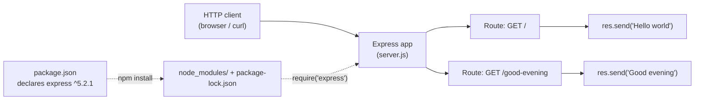

# Technical Specification

# 0. Agent Action Plan

## 0.1 Intent Clarification

This Agent Action Plan translates the user's natural-language feature request into a precise, file-level implementation plan for the Blitzy platform. A single contextual finding governs the entire plan and is therefore stated up front: although the request frames the work as adding a feature to an *existing* product, the repository is presently a greenfield skeleton containing only a placeholder `README.md` [README.md:L1], with no application manifest or source code [Technical Specification:§1.2.2]. The plan below both establishes the described baseline and delivers the requested feature on top of it.

### 0.1.1 Core Feature Objective

Based on the prompt, the Blitzy platform understands that the new feature requirement is to **introduce the Express.js web framework into the Node.js project and add a second HTTP endpoint that returns the response `Good evening`, while preserving the originally described endpoint that returns `Hello world`.**

The request decomposes into the following discrete, clarified requirements:

- **R1 — Adopt Express.js:** Add the Express.js framework as a project dependency so the server is built on Express rather than Node's native `http` module.
- **R2 — Establish the HTTP server:** Instantiate an Express application and bind it to a listening port so the process accepts HTTP requests.
- **R3 — Preserve the existing endpoint:** Continue to serve the response `Hello world` at the root route (`GET /`).
- **R4 — Add the new endpoint:** Expose a new route that returns the exact response `Good evening`.
- **R5 — Provide run ergonomics:** Supply an npm `start` script and a manifest entry point so the server can be installed and launched with standard npm commands.

**Critical reconciliation — described baseline vs. actual repository state.** The user describes an existing "tutorial of node js server hosting one endpoint that returns the response 'Hello world'." However, the repository currently contains only a placeholder `README.md` whose entire content is the single line `# Artifact5` [README.md:L1]; there is no `package.json`, no server source, and no framework configuration [Technical Specification:§1.2.2]. The Technical Specification independently characterizes the project as a "greenfield initiative" [Technical Specification:§1.2.1] with zero catalogued features [Technical Specification:§2.1.1] and no framework adopted [Technical Specification:§3.3.1]. Consequently, the described `Hello world` server does not yet exist in version control and must be **established as part of this work**; the requested Express adoption and the new endpoint are then layered onto that freshly established baseline. This ensures the user's mental model — a two-endpoint Express server — is fully realized.

**Feature dependencies and prerequisites:**

- A Node.js runtime is required; Express 5 mandates Node.js `>= 18`, and Node.js 22 LTS is the recommended runtime for new Express 5 services.
- A project manifest (`package.json`) must exist before Express can be declared and installed.
- Express must be installed — producing `node_modules/` and `package-lock.json` — before `server.js` can `require('express')`.

**User examples preserved verbatim:**

- User Example: "this is a tutorial of node js server hosting one endpoint that returns the response \"Hello world\"."
- User Example: "Could you add expressjs into the project and add another endpoint that return the reponse of \"Good evening\"?"

### 0.1.2 Special Instructions and Constraints

- **Exact response strings (non-negotiable):** The two endpoint bodies must be returned exactly as written by the user — `Hello world` and `Good evening` — preserving capitalization and spacing.
- **No user-specified rules:** The project supplied an empty rules set and no environment/setup instructions; there are therefore no externally mandated files, coding standards, or architectural directives beyond those derived from idiomatic Express usage.
- **Tutorial-level simplicity (implied convention):** The user frames the project as a "tutorial," so the implementation favors a minimal, conventional, single-file Express server. Databases, authentication, build tooling, and route modularization are intentionally avoided to match this intent.
- **Backward compatibility:** The `Hello world` behavior at the root route must remain intact after Express is introduced.
- **Web search research performed:** The exact Express version and the idiomatic routing pattern were verified through external research, summarized in §0.2.2.

### 0.1.3 Technical Interpretation

These feature requirements translate to the following technical implementation strategy:

- **To adopt Express (R1),** we will create `package.json` declaring `"express": "^5.2.1"` and install it, which generates `package-lock.json` and the `node_modules/` tree.
- **To establish the HTTP server (R2),** we will create `server.js` that imports Express, instantiates an application, and calls `app.listen(PORT)` on a configurable port (default `3000`).
- **To preserve the existing endpoint (R3),** we will register a root GET handler returning `Hello world` in `server.js`.
- **To add the new endpoint (R4),** we will register a GET handler at `/good-evening` returning `Good evening` in `server.js`.
- **To provide run ergonomics (R5),** we will set `"main": "server.js"` and `"scripts": { "start": "node server.js" }` in `package.json`, and document usage in `README.md`.

The requirement-to-action mapping is summarized below:

| Req | Requirement | Primary Action | Target File (Mode) |
|-----|-------------|----------------|--------------------|
| R1 | Adopt Express.js | Declare and install `express ^5.2.1` | `package.json` (CREATE) |
| R2 | Establish HTTP server | `const app = express()` + `app.listen(PORT)` | `server.js` (CREATE) |
| R3 | Preserve "Hello world" | `app.get('/', …)` returning `Hello world` | `server.js` (CREATE) |
| R4 | Add "Good evening" | `app.get('/good-evening', …)` returning `Good evening` | `server.js` (CREATE) |
| R5 | Run ergonomics | `start` script + `main` entry | `package.json` (CREATE) |

**Flagged ambiguity for confirmation:** The user did not specify a URL path for the new endpoint. This plan adopts `/good-evening` as a sensible, descriptive default; alternatives such as `/evening` or `/goodevening` are equally valid and can be substituted without affecting the rest of the plan.

## 0.2 Repository Scope Discovery

This section inventories the current repository, records the external research performed, and enumerates the new files the feature requires.

### 0.2.1 Comprehensive File Analysis and Current State

A full traversal of the repository confirms a flat, effectively empty structure. The only tracked, human-authored artifact is `README.md`; the `.git/` directory is version-control metadata and is excluded from analysis.

| Path | Type | Current State | Disposition in This Plan |
|------|------|---------------|--------------------------|
| `README.md` | File | Single line `# Artifact5` [README.md:L1] | UPDATE — add usage and endpoint docs |
| `.git/` | Directory | Version-control metadata | Untouched (excluded) |
| `package.json` | File | Absent [Technical Specification:§1.2.2] | CREATE |
| `server.js` | File | Absent | CREATE |
| `.gitignore` | File | Absent | CREATE |
| `package-lock.json` | File | Absent | CREATE (generated by install) |
| `node_modules/` | Directory | Absent | Generated by install; git-ignored |

**Integration point discovery.** Because the repository is greenfield, there are no pre-existing components to wire into. Each integration surface that a feature addition normally touches is currently absent and will be introduced internally within the new server file:

- **API endpoints:** None exist. Two routes (`GET /`, `GET /good-evening`) will be registered on the Express application.
- **Database models / migrations:** None exist and none are required — the feature returns static strings with no persistence.
- **Service classes:** None exist; no service layer is warranted for this tutorial-scale feature.
- **Controllers / handlers:** None exist; route handlers will be defined inline as Express callbacks.
- **Middleware / interceptors:** None exist; no custom middleware is required for plain-text responses.

### 0.2.2 Web Search Research Conducted

External research was performed to ground version and pattern decisions in current, authoritative sources:

- **Library recommendation and exact version:** Express's latest stable release is **5.2.1** (verified against the npm registry and a live install that resolved to `5.2.1`). Express 5.2 shipped on 2025-12-01 and is the Express Technical Committee's endorsed production release; new Node.js backend projects should adopt the latest Express 5.2.
- **Runtime compatibility:** Express 5 requires **Node.js `>= 18`** (confirmed from the installed package's `engines` field). The recommended runtime for new Express 5 services is **Node.js 22 (Active LTS)**.
- **Idiomatic routing pattern:** The Express documentation establishes the canonical pattern of defining routes with HTTP-method helpers and terminating the request with a response method — `app.get('/', (req, res) => res.send('hello world'))` — which directly models both required endpoints.
- **Migration pattern (native `http` → Express):** Adopting Express replaces a hand-rolled `http.createServer()` request switch with declarative `app.get(path, handler)` registrations plus `app.listen(port)`, eliminating manual URL/method branching.
- **Security considerations:** Express 5 overhauled route matching for improved security and adds native async error forwarding. For static plain-text responses the attack surface is minimal; hardening middleware (e.g., `helmet`) is noted as an optional future enhancement and is out of scope for this request.

### 0.2.3 New File Requirements

The feature requires the following new files. Every file has a single, clear purpose:

- **`/package.json`** — Project manifest declaring the `express ^5.2.1` dependency, the `start` script, the `main` entry point, and the Node.js engine constraint. Without it, `npm install` and `npm start` cannot function.
- **`/server.js`** — The executable entry point: instantiates the Express application, registers the `Hello world` and `Good evening` routes, and starts the listener. This is the heart of the feature.
- **`/.gitignore`** — Excludes the generated `node_modules/` directory (and incidental logs) from version control.
- **`/package-lock.json`** — Generated by `npm install`; pins the exact resolved dependency tree for reproducible installs.

No new test, configuration, or migration files are required by the user's request; rationale and explicit exclusions are documented in §0.6.2.

## 0.3 Dependency Inventory

This feature introduces exactly one declared package. Because the repository has no prior manifest [Technical Specification:§1.2.2], there are no dependency updates or removals — only a single addition.

### 0.3.1 Package Registry

| Package | Registry | Version | Type | Purpose |
|---------|----------|---------|------|---------|
| `express` | npm | `^5.2.1` | Production dependency | HTTP web framework supplying declarative routing (`app.get`) and response helpers (`res.send`) used by both endpoints |

- **Version provenance:** `5.2.1` is the current latest stable release, verified against the npm registry and confirmed by an actual install that resolved to `5.2.1`. The caret range `^5.2.1` permits compatible 5.x patch and minor updates.
- **Transitive dependencies:** Installing `express` produces **66 packages** in `node_modules/` (Express plus 65 transitive dependencies — including `router`, `body-parser`, `path-to-regexp`, `send`, `serve-static`, `qs`, and others). These are resolved automatically by npm and pinned in `package-lock.json`; only `express` is declared in `package.json`.
- **No private packages, dev dependencies, or peer dependencies** are required by this request.

### 0.3.2 Dependency and Import Updates

**Import additions** — the only new import is the Express module, loaded via CommonJS (the default module system, since `package.json` will not set `"type": "module"`):

```js
const express = require('express');
const app = express();
```

**Import transformations** — none. The repository contains no prior source files, so there are no existing imports to rewrite and no wildcard import-migration patterns to apply.

**External reference updates** — the following non-source files reference or declare the dependency and are created/updated accordingly:

- `package.json` — declares `dependencies.express`.
- `package-lock.json` — records the fully resolved dependency tree.
- `.gitignore` — excludes the installed `node_modules/` tree from version control.
- `README.md` — documents the `npm install` prerequisite for obtaining the dependency.

## 0.4 Integration Analysis

Because the repository is greenfield [Technical Specification:§1.2.1], there are no external systems, databases, message brokers, or identity providers to integrate with [Technical Specification:§1.2.1]. All integration is therefore *internal* to the new server file and its manifest.

### 0.4.1 Existing Code Touchpoints

**Direct modifications to existing files:**

- `README.md` — the only pre-existing authored file [README.md:L1]. It will be updated to describe the server, its two endpoints, and the install/run commands.

**New internal wiring (introduced in `server.js`):**

- **Application instantiation** — `const app = express()` creates the central integration hub onto which all routes attach.
- **Route registration (preserved endpoint)** — `app.get('/', …)` keeps the `Hello world` behavior at the root path, satisfying the backward-compatibility constraint.
- **Route registration (new endpoint)** — `app.get('/good-evening', …)` adds the `Good evening` response.
- **Server bootstrap** — `app.listen(PORT, …)` starts the listener, replacing the `http.createServer().listen()` call a native implementation would have used.

**Manifest and tooling wiring:**

- `package.json` declares the `express` dependency and the `start` script, enabling `npm install` and `npm start`.
- `package-lock.json` (generated by install) pins the resolved tree for reproducibility.

The runtime request flow and the inter-file relationships are illustrated below:



There are no dependency-injection containers, route registries, or model export barrels in this repository, so no such files require updating — a deliberate consequence of the tutorial-scale, single-file design.

## 0.5 Technical Implementation

This section is the authoritative build plan. Every file listed is created or modified — there are no advisory-only entries. The end-to-end approach was validated in a throwaway sandbox: installing `express` resolved to `5.2.1` and a two-route server returned `Hello world` and `Good evening` exactly.

### 0.5.1 File-by-File Execution Plan

| Group | File | Mode | Action |
|-------|------|------|--------|
| 1 — Core Server | `package.json` | CREATE | Declare `express ^5.2.1`, `start` script, `main`, and `engines.node >= 18` |
| 1 — Core Server | `server.js` | CREATE | Instantiate Express app, register `GET /` and `GET /good-evening`, call `app.listen(PORT)` |
| 2 — Hygiene & Lockfile | `.gitignore` | CREATE | Ignore `node_modules/` and incidental logs |
| 2 — Hygiene & Lockfile | `package-lock.json` | CREATE (generated) | Pin the resolved dependency tree from `npm install` |
| 3 — Documentation | `README.md` | UPDATE | Add description, prerequisites, install/run steps, and endpoint table |

### 0.5.2 Implementation Approach per File

**`package.json` (CREATE)** — Establish the project manifest so Express can be declared and the server launched with standard npm commands:

```json
"main": "server.js",
"scripts": { "start": "node server.js" },
"engines": { "node": ">=18" },
"dependencies": { "express": "^5.2.1" }
```

**`server.js` (CREATE)** — Import Express, instantiate the app, and resolve a configurable port:

```js
const express = require('express');
const app = express();
const PORT = process.env.PORT || 3000;
```

Register the preserved root route and the new endpoint, returning the exact strings:

```js
app.get('/', (req, res) => res.send('Hello world'));
app.get('/good-evening', (req, res) => res.send('Good evening'));
```

Start the listener so the process accepts requests:

```js
app.listen(PORT, () => console.log(`Server running on http://localhost:${PORT}`));
```

**`.gitignore` (CREATE)** — Prevent committing installed dependencies:

```text
node_modules/
npm-debug.log*
```

**`package-lock.json` (CREATE, generated)** — Produced automatically by `npm install`; committed as-is to lock the Express 5.2.1 tree for reproducible builds. No manual authoring.

**`README.md` (UPDATE)** — Replace the lone `# Artifact5` heading [README.md:L1] with: a one-line description; a prerequisites note (Node.js `>= 18`, recommend Node 22 LTS); install (`npm install`) and run (`npm start`) instructions; and an endpoint table documenting `GET / → Hello world` and `GET /good-evening → Good evening` on port `3000`.

**Build order:** create `package.json` → run `npm install` (generates `node_modules/` + `package-lock.json`) → author `server.js` → add `.gitignore` → update `README.md` → validate with `npm start` and `curl` against both routes.

**Figma references:** None — no Figma URLs or design attachments were provided, so no file needs to reference design sources.

### 0.5.3 User Interface Design

User interface design is **not applicable** to this feature. Both endpoints return plain-text bodies via `res.send()`; there is no HTML, CSS, client-side script, browser-rendered view, component library, or design system involved, and no Figma attachments were supplied. The user-facing surface is limited to two HTTP responses whose exact text (`Hello world`, `Good evening`) is specified in §0.1.1.

## 0.6 Scope Boundaries

The repository root is flat (no nested `src/` tree), so wildcard patterns are minimal; the in-scope set is small and fully enumerable.

### 0.6.1 Exhaustively In Scope

- **Application entry point:** `/server.js` (CREATE) — Express app, both route handlers, and the listener.
- **Project manifest:** `/package.json` (CREATE) — `express ^5.2.1`, `start` script, `main`, `engines`.
- **Lockfile:** `/package-lock.json` (CREATE, generated by `npm install`) — pins the dependency tree.
- **Version-control hygiene:** `/.gitignore` (CREATE) — excludes `node_modules/`.
- **Documentation:** `/README.md` (UPDATE) — currently `# Artifact5` [README.md:L1]; gains usage and endpoint documentation.
- **Installed dependencies:** `/node_modules/**` — generated by `npm install` and git-ignored; not authored or committed.
- **Endpoints delivered:** `GET /` returning `Hello world` (preserved) and `GET /good-evening` returning `Good evening` (new).

### 0.6.2 Explicitly Out of Scope

- **Automated tests** (`*.test.js`, `*.spec.js`, and any test framework such as Jest, Mocha, or supertest) — the user requested no tests; validation is performed manually via `curl`. A test suite is a reasonable future enhancement but is not part of this request.
- **Databases, ORMs, persistence, models, and migrations** — the feature returns static strings; no data layer is required [Technical Specification:§1.2.1].
- **Authentication, authorization, sessions, rate limiting, or custom middleware** beyond what the two trivial routes need.
- **Additional endpoints** beyond the two specified.
- **Route modularization** via `express.Router` or separate route files — routes are kept inline for tutorial simplicity.
- **TypeScript, bundlers, linters, formatters, or other build tooling.**
- **CI/CD pipelines, Dockerfiles, deployment, orchestration, and environment provisioning.**
- **HTTPS/HTTP2/TLS, logging frameworks, observability, performance tuning, and security hardening** beyond Express defaults.
- **Any modification to `.git/` internals.**

## 0.7 Rules for Feature Addition

The user supplied an empty rules set and no setup instructions, so there are no externally mandated constraints. The following operative rules are therefore derived from the request itself and from idiomatic Express conventions, and govern the implementation:

- **Preserve exact response strings.** The endpoint bodies must read precisely `Hello world` and `Good evening` — no punctuation, casing, or whitespace changes.
- **Preserve existing behavior.** Introducing Express must not alter the root endpoint's `Hello world` response; the root route stays at `GET /`.
- **Use the verified framework version.** Declare `express` as `^5.2.1` (the verified current stable); never use placeholder versions such as `latest` or `1.0.0`.
- **Respect the runtime floor.** Target Node.js `>= 18` (Express 5 requirement); recommend Node.js 22 LTS. Record this in `package.json` `engines`.
- **Favor convention over configuration.** Keep a single-file Express server with inline routes and CommonJS `require`, matching common Node tutorials; do not introduce frameworks, layers, or tooling the request does not call for.
- **Keep dependencies minimal.** Declare only `express`; allow npm to resolve and lock transitive dependencies. Do not add unrequested packages.
- **Maintain version-control hygiene.** Exclude `node_modules/` via `.gitignore`; commit `package-lock.json`.
- **Launchable out of the box.** `npm install` followed by `npm start` must start the server and serve both endpoints with no extra steps.

**Decisions and assumptions requiring confirmation** (defaults chosen to keep the plan unambiguous and actionable):

- **New endpoint path** = `/good-evening` (the user specified only the response text, not the path).
- **Entry file name** = `server.js` (referenced by `main` and the `start` script).
- **Listening port** = `3000`, overridable via the `PORT` environment variable.
- **Module system** = CommonJS (`require`), i.e., `package.json` does not set `"type": "module"`.

## 0.8 Attachments

No attachments were provided with this request.

- **File attachments (PDF/image/document):** None. The project contains no uploaded files to analyze.
- **Figma designs:** None. No Figma frames or URLs were supplied; consequently, no design-to-system mapping, token manifest, or UI fidelity analysis applies to this feature.

All requirements were derived solely from the user's textual prompt, which is preserved verbatim in §0.1.1.

