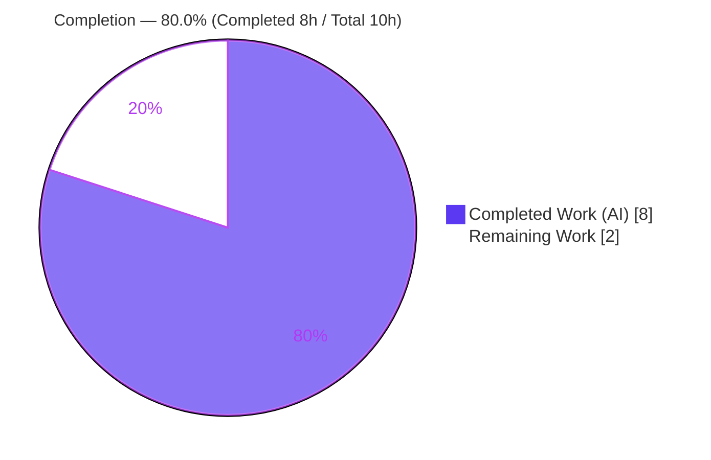
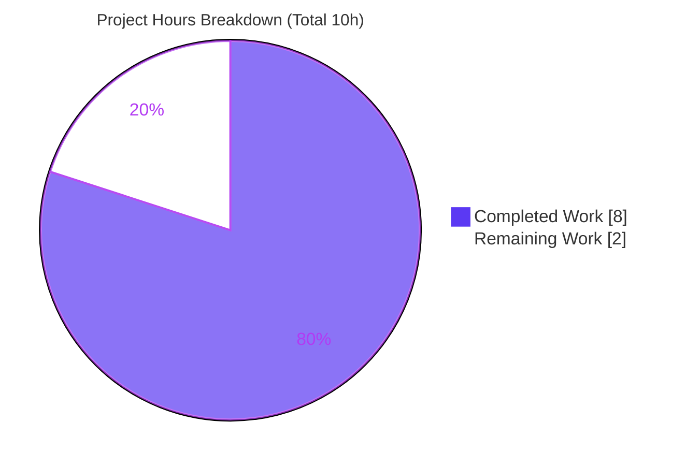
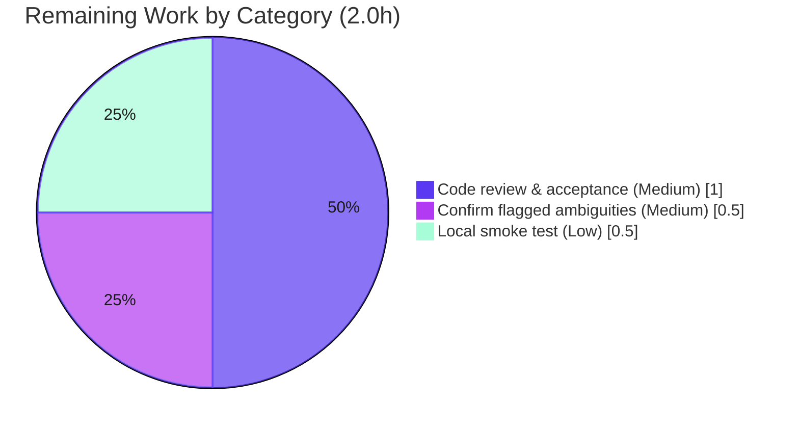

# Blitzy Project Guide — Artifact5 (Express.js Tutorial Server)

> **Brand legend** — <span style="color:#5B39F3">**■ Completed / AI Work = Dark Blue `#5B39F3`**</span> · **□ Remaining / Not Completed = White `#FFFFFF`** · Headings/Accents = Violet-Black `#B23AF2` · Highlight = Mint `#A8FDD9`

---

## 1. Executive Summary

### 1.1 Project Overview

Artifact5 is a minimal Node.js **Express.js** tutorial web server. The repository was a greenfield skeleton (placeholder `README.md` only), so this work establishes the project baseline and delivers the requested feature: adopt Express and expose a second HTTP endpoint returning `Good evening`, while preserving the original `GET /` endpoint that returns `Hello world`. The target users are learners and developers needing a clean, conventional single-file Express reference. Technical scope is intentionally small — two static plain-text GET routes, a configurable listening port, and standard npm run ergonomics — with no database, authentication, or build tooling. All five clarified requirements (R1–R5) and the non-negotiable exact-response-string constraint have been implemented and autonomously validated end-to-end.

### 1.2 Completion Status



| Metric | Hours |
|--------|-------|
| **Total Hours** | **10.0** |
| Completed Hours (AI) | 8.0 |
| Completed Hours (Manual) | 0.0 |
| **Completed Hours (AI + Manual)** | **8.0** |
| **Remaining Hours** | **2.0** |
| **Percent Complete** | **80.0%** |

> **Completion formula (PA1, AAP-scoped):** `8.0 ÷ (8.0 + 2.0) × 100 = 80.0%`. The completion percentage reflects only AAP-defined deliverables plus genuine path-to-production activities. All AAP implementation is delivered and validated; the remaining 20% is human acceptance work (review, confirmation of flagged defaults, smoke test), not new development.

### 1.3 Key Accomplishments

- ✅ **Express.js adopted (R1)** — `express ^5.2.1` declared and pinned to exactly `5.2.1` (lockfileVersion 3); 0 vulnerabilities on audit.
- ✅ **HTTP server established (R2)** — `server.js` instantiates an Express app and listens on `process.env.PORT || 3000`.
- ✅ **`Hello world` preserved (R3)** — `GET /` returns the exact string `Hello world` (byte-verified, 11 bytes).
- ✅ **`Good evening` added (R4)** — `GET /good-evening` returns the exact string `Good evening` (byte-verified, 12 bytes).
- ✅ **Run ergonomics (R5)** — `npm install` + `npm start` launch the server out of the box; `main` + `start` wired in `package.json`.
- ✅ **Documentation** — `README.md` rewritten with description, prerequisites, install/run, PORT override, and an endpoint table.
- ✅ **Version-control hygiene** — `.gitignore` excludes `node_modules/`; lockfile committed for reproducible installs.
- ✅ **Autonomous validation** — dependency, compilation, runtime (curl), and browser/UI verification all passed with zero defects.

### 1.4 Critical Unresolved Issues

| Issue | Impact | Owner | ETA |
|-------|--------|-------|-----|
| _None_ — no defects, compilation errors, or failing checks were identified. All AAP requirements are implemented and validated. | None | — | — |

> There are **no critical unresolved issues**. The items in §1.6 / §2.2 are routine human acceptance steps, not blockers.

### 1.5 Access Issues

| System/Resource | Type of Access | Issue Description | Resolution Status | Owner |
|-----------------|----------------|-------------------|-------------------|-------|
| Git repository (branch `blitzy-b3b07ead-e81e-4862-89de-8ddfaa110dc7`) | Read/Write | Accessible; all 5 files committed | ✅ Resolved | — |
| npm registry (`express@5.2.1`) | Read | Resolved & installed (0 vulnerabilities) | ✅ Resolved | — |

> **No access issues identified.** The project requires no external service credentials, API keys, or third-party accounts (no database, auth provider, or external integrations).

### 1.6 Recommended Next Steps

1. **[Medium]** Confirm the flagged default decisions — endpoint path `/good-evening` (alternatives `/evening`, `/goodevening`), entry filename `server.js`, default port `3000`, and CommonJS module system. If a different endpoint path is desired, it is a one-line change in `server.js` and the README endpoint table.
2. **[Medium]** Perform code review and accept the 5 in-scope files; approve the pull request for merge.
3. **[Low]** Run a local smoke test in the target environment: `npm install` → `npm start` → `curl` both endpoints.
4. **[Low]** _(Optional, out of AAP scope)_ Consider production-hardening enhancements when promoting beyond tutorial use: automated tests, `helmet`, a `/health` endpoint, structured logging, graceful shutdown, and CI/CD.

---

## 2. Project Hours Breakdown

### 2.1 Completed Work Detail

| Component | Hours | Description |
|-----------|-------|-------------|
| Express adoption & project manifest (R1, R5) | 1.5 | `package.json`: `express ^5.2.1` dependency, `main` entry, `start` script, `engines.node >=18`, MIT license; Express `5.2.1` version verified against the npm registry. |
| Express server implementation (R2, R3, R4) | 2.0 | `server.js`: `'use strict'`, app instantiation, PORT config (`env \|\| 3000`), `GET /` → `Hello world`, `GET /good-evening` → `Good evening`, `app.listen` + startup log, plus a comprehensive JSDoc documentation header. |
| Dependency installation & lockfile | 0.5 | `npm install` resolving 66 packages; `package-lock.json` (lockfileVersion 3) pinning Express `5.2.1` for reproducible builds. |
| Version-control hygiene (`.gitignore`) | 0.5 | `.gitignore` excluding `node_modules/` and `npm-debug.log*`. |
| Documentation (`README.md`) | 1.5 | Full rewrite: title, description, prerequisites, install/run instructions, PORT override, endpoint table, and `curl` examples. |
| Autonomous validation & verification | 2.0 | Five-gate validation: dependency audit (0 vulns), compilation (`node --check`), runtime (`curl` byte-exact + 404 negatives + `PORT=8080` override), browser/UI (Chrome DevTools screenshots), and commit hygiene. |
| **Total Completed** | **8.0** | _Matches §1.2 Completed Hours (AI = 8.0, Manual = 0.0)._ |

### 2.2 Remaining Work Detail

| Category | Hours | Priority |
|----------|-------|----------|
| Confirm flagged ambiguities (endpoint path `/good-evening`, entry filename, port `3000`, CommonJS) — requires requester input | 0.5 | Medium |
| Human code review & acceptance of the 5 in-scope files (135 human-authored lines) | 1.0 | Medium |
| Local environment smoke test (`npm install` → `npm start` → `curl` both endpoints) | 0.5 | Low |
| **Total Remaining** | **2.0** | _Matches §1.2 Remaining Hours and §7 "Remaining Work"._ |

### 2.3 Out-of-Scope Future Enhancements (informational — not counted in hours)

Per AAP §0.6.2 these were deliberately excluded and **do not** affect the completion percentage. Listed only for awareness of production hardening beyond tutorial scope:

- Automated test suite (Jest + supertest)
- Security hardening middleware (`helmet`)
- `/health` endpoint + structured logging (pino/winston)
- Graceful shutdown (SIGTERM/SIGINT)
- Dockerfile + CI/CD pipeline
- Reverse-proxy TLS termination (HTTPS)

---

## 3. Test Results

> **Integrity note:** The project has **no automated test suite** — automated tests are explicitly excluded by AAP §0.6.2 ("the user requested no tests; validation is performed manually via curl"). Therefore **0 automated unit/integration tests** are in scope. All checks below originate from **Blitzy's autonomous validation logs** for this project (functional verification via `curl`, browser verification via Chrome DevTools, static syntax checks, and dependency auditing) and were independently re-confirmed.

| Test Category | Framework / Tool | Total | Passed | Failed | Coverage | Notes |
|---------------|------------------|-------|--------|--------|----------|-------|
| Automated Unit/Integration | — (none in scope) | 0 | 0 | 0 | N/A | Excluded by AAP §0.6.2 (out of scope) |
| Functional / Runtime (HTTP) | `curl` (autonomous) | 6 | 6 | 0 | 2/2 endpoints | `GET /`→`Hello world`; `GET /good-evening`→`Good evening`; unknown route→404; `POST /`→404; both endpoints re-verified under `PORT=8080` |
| UI / Browser | Chrome DevTools (MCP) | 2 | 2 | 0 | 2/2 endpoints | Both endpoints render correctly; screenshots captured; only a harmless "Quirks Mode" console notice |
| Static / Syntax | `node --check` | 1 | 1 | 0 | N/A | `server.js` syntax valid (exit 0); manifest + lockfile valid JSON |
| Dependency Audit | `npm audit` / `npm ls` | 2 | 2 | 0 | N/A | 0 vulnerabilities; clean tree `artifact5@1.0.0 └── express@5.2.1` |
| **Total (autonomous checks)** | | **11** | **11** | **0** | **100%** | All passed; zero failures |

---

## 4. Runtime Validation & UI Verification

**Server bootstrap**
- ✅ **Operational** — `npm start` binds the port and logs `Server running on http://localhost:3000`.
- ✅ **Operational** — Port override: `PORT=8080 npm start` logs `Server running on http://localhost:8080`.
- ✅ **Operational** — Clean startup and shutdown; no orphan processes.

**HTTP endpoints (API integration)**
- ✅ **Operational** — `GET /` → HTTP 200, body `Hello world` (byte-exact, 11 bytes, no trailing newline).
- ✅ **Operational** — `GET /good-evening` → HTTP 200, body `Good evening` (byte-exact, 12 bytes, no trailing newline).
- ✅ **Operational** — Negative cases: unknown route → 404; `POST /` → 404 (Express defaults).
- ✅ **Operational** — Exact-string constraint (case + spacing) satisfied for both endpoints.

**UI / Browser verification**
- ✅ **Operational** — Chrome DevTools rendered `GET /`: the text `Hello world` displays top-left on a blank white page (plain-text response, no HTML/CSS — expected).
- ✅ **Operational** — Chrome DevTools rendered `GET /good-evening`: the text `Good evening` displays correctly.
- ⚠ **Partial (informational only)** — Browser emits a single "Quirks Mode" console notice because a plain-text `res.send` response has no `<!DOCTYPE>`. **Harmless, zero functional impact**; HTML/DOCTYPE is out of scope per AAP §0.5.3. No JavaScript or network errors.

> Screenshots are stored at `blitzy/screenshots/endpoint_root_hello_world.png` and `blitzy/screenshots/endpoint_good_evening.png` (untracked platform artifacts, correctly not committed).

---

## 5. Compliance & Quality Review

| AAP Deliverable / Benchmark | Requirement | Status | Progress | Evidence |
|------------------------------|-------------|--------|----------|----------|
| R1 — Adopt Express.js | `express ^5.2.1` declared & installed | ✅ Pass | 100% | `package.json`, `package-lock.json` (pinned 5.2.1) |
| R2 — Establish HTTP server | `express()` + `app.listen(PORT)` | ✅ Pass | 100% | `server.js` L48/L52/L66; boots & logs |
| R3 — Preserve `Hello world` | `GET /` → exact `Hello world` | ✅ Pass | 100% | `server.js` L58; curl 11 bytes |
| R4 — Add `Good evening` | `GET /good-evening` → exact `Good evening` | ✅ Pass | 100% | `server.js` L61; curl 12 bytes |
| R5 — Run ergonomics | `main` + `start` script | ✅ Pass | 100% | `package.json`; `npm start` works |
| Exact-string constraint | Case + spacing preserved | ✅ Pass | 100% | Byte-exact verification (11/12 bytes) |
| Runtime floor | `engines.node >=18` | ✅ Pass | 100% | `package.json`; validated on Node v20.20.2 |
| Module system | CommonJS (`require`) | ✅ Pass | 100% | No `"type":"module"` in manifest |
| Dependency hygiene | Only `express`; `node_modules` ignored; lockfile committed | ✅ Pass | 100% | `.gitignore`; lockfile tracked |
| Code quality | Production-ready, documented, no placeholders | ✅ Pass | 100% | `'use strict'`, JSDoc header, inline comments |
| Security (dependencies) | No known vulnerabilities | ✅ Pass | 100% | `npm audit` → 0 vulnerabilities |
| Flagged ambiguity confirmation | Human approval of default decisions | ⏳ Pending | 0% | Tracked in §1.6 / §2.2 (Medium) |

**Fixes applied during autonomous validation:** None required — the implementation committed by prior agents (commits `930257a..7b8804b`) was already correct; validation was read-only/runtime and made zero modifications to tracked files.

**Outstanding compliance items:** Human confirmation of the flagged default decisions (endpoint path, filename, port, module system) — see §1.6.

---

## 6. Risk Assessment

| Risk | Category | Severity | Probability | Mitigation | Status |
|------|----------|----------|-------------|------------|--------|
| No automated test suite | Technical | Low | Medium | Manual curl + browser validation performed; deliberately excluded by AAP §0.6.2; add Jest/supertest as a future enhancement | Accepted (by design) |
| Caret range `^5.2.1` may pull future minor/patch updates | Technical | Low | Low | `package-lock.json` pins exact `5.2.1` for reproducible installs | Mitigated |
| No graceful shutdown (SIGTERM/SIGINT) handling | Technical | Low | Low | Acceptable for tutorial; add for long-running production service | Accepted (out of scope) |
| No hardening middleware (`helmet`) | Security | Low | Low | Minimal attack surface (static plain-text GETs, no input, no persistence); `helmet` noted as optional future in AAP §0.2.2 | Accepted (out of scope) |
| No HTTPS/TLS | Security | Low | Low | Terminate TLS at a reverse proxy/load balancer if deployed; out of scope per §0.6.2 | Accepted (out of scope) |
| Dependency vulnerabilities | Security | Low | Low | `npm audit` reports 0 vulnerabilities | Mitigated |
| No health-check endpoint / structured logging / observability | Operational | Low | Low | Startup log present; add `/health` + logging for production | Accepted (out of scope) |
| No process manager / restart policy | Operational | Low | Low | Deployment-time concern (pm2/systemd/container restart) | Open (deferred) |
| No CI/CD pipeline | Operational | Low | Low | Out of scope §0.6.2; add when promoting beyond tutorial | Open (deferred) |
| No external integrations (DB, APIs, brokers) | Integration | N/A | N/A | Risk-reducing — zero external integration surface by design | N/A |
| Endpoint path `/good-evening` not yet confirmed with requester | Integration | Low | Low | Confirm with requester (tracked in §2.2); one-line change if a different path is desired | Open (pending confirmation) |

> **Overall risk profile: LOW.** No High- or Medium-severity risks exist. The two-endpoint static-response design with no user input, no data layer, and no external integrations inherently minimizes the attack and failure surface.

---

## 7. Visual Project Status

**Project hours breakdown** (Completed = Dark Blue `#5B39F3`, Remaining = White `#FFFFFF`):



**Remaining work by category** (hours from §2.2, total **2.0h**):



> **Integrity check:** "Remaining Work" = **2.0h** equals §1.2 Remaining Hours and the sum of the §2.2 Hours column. "Completed Work" = **8.0h** equals §1.2 Completed Hours and the sum of the §2.1 Hours column.

---

## 8. Summary & Recommendations

**Achievements.** The Artifact5 Express tutorial server is **80.0% complete** on an AAP-scoped basis, with all five functional requirements (R1–R5), all five in-scope files, every coding convention, and the non-negotiable exact-response-string constraint fully implemented and autonomously validated. Both endpoints (`GET /` → `Hello world`, `GET /good-evening` → `Good evening`) return byte-exact responses; the dependency tree is clean and vulnerability-free; and the project installs and runs out of the box via `npm install` + `npm start`.

**Remaining gaps.** The remaining **2.0 hours (20%)** consist exclusively of human path-to-production gates — confirming the flagged default decisions, reviewing/accepting the change, and a local smoke test — **not additional development**. There are no defects, failing checks, or blockers.

**Critical path to production.** (1) Confirm flagged defaults → (2) review & accept the PR → (3) local smoke test → merge. Each is short and low-risk; the only one requiring external input is confirmation of the `/good-evening` path.

**Success metrics.** ✅ 2/2 endpoints serve exact strings · ✅ 0 vulnerabilities · ✅ 11/11 autonomous validation checks passed · ✅ 0 compilation/runtime errors · ✅ launchable out of the box.

**Production readiness assessment.** For its intended **tutorial** purpose, the project is functionally complete and production-ready. For hardened production deployment beyond tutorial scope, the optional enhancements in §2.3 (tests, `helmet`, health checks, logging, CI/CD, TLS) are recommended but were deliberately excluded by the AAP.

| Metric | Value |
|--------|-------|
| Completion (AAP-scoped) | 80.0% |
| Completed Hours | 8.0 |
| Remaining Hours | 2.0 |
| Total Hours | 10.0 |
| Autonomous checks passed | 11 / 11 |
| Open defects / blockers | 0 |
| Overall risk | Low |

---

## 9. Development Guide

> All commands below were executed and verified on this host (Node v20.20.2, npm 11.1.0). Run them from the repository root.

### 9.1 System Prerequisites

- **Node.js `>= 18`** (Express 5 requirement). **Node.js 22 LTS recommended.** Verified on Node v20.20.2.
- **npm** (bundled with Node.js). Verified on npm 11.1.0.
- No databases, build tools, or external services are required.

```bash
node --version   # must be >= v18 (e.g., v20.20.2)
npm --version    # e.g., 11.1.0
```

### 9.2 Environment Setup

- No `.env` file or environment variables are required.
- Optional single override: **`PORT`** (defaults to `3000`).
- Module system is **CommonJS** (the manifest does not set `"type": "module"`).

### 9.3 Dependency Installation

```bash
# From the repository root — installs Express 5.2.1 from the committed lockfile
npm install
```

Expected: a short install completing with `found 0 vulnerabilities`. Verify the tree:

```bash
npm ls
# artifact5@1.0.0 <repo-root>
# └── express@5.2.1
```

### 9.4 Application Startup

```bash
# Start on the default port 3000
npm start
# -> Server running on http://localhost:3000

# Or override the port
PORT=8080 npm start
# -> Server running on http://localhost:8080
```

`npm start` runs `node server.js`. The server runs in the foreground — press `Ctrl+C` to stop.

### 9.5 Verification Steps

```bash
# Static syntax check (no server needed)
node --check server.js          # exit 0 = OK

# With the server running, verify both endpoints
curl http://localhost:3000/             # -> Hello world
curl http://localhost:3000/good-evening # -> Good evening

# Negative cases (Express defaults)
curl -s -o /dev/null -w '%{http_code}\n' http://localhost:3000/nope   # -> 404
curl -s -o /dev/null -w '%{http_code}\n' -X POST http://localhost:3000/ # -> 404
```

### 9.6 Example Usage

```bash
# Default port
curl http://localhost:3000/             # Hello world
curl http://localhost:3000/good-evening # Good evening

# Custom port
PORT=8080 npm start
curl http://localhost:8080/good-evening # Good evening
```

### 9.7 Troubleshooting

- **`EADDRINUSE` (port 3000 already in use):** start with a different port — `PORT=8080 npm start` — or free the port (`lsof -i :3000`, then stop that specific process).
- **`Cannot find module 'express'`:** run `npm install` first. `node_modules/` is git-ignored and not committed, so dependencies must be installed locally.
- **Node too old (`< 18`):** Express 5 requires Node `>= 18`. Upgrade Node (22 LTS recommended); `npm install` will warn via the `engines` field.
- **Browser shows a "Quirks Mode" console notice:** expected and harmless — `res.send` returns plain text with no `<!DOCTYPE>`. Zero functional impact (HTML is out of scope per AAP §0.5.3).
- **Server won't stop:** it runs in the foreground (`Ctrl+C`). If backgrounded, find its PID with `lsof -i :3000` and stop that specific PID.

---

## 10. Appendices

### A. Command Reference

| Command | Purpose |
|---------|---------|
| `npm install` | Install Express 5.2.1 from the lockfile |
| `npm start` | Start the server (`node server.js`) on port 3000 |
| `PORT=8080 npm start` | Start the server on a custom port |
| `npm ls` | Show the resolved dependency tree |
| `npm audit` | Check for dependency vulnerabilities |
| `node --check server.js` | Validate `server.js` syntax without running |
| `curl http://localhost:3000/` | Test the `Hello world` endpoint |
| `curl http://localhost:3000/good-evening` | Test the `Good evening` endpoint |

### B. Port Reference

| Port | Purpose | Configurable |
|------|---------|--------------|
| `3000` | Default HTTP listening port | Yes — via `PORT` env var |
| `8080` | Example override used in validation | Yes — `PORT=8080` |

### C. Key File Locations

| Path | Role |
|------|------|
| `server.js` | Express application entry point — both routes + listener (67 lines) |
| `package.json` | Manifest — Express dependency, `start` script, `main`, `engines` |
| `package-lock.json` | Generated lockfile pinning Express 5.2.1 (lockfileVersion 3) |
| `.gitignore` | Excludes `node_modules/` and `npm-debug.log*` |
| `README.md` | Project documentation (description, install/run, endpoint table) |
| `node_modules/` | Installed dependencies (66 packages) — git-ignored, generated |
| `blitzy/screenshots/` | Browser-verification screenshots — untracked platform artifacts |

### D. Technology Versions

| Technology | Version | Notes |
|------------|---------|-------|
| Node.js | v20.20.2 (validated) | `>= 18` required; 22 LTS recommended |
| npm | 11.1.0 | Bundled with Node.js |
| Express | 5.2.1 | Declared `^5.2.1`, pinned `5.2.1` |
| Lockfile | lockfileVersion 3 | npm v7+ format |
| Module system | CommonJS | `require` / no `"type":"module"` |

### E. Environment Variable Reference

| Variable | Required | Default | Description |
|----------|----------|---------|-------------|
| `PORT` | No | `3000` | TCP port the HTTP server listens on |

### F. Developer Tools Guide

- **Chrome DevTools (MCP):** used to render both endpoints in a real browser and capture verification screenshots (`blitzy/screenshots/`). The single "Quirks Mode" console notice is expected for plain-text responses and is harmless.
- **`curl`:** primary functional verification tool (manual testing per AAP) — confirms HTTP status, exact body, and byte counts.
- **`node --check`:** fast static syntax validation without executing the server.
- **`npm ls` / `npm audit`:** dependency-tree integrity and vulnerability checks.

### G. Glossary

| Term | Definition |
|------|------------|
| **Express.js** | Minimal, unopinionated Node.js web framework providing declarative routing (`app.get`) and response helpers (`res.send`). |
| **CommonJS** | Node.js's default module system using `require()` / `module.exports`. |
| **Caret range (`^5.2.1`)** | Permits compatible `5.x` minor and patch updates while disallowing a major (`6.x`) upgrade. |
| **Lockfile (`package-lock.json`)** | Records the exact resolved dependency tree for reproducible installs. |
| **`res.send`** | Express response method that sends a body and infers the `Content-Type`; here returns plain text. |
| **Greenfield** | A project started from scratch with no pre-existing source code. |
| **Quirks Mode** | A browser rendering mode triggered when a document lacks a `<!DOCTYPE>`; informational only for plain-text responses. |
| **AAP** | Agent Action Plan — the file-level implementation directive this guide assesses against. |

---

*Generated by the Blitzy Platform · Completion is measured against AAP-scoped deliverables plus path-to-production activities (PA1 methodology). Completed = `#5B39F3`, Remaining = `#FFFFFF`.*