# Technical Specification

# 1. Introduction

## 1.1 Executive Summary

The system documented herein is identified in its repository solely by the project name **"Artifact5"**, as declared in the sole content-bearing artifact present in the codebase (`README.md`). At the time of this specification, the repository exists in a **pre-implementation, skeleton state**: it contains no source code, no configuration files, no dependency manifests, no infrastructure-as-code definitions, no test suites, no continuous integration pipelines, and no supplementary documentation beyond the project's H1 heading.

This Introduction therefore documents the project at the earliest possible lifecycle stage, where only the project identifier has been established. Substantive content normally expected in an Introduction section — including business problem definitions, stakeholder catalogues, capability inventories, integration topologies, and concrete scope declarations — is recorded below as **To Be Defined (TBD)** rather than fabricated. Subsequent revisions of this document are expected to populate these elements as design, planning, and implementation artifacts are introduced to the repository.

### 1.1.1 Project Overview

The verified facts about the project, as derived exclusively from repository evidence, are summarized below.

| Attribute | Documented Value |
|---|---|
| Project Name | Artifact5 |
| Repository Lifecycle Stage | Skeleton / Pre-implementation |
| Tracked Source Files | 1 (`README.md`) |
| Repository Size (content) | 11 bytes |
| Commit History Depth | 1 commit ("Initial commit", hash `774720d`) |

### 1.1.2 Core Business Problem

No business problem statement, domain narrative, opportunity description, or use-case documentation has been recorded in the repository. The business motivation driving the creation of Artifact5 is **To Be Defined** and must be supplied through a forthcoming requirements artifact (e.g., a Product Requirements Document, Business Case, or Vision Statement) before this subsection can be meaningfully populated.

### 1.1.3 Key Stakeholders and Users

No stakeholder identification, user persona definitions, RACI matrix, or audience analysis has been recorded in the repository. The following table reflects the current undefined state of all stakeholder categories typically catalogued in an Introduction section.

| Stakeholder Category | Documented Identification |
|---|---|
| Business Sponsors / Product Owners | Not yet identified |
| End Users / User Personas | Not yet identified |
| Technical Owners / Engineering Leads | Not yet identified |
| Operational / Support Stakeholders | Not yet identified |

### 1.1.4 Expected Business Impact and Value Proposition

No value proposition, expected business impact, outcome metric, return-on-investment estimate, or strategic alignment statement has been articulated in the repository. This subsection is **To Be Defined** in coordination with the future business-context artifact referenced in subsection 1.1.2.

## 1.2 System Overview

### 1.2.1 Project Context

#### Business Context and Market Positioning

The repository contains no information on business context, market segment, competitive positioning, or strategic placement of Artifact5 within any product portfolio. This dimension is awaiting definition.

#### Current System Limitations

The repository contains **no references to a predecessor system, legacy platform, or system being replaced**. There are no migration plans, no deprecated-module annotations, and no backward-compatibility considerations recorded. On the evidence available, Artifact5 is best characterized as a **greenfield initiative** rather than a replacement or modernization effort. This characterization should be re-validated once business documentation is introduced.

#### Integration with Existing Enterprise Landscape

No integration points, external service references, API client configurations, message broker connections, identity provider links, data pipeline taps, or any other enterprise-system touchpoints have been documented. Artifact5 currently declares **zero dependencies** on internal or external systems.

### 1.2.2 High-Level Description

#### Primary System Capabilities

No system capabilities have been declared. The repository contains zero functional source code, no feature specifications, no API contracts, and no user-facing behavior descriptions. A capability inventory cannot be produced from the available evidence.

#### Major System Components

The repository's complete structure is depicted below. No source-code directories, configuration directories, documentation directories, or test directories exist beyond the root.

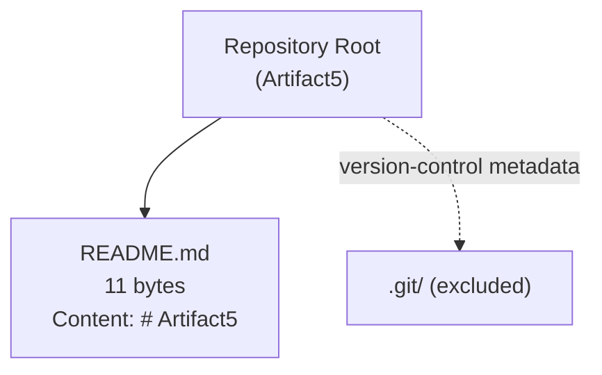

The component inventory expected in a typical Introduction is correspondingly empty:

| Component Category | Status in Repository |
|---|---|
| Frontend / User Interface Layer | Not present |
| Backend Services / Application Layer | Not present |
| Data Layer / Persistence | Not present |
| Integration / API Gateway Layer | Not present |
| Asynchronous / Batch Processing | Not present |

#### Core Technical Approach

No technical approach has been selected. The diagnostic indicators normally used to identify a project's technology stack are all absent, as enumerated below.

| Technology Indicator | Observed State |
|---|---|
| Language Manifests (`package.json`, `requirements.txt`, `pyproject.toml`, `go.mod`, `Cargo.toml`, `pom.xml`, `build.gradle`, `composer.json`, `Gemfile`) | None present |
| Framework Configuration Files | None present |
| Build, Bundler, or Task-Runner Configuration | None present |
| Infrastructure-as-Code (Dockerfile, Kubernetes manifests, Terraform, CloudFormation) | None present |
| Environment Configuration (`.env`, `.env.example`, configuration directories) | None present |

The selection of programming language, runtime, framework, persistence technology, deployment target, and tooling pipeline is therefore **To Be Defined** through a forthcoming Architecture Decision Record (ADR) or equivalent technology-selection artifact.

### 1.2.3 Success Criteria

#### Measurable Objectives

No measurable objectives, Objectives and Key Results (OKRs), or quantified goals have been formalized in the repository.

#### Critical Success Factors

No critical success factors, risk mitigations, or dependency callouts have been documented.

#### Key Performance Indicators (KPIs)

No KPIs, service-level objectives (SLOs), service-level agreements (SLAs), or performance budgets have been declared. This subsection cannot be populated until operational and business targets are established.

| Success Criterion Category | Defined Targets |
|---|---|
| Business Objectives / OKRs | Not yet defined |
| Critical Success Factors | Not yet defined |
| Operational KPIs / SLOs | Not yet defined |
| User-Experience Metrics | Not yet defined |

## 1.3 Scope

Because no implementation, design, or requirements artifacts currently exist within the repository, no scope items have been formally committed. The following subsections document the categories required by this specification and explicitly mark each as undefined; they should be revisited once requirements gathering is conducted.

### 1.3.1 In-Scope Elements

#### Core Features and Functionalities

| In-Scope Dimension | Current Definition |
|---|---|
| Must-Have Capabilities | To be defined |
| Primary User Workflows | To be defined |
| Essential Integrations | To be defined |
| Key Technical Requirements | To be defined |

#### Implementation Boundaries

| Boundary Dimension | Current Definition |
|---|---|
| System Boundaries (logical) | Not yet drawn |
| User Groups Covered | Not yet identified |
| Geographic / Market Coverage | Not yet declared |
| Data Domains Included | Not yet modeled |

### 1.3.2 Out-of-Scope Elements

No explicit exclusions, future-phase deferrals, unsupported use cases, or excluded integration points have been documented. Because no in-scope content currently exists, there is no operative boundary against which exclusions can be meaningfully expressed.

| Out-of-Scope Category | Documented Exclusions |
|---|---|
| Explicitly Excluded Features / Capabilities | None documented |
| Future Phase Considerations | None documented |
| Integration Points Not Covered | None documented |
| Unsupported Use Cases | None documented |

### 1.3.3 Forward Path for Scope Definition

The following artifacts, when introduced to the repository, will enable population of the corresponding scope subsections above. Until such artifacts exist, scope statements in this specification remain placeholders.

| Future Artifact | Scope Subsection Enabled |
|---|---|
| Business / Product Requirements Document | In-Scope: Core Features and Functionalities |
| User Journey or Workflow Documentation | In-Scope: Primary User Workflows |
| Integration Architecture Document | In-Scope: Essential Integrations |
| Out-of-Scope Statement / Non-Goals Document | Out-of-Scope: All Categories |

## 1.4 References

#### Files Examined

- `README.md` — The sole content-bearing file in the repository. Contains exactly one line, `# Artifact5`, totaling 11 bytes; establishes the project name as the only documented fact about the system.

#### Folders Explored

- `/` (repository root) — Verified to contain only `README.md` alongside version-control metadata (`.git/`, intentionally excluded as a non-project artifact). No source directories, configuration directories, documentation directories, or test directories exist.

#### Repository-Level Inspections Performed

- Full filesystem traversal of the repository root, confirming the absence of subdirectories beyond version-control metadata.
- Inspection of the git commit history, which contains a single commit titled "Initial commit" (hash `774720d`).
- Search for language manifest files (e.g., `package.json`, `requirements.txt`, `pyproject.toml`, `go.mod`, `Cargo.toml`, `pom.xml`, `build.gradle`, `composer.json`, `Gemfile`) — none found.
- Search for hidden configuration files (including `.blitzyignore`, `.env`, `.env.example`, `.editorconfig`, `.gitattributes`) — none found.
- Semantic searches for documentation content, source code, and application modules — all returned empty results, corroborating the structural inspection.

#### Cross-Referenced Technical Specification Sections

- None. The list of available technical specification sections provided to this section's author was empty, indicating that this Introduction is the first section being authored for the Artifact5 Technical Specification document and no prior specification content was available for cross-reference.

# 2. Product Requirements

This section documents the Product Requirements for the system identified in its repository as **Artifact5**. Consistent with the evidence-based posture established in §1.1 Executive Summary, §1.2 System Overview, and §1.3 Scope — all of which formally record the project as being in a **pre-implementation, skeleton state** containing only an 11-byte `README.md` file with the single line `# Artifact5` — no features, functional requirements, feature relationships, or implementation considerations have been recorded in the codebase. Per the directive controlling this section ("Only include sections and items that are actually relevant to this system, based on your analysis of its requirements. Don't add any features of your own, or any items that aren't clearly applicable."), this section therefore documents the **verified absence** of product requirements rather than fabricating speculative content.

The subsections that follow:

1. Honor each structural element requested by the section prompt (Feature Catalog, Functional Requirements Table, Feature Relationships, Implementation Considerations, and Traceability Matrix).
2. Mark every required field as **Not Yet Defined (NYD)** or **To Be Defined (TBD)** in alignment with the conventions already established in §1.1.2, §1.1.3, §1.1.4, §1.2.2, §1.2.3, §1.3.1, and §1.3.2.
3. Preserve the **schema and identifier formats** prescribed by the prompt (F-XXX for features, F-XXX-RQ-YYY for requirements) so that future revisions can populate the templates without restructuring this section.
4. Cite the **forward-enabling artifacts** enumerated in §1.3.3 (Business / Product Requirements Document, User Journey or Workflow Documentation, Integration Architecture Document, Out-of-Scope Statement / Non-Goals Document) as the prerequisite inputs required to convert each placeholder into a substantive requirement record.

---

## 2.1 FEATURE CATALOG

### 2.1.1 Current Feature Inventory State

The Artifact5 repository declares **zero features**. This determination is grounded in the following evidence already recorded in this Technical Specification:

| Evidence Source | Documented Finding |
|---|---|
| §1.1.2 Core Business Problem | "No business problem statement, domain narrative, opportunity description, or use-case documentation has been recorded in the repository." |
| §1.2.2 Primary System Capabilities | "No system capabilities have been declared. The repository contains zero functional source code, no feature specifications, no API contracts, and no user-facing behavior descriptions." |
| §1.2.2 Major System Components | All component categories (Frontend, Backend, Data, Integration, Asynchronous) recorded as "Not present." |
| §1.3.1 Core Features and Functionalities | "Must-Have Capabilities," "Primary User Workflows," "Essential Integrations," and "Key Technical Requirements" all marked "To be defined." |

Because feature catalog entries derive from declared system capabilities, and no such capabilities exist in the repository, no `F-XXX` identifier can be assigned with evidentiary support. The catalog is intentionally left empty rather than populated with synthesized content.

#### Feature Inventory Summary

| Inventory Dimension | Current State |
|---|---|
| Total Features Catalogued | 0 |
| Features in "Proposed" Status | 0 |
| Features in "Approved" Status | 0 |
| Features in "In Development" Status | 0 |
| Features in "Completed" Status | 0 |

### 2.1.2 Feature Metadata Schema (Reserved for Future Population)

The following schema is reserved to be applied to each future feature once the Business / Product Requirements Document referenced in §1.3.3 introduces capability definitions. No rows are populated at this time because no feature evidence exists.

| Metadata Field | Format / Allowed Values |
|---|---|
| Unique ID | `F-XXX` (zero-padded sequential, beginning `F-001`) |
| Feature Name | Free text, ≤ 80 characters |
| Feature Category | TBD — taxonomy to be defined alongside first feature |
| Priority Level | Critical / High / Medium / Low |
| Status | Proposed / Approved / In Development / Completed |

#### Feature Catalog Table (Empty State)

| Feature ID | Feature Name | Priority | Status |
|---|---|---|---|
| _No entries — see §2.1.1_ | _NYD_ | _NYD_ | _NYD_ |

### 2.1.3 Description Schema (Reserved for Future Population)

Each future feature will require the four descriptive elements requested by the section prompt. The fields below are documented for schema preservation only.

| Description Field | Required Input Source |
|---|---|
| Overview | Capability statement (PRD §TBD) |
| Business Value | Value proposition from §1.1.4 once defined |
| User Benefits | User personas / stakeholder catalog from §1.1.3 once defined |
| Technical Context | Architecture Decision Record (ADR) referenced in §1.2.2 once authored |

### 2.1.4 Dependencies Schema (Reserved for Future Population)

Per §1.2.1, "Artifact5 currently declares zero dependencies on internal or external systems," and Artifact5 is characterized as a "greenfield initiative." Consequently, no prerequisite features, system dependencies, external dependencies, or integration requirements are recorded. The schema below preserves the four dependency categories requested by the prompt for future use.

| Dependency Category | Current Documented Items |
|---|---|
| Prerequisite Features | None — no features exist (§2.1.1) |
| System Dependencies | None — no components exist (§1.2.2) |
| External Dependencies | None — zero integrations declared (§1.2.1) |
| Integration Requirements | None — Integration Architecture Document not yet authored (§1.3.3) |

---

## 2.2 FUNCTIONAL REQUIREMENTS TABLE

### 2.2.1 Current Requirements Inventory State

The Artifact5 repository contains **zero functional requirements** and **zero non-functional requirements**. The supporting evidence is summarized below.

| Evidence Source | Documented Finding |
|---|---|
| §1.2.3 Measurable Objectives | "No measurable objectives, Objectives and Key Results (OKRs), or quantified goals have been formalized in the repository." |
| §1.2.3 Key Performance Indicators | "No KPIs, service-level objectives (SLOs), service-level agreements (SLAs), or performance budgets have been declared." |
| §1.2.3 Critical Success Factors | "No critical success factors, risk mitigations, or dependency callouts have been documented." |
| §1.3.1 Key Technical Requirements | "To be defined." |

Because requirements (in the format `F-XXX-RQ-YYY`) are indexed against features (`F-XXX`), and no features exist (see §2.1.1), no requirement identifier can be issued with evidentiary support. The Functional Requirements Table is therefore empty.

#### Requirements Inventory Summary

| Inventory Dimension | Current Count |
|---|---|
| Must-Have Requirements | 0 |
| Should-Have Requirements | 0 |
| Could-Have Requirements | 0 |
| Total Requirements Recorded | 0 |

### 2.2.2 Requirement Details Schema (Reserved for Future Population)

The schema below is preserved to permit population once the Business / Product Requirements Document referenced in §1.3.3 is introduced.

| Requirement Field | Format / Allowed Values |
|---|---|
| Requirement ID | `F-XXX-RQ-YYY` (parent feature ID + sequential RQ number) |
| Description | Single-sentence statement of testable behavior |
| Acceptance Criteria | Given/When/Then structure, ≥ 1 criterion per requirement |
| Priority | Must-Have / Should-Have / Could-Have |
| Complexity | High / Medium / Low |

#### Requirement Details Table (Empty State)

| Requirement ID | Description | Priority | Complexity |
|---|---|---|---|
| _No entries — see §2.2.1_ | _NYD_ | _NYD_ | _NYD_ |

### 2.2.3 Technical Specifications Schema (Reserved for Future Population)

Each future requirement will be augmented with the four technical specification fields the section prompt requires. These cannot be populated until at least the Architecture Decision Record referenced in §1.2.2 is authored.

| Technical Specification Field | Current Documented Value |
|---|---|
| Input Parameters | NYD — no API contracts exist (§1.2.2) |
| Output / Response | NYD — no API contracts exist (§1.2.2) |
| Performance Criteria | NYD — no KPIs / SLOs declared (§1.2.3) |
| Data Requirements | NYD — no Data Layer present (§1.2.2) |

### 2.2.4 Validation Rules Schema (Reserved for Future Population)

The four validation-rule categories specified by the section prompt are similarly reserved.

| Validation Category | Current Documented Value |
|---|---|
| Business Rules | NYD — no business problem statement (§1.1.2) |
| Data Validation | NYD — no Data Layer or data domains (§1.2.2, §1.3.1) |
| Security Requirements | NYD — no integrations, identity, or data assets to protect (§1.2.1) |
| Compliance Requirements | NYD — no regulatory or market posture documented (§1.2.1) |

---

## 2.3 FEATURE RELATIONSHIPS

### 2.3.1 Current Relationship Inventory State

The section prompt explicitly instructs: *"Only document feature relationships that are clearly evident in the requirements or source code. Don't imagine any feature relationships of your own."* Because §2.1.1 establishes that zero features exist and §2.2.1 establishes that zero requirements exist, **no feature-to-feature relationships, integration points, shared components, or common services can be enumerated** for Artifact5 at this time.

### 2.3.2 Feature Dependency Map (Empty State)

The dependency map for Artifact5 is intentionally empty. The diagram below visualizes the current state — a single repository root with one content-bearing artifact and no feature nodes to relate — directly mirroring the structural diagram in §1.2.2.

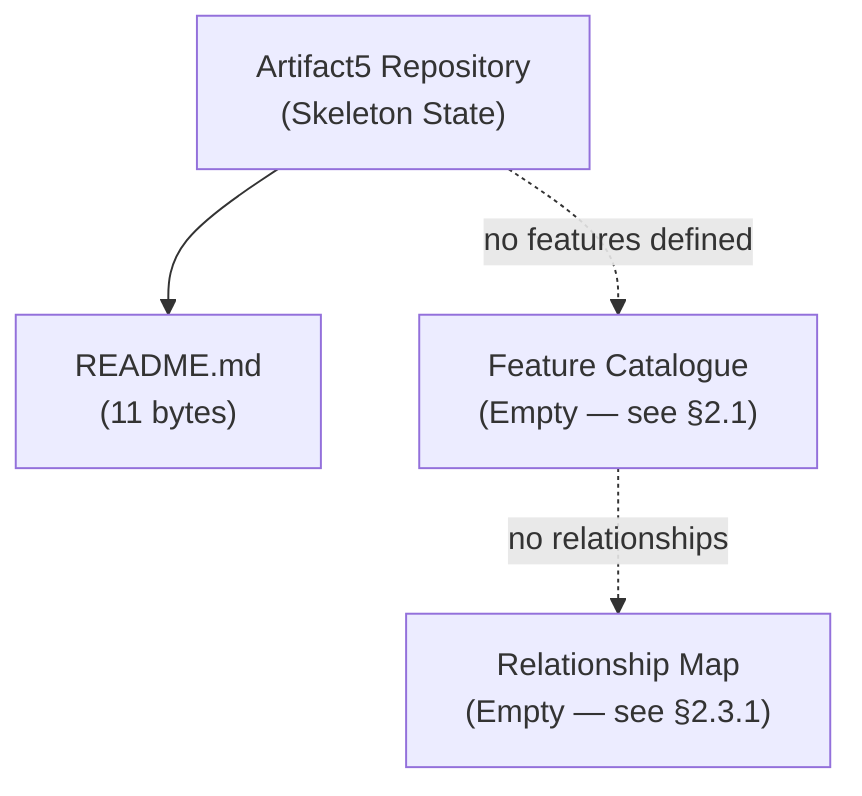

### 2.3.3 Integration Points

| Integration Point Category | Documented Items |
|---|---|
| Inbound Integrations | None — see §1.2.1 |
| Outbound Integrations | None — see §1.2.1 |
| Inter-Feature Boundaries | None — no features defined (§2.1.1) |
| External System Touchpoints | None — Integration Architecture Document pending (§1.3.3) |

### 2.3.4 Shared Components and Common Services

| Shared Asset Category | Documented Items |
|---|---|
| Shared UI Components | None — Frontend layer "Not present" (§1.2.2) |
| Shared Backend Modules | None — Backend layer "Not present" (§1.2.2) |
| Shared Data Stores | None — Data layer "Not present" (§1.2.2) |
| Common Cross-Cutting Services | None — no asynchronous / batch layer (§1.2.2) |

---

## 2.4 IMPLEMENTATION CONSIDERATIONS

### 2.4.1 Current Implementation State

No implementation exists. Per §1.2.2, "No technical approach has been selected," and "The selection of programming language, runtime, framework, persistence technology, deployment target, and tooling pipeline is therefore To Be Defined through a forthcoming Architecture Decision Record (ADR) or equivalent technology-selection artifact." Consequently, every "Implementation Considerations" sub-dimension required by the section prompt is recorded below as NYD with the corresponding evidentiary cross-reference.

### 2.4.2 Technical Constraints

| Constraint Dimension | Current Documented Value |
|---|---|
| Language / Runtime Constraints | NYD — no language manifest present (§1.2.2) |
| Framework Constraints | NYD — no framework configuration present (§1.2.2) |
| Build / Tooling Constraints | NYD — no build configuration present (§1.2.2) |
| Deployment Target Constraints | NYD — no infrastructure-as-code present (§1.2.2) |

### 2.4.3 Performance Requirements

| Performance Dimension | Current Documented Value |
|---|---|
| Throughput Targets | NYD — no KPIs declared (§1.2.3) |
| Latency Targets | NYD — no SLOs declared (§1.2.3) |
| Resource Utilization Targets | NYD — no performance budgets declared (§1.2.3) |
| Concurrency / Load Targets | NYD — no operational targets declared (§1.2.3) |

### 2.4.4 Scalability Considerations

| Scalability Dimension | Current Documented Value |
|---|---|
| Horizontal Scaling Strategy | NYD — no Backend layer present (§1.2.2) |
| Vertical Scaling Constraints | NYD — no runtime selected (§1.2.2) |
| Data Partitioning / Sharding | NYD — no Data layer present (§1.2.2) |
| Geographic / Regional Distribution | NYD — geographic coverage not declared (§1.3.1) |

### 2.4.5 Security Implications

| Security Dimension | Current Documented Value |
|---|---|
| Authentication Model | NYD — no identity provider integration declared (§1.2.1) |
| Authorization Model | NYD — no user groups identified (§1.3.1) |
| Data Protection / Encryption | NYD — no data domains modeled (§1.3.1) |
| Threat Model / Attack Surface | Minimal — repository contains only an 11-byte README (§1.1.1) |

### 2.4.6 Maintenance Requirements

| Maintenance Dimension | Current Documented Value |
|---|---|
| Logging and Observability | NYD — no application layer present (§1.2.2) |
| Backup and Recovery | NYD — no data store present (§1.2.2) |
| Patching / Dependency Updates | NYD — zero dependencies declared (§1.2.1) |
| Documentation Maintenance Cadence | Single artifact (`README.md`) maintained under git (§1.1.1) |

---

## 2.5 TRACEABILITY MATRIX

### 2.5.1 Requirement-to-Evidence Traceability

Because no requirement records exist, the traceability matrix in its conventional form (requirement ID → design artifact → code artifact → test artifact) cannot be populated. The matrix below instead traces each **placeholder subsection** of this Section 2 to the **evidentiary anchor** in §1.1–§1.3 that justifies its empty state.

| Section 2 Subsection | Evidentiary Anchor | Documented Finding |
|---|---|---|
| §2.1 Feature Catalog | §1.2.2 Primary System Capabilities | No system capabilities declared |
| §2.2 Functional Requirements | §1.2.3 KPIs / §1.3.1 Key Technical Requirements | No KPIs declared; technical requirements TBD |
| §2.3 Feature Relationships | §1.2.1 Integration Landscape | Zero dependencies on internal or external systems |
| §2.4 Implementation Considerations | §1.2.2 Core Technical Approach | No technical approach selected |

### 2.5.2 Forward-Path Artifacts and Enablement

The artifacts catalogued in §1.3.3 are the prerequisite inputs required to convert each empty placeholder in this section into substantive content. The mapping below makes that dependency explicit.

| Forward-Path Artifact (per §1.3.3) | Section 2 Subsection Enabled |
|---|---|
| Business / Product Requirements Document | §2.1 Feature Catalog and §2.2 Functional Requirements Table |
| User Journey or Workflow Documentation | §2.1.3 User Benefits; §2.2 Acceptance Criteria |
| Integration Architecture Document | §2.1.4 External Dependencies; §2.3 Feature Relationships |
| Out-of-Scope Statement / Non-Goals Document | Bounding context for §2.1, §2.2, and §2.3 |
| Architecture Decision Record (per §1.2.2) | §2.4 Implementation Considerations (all subsections) |

### 2.5.3 Assumptions and Constraints Governing This Section

The following assumptions and constraints have been applied in authoring this section. They are surfaced here so that future revisions can validate or revise them as the project moves out of skeleton state.

| Assumption / Constraint | Basis |
|---|---|
| Repository content is limited to `README.md` (11 bytes) | §1.1.1 and §1.4 Files Examined |
| Project is a greenfield initiative, not a replacement | §1.2.1 Current System Limitations |
| No `.blitzyignore` or hidden config alters visible scope | §1.4 Repository-Level Inspections Performed |
| Requirement identifiers (`F-XXX`, `F-XXX-RQ-YYY`) remain reserved for future use | Section prompt directive |
| Tables in this section are capped at four columns | Section prompt directive |

### 2.5.4 Requirement Version Tracking

| Version Field | Current Value |
|---|---|
| Section Revision | 1 (initial authoring against skeleton repository) |
| Number of Active Requirements | 0 |
| Number of Deprecated Requirements | 0 |
| Last Repository Commit Referenced | `774720d` ("Initial commit", per §1.1.1) |

---

## 2.6 RELATED DOCUMENTS AND PROCESS FLOWCHARTS

### 2.6.1 Related Technical Specification Sections

| Related Section | Relationship to §2 Product Requirements |
|---|---|
| §1.1 Executive Summary | Establishes project name and skeleton state; baseline for all NYD markings |
| §1.2 System Overview | Documents absence of capabilities, components, and technology stack |
| §1.3 Scope | Lists forward-enabling artifacts required to populate §2 |
| §1.4 References | Enumerates files and folders examined; corroborates evidentiary basis |

### 2.6.2 Process Flowcharts

No process flowcharts exist within the repository, and none are referenced by the upstream sections §1.1–§1.4. The section prompt's instruction to "Reference related process flowcharts" therefore yields zero linkable artifacts at this time. Future revisions are expected to introduce workflow diagrams alongside the User Journey or Workflow Documentation enumerated in §1.3.3.

| Flowchart Category | Current Availability |
|---|---|
| User Journey Flowcharts | None — see §1.3.3 forward-path artifacts |
| System Process Flowcharts | None — no system processes defined (§1.2.2) |
| Integration Sequence Diagrams | None — zero integrations declared (§1.2.1) |
| State Transition Diagrams | None — no stateful components defined (§1.2.2) |

---

## 2.7 References

#### Files Examined

- `README.md` — The sole content-bearing file in the repository (11 bytes; content: `# Artifact5`). Confirms the absence of any feature specifications, requirement statements, API contracts, or user-facing behavior descriptions that would otherwise populate this section.

#### Folders Explored

- `/` (repository root) — Verified to contain only `README.md` alongside version-control metadata (`.git/`). No source, configuration, documentation, test, or infrastructure directories exist; this absence is the structural basis for every "NYD" / "TBD" entry in §2.1–§2.4.

#### Cross-Referenced Technical Specification Sections

- **§1.1 Executive Summary** — Established the pre-implementation skeleton state and recorded Core Business Problem (§1.1.2), Stakeholders (§1.1.3), and Value Proposition (§1.1.4) as TBD; cited throughout §2.1–§2.5 as the evidentiary anchor for the absence of feature metadata and descriptive elements.
- **§1.2 System Overview** — Documented zero integrations (§1.2.1), zero declared capabilities (§1.2.2), zero defined components (§1.2.2), no selected technology stack (§1.2.2), and no measurable objectives, KPIs, or SLOs (§1.2.3); cited as the evidentiary anchor for empty Feature Catalog (§2.1), empty Functional Requirements (§2.2), empty Feature Relationships (§2.3), and empty Implementation Considerations (§2.4).
- **§1.3 Scope** — Confirmed all in-scope dimensions and out-of-scope exclusions as TBD (§1.3.1, §1.3.2) and enumerated the forward-enabling artifacts (Business / Product Requirements Document, User Journey or Workflow Documentation, Integration Architecture Document, Out-of-Scope Statement / Non-Goals Document) in §1.3.3; cited as the source of the Forward-Path Artifacts mapping in §2.5.2.
- **§1.4 References** — Corroborated the file and folder inventory used as evidence for the absence findings throughout §2.

#### Repository-Level Inspections Inherited from §1.4

- Full filesystem traversal confirming only `README.md` exists at the repository root.
- Git log inspection confirming a single commit (`774720d`, "Initial commit").
- Search for language manifest files (`package.json`, `requirements.txt`, `pyproject.toml`, `go.mod`, `Cargo.toml`, `pom.xml`, `build.gradle`, `composer.json`, `Gemfile`) — none found.
- Search for hidden configuration files (`.blitzyignore`, `.env`, `.env.example`, `.editorconfig`, `.gitattributes`) — none found.
- Semantic searches for feature specifications, requirements documentation, and application source code — all returned empty results.

# 3. Technology Stack

This section documents the Technology Stack for the system identified in its repository as **Artifact5**. Consistent with the evidence-based posture established throughout §1.1 Executive Summary, §1.2 System Overview, §1.3 Scope, and §2.4 Implementation Considerations — all of which formally record the project as being in a **pre-implementation, skeleton state** containing only an 11-byte `README.md` file with the single line `# Artifact5` — no technology selections have been ratified in the codebase. Per §1.2.2, "No technical approach has been selected," and "The selection of programming language, runtime, framework, persistence technology, deployment target, and tooling pipeline is therefore **To Be Defined** through a forthcoming Architecture Decision Record (ADR) or equivalent technology-selection artifact."

Per the directive controlling this section ("Only include sections and items that are actually relevant to this system, based on your analysis of its requirements. Don't add any items that aren't clearly applicable."), this section therefore documents the **verified absence** of a technology stack rather than adopting a speculative or hypothetical baseline. The subsections that follow:

1. Honor each structural element requested by the section prompt (Programming Languages; Frameworks and Libraries; Open Source Dependencies; Third-Party Services; Databases and Storage; Development and Deployment).
2. Mark every required field as **Not Yet Defined (NYD)** or **To Be Defined (TBD)** in alignment with the conventions already established in §1.1.2, §1.1.3, §1.1.4, §1.2.2, §1.2.3, §1.3.1, §1.3.2, §2.1, §2.2, §2.3, and §2.4.
3. Preserve a **reserved schema** for each technology category so that future revisions can populate the templates without restructuring this section.
4. Cite the **forward-enabling artifacts** enumerated in §1.3.3 (Business / Product Requirements Document, User Journey or Workflow Documentation, Integration Architecture Document, Out-of-Scope Statement / Non-Goals Document) and the **Architecture Decision Record (ADR)** identified in §1.2.2 and §2.5.2 as the prerequisite inputs required to convert each placeholder into a substantive technology selection record.

Tables in this section are capped at four columns in compliance with the constraint recorded in §2.5.3.

---

## 3.1 TECHNOLOGY STACK CURRENT STATE

### 3.1.1 Repository Evidence Summary

The current state of every technology-stack indicator in the Artifact5 repository is summarized below. These observations are inherited from §1.1.1 (Project Overview), §1.2.2 (Core Technical Approach), and §1.4 (References), and are restated here as the direct evidentiary basis for the empty-state declarations in §3.2 through §3.7.

| Evidence Dimension | Verified Observation |
|---|---|
| Total Content-Bearing Files | 1 (`README.md`, 11 bytes) |
| Source Code Files | None (no `*.py`, `*.js`, `*.ts`, `*.java`, `*.kt`, `*.swift`, `*.go`, `*.rs`, `*.rb`, `*.cs`, or `*.php` files present) |
| Commit History Depth | 1 commit ("Initial commit", hash `774720d`) |
| Repository Subdirectories Beyond Root | None (no source, configuration, documentation, test, or infrastructure directories) |

### 3.1.2 Diagnostic Indicator Inventory

The diagnostic-indicator table introduced in §1.2.2 is reproduced and expanded below as the canonical reference for every NYD declaration in this section. Each indicator category has been verified absent through a combination of direct filesystem traversal and semantic search, as documented in §1.4 and §2.7.

| Diagnostic Indicator Category | Specific Files Searched | Observed State |
|---|---|---|
| Python Language Manifests | `requirements.txt`, `pyproject.toml`, `setup.py`, `Pipfile`, `poetry.lock` | None present |
| JavaScript / Node Manifests | `package.json`, `package-lock.json`, `yarn.lock`, `pnpm-lock.yaml` | None present |
| JVM Language Manifests | `pom.xml`, `build.gradle`, `build.gradle.kts`, `settings.gradle` | None present |
| Go / Rust / Ruby / PHP / .NET Manifests | `go.mod`, `go.sum`, `Cargo.toml`, `Cargo.lock`, `Gemfile`, `Gemfile.lock`, `composer.json`, `composer.lock`, `*.csproj`, `*.sln` | None present |
| Container Definitions | `Dockerfile`, `docker-compose.yml`, `.dockerignore` | None present |
| Orchestration / IaC | Kubernetes manifests, Helm charts, `*.tf`, CloudFormation, Pulumi, Ansible | None present |
| CI/CD Definitions | `.github/workflows/`, `.gitlab-ci.yml`, `Jenkinsfile`, `azure-pipelines.yml` | None present |
| Environment Configuration | `.env`, `.env.example`, `.env.local` | None present |
| Build Tooling | `Makefile`, `webpack.config.js`, `vite.config.js`, `rollup.config.js`, `tsconfig.json` | None present |
| Linting / Formatting | `.eslintrc*`, `.prettierrc*`, `ruff.toml`, `pyproject.toml` `[tool]` blocks | None present |
| Database Schemas / Migrations | `*.sql`, ORM model files, migration directories | None present |

### 3.1.3 Stack Definition Status Diagram

The diagram below depicts the current relationship between the sole tracked artifact in the repository and each technology-stack category requested by the section prompt. Every category is dependent on the future ADR identified in §1.2.2 and §2.5.2 for substantive population.

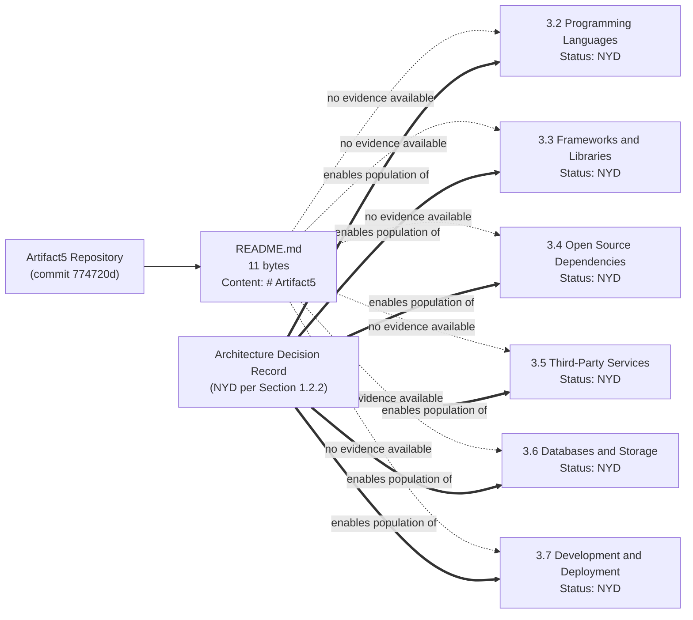

---

## 3.2 PROGRAMMING LANGUAGES

### 3.2.1 Selection Status

No programming language has been selected for any platform or component of Artifact5. The repository contains no source files in any language (verified per §3.1.2) and no language manifest declaring a runtime or interpreter version. Per §2.4.2, **Language / Runtime Constraints** are recorded as "NYD — no language manifest present (§1.2.2)."

| Platform / Component Layer (per §1.2.2 inventory) | Selected Language | Selected Runtime Version | Status |
|---|---|---|---|
| Frontend / User Interface Layer | NYD | NYD | Layer not present in repository |
| Backend Services / Application Layer | NYD | NYD | Layer not present in repository |
| Data Layer / Persistence | NYD | NYD | Layer not present in repository |
| Integration / API Gateway Layer | NYD | NYD | Layer not present in repository |
| Asynchronous / Batch Processing | NYD | NYD | Layer not present in repository |

### 3.2.2 Reserved Language Schema

The following four-column schema is reserved for future revisions to populate once an ADR (per §1.2.2) selects one or more languages for the project. The schema explicitly captures the selection-criteria fields requested by the section prompt ("List languages by platform/component"; "Justify selection criteria"; "Note any constraints or dependencies").

| Field | Purpose |
|---|---|
| Component / Platform | Identifies the system component (frontend, backend, data, etc.) the language serves; populated from the §1.2.2 Major System Components inventory once components are defined |
| Selected Language (and Version) | Captures the language name and version constraints (e.g., interpreter version, language-spec edition) chosen for the component |
| Selection Justification | Records the rationale for the choice, including ecosystem fit, team expertise, performance envelope, and tooling availability |
| Constraints / Dependencies | Notes runtime, OS, library, or interoperability constraints arising from the selection |

### 3.2.3 Selection Criteria for Future Definition

When the ADR identified in §1.2.2 is authored, the following criteria — derived from the section prompt — are to be applied to each candidate language and documented per row of the schema above:

- **Platform / Component Alignment:** Each language must be mapped to a specific component layer enumerated in the §1.2.2 Major System Components inventory.
- **Selection Justification:** Each selection must record an evidence-based rationale (e.g., ecosystem maturity, runtime characteristics, tooling support, hiring market).
- **Constraints and Dependencies:** Each selection must enumerate downstream constraints (e.g., minimum runtime version, OS-level dependencies, transpilation requirements).

Until the ADR exists, no programming-language selection can be substantiated by repository evidence.

---

## 3.3 FRAMEWORKS AND LIBRARIES

### 3.3.1 Selection Status

No application framework or supporting library has been adopted for Artifact5. Per §3.1.2, no framework-configuration files exist anywhere in the repository (no application bootstrap files, no framework manifests, no module/router definitions). Per §2.4.2, **Framework Constraints** are recorded as "NYD — no framework configuration present (§1.2.2)."

| Framework / Library Role | Selected Component | Version | Status |
|---|---|---|---|
| Core Application / Web Framework | NYD | NYD | No application source present |
| Frontend UI Framework | NYD | NYD | Frontend layer not present (§1.2.2) |
| API / Service Framework | NYD | NYD | API Gateway layer not present (§1.2.2) |
| ORM / Data-Access Library | NYD | NYD | Data layer not present (§1.2.2) |
| Background Task / Job Framework | NYD | NYD | Async / batch layer not present (§1.2.2) |
| Testing Framework | NYD | NYD | No test directories present (§1.4) |

### 3.3.2 Reserved Framework and Library Schema

The following four-column schema is reserved for future revisions to capture the framework and supporting-library inventory mandated by the section prompt ("Core frameworks with versions"; "Supporting libraries"; "Compatibility requirements"; "Justification for each major choice").

| Field | Purpose |
|---|---|
| Framework / Library Name | Canonical identifier of the framework or library |
| Version (or Version Range) | Specific version, semver range, or compatibility window selected |
| Compatibility Requirements | Records language-runtime version dependency, OS dependency, peer-dependency relationships, and interoperability constraints with sibling frameworks |
| Selection Justification | Captures the rationale tied to system capabilities (per §1.2.2) and functional requirements (per §2.2) once those are defined |

### 3.3.3 Compatibility and Selection Criteria

Future revisions of this subsection — to be enabled by the ADR per §1.2.2 and the Business / Product Requirements Document per §1.3.3 — must additionally record:

- **Compatibility Matrix:** Cross-framework compatibility (e.g., framework-runtime version, peer-framework version constraints) must be documented to prevent integration failures.
- **Security Posture:** Each framework selection must include a security-implication assessment per the constraint identified in §2.4.5 (Security Implications), where every dimension is currently NYD.
- **Maintenance Lifecycle:** Long-term-support windows, deprecation timelines, and upgrade cadence must be evaluated per §2.4.6 (Maintenance Requirements).

Until those upstream artifacts exist, no framework selection can be substantiated.

---

## 3.4 OPEN SOURCE DEPENDENCIES

### 3.4.1 Dependency Inventory Status

No open-source or third-party library dependencies have been declared for Artifact5. Per §1.2.1, "Artifact5 currently declares **zero dependencies** on internal or external systems," and per §3.1.2 no package manifest file of any kind (JavaScript, Python, Java, Go, Rust, Ruby, PHP, or .NET) exists in the repository. Per §2.4.6, **Patching / Dependency Updates** are recorded as "NYD — zero dependencies declared (§1.2.1)."

| Dependency Class | Count Declared | Package Registry | Status |
|---|---|---|---|
| Direct Application Dependencies | 0 | None — no manifest file present | NYD |
| Transitive Dependencies (lockfile-resolved) | 0 | None — no lockfile present | NYD |
| Development / Build-Time Dependencies | 0 | None — no manifest file present | NYD |
| Test-Only Dependencies | 0 | None — no manifest file present | NYD |
| Vendored / Bundled Dependencies | 0 | None — no `vendor/`, `lib/`, or equivalent directory | NYD |

### 3.4.2 Reserved Dependency Schema

The following four-column schema is reserved for future revisions to enumerate open-source dependencies in compliance with the section prompt ("Third-party / open-source libraries identified"; "Package dependencies, registries and versions").

| Field | Purpose |
|---|---|
| Package Name | Canonical package name as registered in the applicable registry |
| Package Registry | Identifies the registry the dependency is fetched from (e.g., PyPI, npm, Maven Central, crates.io, RubyGems, Packagist, NuGet) |
| Version / Constraint | Records the exact version, semver range, or pinned hash declared in the manifest |
| Purpose / Consumer Component | Maps the dependency to the system component (per §1.2.2) that consumes it |

### 3.4.3 Registry and Versioning Considerations

Future population of §3.4 — enabled by the ADR (per §1.2.2) and the introduction of one or more package-manifest files — must additionally observe:

- **Manifest Authority:** A single canonical manifest file per platform must be designated to prevent version drift; this expectation maps to the §1.4 search inventory that has already been exhausted against the repository.
- **Lockfile Discipline:** A lockfile (e.g., `package-lock.json`, `poetry.lock`, `Cargo.lock`) must accompany the primary manifest to guarantee reproducible builds.
- **Vulnerability Surveillance:** Each declared dependency must be surveilled for known vulnerabilities, in alignment with the §2.4.5 Threat Model placeholder.
- **Licensing Review:** Each declared dependency must be reviewed for license compatibility prior to inclusion.

---

## 3.5 THIRD-PARTY SERVICES

### 3.5.1 External Service Integration Status

No external API, third-party service, or cloud platform integration has been declared for Artifact5. Per §1.2.1, "No integration points, external service references, API client configurations, message broker connections, identity provider links, data pipeline taps, or any other enterprise-system touchpoints have been documented." Per §2.3 (cross-referenced in the context report), the project has "Zero dependencies on internal or external systems." Per §2.4.5, the **Authentication Model** is recorded as "NYD — no identity provider integration declared (§1.2.1)."

| Service Category (per section prompt) | Selected Provider | Integration Mechanism | Status |
|---|---|---|---|
| External APIs / SaaS Integrations | NYD | NYD | Zero integrations declared (§1.2.1) |
| Authentication / Identity Services | NYD | NYD | No identity provider integration (§2.4.5) |
| Monitoring / Observability Services | NYD | NYD | No application layer to observe (§2.4.6) |
| Cloud Services / Hosting Platform | NYD | NYD | No infrastructure-as-code present (§1.2.2) |
| Message Brokers / Event Buses | NYD | NYD | No async / batch layer present (§1.2.2) |
| Payment, Notification, or Analytics Vendors | NYD | NYD | No feature catalog declared (§2.1) |

### 3.5.2 Reserved Third-Party Service Schema

The following four-column schema is reserved for future revisions to capture each third-party service integration in compliance with the section prompt ("External APIs and integrations"; "Authentication services"; "Monitoring tools"; "Cloud services").

| Field | Purpose |
|---|---|
| Service / Provider Name | Canonical name of the external service (e.g., the vendor, SaaS product, or cloud platform) |
| Category | Maps the integration to one of the service categories enumerated in §3.5.1 |
| Integration Mechanism | Records the protocol, SDK, or API surface used (e.g., REST, GraphQL, SDK version, webhook, message queue) |
| Security and Compliance Requirements | Records authentication mechanism, data-residency requirements, encryption-in-transit posture, and contractual obligations |

### 3.5.3 Integration and Authentication Considerations

Future population of §3.5 — enabled by the Integration Architecture Document identified in §1.3.3 and the ADR per §1.2.2 — must additionally observe:

- **Identity and Authentication Posture:** Once the §2.4.5 Authentication Model is defined, the identity provider integration must be documented as a row in the schema above.
- **Monitoring and Observability Posture:** Once the §2.4.6 Logging and Observability dimension is defined, the corresponding telemetry, log-aggregation, and metrics services must be declared.
- **Cloud Service Boundary:** Once the §2.4.4 Geographic / Regional Distribution and the §2.4.2 Deployment Target Constraints are defined, the cloud hosting boundary must be documented.
- **Data Protection Boundary:** External services that process system data must be evaluated against the §2.4.5 Data Protection / Encryption dimension.

Until those upstream artifacts exist, no third-party service integration can be substantiated by repository evidence.

---

## 3.6 DATABASES AND STORAGE

### 3.6.1 Persistence Layer Status

No database, persistence engine, caching layer, or object/blob storage has been selected or configured for Artifact5. Per §1.2.2, the **Data Layer / Persistence** is recorded as "Not present." Per §3.1.2, no database schema files, migration directories, or ORM model files exist anywhere in the repository. Per §2.4.4, **Data Partitioning / Sharding** is recorded as "NYD — no Data layer present (§1.2.2)."

| Storage Tier (per section prompt) | Selected Technology | Persistence Strategy | Status |
|---|---|---|---|
| Primary Database (OLTP / System of Record) | NYD | NYD | Data layer not present (§1.2.2) |
| Secondary Database (OLAP / Analytics / Read-Replica) | NYD | NYD | Data layer not present (§1.2.2) |
| In-Memory / Distributed Cache | NYD | NYD | No application layer to cache for (§1.2.2) |
| Object / Blob Storage | NYD | NYD | No data domains modeled (§1.3.1) |
| File-System Storage | NYD | NYD | No application or asset files present |
| Search Index / Vector Store | NYD | NYD | No feature catalog declared (§2.1) |

### 3.6.2 Reserved Database and Storage Schema

The following four-column schema is reserved for future revisions to capture each persistence-tier decision in compliance with the section prompt ("Primary and secondary databases"; "Data persistence strategies"; "Caching solutions"; "Storage services").

| Field | Purpose |
|---|---|
| Storage Tier | Identifies the role of the data store (primary OLTP, secondary OLAP, cache, object storage, etc.) |
| Selected Technology and Version | Captures the engine, version, and edition selected |
| Data Domain Served | Maps the store to a data domain enumerated in §1.3.1 once data domains are modeled |
| Persistence / Durability Strategy | Records the consistency model, replication topology, backup cadence (per §2.4.6), and recovery objectives |

### 3.6.3 Persistence Strategy Considerations

Future population of §3.6 — enabled by the Business / Product Requirements Document per §1.3.3 (to define data domains) and the ADR per §1.2.2 (to select the engine) — must additionally observe:

- **Data Domain Mapping:** Each store must be tied to one or more data domains, which are currently "Not yet modeled" per §1.3.1.
- **Backup and Recovery:** Each persistent store must be documented against the §2.4.6 Backup and Recovery dimension, currently "NYD — no data store present (§1.2.2)."
- **Encryption-at-Rest:** Each persistent store must be evaluated against the §2.4.5 Data Protection / Encryption dimension.
- **Scalability Profile:** Each store must be evaluated against the §2.4.4 Horizontal Scaling, Vertical Scaling, and Geographic Distribution dimensions.

Until those upstream artifacts exist, no persistence technology can be substantiated by repository evidence.

---

## 3.7 DEVELOPMENT AND DEPLOYMENT

### 3.7.1 Development Tooling Status

No development tooling, editor configuration, linter configuration, or formatter configuration has been adopted for Artifact5. Per §3.1.2, none of `.editorconfig`, `.gitattributes`, `.eslintrc*`, `.prettierrc*`, `ruff.toml`, or `pyproject.toml` `[tool]` blocks exists in the repository. Per §1.4, no hidden configuration files (including `.blitzyignore`) alter visible scope.

| Development Tool Category | Selected Tool | Configuration Location | Status |
|---|---|---|---|
| Code Editor / IDE Configuration | NYD | None — no `.editorconfig` present | NYD |
| Linter | NYD | None — no linter config file present | NYD |
| Code Formatter | NYD | None — no formatter config file present | NYD |
| Type Checker / Static Analysis | NYD | None — no `tsconfig.json` or equivalent present | NYD |
| Pre-Commit Hooks | NYD | None — no hook configuration file present | NYD |

### 3.7.2 Build, Containerization, and CI/CD Status

No build system, container definition, orchestration manifest, infrastructure-as-code module, or continuous-integration pipeline has been authored for Artifact5. Per §2.4.2, **Build / Tooling Constraints** are recorded as "NYD — no build configuration present (§1.2.2)," and **Deployment Target Constraints** are recorded as "NYD — no infrastructure-as-code present (§1.2.2)."

| Build / Deploy Element (per section prompt) | Selected Tool / Definition | Artifact in Repository | Status |
|---|---|---|---|
| Build System / Task Runner | NYD | None — no `Makefile`, `webpack.config.js`, `vite.config.js`, `rollup.config.js`, or build script | NYD |
| Containerization | NYD | None — no `Dockerfile`, `docker-compose.yml`, or `.dockerignore` | NYD |
| Container Orchestration | NYD | None — no Kubernetes manifests or Helm charts | NYD |
| Infrastructure-as-Code | NYD | None — no `*.tf`, CloudFormation, Pulumi, or Ansible files | NYD |
| CI/CD Pipeline | NYD | None — no `.github/workflows/`, `.gitlab-ci.yml`, `Jenkinsfile`, or `azure-pipelines.yml` | NYD |
| Artifact Registry / Container Registry | NYD | None — no registry references | NYD |
| Environment Configuration | NYD | None — no `.env`, `.env.example`, or `.env.local` | NYD |

### 3.7.3 Reserved Development and Deployment Schema

The following four-column schema is reserved for future revisions to capture each tooling and deployment decision in compliance with the section prompt ("Development tools"; "Build system"; "Containerization"; "CI/CD requirements").

| Field | Purpose |
|---|---|
| Tooling Category | Identifies the role of the tool (linter, build system, container runtime, CI/CD platform, etc.) |
| Selected Tool and Version | Captures the tool name and version pin |
| Repository Artifact | Identifies the configuration file or directory introduced to the repository when the tool is adopted |
| Integration Contract | Records how the tool integrates with sibling tools (e.g., a CI workflow invoking a build system invoking a containerization step) |

### 3.7.4 Pipeline Criteria for Future Definition

Future population of §3.7 — enabled by the ADR per §1.2.2 — must additionally observe:

- **End-to-End Pipeline Coverage:** The development-to-deployment pipeline must be documented as a unified flow, from local development tooling through CI, container build, registry push, IaC provisioning, and runtime deployment.
- **Security Implications:** Each tooling decision must be evaluated against the §2.4.5 Security Implications dimensions; this includes secrets management for the (currently absent) `.env` files and supply-chain integrity for the (currently empty) dependency manifest.
- **Reproducibility:** Build configuration and lockfiles must guarantee reproducible artifacts, consistent with the §2.4.6 Maintenance Requirements posture.
- **Single-Commit Baseline:** The current commit history depth is one (`774720d`, "Initial commit", per §1.1.1); any CI/CD pipeline introduced must accommodate this skeleton baseline as its first trigger event.

---

## 3.8 TECHNOLOGY STACK TRACEABILITY

### 3.8.1 Subsection-to-Evidence Mapping

Because no technology selections exist, a conventional technology-to-component traceability matrix cannot be populated. The matrix below instead traces each **placeholder subsection** of this Section 3 to the **evidentiary anchor** in §1 and §2 that justifies its empty state. This mirrors the convention established in §2.5.1.

| Section 3 Subsection | Evidentiary Anchor | Documented Finding |
|---|---|---|
| §3.2 Programming Languages | §1.2.2 Core Technical Approach; §2.4.2 Language / Runtime Constraints | No language manifest present; no source files in any language |
| §3.3 Frameworks and Libraries | §1.2.2 Core Technical Approach; §2.4.2 Framework Constraints | No framework configuration present |
| §3.4 Open Source Dependencies | §1.2.1 Integration Landscape; §2.4.6 Patching / Dependency Updates | Zero dependencies declared; no manifest file present |
| §3.5 Third-Party Services | §1.2.1 Integration Landscape; §2.4.5 Authentication Model | Zero integration points; no identity provider integration |
| §3.6 Databases and Storage | §1.2.2 Major System Components; §2.4.4 Data Partitioning | Data Layer recorded as "Not present"; no schema files |
| §3.7 Development and Deployment | §1.2.2 Core Technical Approach; §2.4.2 Build / Deployment Constraints | No build configuration; no infrastructure-as-code |

### 3.8.2 Forward-Path Artifact Enablement

The artifacts catalogued in §1.3.3 and §2.5.2 are the prerequisite inputs required to convert each empty placeholder in this section into substantive content. The mapping below extends §2.5.2 by making the dependency explicit for §3.

| Forward-Path Artifact | Section 3 Subsection Enabled |
|---|---|
| Architecture Decision Record (per §1.2.2) | §3.2 Programming Languages; §3.3 Frameworks and Libraries; §3.6 Databases and Storage; §3.7 Development and Deployment |
| Business / Product Requirements Document (per §1.3.3) | §3.3 Frameworks and Libraries (capability-driven framework needs); §3.6 Databases and Storage (data-domain modeling) |
| Integration Architecture Document (per §1.3.3) | §3.4 Open Source Dependencies; §3.5 Third-Party Services |
| User Journey or Workflow Documentation (per §1.3.3) | §3.3 Frameworks and Libraries (UI framework selection); §3.5 Third-Party Services (user-facing integrations) |
| Out-of-Scope Statement / Non-Goals Document (per §1.3.3) | Bounding context for all Section 3 subsections (excludes non-applicable technology categories) |

### 3.8.3 Assumptions and Constraints Governing This Section

The following assumptions and constraints have been applied in authoring §3. They are surfaced here, consistent with the convention established in §2.5.3, so that future revisions can validate or revise them as the project moves out of skeleton state.

| Assumption / Constraint | Basis |
|---|---|
| Repository content is limited to `README.md` (11 bytes) | §1.1.1 and §1.4 Files Examined |
| The "Default Technology Stack" supplied to the section prompt is a hypothetical baseline, not a ratified architectural decision | Section prompt directive: "Only include sections and items that are actually relevant" |
| No source code, manifest, configuration, or infrastructure file exists in the repository | §1.2.2 Core Technical Approach and §3.1.2 Diagnostic Indicator Inventory |
| The Architecture Decision Record (ADR) referenced in §1.2.2 is the canonical enabling artifact for §3.2, §3.3, §3.6, and §3.7 | §2.5.2 Forward-Path Artifacts and Enablement |
| Tables in this section are capped at four columns | §2.5.3 |

---

## 3.9 References

#### Files Examined

- `README.md` — The sole content-bearing file in the repository (11 bytes; content: `# Artifact5`). Confirms the absence of any source code, language manifest, framework configuration, dependency declaration, third-party service reference, persistence definition, or development-and-deployment artifact that would otherwise populate this section.

#### Folders Explored

- `/` (repository root) — Verified to contain only `README.md` alongside version-control metadata (`.git/`). No source, configuration, documentation, test, or infrastructure subdirectories exist. The absence of these subdirectories is the structural basis for every "NYD" entry in §3.1 through §3.7.

#### Search and Discovery Operations Performed

- Search for language manifest files (`requirements.txt`, `pyproject.toml`, `setup.py`, `Pipfile`, `poetry.lock`, `package.json`, `package-lock.json`, `yarn.lock`, `pnpm-lock.yaml`, `pom.xml`, `build.gradle`, `build.gradle.kts`, `settings.gradle`, `go.mod`, `go.sum`, `Cargo.toml`, `Cargo.lock`, `Gemfile`, `Gemfile.lock`, `composer.json`, `composer.lock`, `*.csproj`, `*.sln`, `packages.config`) — none found.
- Search for container and orchestration files (`Dockerfile`, `docker-compose.yml`, `.dockerignore`, Kubernetes manifests, Helm charts) — none found.
- Search for infrastructure-as-code files (`*.tf` Terraform, CloudFormation, Pulumi, Ansible) — none found.
- Search for CI/CD configuration (`.github/workflows/`, `.gitlab-ci.yml`, `Jenkinsfile`, `azure-pipelines.yml`) — none found.
- Search for environment and build configuration (`.env`, `.env.example`, `.env.local`, `Makefile`, `webpack.config.js`, `vite.config.js`, `rollup.config.js`, `tsconfig.json`) — none found.
- Search for linting / formatting configuration (`.eslintrc*`, `.prettierrc*`, `ruff.toml`, `pyproject.toml [tool]` blocks) — none found.
- Search for editor / VCS configuration (`.editorconfig`, `.gitattributes`, `.blitzyignore`) — none found.
- Search for database schemas (`*.sql`, migration directories, ORM model files) — none found.
- Search for application source files in all common languages (`*.py`, `*.js`, `*.ts`, `*.tsx`, `*.java`, `*.kt`, `*.swift`, `*.m`, `*.go`, `*.rs`, `*.rb`, `*.cs`, `*.php`) — none found.
- Semantic searches across files and folders for technology-stack indicators (`"package.json or pyproject.toml or requirements.txt dependency manifest"`, `"source code application implementation"`, `"configuration build infrastructure docker"`, `"technology stack framework backend frontend"`, `"configuration build deployment infrastructure"`) — all returned empty result sets.

#### Cross-Referenced Technical Specification Sections

- **§1.1 Executive Summary** — Established the pre-implementation skeleton state (§1.1.1), recorded a single commit (`774720d`, "Initial commit"), and confirmed total repository content as 11 bytes; cited throughout §3 as the evidentiary basis for the absence of all technology artifacts.
- **§1.2 System Overview** — Documented zero integrations (§1.2.1), zero declared capabilities and components (§1.2.2), and the explicit "To Be Defined" status of language, framework, persistence, deployment target, and tooling selection through a forthcoming ADR (§1.2.2); cited as the primary evidentiary anchor for §3.2, §3.3, §3.5, §3.6, and §3.7.
- **§1.3 Scope** — Confirmed all in-scope dimensions as TBD and enumerated the forward-enabling artifacts (Business / Product Requirements Document, User Journey or Workflow Documentation, Integration Architecture Document, Out-of-Scope Statement / Non-Goals Document) in §1.3.3; cited as the source of the Forward-Path Artifacts mapping in §3.8.2.
- **§1.4 References** — Corroborated the file and folder inventory and search exhaustiveness used as evidence throughout §3.1.
- **§2.1 Feature Catalog** — Confirmed zero features exist; cited to justify the absence of feature-driven framework and service selections in §3.3 and §3.5.
- **§2.2 Functional Requirements Table** — Confirmed zero functional requirements exist; cited to justify the absence of requirement-driven technology constraints in §3.3.
- **§2.3 Feature Relationships** — Confirmed zero integration points and zero shared components; cited to justify the absence of inter-service technology dependencies in §3.5.
- **§2.4 Implementation Considerations** — The most directly upstream section to §3; documented every constraint dimension (Language / Runtime, Framework, Build / Tooling, Deployment Target, Performance, Scalability, Security, Maintenance) as NYD with the corresponding evidentiary cross-reference. Cited throughout §3 as the basis for each technology-category placeholder.
- **§2.5 Traceability Matrix** — Provided the four-column constraint (§2.5.3), the forward-path artifact mapping (§2.5.2 — including the ADR enablement of §2.4), and the assumption / constraint convention used in §3.8.3.
- **§2.6 Related Documents and Process Flowcharts** — Confirmed no architectural diagrams or flowcharts exist in the repository; cited to justify the absence of physical-architecture diagrams in §3.
- **§2.7 References** — Corroborated repository-level inspections and inherited the search and discovery operations enumerated above.

# 4. Process Flowchart

This section documents process flows for the system identified in its repository as **Artifact5**. Consistent with the evidence-based posture established across §1.1 Executive Summary, §1.2 System Overview, §1.3 Scope, §2.1 Feature Catalog, §2.2 Functional Requirements Table, §2.6 Related Documents and Process Flowcharts, and §3.1 Technology Stack Current State — all of which formally record the project as being in a **pre-implementation, skeleton state** containing only an 11-byte `README.md` file with the single line `# Artifact5` — no end-to-end user journeys, system interactions, integration workflows, decision points, error handling paths, or stateful transitions have been recorded in the codebase.

The direct upstream anchor for this section, §2.6.2, has already enumerated each of the four flowchart categories requested by the Section 4 prompt — User Journey Flowcharts, System Process Flowcharts, Integration Sequence Diagrams, and State Transition Diagrams — as "**None**." Accordingly, this section documents the **verified absence** of process flows rather than fabricating speculative workflows. Each subsection below:

1. Honors every structural element requested by the section prompt (System Workflows, Flowchart Requirements, Validation Rules, Technical Implementation, Required Diagrams).
2. Marks every required field as **Not Yet Defined (NYD)** with the corresponding evidentiary cross-reference, in alignment with the conventions established in §1.2.2, §1.2.3, §1.3.1, §2.1.1, §2.2.1, §2.2.4, §2.3.1, §2.4.1, and §3.8.1.
3. Preserves the schema and identifier formats prescribed by the prompt so that future revisions can populate the templates without restructuring this section.
4. Cites the forward-enabling artifacts enumerated in §1.3.3, §2.5.2, and §3.8.2 (Business / Product Requirements Document, User Journey or Workflow Documentation, Integration Architecture Document, Architecture Decision Record, Out-of-Scope Statement / Non-Goals Document) as the prerequisite inputs required to convert each placeholder into a substantive process-flow record.
5. Provides minimum-viable Mermaid diagrams that depict the current (empty) state for each of the five required diagram categories, following the styling convention introduced in §1.2.2, §2.3.2, and §3.1.3.

---

## 4.1 CURRENT WORKFLOW INVENTORY STATE

### 4.1.1 Direct Statement of Absence

The Artifact5 repository declares **zero process flows**. This determination is the canonical extension of the finding in §2.6.2 ("No process flowcharts exist within the repository, and none are referenced by the upstream sections §1.1–§1.4") and is the direct corollary of the upstream evidentiary chain summarized below. Because process flowcharts are derivative artifacts that require declared system capabilities, components, integrations, stateful resources, and operational targets as inputs, and because each of these inputs has been independently recorded as absent in §1 and §2, no flow node, edge, decision diamond, swim lane, or sequence arrow can be authored with evidentiary support.

### 4.1.2 Evidentiary Anchors for Empty-State Determination

The table below enumerates the upstream findings that converge on the zero-flow determination for §4. Each anchor traces to a previously authored, evidence-grounded statement elsewhere in this Technical Specification.

| Evidentiary Anchor | Documented Finding Supporting Zero-Flow Determination |
|---|---|
| §1.2.1 Integration Landscape | "Artifact5 currently declares zero dependencies on internal or external systems." |
| §1.2.2 Major System Components | Frontend, Backend, Data, Integration, and Asynchronous layers all "Not present." |
| §2.1.1 Feature Inventory | "The Artifact5 repository declares zero features." |
| §2.6.2 Process Flowcharts | All four flowchart categories (User Journey, System Process, Integration Sequence, State Transition) recorded as "None." |

### 4.1.3 Workflow Inventory Summary

The inventory dimensions below mirror the conventions of §2.1.1 and §2.2.1 and are populated with verified-zero counts. The schema is preserved for future revisions.

| Inventory Dimension | Current Count |
|---|---|
| Total Workflows Catalogued | 0 |
| Workflows in "Proposed" Status | 0 |
| Workflows in "Approved" Status | 0 |
| Workflows in "Implemented" Status | 0 |

---

## 4.2 SYSTEM WORKFLOWS (EMPTY STATE)

This subsection preserves the structure requested by the Section 4 prompt's **SYSTEM WORKFLOWS** branch. Each sub-dimension is recorded below as NYD with the corresponding evidentiary cross-reference, following the convention established in §2.2.4 and §2.4 for empty-schema preservation.

### 4.2.1 Core Business Processes Schema (Reserved for Future Population)

The four Core Business Process dimensions enumerated in the section prompt cannot be authored against the current repository state because none of their prerequisite inputs (declared user journeys, declared system components, declared decision logic, or declared error semantics) exist.

| Core Business Process Dimension | Current Documented Value |
|---|---|
| End-to-End User Journeys | NYD — User Groups Covered "Not yet identified" (§1.3.1); Primary User Workflows "To be defined" (§1.3.1) |
| System Interactions | NYD — all five component layers "Not present" (§1.2.2) |
| Decision Points | NYD — zero features and zero requirements (§2.1.1, §2.2.1) |
| Error Handling Paths | NYD — Backend Services / Application Layer "Not present" (§1.2.2) |

### 4.2.2 Integration Workflows Schema (Reserved for Future Population)

The four Integration Workflow dimensions are similarly reserved. §1.2.1 records zero declared integrations and §2.3.3 confirms that all Integration Point categories (Inbound, Outbound, Inter-Feature, External) are empty.

| Integration Workflow Dimension | Current Documented Value |
|---|---|
| Data Flow Between Systems | NYD — zero integration points declared (§1.2.1, §2.3.3) |
| API Interactions | NYD — Integration / API Gateway Layer "Not present" (§1.2.2) |
| Event Processing Flows | NYD — Asynchronous / Batch Processing layer "Not present" (§1.2.2) |
| Batch Processing Sequences | NYD — Asynchronous / Batch Processing layer "Not present" (§1.2.2) |

### 4.2.3 Workflow Identifier Schema (Reserved for Future Population)

To preserve forward-compatibility with the requirement identifier schema established in §2.1.2 (`F-XXX`) and §2.2.2 (`F-XXX-RQ-YYY`), the following identifier format is reserved for future workflow records. No identifiers are issued at this time because no workflow evidence exists.

| Identifier Field | Format / Allowed Values |
|---|---|
| Workflow ID | `WF-XXX` (zero-padded sequential, beginning `WF-001`) |
| Parent Feature ID | `F-XXX` (per §2.1.2) — required association |
| Workflow Type | Business Process / Integration / Batch / Event-Driven |
| Status | Proposed / Approved / Implemented / Deprecated |

---

## 4.3 FLOWCHART REQUIREMENTS (EMPTY STATE)

This subsection preserves the structure requested by the Section 4 prompt's **FLOWCHART REQUIREMENTS** branch, covering both the seven per-workflow flowchart elements and the four Validation Rules categories.

### 4.3.1 Per-Workflow Element Schema (Reserved for Future Population)

The seven flowchart elements requested by the prompt for "each major workflow" cannot be populated because no workflows exist (see §4.1). The schema below is preserved verbatim so that future revisions can apply it uniformly to each future `WF-XXX` record.

| Flowchart Element | Current Documented Value |
|---|---|
| Start and End Points | NYD — no system entry or exit boundaries drawn (§1.3.1) |
| Process Steps | NYD — zero features and zero requirements (§2.1.1, §2.2.1) |
| Decision Diamonds | NYD — no business rules declared (§2.2.4) |
| System Boundaries | NYD — System Boundaries (logical) "Not yet drawn" (§1.3.1) |
| User Touchpoints | NYD — User Groups Covered "Not yet identified" (§1.3.1) |
| Error States and Recovery Paths | NYD — Backend layer "Not present" (§1.2.2); Backup and Recovery NYD (§2.4.6) |
| Timing and SLA Considerations | NYD — no KPIs / SLOs / SLAs declared (§1.2.3) |

### 4.3.2 Validation Rules Schema (Reserved for Future Population)

The four Validation Rule categories required by the Section 4 prompt map directly onto the schema already preserved in §2.2.4. The cross-references are restated below for §4 traceability; no new validation rules are introduced here.

| Validation Category | Current Documented Value |
|---|---|
| Business Rules at Each Step | NYD — no business problem statement (§1.1.2); see §2.2.4 |
| Data Validation Requirements | NYD — no Data Layer or data domains (§1.2.2, §1.3.1); see §2.2.4 |
| Authorization Checkpoints | NYD — Authentication and Authorization Models NYD (§2.4.5); see §2.2.4 |
| Regulatory Compliance Checks | NYD — no regulatory or market posture documented (§1.2.1); see §2.2.4 |

### 4.3.3 Swim Lane Catalogue (Reserved for Future Population)

The section prompt instructs the author to "Add swim lanes for different actors/systems." Because §1.3.1 records User Groups as "Not yet identified" and §1.2.2 records all five system component layers as "Not present," no actor or system swim lane can be drawn. The reserved swim-lane catalogue is documented below for future population.

| Swim-Lane Category | Currently Identified Members |
|---|---|
| Human Actors / User Roles | None — User Groups Covered "Not yet identified" (§1.3.1) |
| Frontend / Presentation Systems | None — Frontend Layer "Not present" (§1.2.2) |
| Backend / Application Systems | None — Backend Layer "Not present" (§1.2.2) |
| External / Third-Party Systems | None — zero integrations declared (§1.2.1) |

---

## 4.4 TECHNICAL IMPLEMENTATION (EMPTY STATE)

This subsection preserves the structure requested by the Section 4 prompt's **TECHNICAL IMPLEMENTATION** branch. Each State Management and Error Handling dimension is recorded below as NYD with the corresponding evidentiary cross-reference.

### 4.4.1 State Management Schema (Reserved for Future Population)

The four State Management dimensions required by the prompt are blocked by the absence of a Backend, Data, or Asynchronous layer (per §1.2.2) and by the absence of any selected runtime, persistence technology, or caching technology (per §2.4.2, §2.4.4, and §3.6).

| State Management Dimension | Current Documented Value |
|---|---|
| State Transitions | NYD — no stateful components defined (§1.2.2); no state diagrams (§2.6.2) |
| Data Persistence Points | NYD — Data Layer "Not present" (§1.2.2); Data Partitioning NYD (§2.4.4) |
| Caching Requirements | NYD — no Backend layer (§1.2.2); no Performance / Latency targets declared (§2.4.3) |
| Transaction Boundaries | NYD — no Data layer present (§1.2.2); no API contracts (§2.2.3) |

### 4.4.2 Error Handling Schema (Reserved for Future Population)

The four Error Handling dimensions required by the prompt are blocked by the absence of an application runtime, an observability stack, and any declared integration through which error notifications could be emitted.

| Error Handling Dimension | Current Documented Value |
|---|---|
| Retry Mechanisms | NYD — no Backend layer (§1.2.2); no concurrency / load targets (§2.4.3) |
| Fallback Processes | NYD — no Backend layer (§1.2.2); zero integrations to fall back to (§1.2.1) |
| Error Notification Flows | NYD — zero integrations (§1.2.1); Logging and Observability NYD (§2.4.6) |
| Recovery Procedures | NYD — Backup and Recovery NYD (§2.4.6); no Data store present (§1.2.2) |

### 4.4.3 Transaction and Consistency Posture Schema

To preserve coverage of common Technical Implementation concerns adjacent to state and error handling, the following posture dimensions are also marked NYD with their evidentiary anchors.

| Posture Dimension | Current Documented Value |
|---|---|
| Consistency Model (Strong / Eventual / Causal) | NYD — no Data layer or distributed components (§1.2.2) |
| Idempotency Strategy | NYD — no API contracts to designate idempotent operations (§2.2.3) |
| Distributed Transaction Pattern (2PC / Saga / Outbox) | NYD — no inter-service boundaries (§1.2.2, §2.3.3) |
| Observability Hooks (Logs / Metrics / Traces) | NYD — Logging and Observability NYD (§2.4.6) |

---

## 4.5 REQUIRED DIAGRAMS (CURRENT EMPTY STATE)

The Section 4 prompt mandates five Mermaid.js diagram categories. Because no workflows, features, integrations, or stateful components exist, none of the five diagrams can be authored with substantive content. The diagrams below adopt the minimum-viable empty-state convention established in §1.2.2, §2.3.2, and §3.1.3: solid arrows depict the current (verified) state of the repository, dotted arrows denote "no evidence available" relationships, and double arrows denote "enables population of" relationships from forward-path artifacts.

### 4.5.1 High-Level System Workflow Diagram (Empty State)

The diagram below depicts the current state of the system from a workflow perspective. The repository's sole content-bearing artifact (`README.md`) cannot, by itself, produce a substantive system workflow. The diagram preserves the **Start → Process → Decision → End** topology requested by the prompt while marking each interior node as NYD with its evidentiary anchor.

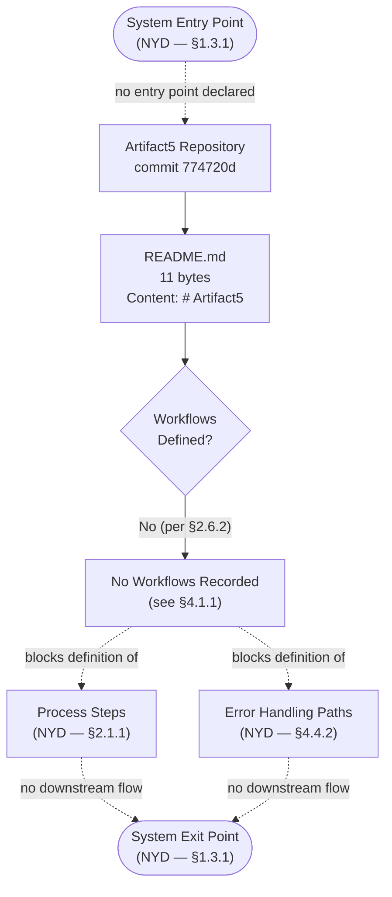

### 4.5.2 Detailed Process Flow Per Core Feature (Empty State)

The section prompt requires "Detailed process flows for each core feature." Because §2.1.1 records zero features (`F-XXX` catalogue empty), the per-feature flow inventory is correspondingly empty. The diagram below preserves the reserved `F-001`, `F-002`, `F-NNN` slots from §2.1.2 and visualizes their blocked status.

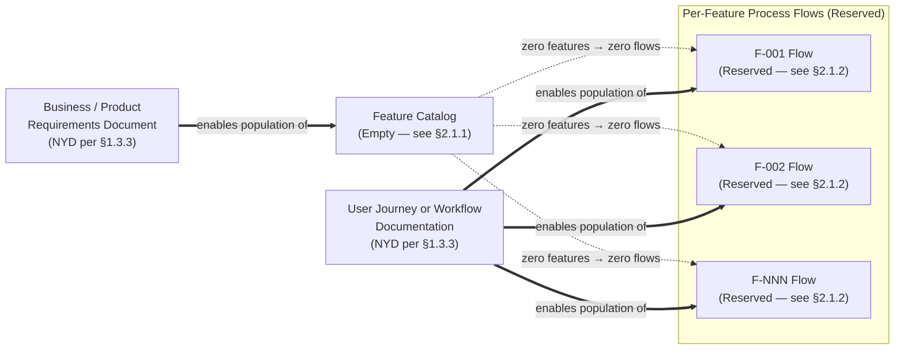

### 4.5.3 Error Handling Flowchart (Empty State)

The section prompt requires an error-handling flowchart with retry, fallback, notification, and recovery branches. Because §1.2.2 records the Backend Services / Application Layer as "Not present" and §2.4.6 records Logging and Observability as NYD, no runtime error trigger, retry path, or recovery sink can be authored. The diagram below preserves the four-branch error-handling topology and explicitly marks each branch as blocked by an evidentiary anchor.

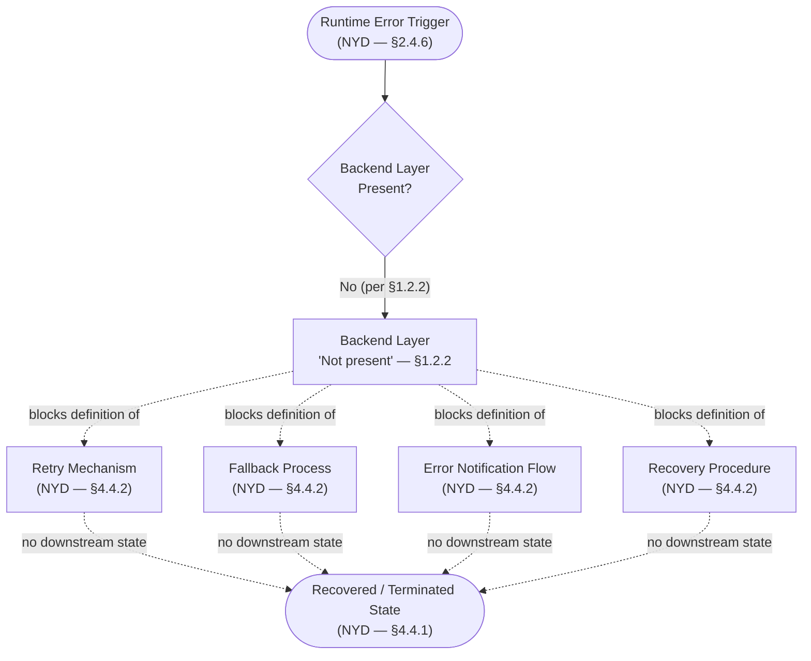

### 4.5.4 Integration Sequence Diagram (Empty State)

The section prompt requires an integration sequence diagram. Because §1.2.1 records "zero dependencies on internal or external systems" and §2.3.3 confirms all Integration Point categories as empty, no concrete participant set or message exchange can be drawn. The sequence diagram below preserves the canonical three-actor topology (User, System, External System) requested by the prompt and uses Mermaid Note elements to mark the absence of declared interactions.

```mermaid
sequenceDiagram
    autonumber
    participant U as User (NYD — §1.3.1)
    participant S as Artifact5 System (Skeleton)
    participant E as External System (Zero declared — §1.2.1)

    Note over U,E: No integration interactions defined. See §2.3.3 Integration Points and §2.6.2 Process Flowcharts.

    U->>S: (No inbound request defined — NYD per §2.2.3)
    Note right of S: Backend Layer 'Not present' per §1.2.2; no handler exists.
    S->>E: (No outbound integration — see §1.2.1)
    Note right of E: Zero external systems declared per §2.3.3.
    E-->>S: (No inbound integration — see §1.2.1)
    S-->>U: (No response contract defined — NYD per §2.2.3)
```

### 4.5.5 State Transition Diagram (Empty State)

The section prompt requires a state transition diagram. Because §1.2.2 records all five system component layers as "Not present" and §4.4.1 records every State Management dimension as NYD, the state machine for Artifact5 collapses to a single placeholder state. The diagram below uses Mermaid's `stateDiagram-v2` syntax to preserve the entry → state → transition → exit topology while marking the entire state space as undefined.

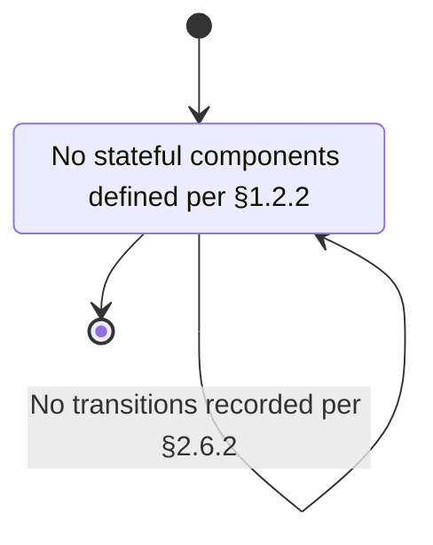

### 4.5.6 Diagram Coverage Summary

The table below maps each of the five required Mermaid diagram categories from the Section 4 prompt to the empty-state diagram authored above and to the forward-path artifact that will enable substantive content.

| Required Diagram Category | Empty-State Diagram Reference | Enabling Forward-Path Artifact |
|---|---|---|
| High-Level System Workflow | §4.5.1 | Business / Product Requirements Document (§1.3.3) |
| Detailed Process Flows per Feature | §4.5.2 | Business / Product Requirements Document + User Journey Documentation (§1.3.3) |
| Error Handling Flowchart | §4.5.3 | Architecture Decision Record (§1.2.2) |
| Integration Sequence Diagram | §4.5.4 | Integration Architecture Document (§1.3.3) |
| State Transition Diagram | §4.5.5 | Architecture Decision Record (§1.2.2) |

---

## 4.6 FORWARD-PATH ARTIFACT ENABLEMENT

Mirroring the convention established in §2.5.2 and §3.8.2, this subsection makes explicit the dependency of each empty placeholder in §4 on the forward-path artifacts enumerated in §1.3.3. Until such artifacts are introduced to the repository, every workflow statement in this specification remains a reserved schema.

### 4.6.1 Subsection-to-Artifact Mapping

The matrix below traces each §4 subsection to the prerequisite artifact required to convert its empty placeholders into substantive content.

| Forward-Path Artifact (per §1.3.3) | §4 Subsection Enabled |
|---|---|
| Business / Product Requirements Document | §4.2.1 Core Business Processes; §4.3.1 Process Steps and Decision Diamonds |
| User Journey or Workflow Documentation | §4.2.1 End-to-End User Journeys; §4.3.1 User Touchpoints; §4.3.3 Swim Lanes; §4.5.1, §4.5.2 |
| Integration Architecture Document | §4.2.2 Integration Workflows; §4.3.1 System Boundaries; §4.5.4 |
| Architecture Decision Record (per §1.2.2) | §4.4.1 State Management; §4.4.2 Error Handling; §4.4.3 Consistency Posture; §4.5.3, §4.5.5 |
| Out-of-Scope Statement / Non-Goals Document | Bounding context for §4.2, §4.3, §4.4, and §4.5 |

### 4.6.2 Process Flow Authoring Prerequisites Sequence

The following ordering reflects the natural authoring dependency observed in §2.5.2 and §3.8.2: business intent must precede integration topology, which must precede technical architecture, which must precede the flowcharts that depict their orchestration.

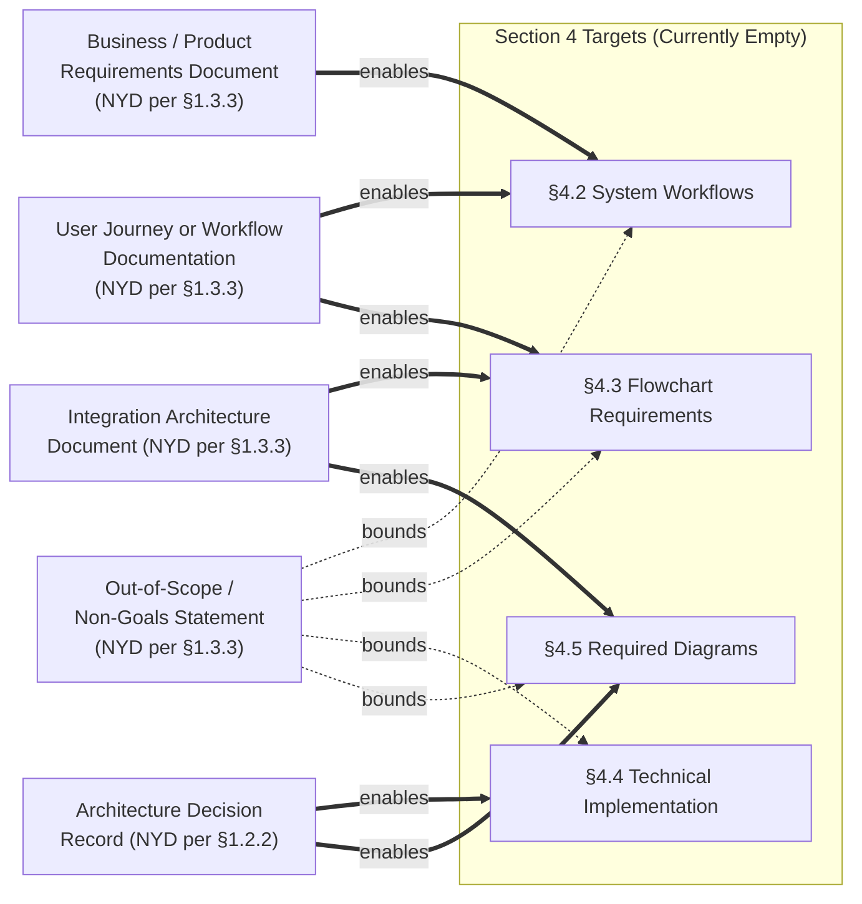

### 4.6.3 Required Inputs for Each Diagram Category

| Diagram Category | Minimum Required Inputs Before Authoring |
|---|---|
| High-Level System Workflow (§4.5.1) | At least one feature in §2.1; at least one user group in §1.3.1 |
| Detailed Per-Feature Flow (§4.5.2) | At least one `F-XXX` entry; corresponding `F-XXX-RQ-YYY` set in §2.2 |
| Error Handling Flowchart (§4.5.3) | Backend layer declared; observability stack selected (§2.4.6) |
| Integration Sequence Diagram (§4.5.4) | At least one inbound or outbound integration declared in §2.3.3 |
| State Transition Diagram (§4.5.5) | At least one stateful component identified in §1.2.2 |

---

## 4.7 ASSUMPTIONS AND CONSTRAINTS

Following the conventions established in §2.5.3 and §3.8.3, the assumptions and constraints applied in authoring §4 are surfaced below so that future revisions can validate or revise them as the project moves out of skeleton state.

### 4.7.1 Section-Level Assumptions

| Assumption | Basis |
|---|---|
| Repository content remains limited to `README.md` (11 bytes) at the time of authoring | §1.1.1 and §1.4 Files Examined |
| Project is a greenfield initiative; no legacy workflows exist for migration | §1.2.1 Current System Limitations |
| No `.blitzyignore` or hidden config alters visible workflow scope | §1.4 Repository-Level Inspections Performed |
| §2.6.2 is the canonical upstream anchor for all process-flow declarations | §2.6.2 Process Flowcharts |
| Workflow identifiers (`WF-XXX`) remain reserved for future use | §4.2.3 (forward-compatibility with §2.1.2 and §2.2.2) |

### 4.7.2 Section-Level Constraints

| Constraint | Basis |
|---|---|
| Tables in this section are capped at four columns | §2.5.3 and §3.8.3 |
| Empty-state diagrams must follow the styling of §1.2.2, §2.3.2, and §3.1.3 | Prior-section conventions |
| Diagrams must not fabricate workflow nodes, actors, or sequence interactions absent from the repository | Section prompt directive |
| Each empty placeholder must cite at least one evidentiary anchor in §1 or §2 | §2.2 / §2.4 / §3.8 authoring convention |
| The five required diagram categories from the prompt must each be represented, even when empty | Section prompt directive |

### 4.7.3 Version Tracking

| Version Field | Current Value |
|---|---|
| Section Revision | 1 (initial authoring against skeleton repository) |
| Number of Active Workflows | 0 |
| Number of Authored Mermaid Diagrams | 6 (all empty-state) |
| Last Repository Commit Referenced | `774720d` ("Initial commit", per §1.1.1) |

---

## 4.8 REFERENCES

### 4.8.1 Files Examined

- `README.md` — The sole content-bearing file in the repository. Contains exactly one line, `# Artifact5`, totaling 11 bytes; verified to contain no workflow narratives, user journey descriptions, integration diagrams, or state machine definitions.

### 4.8.2 Folders Explored

- `/` (repository root) — Verified to contain only `README.md` alongside version-control metadata (`.git/`, intentionally excluded as a non-project artifact). No source directories, configuration directories, documentation directories, workflow directories, or `flows/` directories exist.

### 4.8.3 Repository-Level Inspections Performed

- Full filesystem traversal confirming the absence of any workflow, flow, BPMN, sequence-diagram, or state-machine artifacts.
- Semantic search for "workflow process flow business logic implementation" — returned empty results.
- Semantic search for "source code application modules api services" — returned empty results.
- Inspection of the git commit history, which contains a single commit titled "Initial commit" (hash `774720d`).
- Verification that no `.blitzyignore` file masks workflow content from inspection.

### 4.8.4 Cross-Referenced Technical Specification Sections

- **§1.1 Executive Summary** — Established baseline facts (project name, commit hash, repository size, skeleton state) restated in §4.1 and §4.7.
- **§1.2 System Overview** — Provided the canonical "Not present" findings for all five component layers (§1.2.2) and the zero-integration finding (§1.2.1) restated in §4.2.1, §4.2.2, §4.4.1, and §4.4.2.
- **§1.3 Scope** — Provided the "Primary User Workflows: To be defined" anchor (§1.3.1) and the forward-path artifact catalogue (§1.3.3) restated in §4.6.1.
- **§1.4 References** — Provided the file inventory and search exhaustiveness corroborating the empty-state finding in §4.1.
- **§2.1 Feature Catalog** — Provided the zero-feature finding (§2.1.1) and the `F-XXX` identifier schema (§2.1.2) restated in §4.5.2 and §4.2.3.
- **§2.2 Functional Requirements Table** — Provided the zero-requirement finding (§2.2.1) and the Validation Rules schema (§2.2.4) restated in §4.3.2.
- **§2.3 Feature Relationships** — Provided the empty Integration Points table (§2.3.3) and the empty-state Mermaid styling convention (§2.3.2) restated in §4.2.2 and §4.5.
- **§2.4 Implementation Considerations** — Provided the NYD findings for Performance (§2.4.3), Scalability (§2.4.4), Security (§2.4.5), and Maintenance (§2.4.6) restated in §4.4.
- **§2.5 Traceability Matrix** — Provided the Subsection-to-Evidence mapping pattern (§2.5.1), the Forward-Path Artifact mapping pattern (§2.5.2), and the Assumptions / Constraints convention (§2.5.3) replicated in §4.6 and §4.7.
- **§2.6 Related Documents and Process Flowcharts** — **Direct upstream parent.** Provided the canonical "None" determinations for all four flowchart categories (§2.6.2) restated in §4.1.1.
- **§3.1 Technology Stack Current State** — Provided the Diagnostic Indicator Inventory (§3.1.2) and the `flowchart LR` empty-state Mermaid styling (§3.1.3) replicated in §4.5.2 and §4.6.2.
- **§3.8 Technology Stack Traceability** — Provided the Subsection-to-Evidence Mapping (§3.8.1) and Assumptions / Constraints (§3.8.3) patterns replicated in §4.6.1 and §4.7.

# 5. System Architecture

This section documents the system architecture of Artifact5 against the verified state of the repository at commit `774720d` ("Initial commit"). Because the repository is in a **pre-implementation, skeleton state** — containing only a single 11-byte `README.md` whose entire content is the H1 heading `# Artifact5` — no architectural style has been chosen, no components exist, no integration points have been declared, and no technical decisions have been recorded. Every sub-dimension required by the section prompt is therefore documented below as **Not Yet Defined (NYD)** or **To Be Defined (TBD)** with an explicit evidentiary cross-reference to §1, §2, §3, or §4. This authoring approach is consistent with the empty-state conventions established in §1.2.2 (Major System Components), §2.3.2 (Feature Dependency Map), §3.1.3 (Stack Definition Status Diagram), and §4.5 (Required Diagrams — Current Empty State).

The Architecture Decision Record (ADR) identified as the forthcoming canonical enabling artifact in §1.2.2 and §2.5.2 is the prerequisite input for substantive content in §5.1 through §5.3. The Business / Product Requirements Document, Integration Architecture Document, User Journey or Workflow Documentation, and Out-of-Scope / Non-Goals Document enumerated in §1.3.3 supply the remaining inputs required to populate this section, as mapped in §5.5.

## 5.1 HIGH-LEVEL ARCHITECTURE

### 5.1.1 System Overview

#### Overall Architecture Style and Rationale

No architecture style has been selected for Artifact5. Per §1.2.2 Core Technical Approach, "No technical approach has been selected," and "The selection of programming language, runtime, framework, persistence technology, deployment target, and tooling pipeline is therefore To Be Defined through a forthcoming Architecture Decision Record (ADR) or equivalent technology-selection artifact." Consequently, the canonical architecture-style decision — monolithic versus modular monolith versus microservices versus serverless versus event-driven versus hybrid — cannot be substantiated by repository evidence and must remain NYD until the ADR is authored.

The rationale for any future architecture-style decision is similarly NYD because the upstream business inputs that normally drive architectural style — non-functional requirements (latency, throughput, availability), team topology, deployment-environment constraints, and integration-landscape complexity — are themselves recorded as NYD across §2.4.3 (Performance Requirements), §2.4.4 (Scalability Considerations), §1.2.1 (Integration Landscape), and §1.2.3 (KPIs / SLOs / SLAs).

#### Key Architectural Principles and Patterns

No architectural principles (e.g., separation of concerns, single responsibility, twelve-factor app, hexagonal architecture, domain-driven design) and no architectural patterns (e.g., layered, ports-and-adapters, CQRS, event sourcing, saga) have been declared in the repository. Per §1.2.2, the diagnostic indicators that normally evidence architectural patterns — package layouts, module boundaries, dependency manifests, and interface definitions — are uniformly absent. Principle and pattern selection is therefore NYD and will be governed by the forthcoming ADR.

#### System Boundaries and Major Interfaces

Per §1.3.1 Implementation Boundaries, "System Boundaries (logical)" are recorded as "Not yet drawn," and per §1.2.1 Integration with Existing Enterprise Landscape, "Artifact5 currently declares zero dependencies on internal or external systems." Per §2.3.3 Integration Points, every category of integration — Inbound Integrations, Outbound Integrations, Inter-Feature Boundaries, and External System Touchpoints — is recorded as "None." There are therefore no system boundaries to draw and no major interfaces (REST endpoints, GraphQL schemas, gRPC services, message-broker topics, file-system contracts, or CLI surfaces) to enumerate. The system-boundary diagram conventionally produced at this point is provided in §5.2.3 as an empty-state diagram.

### 5.1.2 Core Components

#### Component Inventory Status

Per §1.2.2 Major System Components, all five canonical component layers of a typical software system are recorded as **"Not present"** in the repository. The table below restates §1.2.2's component inventory verbatim and adds the key-dependency and critical-considerations columns required by the section prompt, capped at four columns per the constraint established in §2.5.3.

| Component Category | Primary Responsibility (Reserved) | Key Dependencies & Integration Points | Critical Considerations |
|---|---|---|---|
| Frontend / User Interface Layer | NYD — no UI surface declared (§1.2.2) | NYD — no user groups identified (§1.3.1) | Layer status: Not present per §1.2.2 |
| Backend Services / Application Layer | NYD — no application logic declared (§1.2.2) | NYD — zero dependencies declared (§1.2.1) | Layer status: Not present per §1.2.2 |
| Data Layer / Persistence | NYD — no data domains modeled (§1.3.1) | NYD — no schema files present (§3.1.2) | Layer status: Not present per §1.2.2; all storage tiers NYD per §3.6.1 |
| Integration / API Gateway Layer | NYD — no API contracts declared (§2.2.3) | NYD — zero integration points (§2.3.3) | Layer status: Not present per §1.2.2 |
| Asynchronous / Batch Processing Layer | NYD — no workflows defined (§4.1.1) | NYD — no message broker selected (§3.5) | Layer status: Not present per §1.2.2 |

Because no component exists, the conventional component-table fields — Component Name, Primary Responsibility, Key Dependencies, Integration Points, and Critical Considerations — cannot be populated with substantive content. The schema is preserved above for forward compatibility and will be repopulated once the ADR (per §1.2.2) and the Business / Product Requirements Document (per §1.3.3) are authored.

### 5.1.3 Data Flow Description

#### Primary Data Flows Between Components

No primary data flows exist. Per §1.2.2, all five system component layers are recorded as "Not present"; per §4.1.1, "Zero process flows declared"; and per §2.3.3, all Inter-Feature Boundary categories are recorded as "None — no features defined (§2.1.1)." With no producing components, no consuming components, and no intermediate transformation components, the data-flow graph for Artifact5 collapses to the empty set.

#### Integration Patterns and Protocols

No integration patterns (e.g., request-response, publish-subscribe, claim-check, content-based router, message translator) and no protocols (e.g., HTTP/REST, gRPC, GraphQL, AMQP, MQTT, Kafka, WebSocket, SFTP) have been declared. Per §1.2.2, the Integration / API Gateway Layer is recorded as "Not present," and per §3.4 and §3.5, zero open-source dependencies and zero third-party services have been declared. Pattern and protocol selection is therefore NYD and is enabled by the forthcoming Integration Architecture Document referenced in §1.3.3.

#### Data Transformation Points

No data-transformation points exist. Per §1.2.2, the Backend Services / Application Layer — the conventional locus of data transformation (validation, normalization, enrichment, aggregation, projection) — is recorded as "Not present." Per §2.2.1, zero functional requirements have been catalogued, so no transformation contracts can be derived. Transformation-point definition is NYD.

#### Key Data Stores and Caches

No data stores and no caches exist. Per §3.6.1 Persistence Layer Status, every storage tier requested by the section prompt — Primary Database (OLTP / System of Record), Secondary Database (OLAP / Analytics / Read-Replica), In-Memory / Distributed Cache, Object / Blob Storage, File-System Storage, and Search Index / Vector Store — is recorded as NYD with the documented status "Data layer not present (§1.2.2)" or "No application layer to cache for (§1.2.2)." Persistence and caching topology is NYD and is enabled by the ADR (per §1.2.2) and the Business / Product Requirements Document (per §1.3.3).

### 5.1.4 External Integration Points

The four-column external-integration-points table below preserves the schema requested by the section prompt while capping at four columns per §2.5.3. The Data Exchange Pattern and Protocol/Format fields requested by the prompt are combined into a single column. Because §1.2.1 records zero dependencies on internal or external systems and §2.3.3 records all External System Touchpoints as "None — Integration Architecture Document pending (§1.3.3)," no rows can be populated. The schema is reserved for future authoring.

| System Name | Integration Type | Data Exchange Pattern / Protocol & Format | SLA Requirements |
|---|---|---|---|
| NYD — none declared (§1.2.1) | NYD — none declared (§2.3.3) | NYD — Integration / API Gateway layer "Not present" (§1.2.2) | NYD — no SLAs declared (§1.2.3) |

## 5.2 COMPONENT DETAILS

### 5.2.1 Component-Level Specification Status

The section prompt requires, for each major component, a documentation of (a) purpose and responsibilities, (b) technologies and frameworks used, (c) key interfaces and APIs, (d) data persistence requirements, and (e) scaling considerations. Because every component layer is recorded as "Not present" per §1.2.2 and every technology category is recorded as NYD per §3.2 through §3.7, no component can be specified at this level of detail. The reserved schema below is preserved for future authoring once the ADR (per §1.2.2) and the Business / Product Requirements Document (per §1.3.3) are introduced.

#### Reserved Component Specification Schema

| Specification Field | Purpose of Field |
|---|---|
| Purpose and Responsibilities | Captures the component's role and the bounded set of behaviors it owns |
| Technologies and Frameworks | Records the runtime, framework, and library selections — NYD per §3.2 and §3.3 |
| Key Interfaces and APIs | Documents inbound and outbound contracts — NYD per §2.2.3 and §2.3.3 |
| Persistence and Scaling Profile | Maps to §3.6 storage tiers (NYD) and §2.4.4 scaling dimensions (NYD) |

### 5.2.2 Component Interaction Diagram (Empty State)

The diagram below depicts the current state of Artifact5's component topology. Solid arrows denote the verified state of the repository at commit `774720d`; dotted arrows denote "no evidence available" relationships; and double arrows denote "enables population of" relationships from forward-path artifacts, consistent with the empty-state styling established in §1.2.2, §2.3.2, §3.1.3, and §4.5.

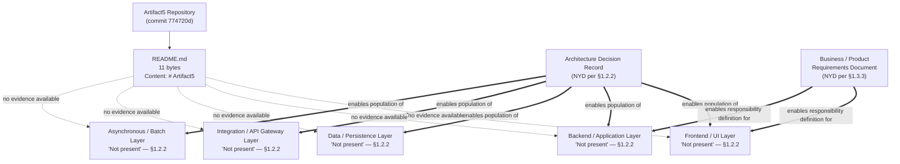

### 5.2.3 State Transition Diagram (Empty State)

Because §1.2.2 records all five component layers as "Not present" and §4.4.1 records every State Management dimension (State Transitions, Data Persistence Points, Caching Requirements, Transaction Boundaries) as NYD, the state machine for Artifact5 collapses to a single placeholder state. The diagram below follows the canonical template established in §4.5.5.

```mermaid
stateDiagram-v2
    [*] --> Undefined
    Undefined: No stateful components defined per §1.2.2; state transitions NYD per §4.4.1
    Undefined --> Undefined: No transitions recorded per §2.6.2
    Undefined --> [*]
```

### 5.2.4 Sequence Diagram for Key Flows (Empty State)

Because §1.2.1 records zero dependencies on internal or external systems, §2.2.3 records no API contracts, and §4.1.1 records zero process flows, no "key flow" can be authored as a sequence interaction. The diagram below follows the canonical three-participant template established in §4.5.4 (User → System → External System) and uses Mermaid `Note` elements to mark each interaction as NYD with its evidentiary anchor.

```mermaid
sequenceDiagram
    autonumber
    participant U as User (NYD — §1.3.1)
    participant S as Artifact5 System (Skeleton — commit 774720d)
    participant E as External System (Zero declared — §1.2.1)

    Note over U,E: No architectural key flow defined. See §2.2.3 (no API contracts), §2.3.3 (no integrations), and §4.1.1 (zero process flows).

    U->>S: (No inbound request defined — NYD per §2.2.3)
    Note right of S: Backend Layer 'Not present' per §1.2.2; no handler exists.
    S->>S: (No internal processing defined — NYD per §4.4.1)
    S->>E: (No outbound integration — see §1.2.1)
    Note right of E: Zero external systems declared per §2.3.3.
    E-->>S: (No inbound response — see §1.2.1)
    S-->>U: (No response contract defined — NYD per §2.2.3)
```

## 5.3 TECHNICAL DECISIONS

### 5.3.1 Architecture Style Decisions and Tradeoffs

No architecture-style decision has been recorded. Per §1.2.2, "No technical approach has been selected"; the canonical tradeoffs that an architecture-style decision documents — operational complexity versus deployment flexibility, blast-radius isolation versus inter-service latency, team autonomy versus consistency enforcement — cannot be substantiated by repository evidence. The forthcoming ADR (per §1.2.2 and §2.5.2) is the canonical enabling artifact for this decision.

| Decision Dimension | Documented Decision | Tradeoffs Evaluated | Status |
|---|---|---|---|
| Architecture Style (monolith / modular monolith / microservices / serverless / event-driven / hybrid) | NYD | NYD | Pending ADR per §1.2.2 |
| Deployment Topology (single-process / multi-process / containerized / functions / hybrid) | NYD | NYD | Pending ADR per §1.2.2; no IaC present per §3.1.2 |
| Module / Service Decomposition Strategy | NYD | NYD | Pending PRD per §1.3.3 and ADR per §1.2.2 |
| Build and Release Topology | NYD | NYD | No CI/CD configuration present per §3.1.2 |

### 5.3.2 Communication Pattern Choices

No communication-pattern choice has been recorded. Per §1.2.2, the Integration / API Gateway Layer is recorded as "Not present"; per §2.3.3, all Integration Point categories are recorded as "None"; and per §4.4.3, the Distributed Transaction Pattern dimension is recorded as "NYD — no inter-service boundaries (§1.2.2, §2.3.3)." Synchronous-versus-asynchronous, request-response-versus-publish-subscribe, and orchestration-versus-choreography choices are therefore NYD and are enabled by the forthcoming Integration Architecture Document referenced in §1.3.3.

### 5.3.3 Data Storage Solution Rationale

No data-storage solution has been chosen. Per §3.6.1, every storage tier (Primary Database, Secondary Database, Cache, Object Storage, File-System Storage, Search Index / Vector Store) is recorded as NYD with the documented basis "Data layer not present (§1.2.2)" or "No application layer to cache for (§1.2.2)" or "No data domains modeled (§1.3.1)." The rationale that would normally accompany a storage-solution decision — domain fit, consistency model, durability profile, throughput envelope, operational maturity — is therefore NYD. Per §3.6.3, future population of this rationale must additionally observe data-domain mapping (currently "Not yet modeled" per §1.3.1), backup-and-recovery (currently "NYD — no data store present" per §2.4.6), encryption-at-rest (currently NYD per §2.4.5), and scalability profile (currently NYD per §2.4.4).

### 5.3.4 Caching Strategy Justification

No caching strategy has been selected. Per §3.6.1, the "In-Memory / Distributed Cache" tier is recorded with the status "No application layer to cache for (§1.2.2)," and per §4.4.1, the Caching Requirements dimension is recorded as "NYD — no Backend layer (§1.2.2); no Performance / Latency targets declared (§2.4.3)." Because there is no application layer to cache for and no latency targets to optimize against, no caching strategy can be justified at this time.

### 5.3.5 Security Mechanism Selection

No security mechanism has been selected. Per §2.4.5 Security Implications, all four security dimensions are recorded as NYD: the Authentication Model ("NYD — no identity provider integration declared (§1.2.1)"), the Authorization Model ("NYD — no user groups identified (§1.3.1)"), Data Protection / Encryption ("NYD — no data domains modeled (§1.3.1)"), and the Threat Model / Attack Surface ("Minimal — repository contains only an 11-byte README (§1.1.1)"). Security-mechanism selection is therefore NYD and is enabled jointly by the ADR (per §1.2.2) and the Integration Architecture Document (per §1.3.3) for identity-provider integration.

### 5.3.6 Architecture Decision Record Catalogue

Per §1.2.2 and §2.5.2, the Architecture Decision Record is itself NYD. No ratified ADRs exist in the repository. The four-column catalogue schema below is reserved for future ADRs and preserves the conventional ADR fields (Identifier, Decision Title, Status, Documented Rationale and Consequences).

| ADR Identifier | Decision Title | Status | Documented Rationale and Consequences |
|---|---|---|---|
| ADR-NYD-001 (reserved) | NYD — architecture style decision (§5.3.1) | Pending authoring per §1.2.2 | NYD |
| ADR-NYD-002 (reserved) | NYD — communication pattern decision (§5.3.2) | Pending authoring per §1.2.2 | NYD |
| ADR-NYD-003 (reserved) | NYD — data storage decision (§5.3.3) | Pending authoring per §1.2.2 | NYD |
| ADR-NYD-004 (reserved) | NYD — security mechanism decision (§5.3.5) | Pending authoring per §1.2.2 | NYD |

### 5.3.7 Decision Tree Diagram (Empty State)

The diagram below depicts the dependency chain that links the forthcoming ADR (per §1.2.2) to each technical-decision dimension required by the section prompt. Solid arrows denote the documented dependency of every decision dimension on the ADR; dotted arrows denote the absence of any current evidence; and double arrows denote "enables population of" relationships.

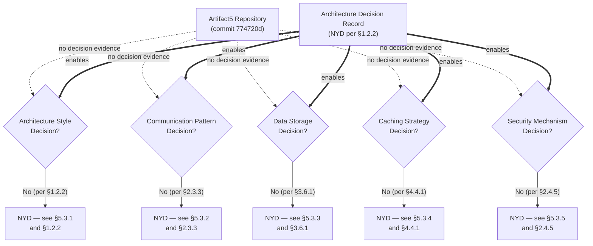

## 5.4 CROSS-CUTTING CONCERNS

Every cross-cutting concern requested by the section prompt is blocked by the same upstream condition: per §1.2.2, all five component layers are "Not present"; per §1.2.3, no KPIs / SLOs / SLAs have been declared; and per §2.4.5 and §2.4.6, every Security and Maintenance dimension is NYD. The subsections below restate each concern in compliance with the prompt and explicitly mark each as NYD with its evidentiary anchor.

### 5.4.1 Monitoring and Observability Approach

Per §2.4.6 Maintenance Requirements, "Logging and Observability" is recorded as "NYD — no application layer present (§1.2.2)," and per §4.4.3 Transaction and Consistency Posture, "Observability Hooks (Logs / Metrics / Traces)" is recorded as "NYD — Logging and Observability NYD (§2.4.6)." No monitoring or observability approach has been declared. Selection of the three observability pillars (logs, metrics, distributed traces) and the corresponding instrumentation, collection, storage, and visualization stack is NYD and is enabled by the forthcoming ADR per §1.2.2.

### 5.4.2 Logging and Tracing Strategy

No logging or tracing strategy has been declared. The structured-logging schema, log-level taxonomy, trace-context propagation mechanism (e.g., W3C Trace Context, B3, Jaeger), and sampling strategy that would normally be documented at this point are NYD per §2.4.6 and §4.4.3. Because no Backend layer is present (per §1.2.2), there is no producer of log or trace data to instrument.

### 5.4.3 Error Handling Patterns

Per §4.4.2 Error Handling Schema, all four error-handling dimensions are NYD: Retry Mechanisms ("NYD — no Backend layer (§1.2.2); no concurrency / load targets (§2.4.3)"), Fallback Processes ("NYD — no Backend layer (§1.2.2); zero integrations to fall back to (§1.2.1)"), Error Notification Flows ("NYD — zero integrations (§1.2.1); Logging and Observability NYD (§2.4.6)"), and Recovery Procedures ("NYD — Backup and Recovery NYD (§2.4.6); no Data store present (§1.2.2)"). The error-handling flow diagram for this state is provided in §5.4.7.

### 5.4.4 Authentication and Authorization Framework

Per §2.4.5 Security Implications, the Authentication Model is recorded as "NYD — no identity provider integration declared (§1.2.1)" and the Authorization Model is recorded as "NYD — no user groups identified (§1.3.1)." No authentication framework (e.g., OAuth 2.0 / OIDC, SAML, mutual TLS, API keys, session cookies) and no authorization framework (e.g., RBAC, ABAC, ReBAC, policy-as-code) has been chosen. Framework selection is NYD and is enabled jointly by the ADR (per §1.2.2) and the Integration Architecture Document (per §1.3.3) for the identity-provider integration component.

### 5.4.5 Performance Requirements and SLAs

Per §1.2.3 Success Criteria, "No KPIs, service-level objectives (SLOs), service-level agreements (SLAs), or performance budgets have been declared." Per §2.4.3 Performance Requirements, all four performance dimensions are NYD: Throughput Targets, Latency Targets, Resource Utilization Targets, and Concurrency / Load Targets. Performance requirements and SLAs are therefore NYD and are enabled by the forthcoming Business / Product Requirements Document referenced in §1.3.3.

| Performance / SLA Dimension | Documented Target | Evidentiary Anchor |
|---|---|---|
| Throughput (requests per second / events per second) | NYD | §2.4.3, §1.2.3 |
| Latency (p50 / p95 / p99) | NYD | §2.4.3, §1.2.3 |
| Availability (uptime SLO) | NYD | §1.2.3 |
| Resource Utilization (CPU / memory / I/O budgets) | NYD | §2.4.3, §1.2.3 |

### 5.4.6 Disaster Recovery Procedures

Per §2.4.6 Maintenance Requirements, "Backup and Recovery" is recorded as "NYD — no data store present (§1.2.2)," and per §4.4.2, "Recovery Procedures" is recorded as "NYD — Backup and Recovery NYD (§2.4.6); no Data store present (§1.2.2)." No disaster-recovery procedures, recovery time objectives (RTOs), recovery point objectives (RPOs), backup cadences, replication topologies, or failover runbooks have been declared. Disaster-recovery posture is NYD and is enabled jointly by the ADR (per §1.2.2) and the Business / Product Requirements Document (per §1.3.3, for RTO/RPO targets).

### 5.4.7 Error Handling Flow Diagram (Empty State)

The diagram below preserves the canonical four-branch error-handling topology (retry / fallback / notification / recovery) established in §4.5.3 and explicitly marks each branch as blocked by an evidentiary anchor. Solid arrows depict the current verified state; dotted arrows denote "blocks definition of" relationships.

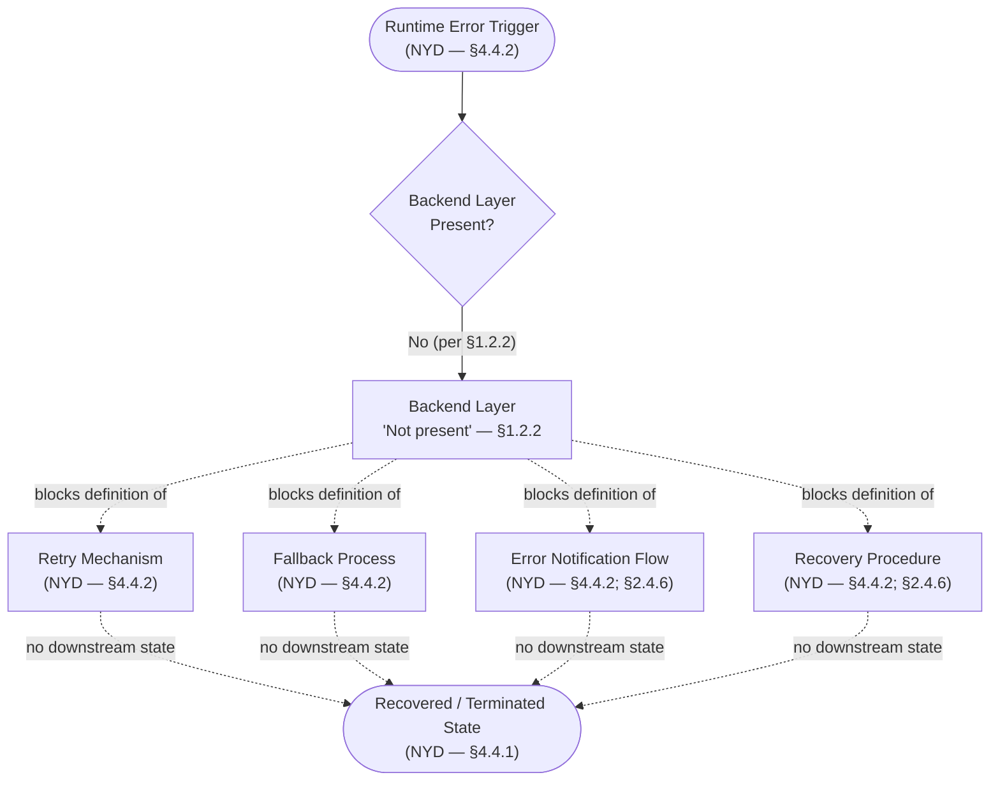

## 5.5 FORWARD-PATH ARTIFACT ENABLEMENT

Following the convention established in §2.5.2, §3.8.2, and §4.6, the mapping below identifies which forward-path artifacts — when introduced to the repository — will enable substantive content in each §5 sub-dimension. This explicit dependency graph ensures that every NYD field above has a documented unblocker.

| Forward-Path Artifact | §5 Sub-Dimension Enabled |
|---|---|
| Architecture Decision Record (per §1.2.2) | §5.1.1 Architecture Style; §5.2 Component Details; §5.3.1 / §5.3.2 / §5.3.3 / §5.3.5 Technical Decisions; §5.3.6 ADR Catalogue; §5.4.1 / §5.4.2 Observability |
| Business / Product Requirements Document (per §1.3.3) | §5.1.2 Core Components (responsibilities); §5.1.3 Data Flows; §5.3.3 Storage Rationale (data domains); §5.4.5 Performance / SLAs; §5.4.6 RTO / RPO |
| Integration Architecture Document (per §1.3.3) | §5.1.3 Integration Patterns and Protocols; §5.1.4 External Integration Points; §5.3.2 Communication Patterns; §5.4.4 AuthN / AuthZ (identity-provider integration) |
| User Journey or Workflow Documentation (per §1.3.3) | §5.1.1 System Boundaries (user-facing interfaces); §5.1.2 Frontend Component Responsibilities; §5.2.4 Sequence Diagrams for Key Flows |
| Out-of-Scope Statement / Non-Goals Document (per §1.3.3) | Bounding context for all §5 subsections (excludes non-applicable components, integrations, and decisions) |

### 5.5.1 Subsection-to-Evidence Mapping

Following the convention established in §2.5.1 and §3.8.1, the matrix below traces each placeholder subsection of §5 to the evidentiary anchor in §1, §2, §3, or §4 that justifies its empty state.

| §5 Subsection | Evidentiary Anchor | Documented Finding |
|---|---|---|
| §5.1.1 System Overview | §1.2.2 Core Technical Approach | No technical approach selected |
| §5.1.2 Core Components | §1.2.2 Major System Components | All five layers "Not present" |
| §5.1.3 Data Flow Description | §1.2.1 Integration Landscape; §3.6.1 Persistence Layer | Zero integrations; no data layer |
| §5.1.4 External Integration Points | §1.2.1; §2.3.3 Integration Points | Zero declared integrations |
| §5.2 Component Details | §1.2.2; §3.2–§3.7 | No components; no technology selected |
| §5.3 Technical Decisions | §1.2.2; §2.5.2 (ADR pending) | No ADRs ratified |
| §5.4.1–§5.4.2 Observability | §2.4.6 Maintenance Requirements | Logging and Observability NYD |
| §5.4.3 Error Handling | §4.4.2 Error Handling Schema | All four dimensions NYD |
| §5.4.4 AuthN / AuthZ | §2.4.5 Security Implications | All security dimensions NYD |
| §5.4.5 Performance / SLAs | §1.2.3; §2.4.3 | No KPIs / SLOs / SLAs declared |
| §5.4.6 Disaster Recovery | §2.4.6; §4.4.2 | Backup / Recovery NYD |

## 5.6 ASSUMPTIONS AND CONSTRAINTS

Following the conventions established in §2.5.3, §3.8.3, and §4.7, the assumptions and constraints applied in authoring §5 are surfaced below so that future revisions can validate or revise them as the project moves out of skeleton state.

### 5.6.1 Section-Level Assumptions

| Assumption | Basis |
|---|---|
| Repository content remains limited to `README.md` (11 bytes) at the time of authoring | §1.1.1 and §1.4 Files Examined |
| Project is a greenfield initiative; no legacy architecture exists for migration | §1.2.1 Current System Limitations |
| No `.blitzyignore` or hidden configuration alters visible architectural scope | §1.4 Repository-Level Inspections Performed |
| The Architecture Decision Record (ADR) referenced in §1.2.2 is the canonical enabling artifact for §5.1, §5.2, and §5.3 | §2.5.2 Forward-Path Artifacts and Enablement |
| Architecture identifiers (`ARCH-NYD-XXX`) and ADR identifiers (`ADR-NYD-XXX`) remain reserved for future use | Section prompt directive |

### 5.6.2 Section-Level Constraints

| Constraint | Basis |
|---|---|
| Tables in this section are capped at four columns | §2.5.3, §3.8.3, §4.7.2 |
| Empty-state diagrams must follow the styling of §1.2.2, §2.3.2, §3.1.3, and §4.5 | Prior-section conventions |
| Diagrams must not fabricate components, interactions, data flows, or technical decisions absent from the repository | Section prompt directive ("Only include sections and items that are actually relevant") |
| Each empty placeholder must cite at least one evidentiary anchor in §1, §2, §3, or §4 | §2.5.1, §3.8.1, §4.7.2 authoring convention |
| All Mermaid diagram categories required by the prompt (component interaction, state transition, sequence, error handling, decision tree) must be represented even when empty | Section prompt directive |

### 5.6.3 Version Tracking

| Version Field | Current Value |
|---|---|
| Section Revision | 1 (initial authoring against skeleton repository) |
| Number of Documented Architecture Components | 0 |
| Number of Documented External Integration Points | 0 |
| Number of Ratified Architecture Decision Records | 0 |
| Number of Authored Mermaid Diagrams | 5 (all empty-state: §5.2.2, §5.2.3, §5.2.4, §5.3.7, §5.4.7) |
| Last Repository Commit Referenced | `774720d` ("Initial commit", per §1.1.1) |

## 5.7 References

### 5.7.1 Files Examined

- `README.md` — Sole content-bearing file in the repository; 11 bytes; entire content is the single line `# Artifact5`; basis for every NYD declaration in §5

### 5.7.2 Folders Examined

- `/` (repository root, depth 0) — Verified to contain only `README.md` and `.git/` version-control metadata; no source, configuration, documentation, test, or infrastructure subdirectories

### 5.7.3 Technical Specification Cross-References

- §1.1 Executive Summary — Repository lifecycle stage (Skeleton / Pre-implementation), commit `774720d`, single content-bearing file
- §1.2.1 Project Context — Greenfield-initiative characterization; zero dependencies on internal or external systems
- §1.2.2 High-Level Description — All five component layers recorded as "Not present"; ADR identified as forthcoming enabling artifact; canonical empty-state Mermaid styling
- §1.2.3 Success Criteria — Absence of KPIs, SLOs, SLAs, and performance budgets
- §1.3.1 In-Scope Elements — System boundaries "Not yet drawn"; user groups "Not yet identified"; data domains "Not yet modeled"
- §1.3.3 Forward Path for Scope Definition — Enumeration of the four forward-path artifacts (PRD, User Journey Documentation, Integration Architecture Document, Out-of-Scope Statement)
- §2.1.1 Feature Catalog Inventory State — Zero features catalogued
- §2.2.3 Functional Requirements — No API contracts defined
- §2.3.2 Feature Dependency Map (Empty State) — Canonical empty-state diagram convention
- §2.3.3 Integration Points — All integration categories recorded as "None"
- §2.3.4 Shared Components — All shared-asset categories recorded as "None"
- §2.4.3 Performance Requirements — All performance dimensions NYD
- §2.4.4 Scalability Considerations — All scalability dimensions NYD
- §2.4.5 Security Implications — AuthN / AuthZ / Encryption / Threat Model all NYD or minimal
- §2.4.6 Maintenance Requirements — Logging and Observability NYD; Backup and Recovery NYD
- §2.5.1 Requirement-to-Evidence Traceability — Subsection-to-evidence mapping convention
- §2.5.2 Forward-Path Artifacts and Enablement — Artifact-to-subsection mapping convention
- §2.5.3 Assumptions and Constraints — Four-column table cap; assumption/constraint authoring template
- §3.1.2 Diagnostic Indicator Inventory — Complete enumeration of absent technology indicators
- §3.1.3 Stack Definition Status Diagram — Canonical empty-state Mermaid styling for technology-stack categories
- §3.6.1 Persistence Layer Status — All six storage tiers recorded as NYD
- §3.6.3 Persistence Strategy Considerations — Forward-population dependencies on data-domain mapping, backup-and-recovery, encryption-at-rest, and scalability profile
- §3.8.1 Subsection-to-Evidence Mapping — Cross-reference convention for §3
- §3.8.2 Forward-Path Artifact Enablement — Artifact-to-subsection mapping for §3
- §3.8.3 Assumptions and Constraints — Section-level assumption/constraint convention
- §4.1.1 Current Workflow Inventory State — Zero process flows declared
- §4.4.1 State Management Schema — All four state dimensions NYD
- §4.4.2 Error Handling Schema — All four error-handling dimensions NYD
- §4.4.3 Transaction and Consistency Posture — Consistency / idempotency / distributed-transaction patterns NYD
- §4.5.3 Error Handling Flowchart (Empty State) — Canonical empty-state error-handling diagram (basis for §5.4.7)
- §4.5.4 Integration Sequence Diagram (Empty State) — Canonical empty-state sequence-diagram template (basis for §5.2.4)
- §4.5.5 State Transition Diagram (Empty State) — Canonical empty-state state-transition template (basis for §5.2.3)
- §4.7 Assumptions and Constraints — Section-level assumption/constraint template (basis for §5.6)

# 6. SYSTEM COMPONENTS DESIGN

## 6.1 Core Services Architecture

### 6.1.1 Applicability Assessment

**Core Services Architecture is not applicable for this system in its current state.**

The Artifact5 repository is in a confirmed pre-implementation, skeleton condition that precludes the documentation of any service-oriented architectural construct. The system documented herein is identified in its repository solely by the project name "Artifact5", as declared in the sole content-bearing artifact present in the codebase (`README.md`). At the time of this specification, the repository exists in a pre-implementation, skeleton state: it contains no source code, no configuration files, no dependency manifests, no infrastructure-as-code definitions, no test suites, no continuous integration pipelines, and no supplementary documentation beyond the project's H1 heading.

Per the Section 6.1 prompt directive — *"If the system does not require microservices, distributed architecture, or distinct service components, clearly state 'Core Services Architecture is not applicable for this system' and explain why"* — this section declares the topic Not Applicable and documents the evidentiary justification. The reserved schemas, four-column tables, and empty-state diagrams below preserve the prompt's structural requirements for forward compatibility once the enabling artifacts identified in §6.1.6 are introduced to the repository.

#### 6.1.1.1 Evidentiary Basis for the Not-Applicable Verdict

The verdict rests on five mutually reinforcing findings drawn from upstream sections of this specification. Each finding is anchored to a verified empty-state declaration; none of the findings is inferred or extrapolated.

| Finding | Documented Status | Primary Evidentiary Anchor |
|---|---|---|
| All five canonical component layers are absent | Frontend, Backend, Data, Integration, and Asynchronous layers all "Not present" | §1.2.2 Major System Components |
| Zero integration points have been declared | Inbound, Outbound, Inter-Feature, and External Touchpoints all "None" | §2.3.3 Integration Points |
| No architecture-style decision has been recorded | Monolith / microservices / serverless / event-driven choice NYD | §5.3.1 Architecture Style Decisions |
| No communication-pattern choice has been recorded | Sync/async, request-response/pub-sub, orchestration/choreography NYD | §5.3.2 Communication Pattern Choices |
| No build, container, orchestration, or CI/CD infrastructure exists | Dockerfile, Kubernetes manifests, Terraform, CI/CD all absent | §3.7.2 Build, Containerization, and CI/CD Status |

The repository contains no references to a predecessor system, legacy platform, or system being replaced. There are no migration plans, no deprecated-module annotations, and no backward-compatibility considerations recorded. On the evidence available, Artifact5 is best characterized as a greenfield initiative rather than a replacement or modernization effort. Because no predecessor service mesh, monolith decomposition, or distributed system is being modernized, no inherited service topology can be documented either.

#### 6.1.1.2 Restatement of Layer Absence

The section prompt's six SERVICE COMPONENTS sub-dimensions (service boundaries, inter-service communication, service discovery, load balancing, circuit breakers, retry/fallback) presuppose the existence of at least a Backend Services / Application Layer and typically an Integration / API Gateway Layer. Both are explicitly absent.

| Component Category | Status in Repository |
|---|---|
| Frontend / User Interface Layer | Not present |
| Backend Services / Application Layer | Not present |
| Data Layer / Persistence | Not present |
| Integration / API Gateway Layer | Not present |
| Asynchronous / Batch Processing | Not present |

#### 6.1.1.3 Restatement of Integration Absence

The inter-service communication, service discovery, and load balancing sub-dimensions additionally presuppose the existence of integration points between services. The Feature Relationships analysis in §2.3.3 explicitly records every integration-point category as "None."

| Integration Point Category | Documented Items |
|---|---|
| Inbound Integrations | None — see §1.2.1 |
| Outbound Integrations | None — see §1.2.1 |
| Inter-Feature Boundaries | None — no features defined (§2.1.1) |
| External System Touchpoints | None — Integration Architecture Document pending (§1.3.3) |

#### 6.1.1.4 Restatement of Decision Absence

Architecture-style and communication-pattern selection is the canonical prerequisite for any Core Services Architecture documentation. Both decisions are formally pending.

No architecture-style decision has been recorded. Per §1.2.2, "No technical approach has been selected"; the canonical tradeoffs that an architecture-style decision documents — operational complexity versus deployment flexibility, blast-radius isolation versus inter-service latency, team autonomy versus consistency enforcement — cannot be substantiated by repository evidence.

No communication-pattern choice has been recorded. Per §1.2.2, the Integration / API Gateway Layer is recorded as "Not present"; per §2.3.3, all Integration Point categories are recorded as "None"; and per §4.4.3, the Distributed Transaction Pattern dimension is recorded as "NYD — no inter-service boundaries (§1.2.2, §2.3.3)." Synchronous-versus-asynchronous, request-response-versus-publish-subscribe, and orchestration-versus-choreography choices are therefore NYD and are enabled by the forthcoming Integration Architecture Document referenced in §1.3.3.

---

### 6.1.2 Service Components (Reserved Schema)

Although Core Services Architecture is Not Applicable in the current repository state, the six SERVICE COMPONENTS sub-dimensions required by the section prompt are preserved below as reserved schemas. Each row is marked NYD with at least one evidentiary anchor in §1, §2, §3, or §4, in compliance with the authoring convention restated in §5.6.2: "Each empty placeholder must cite at least one evidentiary anchor in §1, §2, §3, or §4" and "Tables in this section are capped at four columns".

#### 6.1.2.1 Service Boundaries and Responsibilities

The conventional service-boundary catalogue captures, for each service, its name, primary responsibility, owning team, and downstream dependencies. None of these can be populated because no services have been declared.

| Service Identifier | Primary Responsibility | Owning Team / Domain | Evidentiary Anchor |
|---|---|---|---|
| NYD — no services declared | NYD — Backend Layer "Not present" | NYD — no stakeholders identified (§1.1.3) | §1.2.2, §5.1.2 |
| NYD — no services declared | NYD — no application logic declared | NYD — no team topology recorded | §1.2.2, §5.1.2 |

#### 6.1.2.2 Inter-Service Communication Patterns

The conventional inter-service communication matrix captures, for each producer-consumer pair, the protocol family, payload format, and delivery guarantee. None of these can be populated because no services exist between which communication could occur. Per §4.4.3, the Distributed Transaction Pattern (2PC / Saga / Outbox) dimension is recorded as NYD — no inter-service boundaries (§1.2.2, §2.3.3).

| Communication Concern | Selected Approach | Documented Basis | Evidentiary Anchor |
|---|---|---|---|
| Synchronous vs. Asynchronous | NYD | No Integration / API Gateway Layer | §1.2.2, §5.3.2 |
| Request-Response vs. Publish-Subscribe | NYD | Zero integration points | §2.3.3, §5.3.2 |
| Orchestration vs. Choreography | NYD | No services to coordinate | §1.2.2, §5.3.2 |
| Distributed Transaction Pattern (2PC / Saga / Outbox) | NYD | No inter-service boundaries | §4.4.3, §5.3.2 |

#### 6.1.2.3 Service Discovery Mechanisms

Service discovery — whether client-side (e.g., Ribbon, Eureka clients) or server-side (e.g., Kubernetes Services, Consul, AWS Cloud Map) — presupposes a runtime environment in which services are deployed and addressable. No build system, container definition, orchestration manifest, infrastructure-as-code module, or continuous-integration pipeline has been authored for Artifact5.

| Discovery Concern | Selected Mechanism | Repository Artifact | Evidentiary Anchor |
|---|---|---|---|
| Discovery Pattern (client-side / server-side / mesh) | NYD | None — no orchestration manifest | §1.2.2, §3.7.2 |
| Service Registry (Consul / Eureka / etcd / DNS) | NYD | None — no infrastructure-as-code | §3.7.2 |
| Health-Check Protocol | NYD | None — no Backend layer to expose health endpoints | §1.2.2, §3.7.2 |
| Endpoint Naming and Routing Topology | NYD | None — no API contracts (§2.2.3) | §2.3.3, §3.7.2 |

#### 6.1.2.4 Load Balancing Strategy

Load balancing presupposes the existence of replicated service instances and a traffic distribution layer (L4 or L7). Neither replicas nor a routing tier exists.

| Load Balancing Concern | Selected Strategy | Documented Basis | Evidentiary Anchor |
|---|---|---|---|
| Layer (L4 / L7 / Mesh sidecar) | NYD | No Backend layer to load-balance across | §1.2.2, §3.7.2 |
| Algorithm (Round-Robin / Least-Connections / Weighted) | NYD | No throughput or concurrency targets | §2.4.3 |
| Session Affinity / Sticky Sessions | NYD | No stateful components defined | §4.4.1 |
| Geographic / Regional Routing | NYD | Geographic / Regional Distribution NYD | §2.4.4 |

#### 6.1.2.5 Circuit Breaker Patterns

Circuit breakers (e.g., Hystrix, Resilience4j, Polly, Sentinel) presuppose the existence of inter-service or external-dependency invocations whose failure would benefit from short-circuiting. Per §4.4.2 Error Handling Schema, the four Error Handling dimensions required by the prompt are blocked by the absence of an application runtime, an observability stack, and any declared integration through which error notifications could be emitted.

| Circuit Breaker Concern | Selected Approach | Documented Basis | Evidentiary Anchor |
|---|---|---|---|
| Breaker Library / Framework | NYD | No runtime selected; no Backend layer | §1.2.2, §3.3 |
| Failure Threshold and Sliding Window | NYD | No KPIs / SLOs / SLAs declared | §1.2.3, §2.4.3 |
| Half-Open Probe Strategy | NYD | No external dependencies to probe | §1.2.1, §2.3.3 |
| Open-State Telemetry Hook | NYD | Observability Hooks NYD | §4.4.3, §5.4.1 |

#### 6.1.2.6 Retry and Fallback Mechanisms

Retry and fallback mechanisms are recorded in §4.4.2 as NYD with explicit evidentiary anchors.

| Error Handling Dimension | Current Documented Value |
|---|---|
| Retry Mechanisms | NYD — no Backend layer (§1.2.2); no concurrency / load targets (§2.4.3) |
| Fallback Processes | NYD — no Backend layer (§1.2.2); zero integrations to fall back to (§1.2.1) |
| Error Notification Flows | NYD — zero integrations (§1.2.1); Logging and Observability NYD (§2.4.6) |
| Recovery Procedures | NYD — Backup and Recovery NYD (§2.4.6); no Data store present (§1.2.2) |

---

### 6.1.3 Scalability Design (Reserved Schema)

The five SCALABILITY DESIGN sub-dimensions required by the section prompt are preserved below as reserved schemas. The corresponding Implementation Considerations table in §2.4.4 already records every scalability dimension as NYD.

#### 6.1.3.1 Horizontal and Vertical Scaling Approach

| Scalability Dimension | Current Documented Value |
|---|---|
| Horizontal Scaling Strategy | NYD — no Backend layer present (§1.2.2) |
| Vertical Scaling Constraints | NYD — no runtime selected (§1.2.2) |
| Data Partitioning / Sharding | NYD — no Data layer present (§1.2.2) |
| Geographic / Regional Distribution | NYD — geographic coverage not declared (§1.3.1) |

#### 6.1.3.2 Auto-Scaling Triggers and Rules

Auto-scaling triggers (CPU-, memory-, queue-depth-, request-rate-, or custom-metric-based) presuppose the existence of an orchestration platform that can act upon them and a metric pipeline that can supply them. Neither exists.

| Auto-Scaling Concern | Selected Trigger / Rule | Repository Artifact | Evidentiary Anchor |
|---|---|---|---|
| Trigger Metric (CPU / Memory / RPS / Queue Depth) | NYD | None — no observability pipeline | §2.4.6, §5.4.1 |
| Scaling Boundaries (min / max replicas) | NYD | None — no orchestration manifest | §3.7.2 |
| Cooldown and Stabilization Windows | NYD | None — no auto-scaler configuration | §3.7.2 |
| Predictive vs. Reactive Scaling | NYD | No KPIs / SLOs declared | §1.2.3 |

#### 6.1.3.3 Resource Allocation Strategy

Resource allocation (CPU requests/limits, memory requests/limits, ephemeral storage, GPU/accelerator allocation, quality-of-service classes) presupposes both a containerized runtime and explicit performance budgets.

| Performance Dimension | Current Documented Value |
|---|---|
| Throughput Targets | NYD — no KPIs declared (§1.2.3) |
| Latency Targets | NYD — no SLOs declared (§1.2.3) |
| Resource Utilization Targets | NYD — no performance budgets declared (§1.2.3) |
| Concurrency / Load Targets | NYD — no operational targets declared (§1.2.3) |

#### 6.1.3.4 Performance Optimization Techniques

Performance optimization techniques (caching, connection pooling, batching, asynchronous I/O, query optimization, CDN offload, edge compute, code-path hot-spotting) all presuppose an application layer to optimize. Per §5.3.4, no caching strategy has been selected: "the In-Memory / Distributed Cache tier is recorded with the status 'No application layer to cache for (§1.2.2),' and per §4.4.1, the Caching Requirements dimension is recorded as 'NYD — no Backend layer (§1.2.2); no Performance / Latency targets declared (§2.4.3).' Because there is no application layer to cache for and no latency targets to optimize against, no caching strategy can be justified at this time."

| Optimization Technique | Selected Approach | Documented Basis | Evidentiary Anchor |
|---|---|---|---|
| Application-Layer Caching | NYD | No application layer to cache for | §5.3.4, §4.4.1 |
| Connection Pooling / Reuse | NYD | No Data layer; no Backend layer | §1.2.2, §3.6 |
| Batching / Bulk Operations | NYD | No API contracts to batch | §2.2.3 |
| CDN / Edge Acceleration | NYD | No Frontend layer to accelerate | §1.2.2 |

#### 6.1.3.5 Capacity Planning Guidelines

No KPIs, service-level objectives (SLOs), service-level agreements (SLAs), or performance budgets have been declared. Capacity planning is therefore reserved for future authoring once the Business / Product Requirements Document supplies the operational targets enumerated in §5.4.5.

| Capacity Planning Input | Documented Value | Source Artifact | Evidentiary Anchor |
|---|---|---|---|
| Forecast Demand / Growth Rate | NYD | Pending PRD | §1.2.3, §1.3.3 |
| Headroom and Burst Reserve | NYD | Pending ADR | §1.2.3, §2.4.4 |
| Cost Envelope / Budget | NYD | Pending PRD | §1.2.3 |
| Refresh Cadence (monthly / quarterly) | NYD | Pending ADR | §1.2.3, §1.2.2 |

---

### 6.1.4 Resilience Patterns (Reserved Schema)

The five RESILIENCE PATTERNS sub-dimensions required by the section prompt are preserved below as reserved schemas. The corresponding Maintenance Requirements and Error Handling tables in §2.4.6, §4.4.2, and §5.4.6 already record every resilience dimension as NYD.

#### 6.1.4.1 Fault Tolerance Mechanisms

Fault tolerance — bulkheads, time-outs, idempotent retries, graceful degradation, supervised processes — presupposes the existence of a runtime to host the failure-domain isolation and recovery logic.

| Fault Tolerance Concern | Selected Mechanism | Documented Basis | Evidentiary Anchor |
|---|---|---|---|
| Bulkhead Isolation (thread / connection pools) | NYD | No runtime selected | §1.2.2 |
| Time-Out Budgets (per call / per request) | NYD | No latency targets declared | §2.4.3 |
| Idempotency Strategy | NYD | No API contracts to designate idempotent | §4.4.3, §2.2.3 |
| Supervisor / Watchdog Pattern | NYD | No Backend layer; no orchestration | §1.2.2, §3.7.2 |

#### 6.1.4.2 Disaster Recovery Procedures

Per §2.4.6 Maintenance Requirements, "Backup and Recovery" is recorded as "NYD — no data store present (§1.2.2)," and per §4.4.2, "Recovery Procedures" is recorded as "NYD — Backup and Recovery NYD (§2.4.6); no Data store present (§1.2.2)." No disaster-recovery procedures, recovery time objectives (RTOs), recovery point objectives (RPOs), backup cadences, replication topologies, or failover runbooks have been declared. Disaster-recovery posture is NYD and is enabled jointly by the ADR (per §1.2.2) and the Business / Product Requirements Document (per §1.3.3, for RTO/RPO targets).

| DR Concern | Documented Target | Enabling Artifact | Evidentiary Anchor |
|---|---|---|---|
| Recovery Time Objective (RTO) | NYD | Pending PRD | §5.4.6, §1.3.3 |
| Recovery Point Objective (RPO) | NYD | Pending PRD | §5.4.6, §1.3.3 |
| Backup Cadence and Retention | NYD | Pending ADR | §2.4.6 |
| Failover Runbook / Procedure | NYD | Pending ADR | §5.4.6, §3.7.2 |

#### 6.1.4.3 Data Redundancy Approach

Data redundancy (synchronous replication, asynchronous replication, multi-master, multi-region, quorum-based writes, snapshot/point-in-time recovery) presupposes the existence of a Data layer. The Data Layer is recorded as "Not present" per §1.2.2.

| Redundancy Concern | Selected Approach | Documented Basis | Evidentiary Anchor |
|---|---|---|---|
| Replication Mode (sync / async / quorum) | NYD | Data Layer "Not present" | §1.2.2, §5.3.3 |
| Replica Count and Topology | NYD | No data domains modeled | §5.3.3, §1.3.1 |
| Snapshot / Point-in-Time Recovery | NYD | Backup and Recovery NYD | §2.4.6 |
| Cross-Region Redundancy | NYD | Geographic / Regional Distribution NYD | §2.4.4 |

#### 6.1.4.4 Failover Configurations

Failover configurations (active-active, active-passive, hot-standby, warm-standby, cold-standby, DNS-based switchover, health-check-driven cutover) presuppose both replicated runtime instances and an orchestration tier capable of detecting failure and redirecting traffic.

| Failover Concern | Selected Configuration | Documented Basis | Evidentiary Anchor |
|---|---|---|---|
| Topology (active-active / active-passive / standby) | NYD | No Backend layer; no orchestration | §1.2.2, §3.7.2 |
| Health-Check Protocol and Cadence | NYD | No application layer to probe | §1.2.2, §5.4.1 |
| Cutover Trigger (manual / automatic) | NYD | No DR runbook authored | §5.4.6 |
| Cross-Region / Cross-Zone Failover | NYD | Geographic Distribution NYD | §2.4.4 |

#### 6.1.4.5 Service Degradation Policies

Graceful degradation policies (feature flags, read-only mode, reduced-fidelity responses, queue shedding, load shedding, prioritized critical paths) presuppose both a service portfolio that can be selectively degraded and runtime instrumentation that can detect and signal degradation events.

| Degradation Concern | Selected Policy | Documented Basis | Evidentiary Anchor |
|---|---|---|---|
| Feature-Flag Framework | NYD | No application runtime | §1.2.2 |
| Read-Only / Maintenance Mode | NYD | No Backend or Data layer | §1.2.2 |
| Load Shedding and Queue Drop Strategy | NYD | No async / batch layer | §1.2.2 |
| Priority Tiering of Critical Paths | NYD | No features cataloged | §2.1.1 |

---

### 6.1.5 Required Diagrams

The three diagrams required by the section prompt — Service Interaction, Scalability Architecture, and Resilience Pattern Implementations — are authored below as empty-state placeholders. Solid arrows denote the verified state of the repository at commit `774720d`; dotted arrows denote "no evidence available" relationships; and double arrows denote "enables population of" relationships from forward-path artifacts, consistent with the empty-state styling established in §1.2.2, §2.3.2, §3.1.3, and §4.5.

#### 6.1.5.1 Service Interaction Diagram (Empty State)

The diagram below depicts the absence of services and the dependency of any future service-interaction topology on the forward-path artifacts identified in §5.5. Every node carries an evidentiary anchor in the form `(NYD per §X.Y.Z)` or `('Not present' — §1.2.2)`, in compliance with the convention restated in §5.6.2.

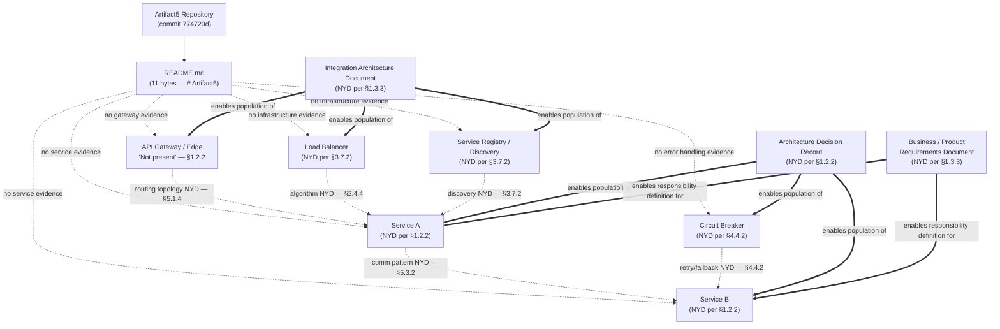

#### 6.1.5.2 Scalability Architecture Diagram (Empty State)

The diagram below depicts the four scalability dimensions documented in §2.4.4 as NYD, plus the auto-scaling, resource-allocation, and capacity-planning sub-dimensions required by the section prompt. The central decision node is anchored to §2.4.4 and the enabling artifacts to §1.2.2 and §1.3.3.

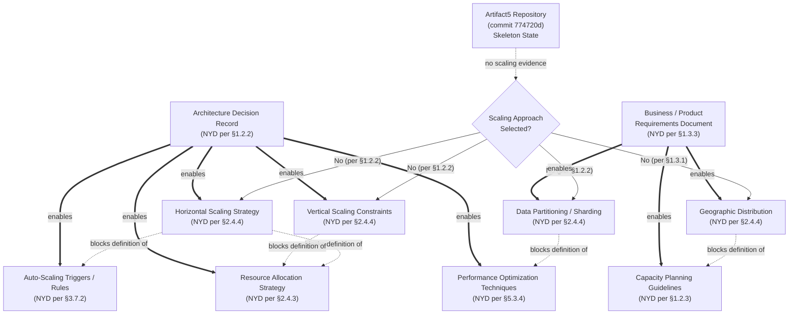

#### 6.1.5.3 Resilience Pattern Implementations Diagram (Empty State)

The diagram below preserves the canonical resilience-pattern topology (fault tolerance → disaster recovery → data redundancy → failover → degradation) required by the section prompt and explicitly marks each pattern as blocked by an evidentiary anchor. The structure parallels the four-branch error-handling topology established in §5.4.7.

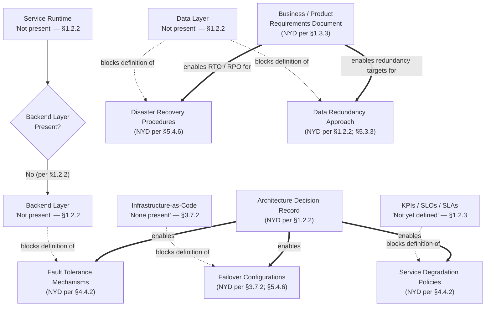

---

### 6.1.6 Forward-Path Artifact Enablement

Consistent with the convention established in §5.5 (which itself follows the convention established in §2.5.2, §3.8.2, and §4.6), the mapping below identifies which forward-path artifacts will unblock each §6.1 sub-dimension once introduced to the repository.

#### 6.1.6.1 Enabling-Artifact Mapping

| Forward-Path Artifact | §6.1 Sub-Dimensions Enabled |
|---|---|
| Architecture Decision Record (per §1.2.2) | §6.1.2.1 Service Boundaries; §6.1.2.4 Load Balancing; §6.1.2.5 Circuit Breakers; §6.1.3.1 Scaling Approach; §6.1.4.1 Fault Tolerance |
| Business / Product Requirements Document (per §1.3.3) | §6.1.2.1 Service Responsibilities; §6.1.3.5 Capacity Planning; §6.1.4.2 DR (RTO / RPO); §6.1.4.3 Data Redundancy Targets |
| Integration Architecture Document (per §1.3.3) | §6.1.2.2 Inter-Service Communication; §6.1.2.3 Service Discovery; §6.1.2.6 Retry / Fallback Across Integration Boundaries |
| User Journey or Workflow Documentation (per §1.3.3) | §6.1.4.5 Service Degradation (prioritization of critical user paths) |

#### 6.1.6.2 Subsection-to-Evidence Mapping

The matrix below traces each §6.1 sub-dimension to the upstream evidentiary anchor that justifies its empty state, mirroring the convention in §5.5.1: "Following the convention established in §2.5.1 and §3.8.1, the matrix below traces each placeholder subsection of §5 to the evidentiary anchor in §1, §2, §3, or §4 that justifies its empty state."

| §6.1 Subsection | Evidentiary Anchor | Documented Finding |
|---|---|---|
| §6.1.2.1 Service Boundaries | §1.2.2 Major System Components | Backend Layer "Not present" |
| §6.1.2.2 Inter-Service Communication | §2.3.3; §4.4.3; §5.3.2 | Zero integrations; no communication pattern selected |
| §6.1.2.3 Service Discovery | §3.7.2 Build / Containerization / CI/CD | No orchestration manifest present |
| §6.1.2.4 Load Balancing | §2.4.4; §3.7.2 | No services to load-balance; no IaC |
| §6.1.2.5 Circuit Breakers | §4.4.2 Error Handling Schema | All four error-handling dimensions NYD |
| §6.1.2.6 Retry / Fallback | §4.4.2 Error Handling Schema | Retry and Fallback dimensions NYD |
| §6.1.3.1 Scaling Approach | §2.4.4 Scalability Considerations | All four scalability dimensions NYD |
| §6.1.3.2 Auto-Scaling | §3.7.2 Build / Containerization / CI/CD | No orchestration platform |
| §6.1.3.3 Resource Allocation | §2.4.3 Performance Requirements | All four performance dimensions NYD |
| §6.1.3.4 Performance Optimization | §5.3.4 Caching Strategy Justification | No application layer to cache for |
| §6.1.3.5 Capacity Planning | §1.2.3 Success Criteria | No KPIs / SLOs / SLAs declared |
| §6.1.4.1 Fault Tolerance | §4.4.2; §4.4.3 | Retry / Fallback / Idempotency NYD |
| §6.1.4.2 Disaster Recovery | §5.4.6; §2.4.6 | Backup / Recovery NYD; no RTO / RPO |
| §6.1.4.3 Data Redundancy | §1.2.2; §5.3.3 | Data Layer "Not present" |
| §6.1.4.4 Failover Configurations | §3.7.2; §5.4.6 | No infrastructure; no DR runbook |
| §6.1.4.5 Service Degradation | §4.4.2; §2.1.1 | No services; no features |

---

### 6.1.7 Assumptions and Constraints

Following the convention established in §5.6 (which itself follows the conventions established in §2.5.3, §3.8.3, and §4.7), the assumptions and constraints applied in authoring §6.1 are surfaced below so that future revisions can validate or revise them as the project moves out of skeleton state.

#### 6.1.7.1 Section-Level Assumptions

| Assumption | Basis |
|---|---|
| Repository content remains limited to `README.md` (11 bytes) at the time of authoring | §1.1.1; §1.4 Files Examined |
| The "Not Applicable" verdict applies to the current commit (`774720d`) only and must be re-evaluated upon introduction of any service-bearing artifact | Section prompt directive; §5.6.3 Version Tracking |
| The Architecture Decision Record (ADR) is the canonical enabling artifact for §6.1.2.1, §6.1.2.4, §6.1.2.5, §6.1.3, and §6.1.4 | §5.5 Forward-Path Artifact Enablement |
| The Integration Architecture Document is the canonical enabling artifact for §6.1.2.2, §6.1.2.3, and §6.1.2.6 | §5.5 Forward-Path Artifact Enablement |

#### 6.1.7.2 Section-Level Constraints

| Constraint | Basis |
|---|---|
| Tables in this section are capped at four columns | §2.5.3; §3.8.3; §4.7.2; §5.6.2 |
| Empty-state diagrams must follow the styling of §1.2.2, §2.3.2, §3.1.3, §4.5, and §5.2.2 | §5.6.2 Prior-Section Conventions |
| Diagrams must not fabricate services, communication patterns, scaling rules, or resilience mechanisms absent from the repository | Section prompt directive; §5.6.2 |
| Each empty placeholder must cite at least one evidentiary anchor in §1, §2, §3, §4, or §5 | §2.5.1; §3.8.1; §4.7.2; §5.6.2 |
| All three diagram categories required by the prompt (service interaction, scalability architecture, resilience pattern implementations) must be represented even when empty | Section prompt directive |

#### 6.1.7.3 Version Tracking

| Version Field | Current Value |
|---|---|
| Section Revision | 1 (initial authoring against skeleton repository) |
| Number of Documented Services | 0 |
| Number of Documented Inter-Service Communication Patterns | 0 |
| Number of Documented Auto-Scaling Rules | 0 |
| Number of Documented Resilience Patterns | 0 |
| Number of Authored Mermaid Diagrams | 3 (all empty-state: §6.1.5.1, §6.1.5.2, §6.1.5.3) |
| Last Repository Commit Referenced | `774720d` ("Initial commit", per §1.1.1) |

---

### 6.1.8 References

#### 6.1.8.1 Files Examined

- `README.md` — Sole content-bearing artifact in the repository (11 bytes, single H1 heading `# Artifact5`); confirms absence of any service-bearing code, configuration, or infrastructure definition

#### 6.1.8.2 Folders Explored

- `""` (repository root) — Confirmed via prior section research that only `README.md` exists at the root and no subdirectories (`src/`, `services/`, `infra/`, `docs/`, etc.) are present

#### 6.1.8.3 Technical Specification Sections Cross-Referenced

- **§1.1 Executive Summary** — Establishes the pre-implementation, skeleton state of the repository and confirms commit `774720d` as the authoritative reference point
- **§1.2 System Overview** — Provides the canonical "Not present" declarations for all five component layers (Frontend, Backend, Data, Integration, Asynchronous) used to justify the Not-Applicable verdict
- **§1.3 Scope** — Establishes that system boundaries are "Not yet drawn" and identifies the forward-path artifacts (PRD, User Journey Docs, Integration Architecture Doc)
- **§2.3 Feature Relationships** — Provides the canonical "None" declarations for all four Integration Point categories used to justify the absence of inter-service communication
- **§2.4 Implementation Considerations** — Provides Scalability Considerations (§2.4.4) and Performance Requirements (§2.4.3) tables that anchor §6.1.3 sub-dimensions to NYD status
- **§3.5 Third-Party Services** — Confirms zero external service integrations, supporting the absence of integration points for service discovery and load balancing
- **§3.7 Development and Deployment** — Confirms the absence of Dockerfile, Kubernetes manifests, Terraform, CI/CD pipelines that would otherwise support service discovery, load balancing, and auto-scaling
- **§4.4 Technical Implementation (Empty State)** — Provides Error Handling Schema (§4.4.2) and Transaction/Consistency Posture (§4.4.3) anchors directly relevant to circuit breakers, retry/fallback, and distributed transactions
- **§5.1 High-Level Architecture** — Confirms no architecture style decision, all component layers "Not present," no data flows, no external integration points
- **§5.2 Component Details** — Establishes the visual vocabulary (solid / dotted / double arrows) used in the §6.1.5 empty-state diagrams
- **§5.3 Technical Decisions** — Confirms no architecture-style decisions (§5.3.1), no communication patterns (§5.3.2), no caching strategy (§5.3.4)
- **§5.4 Cross-Cutting Concerns** — Confirms no monitoring/observability (§5.4.1), no error handling patterns (§5.4.3), no performance/SLAs (§5.4.5), no disaster recovery (§5.4.6)
- **§5.5 Forward-Path Artifact Enablement** — Identifies ADR, PRD, Integration Architecture Document, and User Journey Documentation as the enabling artifacts mapped in §6.1.6
- **§5.6 Assumptions and Constraints** — Establishes the four-column table cap, the empty-state diagram styling conventions, and the evidentiary-anchor requirement applied throughout §6.1

## 6.2 Database Design

### 6.2.1 Applicability Assessment

**Database Design is not applicable to this system in its current state.**

The Artifact5 repository is in a confirmed pre-implementation, skeleton condition that precludes the documentation of any database design construct. Per §1.1.1, the repository identifies itself solely by the project name "Artifact5", contains a single tracked source file (`README.md`, 11 bytes), and has a commit-history depth of one (commit `774720d`, "Initial commit"). Per §1.2.2, the **Data Layer / Persistence** is recorded as "Not present" alongside the four other canonical component layers. Per §3.6.1, "No database, persistence engine, caching layer, or object/blob storage has been selected or configured for Artifact5," and every storage tier (Primary OLTP, Secondary OLAP, In-Memory / Distributed Cache, Object / Blob Storage, File-System Storage, Search Index / Vector Store) is recorded as NYD.

Per the Section 6.2 prompt directive — *"If the system does not require or direct database or persistent storage interactions are not clearly evident, clearly state 'Database Design is not applicable to this system' and explain why"* — this section declares the topic Not Applicable and documents the evidentiary justification. The reserved schemas, four-column tables, and empty-state diagrams below preserve the prompt's structural requirements (Schema Design, Data Management, Compliance Considerations, Performance Optimization, and the three required diagram categories) for forward compatibility once the enabling artifacts identified in §6.2.7 are introduced to the repository. The section follows the verdict pattern, evidentiary discipline, and four-column table cap established by §6.1 Core Services Architecture and reaffirmed in §5.6.2.

#### 6.2.1.1 Evidentiary Basis for the Not-Applicable Verdict

The verdict rests on six mutually reinforcing findings drawn from upstream sections of this specification. Each finding is anchored to a verified empty-state declaration; none is inferred or extrapolated.

| Finding | Documented Status | Primary Evidentiary Anchor |
|---|---|---|
| The Data Layer / Persistence component is absent | "Not present" | §1.2.2 Major System Components |
| Every storage tier required by the prompt is NYD | Primary DB, Secondary DB, Cache, Object, File, Search all NYD | §3.6.1 Persistence Layer Status |
| No database schemas, migration directories, or ORM model files exist | None present | §1.2.2 Core Technical Approach |
| No data domains have been modeled | "Not yet modeled" | §1.3.1 Implementation Boundaries |
| No data-storage rationale or ADR has been ratified | NYD; ADR-NYD-003 reserved | §5.3.3 Data Storage Solution Rationale; §5.3.6 ADR Catalogue |
| No backup, recovery, or replication posture has been declared | Backup and Recovery NYD | §2.4.6 Maintenance Requirements |

The repository contains no references to a predecessor system, legacy platform, or database being replaced; there are no migration plans, deprecated-schema annotations, or backward-compatibility considerations recorded. On the evidence available, Artifact5 is a greenfield initiative rather than a database modernization effort, and no inherited schema, replication topology, or backup architecture can be documented.

#### 6.2.1.2 Restatement of Data Layer Absence

The section prompt's four SCHEMA DESIGN, DATA MANAGEMENT, COMPLIANCE CONSIDERATIONS, and PERFORMANCE OPTIMIZATION sub-branches all presuppose the existence of a Data Layer / Persistence component. That component is explicitly absent.

| Component Category | Status in Repository |
|---|---|
| Frontend / User Interface Layer | Not present |
| Backend Services / Application Layer | Not present |
| **Data Layer / Persistence** | **Not present** |
| Integration / API Gateway Layer | Not present |
| Asynchronous / Batch Processing | Not present |

#### 6.2.1.3 Restatement of Storage Tier Absence

The Schema Design and Data Management sub-dimensions additionally presuppose the existence of at least one selected storage technology. Per §3.6.1, every storage tier is NYD with the documented basis explicitly anchored to §1.2.2 ("Data layer not present"), §1.3.1 ("No data domains modeled"), or §2.1 ("No feature catalog declared").

| Storage Tier | Selected Technology | Persistence Strategy | Documented Basis |
|---|---|---|---|
| Primary Database (OLTP / System of Record) | NYD | NYD | Data layer not present (§1.2.2) |
| Secondary Database (OLAP / Analytics / Read-Replica) | NYD | NYD | Data layer not present (§1.2.2) |
| In-Memory / Distributed Cache | NYD | NYD | No application layer to cache for (§1.2.2) |
| Object / Blob Storage | NYD | NYD | No data domains modeled (§1.3.1) |

#### 6.2.1.4 Restatement of Data Domain Absence

The Compliance Considerations sub-dimensions (data retention rules, privacy controls, audit mechanisms) additionally presuppose the existence of modeled data domains against which retention, classification, and access policies can be defined. Per §1.3.1, "Data Domains Included" is recorded as "Not yet modeled."

| Implementation Boundary Dimension | Current Definition | Evidentiary Anchor |
|---|---|---|
| System Boundaries (logical) | Not yet drawn | §1.3.1 |
| User Groups Covered | Not yet identified | §1.3.1 |
| Geographic / Market Coverage | Not yet declared | §1.3.1 |
| Data Domains Included | Not yet modeled | §1.3.1 |

---

### 6.2.2 Schema Design (Reserved Schema)

Although Database Design is Not Applicable in the current repository state, the six SCHEMA DESIGN sub-dimensions required by the section prompt — entity relationships, data models and structures, indexing strategy, partitioning approach, replication configuration, and backup architecture — are preserved below as reserved schemas. Each row is marked NYD with at least one evidentiary anchor in §1, §2, §3, or §4, in compliance with the authoring convention restated in §5.6.2 and reaffirmed by §6.1.7.2: "Each empty placeholder must cite at least one evidentiary anchor" and "Tables in this section are capped at four columns."

#### 6.2.2.1 Entity Relationships and Data Models

The conventional entity-relationship catalogue captures, for each modeled entity, its primary attributes, cardinality relationships to other entities, and the data domain to which it belongs. None of these can be populated because no data domains have been modeled (per §1.3.1) and no schema, ORM model, or DDL file exists in the repository.

| Modeling Concern | Documented Definition | Documented Basis | Evidentiary Anchor |
|---|---|---|---|
| Entity Inventory | NYD — no entities declared | No data domains modeled | §1.3.1, §3.6.1 |
| Cardinality Relationships (1:1 / 1:N / M:N) | NYD — no relationships expressible | No entities to relate | §1.3.1, §3.6.1 |
| Attribute / Field Definitions | NYD — no DDL or ORM models | No language manifest present | §1.2.2, §3.6.1 |
| Data Domain Assignment | NYD — domains "Not yet modeled" | Pending PRD | §1.3.1, §1.3.3 |

#### 6.2.2.2 Indexing Strategy

Index design (primary keys, secondary indexes, composite indexes, covering indexes, partial / filtered indexes, full-text indexes, geospatial indexes) presupposes both a selected database engine and a workload profile (read patterns, write patterns, selectivity statistics) against which indexes can be justified. Neither exists.

| Indexing Concern | Selected Approach | Documented Basis | Evidentiary Anchor |
|---|---|---|---|
| Primary Key Strategy (natural / surrogate / composite) | NYD | No entities to key | §1.3.1, §3.6.1 |
| Secondary Index Catalogue | NYD | No query workload defined | §2.2.1, §3.6.1 |
| Composite / Covering Index Design | NYD | No access patterns declared | §2.4.3, §3.6.1 |
| Specialized Indexes (full-text / geospatial / vector) | NYD | No feature catalog declared (§2.1) | §3.6.1 |

#### 6.2.2.3 Partitioning Approach

Per §2.4.4 Scalability Considerations, the "Data Partitioning / Sharding" dimension is recorded as "NYD — no Data layer present (§1.2.2)." Horizontal partitioning (range, list, hash, or composite sharding), vertical partitioning (column-family separation), and time-based partitioning all presuppose a selected data store and a forecast data volume neither of which is available.

| Partitioning Concern | Selected Approach | Documented Basis | Evidentiary Anchor |
|---|---|---|---|
| Partitioning Scheme (horizontal / vertical / hybrid) | NYD | Data Layer "Not present" | §1.2.2, §2.4.4 |
| Sharding Key Selection | NYD | No entities to shard on | §1.3.1, §2.4.4 |
| Partition Cardinality and Growth Forecast | NYD | No KPIs / volumes declared | §1.2.3, §2.4.4 |
| Rebalancing / Split-Merge Strategy | NYD | No data store to rebalance | §1.2.2, §2.4.4 |

#### 6.2.2.4 Replication Configuration

Per §6.1.4.3 Data Redundancy Approach, the four replication concerns (Replication Mode, Replica Count and Topology, Snapshot / Point-in-Time Recovery, Cross-Region Redundancy) are all recorded as NYD with the documented basis "Data Layer 'Not present.'" The reserved schema below restates that catalogue under the Schema Design heading required by the §6.2 prompt.

| Replication Concern | Selected Configuration | Documented Basis | Evidentiary Anchor |
|---|---|---|---|
| Replication Mode (synchronous / asynchronous / quorum) | NYD | Data Layer "Not present" | §1.2.2, §6.1.4.3 |
| Replica Count and Topology (primary-replica / multi-primary) | NYD | No data domains modeled | §1.3.1, §5.3.3 |
| Cross-Region / Cross-Zone Redundancy | NYD | Geographic Distribution NYD | §2.4.4, §6.1.4.3 |
| Consistency Model (strong / eventual / causal) | NYD | No Data layer or distributed components | §4.4.3, §6.1.4.3 |

#### 6.2.2.5 Backup Architecture

Per §2.4.6 Maintenance Requirements, "Backup and Recovery" is recorded as "NYD — no data store present (§1.2.2)," and per §6.1.4.2 Disaster Recovery Procedures, both Recovery Time Objective (RTO) and Recovery Point Objective (RPO) are recorded as NYD with the enabling artifact identified as the forthcoming Business / Product Requirements Document (per §1.3.3). Backup cadences, snapshot retention, point-in-time recovery (PITR) windows, and offsite-replication procedures are NYD.

| Backup Architecture Concern | Selected Approach | Documented Basis | Evidentiary Anchor |
|---|---|---|---|
| Backup Type (full / incremental / differential / log shipping) | NYD | No data store present | §2.4.6, §6.1.4.2 |
| Backup Cadence and Retention Window | NYD | No data domains; no PRD | §2.4.6, §1.3.3 |
| Snapshot / Point-in-Time Recovery (PITR) | NYD | Backup and Recovery NYD | §2.4.6, §6.1.4.3 |
| Offsite / Cross-Region Backup Replication | NYD | Geographic Distribution NYD | §2.4.4, §6.1.4.2 |

---

### 6.2.3 Data Management (Reserved Schema)

The five DATA MANAGEMENT sub-dimensions required by the section prompt — migration procedures, versioning strategy, archival policies, data storage and retrieval mechanisms, caching policies — are preserved below as reserved schemas. The corresponding State Management dimensions in §4.4.1, the Persistence Layer Status in §3.6.1, and the Caching Strategy Justification in §5.3.4 already record every data-management dimension as NYD.

#### 6.2.3.1 Migration Procedures

Schema migration tooling (Flyway, Liquibase, Alembic, Knex, Prisma Migrate, Django migrations, Rails ActiveRecord migrations, golang-migrate, EF Core migrations) presupposes both a selected database engine and a versioned schema. Neither exists in the repository — per §1.2.2, there are no language manifests, no ORM model files, and no migration directories.

| Migration Concern | Selected Approach | Documented Basis | Evidentiary Anchor |
|---|---|---|---|
| Migration Tool / Framework | NYD | No language or framework selected | §1.2.2, §3.3 |
| Migration Directory / File Layout | NYD | No migration directory present | §1.2.2, §3.6.1 |
| Forward / Backward Migration Strategy | NYD | No schema to migrate | §3.6.1 |
| CI/CD Integration of Migrations | NYD | No CI/CD pipelines present | §1.2.2 |

#### 6.2.3.2 Versioning Strategy

Schema versioning (sequential integer versions, timestamp-based versions, semantic-version tags, version control of `.sql` files alongside application code) presupposes both an authored schema and a chosen migration tool. Per §3.1.2 Diagnostic Indicator Inventory, no `.sql` files, ORM model files, or migration directories exist anywhere in the repository.

| Versioning Concern | Selected Approach | Documented Basis | Evidentiary Anchor |
|---|---|---|---|
| Schema Version Scheme (sequential / timestamp / semantic) | NYD | No schema to version | §3.6.1, §1.2.2 |
| Compatibility Policy (backward / forward / both) | NYD | No consumers declared | §2.2.3, §3.6.1 |
| Breaking-Change Process and Communication | NYD | No stakeholders identified | §1.1.3 |
| Schema Registry / Catalog Tooling | NYD | No data domains modeled | §1.3.1, §3.6.1 |

#### 6.2.3.3 Archival Policies

Archival policy (hot / warm / cold tiering, time-to-live (TTL) rules, archival to object storage, soft-delete versus hard-delete, archival audit trail) presupposes both modeled data domains with established access patterns and a defined retention requirement. Per §1.3.1, no data domains have been modeled, and per §1.3.3, the Business / Product Requirements Document — which would supply retention requirements — is itself NYD.

| Archival Concern | Selected Policy | Documented Basis | Evidentiary Anchor |
|---|---|---|---|
| Hot / Warm / Cold Tiering | NYD | No data domains modeled | §1.3.1, §3.6.1 |
| Time-to-Live (TTL) Rules | NYD | No retention requirements declared | §1.3.3, §3.6.1 |
| Archival Destination (object store / cold DB) | NYD | Object Storage tier NYD | §3.6.1 |
| Soft-Delete vs. Hard-Delete Semantics | NYD | No data domains modeled | §1.3.1, §3.6.1 |

#### 6.2.3.4 Data Storage and Retrieval Mechanisms

The conventional data-access surface (repository pattern, DAO layer, ORM mapping, query builder, raw-SQL access, GraphQL data sources, OData endpoints) presupposes a Backend Services / Application Layer through which storage and retrieval are mediated. Per §1.2.2, the Backend layer is recorded as "Not present"; per §3.6.1, every storage tier is NYD; and per §5.1.3, "No data stores and no caches exist."

| Access Mechanism Concern | Selected Approach | Documented Basis | Evidentiary Anchor |
|---|---|---|---|
| Access Pattern (ORM / Repository / DAO / Raw SQL) | NYD | No Backend layer; no runtime selected | §1.2.2, §3.3 |
| Read Path (direct / cached / read-replica) | NYD | No application layer to read from | §5.1.3, §3.6.1 |
| Write Path (direct / write-through / event-sourced) | NYD | No application layer to write to | §5.1.3, §4.4.3 |
| Data Serialization Format (JSON / Protobuf / Avro) | NYD | No API contracts declared | §2.2.3 |

#### 6.2.3.5 Caching Policies

Per §5.3.4 Caching Strategy Justification, "No caching strategy has been selected." Per §3.6.1, the "In-Memory / Distributed Cache" tier is recorded with the status "No application layer to cache for (§1.2.2)," and per §4.4.1, the Caching Requirements dimension is recorded as "NYD — no Backend layer (§1.2.2); no Performance / Latency targets declared (§2.4.3)." Because there is no application layer to cache for and no latency targets to optimize against, no caching policy can be justified at this time.

| Caching Policy Concern | Selected Approach | Documented Basis | Evidentiary Anchor |
|---|---|---|---|
| Cache Topology (local / distributed / multi-tier) | NYD | No application layer to cache for | §3.6.1, §5.3.4 |
| Invalidation Strategy (TTL / write-through / write-behind) | NYD | No latency targets declared | §2.4.3, §4.4.1 |
| Cache-Key Design and Namespace | NYD | No entities; no access patterns | §1.3.1, §2.2.1 |
| Eviction Policy (LRU / LFU / FIFO / ARC) | NYD | No workload profile defined | §2.4.3, §5.3.4 |

---

### 6.2.4 Compliance Considerations (Reserved Schema)

The five COMPLIANCE CONSIDERATIONS sub-dimensions required by the section prompt — data retention rules, backup and fault tolerance policies, privacy controls, audit mechanisms, access controls — are preserved below as reserved schemas. The corresponding Security Implications and Maintenance Requirements tables in §2.4.5 and §2.4.6 already record every compliance dimension as NYD.

#### 6.2.4.1 Data Retention Rules

Data retention (regulatory retention minimums under GDPR, HIPAA, SOX, PCI-DSS; business-driven retention windows; right-to-erasure obligations; legal-hold workflows) presupposes both modeled data domains and a classification scheme that maps each domain to a regulatory regime. Per §1.3.1, no data domains have been modeled and no geographic or market coverage has been declared.

| Retention Concern | Selected Rule | Documented Basis | Evidentiary Anchor |
|---|---|---|---|
| Regulatory Regime (GDPR / HIPAA / SOX / PCI-DSS) | NYD | Geographic coverage not declared | §1.3.1 |
| Retention Window per Data Domain | NYD | No data domains modeled | §1.3.1, §3.6.1 |
| Right-to-Erasure / Right-to-be-Forgotten Workflow | NYD | No data subject categories identified | §1.3.1, §2.4.5 |
| Legal-Hold Override Procedure | NYD | No data store; no stakeholders | §1.1.3, §3.6.1 |

#### 6.2.4.2 Backup and Fault Tolerance Policies

Per §2.4.6, "Backup and Recovery" is recorded as "NYD — no data store present (§1.2.2)"; per §6.1.4.1 Fault Tolerance Mechanisms, all four fault-tolerance concerns (Bulkhead Isolation, Time-Out Budgets, Idempotency Strategy, Supervisor / Watchdog Pattern) are recorded as NYD; and per §6.1.4.2, both RTO and RPO are NYD pending the Business / Product Requirements Document (§1.3.3).

| Backup / Fault Tolerance Concern | Documented Target | Enabling Artifact | Evidentiary Anchor |
|---|---|---|---|
| Recovery Time Objective (RTO) | NYD | Pending PRD | §6.1.4.2, §1.3.3 |
| Recovery Point Objective (RPO) | NYD | Pending PRD | §6.1.4.2, §1.3.3 |
| Backup Cadence and Retention | NYD | Pending ADR | §2.4.6, §5.3.6 |
| Failover Runbook / Procedure | NYD | Pending ADR | §6.1.4.4, §3.7 |

#### 6.2.4.3 Privacy Controls

Per §2.4.5 Security Implications, "Data Protection / Encryption" is recorded as "NYD — no data domains modeled (§1.3.1)." Encryption-at-rest, encryption-in-transit, key-management (KMS / HSM), tokenization, pseudonymization, and field-level masking all presuppose modeled data domains and a classification of personally identifiable information (PII) or other sensitive data categories.

| Privacy Control Concern | Selected Mechanism | Documented Basis | Evidentiary Anchor |
|---|---|---|---|
| Encryption-at-Rest (engine / key custody) | NYD | No data store; no data domains modeled | §2.4.5, §1.3.1 |
| Encryption-in-Transit (TLS / mTLS / payload) | NYD | No Integration / API Gateway layer | §1.2.2, §5.3.5 |
| Key Management (KMS / HSM / envelope) | NYD | No data store; no ADR ratified | §2.4.5, §5.3.6 |
| PII Tokenization / Pseudonymization / Masking | NYD | No data classification declared | §1.3.1, §2.4.5 |

#### 6.2.4.4 Audit Mechanisms

Audit logging (data-access logs, change-data-capture (CDC) streams, immutable audit trails, SIEM integration, tamper-evident hashing) presupposes both an application runtime that emits audit events and an observability stack that ingests them. Per §2.4.6, "Logging and Observability" is recorded as "NYD — no application layer present (§1.2.2)," and per §4.4.3, "Observability Hooks (Logs / Metrics / Traces)" is recorded as "NYD — Logging and Observability NYD (§2.4.6)."

| Audit Mechanism Concern | Selected Mechanism | Documented Basis | Evidentiary Anchor |
|---|---|---|---|
| Data-Access Audit Log Schema | NYD | No application layer to emit events | §2.4.6, §1.2.2 |
| Change-Data-Capture (CDC) Stream | NYD | No data store to capture from | §3.6.1, §1.2.2 |
| Immutable Audit Trail / WORM Storage | NYD | Object Storage tier NYD | §3.6.1 |
| SIEM Integration / Tamper-Evident Hashing | NYD | No third-party services declared | §3.5, §5.4.1 |

#### 6.2.4.5 Access Controls

Per §2.4.5, the Authentication Model is recorded as "NYD — no identity provider integration declared (§1.2.1)" and the Authorization Model is recorded as "NYD — no user groups identified (§1.3.1)." Per §5.3.5 Security Mechanism Selection, security-mechanism selection is NYD and is enabled jointly by the ADR (per §1.2.2) and the Integration Architecture Document (per §1.3.3). Database-level access controls (database roles, row-level security policies, column-level grants, dynamic data masking) cannot be designed in advance of those upstream selections.

| Access Control Concern | Selected Mechanism | Documented Basis | Evidentiary Anchor |
|---|---|---|---|
| Database Role / Principal Model | NYD | No identity provider; no engine selected | §2.4.5, §3.6.1 |
| Row-Level Security (RLS) Policy Set | NYD | No data domains modeled | §1.3.1, §3.6.1 |
| Column-Level Grants / Dynamic Data Masking | NYD | No PII classification declared | §2.4.5, §1.3.1 |
| Privileged-Access / Break-Glass Workflow | NYD | No stakeholders identified | §1.1.3, §5.3.5 |

---

### 6.2.5 Performance Optimization (Reserved Schema)

The five PERFORMANCE OPTIMIZATION sub-dimensions required by the section prompt — query optimization patterns, caching strategy, connection pooling, read/write splitting, batch processing approach — are preserved below as reserved schemas. The corresponding Performance Requirements (§2.4.3), Performance Optimization Techniques (§6.1.3.4), and Caching Strategy Justification (§5.3.4) already record every performance dimension as NYD.

#### 6.2.5.1 Query Optimization Patterns

Query optimization (execution-plan inspection, statistics maintenance, query rewrites, materialized views, denormalization, query hints, prepared statements) presupposes both a query workload and a query engine. Per §2.2.1, no functional requirements have been catalogued; per §3.6.1, no query engine has been selected; and per §2.4.3, no Throughput or Latency targets have been declared.

| Query Optimization Concern | Selected Pattern | Documented Basis | Evidentiary Anchor |
|---|---|---|---|
| Execution-Plan Inspection Process | NYD | No engine; no queries | §3.6.1, §6.1.3.4 |
| Statistics Maintenance Cadence | NYD | No data store present | §3.6.1, §2.4.6 |
| Materialized View / Denormalization Strategy | NYD | No access patterns declared | §2.4.3, §3.6.1 |
| Prepared Statement / Plan-Cache Strategy | NYD | No Backend layer; no engine | §1.2.2, §6.1.3.4 |

#### 6.2.5.2 Caching Strategy

Per §5.3.4 Caching Strategy Justification, "No caching strategy has been selected. Per §3.6.1, the 'In-Memory / Distributed Cache' tier is recorded with the status 'No application layer to cache for (§1.2.2),' and per §4.4.1, the Caching Requirements dimension is recorded as 'NYD — no Backend layer (§1.2.2); no Performance / Latency targets declared (§2.4.3).'" The reserved schema below restates that catalogue under the Performance Optimization heading required by the §6.2 prompt.

| Caching Strategy Concern | Selected Approach | Documented Basis | Evidentiary Anchor |
|---|---|---|---|
| Cache Layer (in-process / sidecar / distributed) | NYD | No application layer to cache for | §3.6.1, §5.3.4 |
| Read-Through / Write-Through / Write-Behind | NYD | No data store; no access patterns | §3.6.1, §6.1.3.4 |
| Cache Warming / Pre-Population Strategy | NYD | No workload profile defined | §2.4.3, §5.3.4 |
| Negative-Result Caching | NYD | No query workload defined | §2.4.3, §3.6.1 |

#### 6.2.5.3 Connection Pooling

Per §6.1.3.4 Performance Optimization Techniques, "Connection Pooling / Reuse" is recorded as NYD with the documented basis "No Data layer; no Backend layer" and the evidentiary anchors §1.2.2 and §3.6. Driver-level pools (HikariCP, c3p0, BoneCP, PgBouncer transactional/session pooling, AWS RDS Proxy), pool sizing, idle eviction, and connection-leak detection cannot be designed in advance of selecting both a runtime and an engine.

| Connection Pooling Concern | Selected Mechanism | Documented Basis | Evidentiary Anchor |
|---|---|---|---|
| Pool Implementation (in-process / proxy / sidecar) | NYD | No runtime; no engine | §1.2.2, §6.1.3.4 |
| Pool Sizing (min / max / overflow) | NYD | No concurrency / load targets | §2.4.3 |
| Idle Eviction / Validation Query Strategy | NYD | No engine selected | §3.6.1 |
| Connection-Leak Detection and Telemetry | NYD | Observability Hooks NYD | §4.4.3, §5.4.1 |

#### 6.2.5.4 Read/Write Splitting

Read/write splitting (routing reads to replicas, writes to primary, with awareness of replication lag, eventual-consistency tolerance, and cross-replica read-your-writes guarantees) presupposes both a primary-replica topology and an application-layer router. Per §6.1.4.3 Data Redundancy Approach, both Replication Mode and Replica Count and Topology are recorded as NYD with the documented basis "Data Layer 'Not present.'"

| Read/Write Splitting Concern | Selected Approach | Documented Basis | Evidentiary Anchor |
|---|---|---|---|
| Routing Layer (driver / proxy / application) | NYD | No Backend layer; no replicas | §1.2.2, §6.1.4.3 |
| Replication Lag Tolerance Window | NYD | Consistency Model NYD | §4.4.3, §6.1.4.3 |
| Read-Your-Writes Guarantee Mechanism | NYD | No consistency model declared | §4.4.3 |
| Stale-Read Fallback Strategy | NYD | No SLOs declared | §1.2.3, §2.4.3 |

#### 6.2.5.5 Batch Processing Approach

Batch processing (bulk inserts, bulk updates, COPY-style loads, ETL jobs, change-data-capture pipelines, scheduled aggregation jobs) presupposes both an Asynchronous / Batch Processing layer and a defined data-volume or throughput target. Per §1.2.2, the Asynchronous / Batch Processing layer is recorded as "Not present"; per §2.2.3, no API contracts exist to designate for batching; and per §4.1.1, "Zero process flows declared."

| Batch Processing Concern | Selected Approach | Documented Basis | Evidentiary Anchor |
|---|---|---|---|
| Batch Engine / Framework | NYD | No async / batch layer | §1.2.2 |
| Bulk Operation Pattern (multi-row insert / COPY / merge) | NYD | No API contracts; no engine | §2.2.3, §3.6.1 |
| Scheduling and Orchestration | NYD | No workflow definitions | §4.1.1 |
| Backpressure / Throttling Strategy | NYD | No throughput targets declared | §2.4.3 |

---

### 6.2.6 Required Diagrams

The three diagrams required by the section prompt — database schema diagrams (ERD), data flow diagrams, and replication architecture — are authored below as empty-state placeholders. Solid arrows denote the verified state of the repository at commit `774720d`; dotted arrows denote "no evidence available" or "blocks definition of" relationships; and double arrows denote "enables population of" relationships from forward-path artifacts. This visual vocabulary is consistent with the empty-state styling established in §1.2.2, §2.3.2, §3.1.3, §4.5, §5.2.2, and §6.1.5. In compliance with §6.1.7.2, the diagrams do not fabricate schemas, entities, relationships, or storage technology absent from the repository; placeholder entities are explicitly labeled as reserved schema slots with NYD annotations.

#### 6.2.6.1 Database Schema Diagram (Empty State / Reserved ERD)

The diagram below depicts the absence of modeled entities and the dependency of any future entity-relationship topology on the forward-path artifacts identified in §6.2.7. Every entity slot carries an evidentiary anchor in the form `(NYD per §X.Y.Z)` consistent with §6.1.7.2. Because no entities, attributes, primary keys, foreign keys, or cardinalities can be substantiated by repository evidence, the diagram preserves the schema structure as reserved placeholders rather than fabricating a notional ERD.

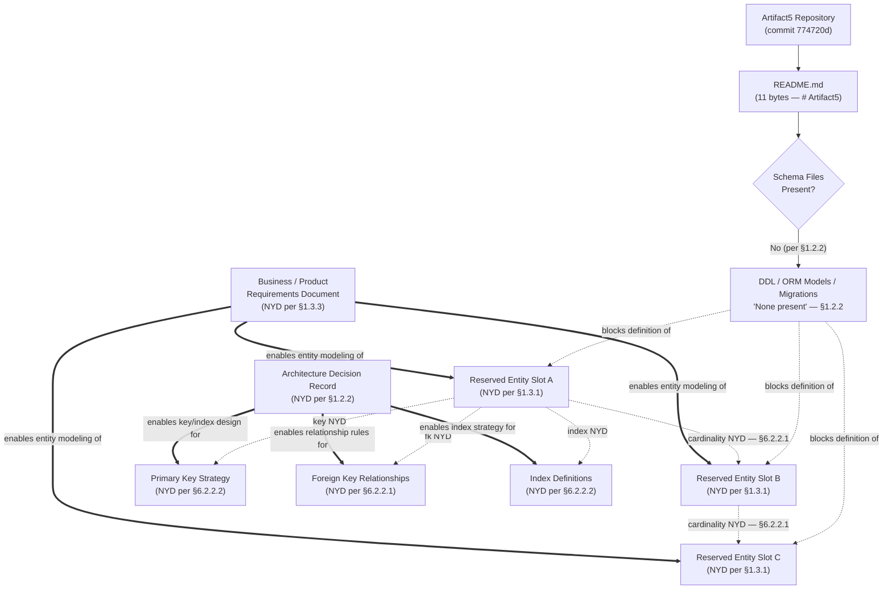

#### 6.2.6.2 Data Flow Diagram (Empty State)

The diagram below depicts the empty data-flow graph established in §5.1.3: "No data stores and no caches exist. Per §3.6.1 Persistence Layer Status, every storage tier requested by the section prompt — Primary Database (OLTP / System of Record), Secondary Database (OLAP / Analytics / Read-Replica), In-Memory / Distributed Cache, Object / Blob Storage, File-System Storage, and Search Index / Vector Store — is recorded as NYD." All five canonical component layers are recorded as "Not present" per §1.2.2, collapsing the producer-transformer-consumer data-flow graph to the empty set.

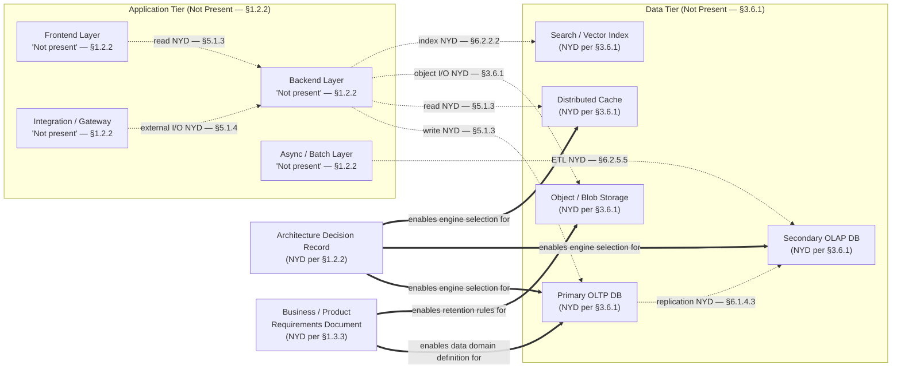

#### 6.2.6.3 Replication Architecture Diagram (Empty State)

The diagram below preserves the canonical replication-architecture topology (primary → synchronous/asynchronous replicas → cross-region standbys → snapshot / PITR / backup tier) required by the section prompt and explicitly marks each component as blocked by an evidentiary anchor. The structure parallels the §6.1.5.3 resilience-pattern diagram and is anchored to §6.1.4.3 Data Redundancy Approach, where every replication concern is recorded as NYD with the documented basis "Data Layer 'Not present.'"

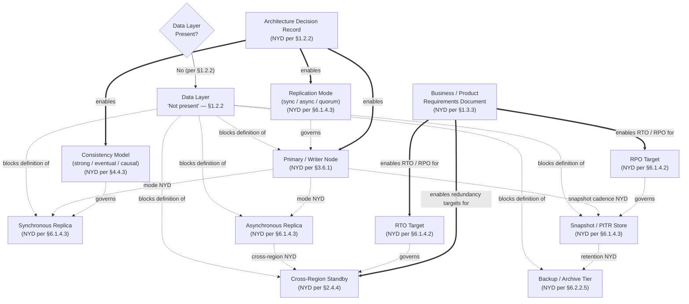

---

### 6.2.7 Forward-Path Artifact Enablement

Consistent with the convention established in §5.5 (which itself follows §2.5.2, §3.8.2, and §4.6) and reaffirmed in §6.1.6, the mapping below identifies which forward-path artifacts will unblock each §6.2 sub-dimension once introduced to the repository.

#### 6.2.7.1 Enabling-Artifact Mapping

| Forward-Path Artifact | §6.2 Sub-Dimensions Enabled |
|---|---|
| Architecture Decision Record (per §1.2.2; ADR-NYD-003 reserved per §5.3.6) | §6.2.2.2 Indexing; §6.2.2.3 Partitioning; §6.2.2.4 Replication; §6.2.2.5 Backup Architecture; §6.2.3.1 Migration; §6.2.5.1 Query Optimization; §6.2.5.3 Connection Pooling |
| Business / Product Requirements Document (per §1.3.3) | §6.2.2.1 Entity Relationships; §6.2.3.3 Archival; §6.2.4.1 Retention; §6.2.4.2 RTO / RPO; §6.2.5.2 Caching (workload profile); §6.2.5.5 Batch Processing (volume targets) |
| Integration Architecture Document (per §1.3.3) | §6.2.3.4 Data Storage and Retrieval (cross-system); §6.2.4.4 Audit Mechanisms (CDC / SIEM integration); §6.2.5.4 Read/Write Splitting (cross-service) |
| Out-of-Scope Statement / Non-Goals Document (per §1.3.3) | Bounding context for excluded data domains and storage tiers across §6.2.2 through §6.2.5 |

#### 6.2.7.2 Subsection-to-Evidence Mapping

The matrix below traces each §6.2 sub-dimension to the upstream evidentiary anchor that justifies its empty state, mirroring the §5.5.1 and §6.1.6.2 convention: "the matrix below traces each placeholder subsection of §5 to the evidentiary anchor in §1, §2, §3, or §4 that justifies its empty state."

| §6.2 Subsection | Evidentiary Anchor | Documented Finding |
|---|---|---|
| §6.2.2.1 Entity Relationships | §1.3.1; §3.6.1 | Data Domains "Not yet modeled"; no schema files |
| §6.2.2.2 Indexing Strategy | §3.6.1; §2.4.3 | No engine selected; no workload profile |
| §6.2.2.3 Partitioning Approach | §2.4.4 Scalability Considerations | Data Partitioning / Sharding NYD |
| §6.2.2.4 Replication Configuration | §6.1.4.3 Data Redundancy Approach | All four replication concerns NYD |
| §6.2.2.5 Backup Architecture | §2.4.6; §6.1.4.2 | Backup and Recovery NYD; RTO / RPO NYD |
| §6.2.3.1 Migration Procedures | §1.2.2; §3.6.1 | No language / framework; no schema |
| §6.2.3.2 Versioning Strategy | §3.6.1; §1.2.2 | No schema to version |
| §6.2.3.3 Archival Policies | §1.3.1; §3.6.1 | No data domains modeled |
| §6.2.3.4 Storage and Retrieval | §1.2.2; §5.1.3 | Backend layer not present; no data stores |
| §6.2.3.5 Caching Policies | §5.3.4; §4.4.1 | No caching strategy selected |
| §6.2.4.1 Data Retention | §1.3.1 | Geographic coverage; data domains not declared |
| §6.2.4.2 Backup and Fault Tolerance | §2.4.6; §6.1.4.1; §6.1.4.2 | All fault-tolerance dimensions NYD |
| §6.2.4.3 Privacy Controls | §2.4.5 Security Implications | Data Protection / Encryption NYD |
| §6.2.4.4 Audit Mechanisms | §2.4.6; §4.4.3 | Logging and Observability NYD |
| §6.2.4.5 Access Controls | §2.4.5; §5.3.5 | AuthN / AuthZ Model NYD |
| §6.2.5.1 Query Optimization | §3.6.1; §6.1.3.4 | No engine; no queries; no workload |
| §6.2.5.2 Caching Strategy | §5.3.4 Caching Strategy Justification | No application layer to cache for |
| §6.2.5.3 Connection Pooling | §6.1.3.4; §1.2.2 | No Data layer; no Backend layer |
| §6.2.5.4 Read/Write Splitting | §6.1.4.3 Data Redundancy Approach | No replication topology defined |
| §6.2.5.5 Batch Processing | §1.2.2; §4.1.1 | No async / batch layer; zero process flows |

---

### 6.2.8 Assumptions and Constraints

Following the convention established in §5.6, §6.1.7, and reaffirmed by §2.5.3, §3.8.3, and §4.7, the assumptions and constraints applied in authoring §6.2 are surfaced below so that future revisions can validate or revise them as the project moves out of skeleton state.

#### 6.2.8.1 Section-Level Assumptions

| Assumption | Basis |
|---|---|
| Repository content remains limited to `README.md` (11 bytes) at the time of authoring | §1.1.1; §1.4 Files Examined |
| The "Not Applicable" verdict applies to the current commit (`774720d`) only and must be re-evaluated upon introduction of any schema file, migration directory, ORM model, or persistence-related configuration | Section prompt directive; §5.6.3 Version Tracking |
| The Architecture Decision Record (ADR-NYD-003 per §5.3.6) is the canonical enabling artifact for engine selection, replication topology, backup architecture, and connection-pooling design | §5.3.3, §5.3.4, §5.3.6, §6.1.6.1 |
| The Business / Product Requirements Document is the canonical enabling artifact for data-domain modeling, retention rules, RTO/RPO targets, and workload volume forecasts | §1.3.3; §6.1.6.1 |
| The Integration Architecture Document is the canonical enabling artifact for cross-system data exchange, audit-event integration, and any cross-service read/write splitting | §1.3.3; §6.1.6.1 |

#### 6.2.8.2 Section-Level Constraints

| Constraint | Basis |
|---|---|
| Tables in this section are capped at four columns | §2.5.3; §3.8.3; §4.7.2; §5.6.2; §6.1.7.2 |
| Empty-state diagrams must follow the styling of §1.2.2, §2.3.2, §3.1.3, §4.5, §5.2.2, and §6.1.5 (solid = verified; dotted = no evidence / blocks; double = enables) | §6.1.7.2 Section-Level Constraints |
| Diagrams must not fabricate schemas, entities, relationships, or storage technology absent from the repository; reserved entity slots are explicitly labeled NYD with evidentiary anchors | Section prompt directive; §6.1.7.2 |
| Each empty placeholder must cite at least one evidentiary anchor in §1, §2, §3, §4, §5, or §6.1 | §2.5.1; §3.8.1; §4.7.2; §5.6.2; §6.1.7.2 |
| All three diagram categories required by the prompt (database schema diagrams, data flow diagrams, replication architecture) must be represented even when empty | Section prompt directive |
| The section verdict ("Not Applicable") must remain consistent with the §1.2.2 Major System Components declaration that the Data Layer / Persistence is "Not present" | §1.2.2; §3.6.1 |

#### 6.2.8.3 Version Tracking

| Version Field | Current Value |
|---|---|
| Section Revision | 1 (initial authoring against skeleton repository) |
| Number of Documented Entities | 0 |
| Number of Documented Storage Tiers (populated) | 0 (six tiers reserved as NYD per §3.6.1) |
| Number of Documented Migrations | 0 |
| Number of Documented Replication Topologies | 0 |
| Number of Documented Backup Policies | 0 |
| Number of Authored Mermaid Diagrams | 3 (all empty-state: §6.2.6.1 ERD, §6.2.6.2 Data Flow, §6.2.6.3 Replication Architecture) |
| Last Repository Commit Referenced | `774720d` ("Initial commit", per §1.1.1) |

---

### 6.2.9 References

#### 6.2.9.1 Files Examined

- `README.md` — Sole content-bearing artifact in the repository (11 bytes, single H1 heading `# Artifact5`); confirmed via direct read to contain no database schema, no SQL, no ORM model declarations, and no references to any persistence technology

#### 6.2.9.2 Folders Explored

- `""` (repository root, depth 0) — Confirmed to contain only `README.md`; no `src/`, `db/`, `schemas/`, `migrations/`, `models/`, or any other subdirectory that would house database design artifacts

#### 6.2.9.3 Technical Specification Sections Cross-Referenced

- **§1.1 Executive Summary** — Establishes the pre-implementation, skeleton state of the repository and confirms commit `774720d` as the authoritative reference point for the Not-Applicable verdict
- **§1.2 System Overview** — Provides the canonical "Not present" declaration for the Data Layer / Persistence component (§1.2.2) that anchors the entire Not-Applicable verdict
- **§1.3 Scope** — Establishes that "Data Domains Included" is "Not yet modeled" (§1.3.1) and identifies the forward-path artifacts (PRD, Integration Architecture Document, Out-of-Scope Statement) that will enable population
- **§2.4 Implementation Considerations** — Provides §2.4.4 Data Partitioning / Sharding (NYD), §2.4.5 Data Protection / Encryption (NYD), and §2.4.6 Backup and Recovery (NYD) anchors directly relevant to §6.2.2.3, §6.2.4.3, and §6.2.2.5
- **§3.6 Databases and Storage** — **Provides the canonical NYD declaration for every storage tier (§3.6.1) and the reserved four-column database-and-storage schema (§3.6.2) on which §6.2.2 through §6.2.5 are anchored**
- **§4.4 Technical Implementation (Empty State)** — Provides State Management Schema (Data Persistence Points NYD, Caching Requirements NYD, Transaction Boundaries NYD per §4.4.1) and Transaction and Consistency Posture (Consistency Model NYD per §4.4.3) directly relevant to §6.2.2.4 and §6.2.5
- **§5.1 High-Level Architecture** — Confirms "No data stores and no caches exist" (§5.1.3), provides the empty-state data-flow declaration on which §6.2.6.2 is anchored
- **§5.3 Technical Decisions** — Provides §5.3.3 Data Storage Solution Rationale (NYD), §5.3.4 Caching Strategy Justification (NYD), and §5.3.6 ADR Catalogue (with ADR-NYD-003 reserved for the data-storage decision) — all foundational anchors for §6.2's "Not Applicable" verdict
- **§5.4 Cross-Cutting Concerns** — Provides §5.4.6 Disaster Recovery Procedures (NYD) and §5.4.4 Authentication and Authorization Framework (NYD) directly relevant to §6.2.4.2 and §6.2.4.5
- **§5.5 Forward-Path Artifact Enablement** — Establishes the artifact-enablement convention (ADR, PRD, Integration Architecture Document) mirrored in §6.2.7
- **§5.6 Assumptions and Constraints** — Establishes the four-column table cap, the empty-state diagram styling conventions, and the evidentiary-anchor requirement applied throughout §6.2
- **§6.1 Core Services Architecture** — **Provides the precedent "Not Applicable" verdict pattern and structural template that §6.2 mirrors; provides §6.1.3.4 Performance Optimization Techniques (connection pooling, caching, batching all NYD), §6.1.4.2 Disaster Recovery Procedures (RTO / RPO NYD), and §6.1.4.3 Data Redundancy Approach (Replication Mode, Replica Topology, Snapshot / PITR, Cross-Region Redundancy all NYD) which are directly imported into §6.2.5.3, §6.2.4.2, and §6.2.2.4 respectively**

## 6.3 Integration Architecture

### 6.3.1 Applicability Assessment

**Integration Architecture is not applicable for this system in its current state.**

The Artifact5 repository is in a confirmed pre-implementation, skeleton condition that precludes the documentation of any integration-architecture construct. The system documented herein is identified in its repository solely by the project name "Artifact5", as declared in the sole content-bearing artifact present in the codebase (`README.md`, 11 bytes, single H1 heading `# Artifact5`, commit `774720d`, "Initial commit"). Per §1.2.1 Integration with Existing Enterprise Landscape, "No integration points, external service references, API client configurations, message broker connections, identity provider links, data pipeline taps, or any other enterprise-system touchpoints have been documented. Artifact5 currently declares zero dependencies on internal or external systems." Per §1.2.2 Major System Components, the **Integration / API Gateway Layer** is recorded as "Not present," and the **Asynchronous / Batch Processing** layer is likewise recorded as "Not present." Per §2.3.3 Integration Points, every category of integration — Inbound, Outbound, Inter-Feature, and External System Touchpoints — is recorded as "None." Per §3.5.1, all six third-party service categories (External APIs/SaaS, Authentication/Identity, Monitoring/Observability, Cloud/Hosting, Message Brokers/Event Buses, Payment/Notification/Analytics) are recorded as NYD with explicit evidentiary anchors.

Per the Section 6.3 prompt directive — *"If the system does not require integration with external systems or services, clearly state 'Integration Architecture is not applicable for this system' and explain why"* — this section declares the topic Not Applicable and documents the evidentiary justification. The reserved schemas, four-column tables, and empty-state diagrams below preserve the prompt's structural requirements (API Design, Message Processing, External Systems, and the three required diagram categories plus a sequence diagram for key flows) for forward compatibility once the enabling artifacts identified in §6.3.6 — most notably the Integration Architecture Document referenced in §1.3.3 — are introduced to the repository. This section follows the verdict pattern, evidentiary discipline, and four-column table cap established by §6.1 Core Services Architecture and reaffirmed by §6.2 Database Design.

#### 6.3.1.1 Evidentiary Basis for the Not-Applicable Verdict

The verdict rests on seven mutually reinforcing findings drawn from upstream sections of this specification. Each finding is anchored to a verified empty-state declaration; none is inferred or extrapolated.

| Finding | Documented Status | Primary Evidentiary Anchor |
|---|---|---|
| The Integration / API Gateway Layer component is absent | "Not present" | §1.2.2 Major System Components |
| The Asynchronous / Batch Processing layer is absent | "Not present" | §1.2.2 Major System Components |
| All four integration-point categories are empty | Inbound, Outbound, Inter-Feature, External all "None" | §2.3.3 Integration Points |
| Zero dependencies on internal or external systems declared | No external service refs, API clients, brokers, identity providers | §1.2.1 Integration Landscape |
| All six third-party service categories are NYD | External APIs, AuthN, Monitoring, Cloud, Brokers, Vendors all NYD | §3.5.1 External Service Integration Status |
| No communication pattern selected | Sync/async, request-response/pub-sub, orchestration/choreography NYD | §5.3.2 Communication Pattern Choices |
| No AuthN/AuthZ framework selected | OAuth/SAML/mTLS/API keys NYD; RBAC/ABAC NYD | §5.4.4 Authentication and Authorization Framework |

The repository contains no references to a predecessor system, legacy platform, or system being replaced. There are no migration plans, no deprecated-module annotations, and no backward-compatibility considerations recorded. On the evidence available, Artifact5 is a greenfield initiative rather than a replacement or modernization effort. Because no predecessor messaging fabric, API gateway, integration bus, or external dependency is being modernized, no inherited integration topology, message contract, or external service relationship can be documented.

#### 6.3.1.2 Restatement of Integration Layer Absence

The section prompt's three top-level branches (API DESIGN, MESSAGE PROCESSING, EXTERNAL SYSTEMS) all presuppose the existence of at least an Integration / API Gateway Layer, and the Message Processing branch additionally presupposes an Asynchronous / Batch Processing layer. Both layers are explicitly absent, alongside the three other canonical component layers.

| Component Category | Status in Repository |
|---|---|
| Frontend / User Interface Layer | Not present |
| Backend Services / Application Layer | Not present |
| Data Layer / Persistence | Not present |
| **Integration / API Gateway Layer** | **Not present** |
| **Asynchronous / Batch Processing** | **Not present** |

#### 6.3.1.3 Restatement of Integration Point Absence

The API Design, Message Processing, and External Systems sub-branches additionally presuppose the existence of declared integration points across which APIs are exposed, messages are routed, and external services are consumed. The Feature Relationships analysis in §2.3.3 explicitly records every integration-point category as "None."

| Integration Point Category | Documented Items |
|---|---|
| Inbound Integrations | None — see §1.2.1 |
| Outbound Integrations | None — see §1.2.1 |
| Inter-Feature Boundaries | None — no features defined (§2.1.1) |
| External System Touchpoints | None — Integration Architecture Document pending (§1.3.3) |

#### 6.3.1.4 Restatement of Third-Party Service Absence

The External Systems branch additionally presupposes selected providers across the six third-party service categories enumerated in §3.5.1. All six categories are recorded as NYD with the documented status anchored to upstream evidence.

| Service Category | Selected Provider | Status |
|---|---|---|
| External APIs / SaaS Integrations | NYD | Zero integrations declared (§1.2.1) |
| Authentication / Identity Services | NYD | No identity provider integration (§2.4.5) |
| Monitoring / Observability Services | NYD | No application layer to observe (§2.4.6) |
| Cloud Services / Hosting Platform | NYD | No infrastructure-as-code present (§1.2.2) |
| Message Brokers / Event Buses | NYD | No async / batch layer present (§1.2.2) |
| Payment, Notification, or Analytics Vendors | NYD | No feature catalog declared (§2.1) |

#### 6.3.1.5 Restatement of Greenfield Status (No Legacy Interfaces)

Per §1.2.1 Current System Limitations, the repository contains no references to a predecessor system, legacy platform, or system being replaced; there are no migration plans, deprecated-module annotations, or backward-compatibility considerations recorded. Artifact5 is best characterized as a greenfield initiative. The "Legacy System Interfaces" sub-dimension required by the EXTERNAL SYSTEMS branch of the section prompt is therefore Not Applicable by definition — there is no legacy system whose interfaces would need to be preserved, wrapped, or migrated.

---

### 6.3.2 API Design (Reserved Schema)

Although Integration Architecture is Not Applicable in the current repository state, the six API DESIGN sub-dimensions required by the section prompt — protocol specifications, authentication methods, authorization framework, rate limiting strategy, versioning approach, and documentation standards — are preserved below as reserved schemas. Each row is marked NYD with at least one evidentiary anchor in §1, §2, §3, §4, or §5, in compliance with the authoring convention restated in §5.6.2 and reaffirmed by §6.1.7.2 and §6.2.8.2: "Each empty placeholder must cite at least one evidentiary anchor" and "Tables in this section are capped at four columns."

#### 6.3.2.1 Protocol Specifications

API protocol selection (REST/JSON-over-HTTPS, GraphQL, gRPC, SOAP/XML, WebSocket, Server-Sent Events, AsyncAPI over MQTT/AMQP/Kafka) presupposes both an Integration / API Gateway Layer through which the protocol is exposed and a Backend Services / Application Layer that implements the protocol's request handlers. Per §1.2.2, both layers are recorded as "Not present"; per §2.2.3, no functional requirements have been catalogued from which API contracts could be derived; and per §5.1.3, "No integration patterns (e.g., request-response, publish-subscribe, claim-check, content-based router, message translator) and no protocols (e.g., HTTP/REST, gRPC, GraphQL, AMQP, MQTT, Kafka, WebSocket, SFTP) have been declared."

| Protocol Concern | Selected Approach | Documented Basis | Evidentiary Anchor |
|---|---|---|---|
| Primary Protocol Family (REST / GraphQL / gRPC / WebSocket) | NYD | No Integration / API Gateway Layer | §1.2.2, §5.1.3 |
| Payload Encoding (JSON / Protobuf / Avro / XML) | NYD | No API contracts declared | §2.2.3, §5.1.3 |
| Transport Security (TLS version / mTLS profile) | NYD | No security mechanism selected | §2.4.5, §5.3.5 |
| Asynchronous Protocol (AMQP / MQTT / Kafka / NATS) | NYD | No async / batch layer; no broker selected | §1.2.2, §3.5.1 |

#### 6.3.2.2 Authentication Methods

Per §2.4.5 Security Implications, the Authentication Model is recorded as "NYD — no identity provider integration declared (§1.2.1)," and per §5.4.4 Authentication and Authorization Framework, "No authentication framework (e.g., OAuth 2.0 / OIDC, SAML, mutual TLS, API keys, session cookies) ... has been chosen. Framework selection is NYD and is enabled jointly by the ADR (per §1.2.2) and the Integration Architecture Document (per §1.3.3) for the identity-provider integration component." Per §3.5.1, the Authentication / Identity Services category is recorded as "No identity provider integration (§2.4.5)."

| Authentication Concern | Selected Mechanism | Documented Basis | Evidentiary Anchor |
|---|---|---|---|
| Identity Provider Integration (OIDC / SAML / Custom) | NYD | No identity provider declared | §2.4.5, §3.5.1 |
| Credential Type (OAuth 2.0 token / API key / mTLS cert / session cookie) | NYD | No AuthN framework chosen | §5.4.4 |
| Token Lifetime, Refresh, and Revocation Policy | NYD | No identity provider integration | §2.4.5, §5.4.4 |
| Service-to-Service AuthN (mTLS / SPIFFE / signed JWT) | NYD | No inter-service boundaries | §1.2.2, §2.3.3 |

#### 6.3.2.3 Authorization Framework

Per §2.4.5 Security Implications, the Authorization Model is recorded as "NYD — no user groups identified (§1.3.1)," and per §5.4.4, "no authorization framework (e.g., RBAC, ABAC, ReBAC, policy-as-code) has been chosen." Per §1.3.1, "User Groups Covered" is recorded as "Not yet identified," precluding the construction of any role taxonomy, attribute set, or policy domain on which an authorization framework would operate.

| Authorization Concern | Selected Mechanism | Documented Basis | Evidentiary Anchor |
|---|---|---|---|
| Authorization Model (RBAC / ABAC / ReBAC / policy-as-code) | NYD | No user groups identified | §1.3.1, §2.4.5 |
| Policy Decision Point / Enforcement Point Topology | NYD | No Backend layer; no gateway | §1.2.2, §5.4.4 |
| Scope / Claim Schema (token claims, audience, scopes) | NYD | No AuthN framework selected | §5.4.4 |
| Delegation / Impersonation / On-Behalf-Of Flows | NYD | No identity provider integration | §1.2.1, §2.4.5 |

#### 6.3.2.4 Rate Limiting Strategy

Rate limiting (token-bucket, leaky-bucket, fixed-window, sliding-window, distributed rate limiting via Redis or specialized gateways) presupposes both an API Gateway through which to enforce throttling and a defined throughput envelope against which limits can be calibrated. Per §1.2.2, the Integration / API Gateway Layer is recorded as "Not present"; per §2.4.3 Performance Requirements, all four performance dimensions — Throughput Targets, Latency Targets, Resource Utilization Targets, and Concurrency / Load Targets — are recorded as NYD; and per §1.2.3, no KPIs / SLOs / SLAs have been declared.

| Rate Limiting Concern | Selected Strategy | Documented Basis | Evidentiary Anchor |
|---|---|---|---|
| Limiting Algorithm (token-bucket / leaky-bucket / windowed) | NYD | No API Gateway present | §1.2.2 |
| Per-Client Quota and Burst Allowance | NYD | No throughput / concurrency targets | §2.4.3, §1.2.3 |
| Enforcement Location (gateway / sidecar / application) | NYD | No infrastructure-as-code | §1.2.2, §3.7.2 |
| Throttling Response Semantics (429 / Retry-After / shed) | NYD | No API contracts; no SLAs declared | §2.2.3, §1.2.3 |

#### 6.3.2.5 Versioning Approach

API versioning (URI versioning, header versioning, media-type versioning, query-parameter versioning; backward-compatibility policy; deprecation cadence; sunset headers) presupposes both an authored API contract and a consumer base whose compatibility must be preserved. Per §2.2.3, no API contracts have been declared; per §1.1.3 (referenced via §6.2.1), no stakeholders or consumers have been identified; and per §1.2.2, the Integration / API Gateway Layer is recorded as "Not present."

| Versioning Concern | Selected Approach | Documented Basis | Evidentiary Anchor |
|---|---|---|---|
| Version Scheme (URI / header / media-type / query) | NYD | No API contracts exist | §2.2.3, §1.2.2 |
| Compatibility Policy (backward / forward / both) | NYD | No consumers declared | §2.2.3, §5.1.4 |
| Deprecation Cadence and Sunset Headers | NYD | No API surface to deprecate | §1.2.2, §2.2.3 |
| Breaking-Change Communication Workflow | NYD | No stakeholders identified | §2.3.3, §5.1.4 |

#### 6.3.2.6 Documentation Standards

API documentation standards (OpenAPI / Swagger, AsyncAPI, JSON Schema, Protocol Buffer IDL, GraphQL SDL, RAML, API Blueprint) presuppose an authored API contract from which the specification can be generated. Per §1.4, the repository contains no documentation directory, no `docs/` folder, no `api/` folder, and no specification files in any of the canonical IDL formats. Per §2.2.3, no API contracts have been declared.

| Documentation Concern | Selected Standard | Documented Basis | Evidentiary Anchor |
|---|---|---|---|
| Synchronous API Spec Format (OpenAPI 3.x / GraphQL SDL / gRPC `.proto`) | NYD | No API contracts; no spec files | §1.4, §2.2.3 |
| Asynchronous API Spec Format (AsyncAPI / Schema Registry) | NYD | No async / batch layer | §1.2.2, §3.5.1 |
| Documentation Hosting (Swagger UI / Redoc / Stoplight / Backstage) | NYD | No documentation directory | §1.4 |
| Publication Cadence and Versioned Catalog | NYD | No API surface to document | §2.2.3, §1.4 |

---

### 6.3.3 Message Processing (Reserved Schema)

The five MESSAGE PROCESSING sub-dimensions required by the section prompt — event processing patterns, message queue architecture, stream processing design, batch processing flows, and error handling strategy — are preserved below as reserved schemas. The corresponding Communication Pattern Choices in §5.3.2, the Asynchronous / Batch Processing layer status in §1.2.2, the Message Brokers / Event Buses category in §3.5.1, and the Error Handling Schema in §4.4.2 already record every message-processing dimension as NYD with explicit evidentiary anchors.

#### 6.3.3.1 Event Processing Patterns

Event processing patterns (event-driven architecture (EDA), event sourcing, command-query responsibility segregation (CQRS), saga choreography, saga orchestration, claim-check, content-based router, message translator) presuppose both an Asynchronous / Batch Processing layer and a selected communication-pattern foundation. Per §1.2.2, the Asynchronous / Batch Processing layer is recorded as "Not present"; per §5.3.2, "Synchronous-versus-asynchronous, request-response-versus-publish-subscribe, and orchestration-versus-choreography choices are therefore NYD and are enabled by the forthcoming Integration Architecture Document referenced in §1.3.3"; and per §4.4.3, the Distributed Transaction Pattern (2PC / Saga / Outbox) dimension is recorded as "NYD — no inter-service boundaries (§1.2.2, §2.3.3)."

| Event Processing Concern | Selected Pattern | Documented Basis | Evidentiary Anchor |
|---|---|---|---|
| Architecture Style (event-driven / event-sourced / CQRS) | NYD | No comm pattern selected | §5.3.2, §1.2.2 |
| Coordination Model (orchestration / choreography) | NYD | No inter-service boundaries | §2.3.3, §4.4.3 |
| Event Schema Registry and Evolution Policy | NYD | No API contracts; no async layer | §2.2.3, §1.2.2 |
| Idempotency / Exactly-Once / At-Least-Once Guarantee | NYD | No API contracts to designate idempotent | §4.4.3, §2.2.3 |

#### 6.3.3.2 Message Queue Architecture

Message queue architecture (broker selection, topic/queue topology, partition count, ordering guarantees, retention policy, dead-letter queue (DLQ) design, consumer-group strategy) presupposes a selected message broker technology and a declared message workload. Per §3.5.1, the Message Brokers / Event Buses category is recorded with the status "No async / batch layer present (§1.2.2)"; per §3.6.1 (referenced via §6.2.1), no storage tier including any message-broker tier has been selected; and per §1.2.2, no infrastructure-as-code is present that would describe broker deployment topology.

| Message Queue Concern | Selected Mechanism | Documented Basis | Evidentiary Anchor |
|---|---|---|---|
| Broker Technology (RabbitMQ / Kafka / SQS / NATS / Azure Service Bus) | NYD | No broker selected | §3.5.1, §1.2.2 |
| Topic / Queue Topology and Partitioning | NYD | No message workload defined | §2.2.3, §3.5.1 |
| Ordering and Delivery Guarantees | NYD | No comm pattern selected | §5.3.2, §4.4.3 |
| Retention Policy and Dead-Letter Queue (DLQ) Design | NYD | No async layer; no error handling | §1.2.2, §4.4.2 |

#### 6.3.3.3 Stream Processing Design

Stream processing design (Kafka Streams, Apache Flink, Apache Spark Structured Streaming, AWS Kinesis Data Analytics, Google Dataflow, ksqlDB; windowing semantics; watermarking; stateful operators; exactly-once processing) presupposes both a streaming substrate and a declared stream workload. Per §1.2.2, neither the Asynchronous / Batch Processing layer nor any supporting infrastructure exists; per §2.2.3, no functional requirements have been catalogued from which stream contracts could be derived; and per §3.5.1, no Message Broker / Event Bus has been selected.

| Stream Processing Concern | Selected Approach | Documented Basis | Evidentiary Anchor |
|---|---|---|---|
| Stream Processing Engine (Kafka Streams / Flink / Spark / Dataflow) | NYD | No async / batch layer | §1.2.2, §3.5.1 |
| Windowing Semantics (tumbling / sliding / session / global) | NYD | No event workload defined | §2.2.3, §5.3.2 |
| Stateful Operator Backing Store | NYD | No Data layer present | §1.2.2, §3.6.1 |
| Watermarking and Late-Arrival Policy | NYD | No latency targets declared | §2.4.3, §1.2.3 |

#### 6.3.3.4 Batch Processing Flows

Batch processing flows (scheduled ETL jobs, micro-batch streaming, bulk imports/exports, scheduled aggregation jobs, file-based integration via SFTP/S3 drop-zones, change-data-capture (CDC) snapshots) presuppose both an Asynchronous / Batch Processing layer and declared upstream/downstream systems. Per §1.2.2, the Asynchronous / Batch Processing layer is recorded as "Not present"; per §4.1.1 (referenced throughout), "Zero process flows declared"; and per §1.2.1, "zero dependencies on internal or external systems" have been declared.

| Batch Processing Concern | Selected Approach | Documented Basis | Evidentiary Anchor |
|---|---|---|---|
| Batch Engine / Framework (Airflow / Spark / Step Functions / cron) | NYD | No async / batch layer | §1.2.2 |
| Scheduling Cadence and Orchestration | NYD | Zero process flows declared | §4.1.1 |
| Source-to-Sink Topology (upstream / downstream systems) | NYD | Zero external integrations | §1.2.1, §2.3.3 |
| Backpressure / Throttling / Retry Strategy | NYD | No throughput targets; error handling NYD | §2.4.3, §4.4.2 |

#### 6.3.3.5 Error Handling Strategy

Per §4.4.2 Error Handling Schema, all four error-handling dimensions are recorded as NYD with explicit evidentiary anchors. The reserved schema below restates that catalogue under the Message Processing branch required by the §6.3 prompt, mirroring the §6.1.2.6 and §6.2.8 conventions for error-handling restatement.

| Error Handling Dimension | Current Documented Value |
|---|---|
| Retry Mechanisms | NYD — no Backend layer (§1.2.2); no concurrency / load targets (§2.4.3) |
| Fallback Processes | NYD — no Backend layer (§1.2.2); zero integrations to fall back to (§1.2.1) |
| Error Notification Flows | NYD — zero integrations (§1.2.1); Logging and Observability NYD (§2.4.6) |
| Recovery Procedures | NYD — Backup and Recovery NYD (§2.4.6); no Data store present (§1.2.2) |

Dead-letter queue (DLQ) topology, poison-message quarantine, redelivery policy, exponential backoff, jitter, and circuit-breaker tripping criteria for message-processing pipelines all presuppose both a message broker and an application runtime that consumes from it. Neither exists. Per §5.4.3 Error Handling Patterns, "the error-handling flow diagram for this state is provided in §5.4.7," which depicts the four-branch error-handling topology (retry / fallback / notification / recovery) with every branch blocked by the absence of the Backend layer.

---

### 6.3.4 External Systems (Reserved Schema)

The four EXTERNAL SYSTEMS sub-dimensions required by the section prompt — third-party integration patterns, legacy system interfaces, API gateway configuration, and external service contracts — are preserved below as reserved schemas. The corresponding External Integration Points table in §5.1.4, the Third-Party Services catalogue in §3.5, and the Integration Points table in §2.3.3 already record every external-systems dimension as NYD or "None."

#### 6.3.4.1 Third-Party Integration Patterns

Third-party integration patterns (synchronous REST/GraphQL/gRPC calls, asynchronous webhook delivery, SDK-based integration, polling, change-data-capture replication, file-drop integration via SFTP/S3, identity federation, OpenAPI client generation, anti-corruption layer wrappers, façade adapters) presuppose at least one selected third-party service. Per §3.5.1, all six third-party service categories are recorded as NYD; per §1.2.1, "zero dependencies" have been declared; and per §3.4 (referenced via §5.1.3), "zero open-source dependencies and zero third-party services have been declared."

| Third-Party Integration Concern | Selected Pattern | Documented Basis | Evidentiary Anchor |
|---|---|---|---|
| Synchronous Integration (REST / GraphQL / gRPC client) | NYD | Zero integrations declared | §1.2.1, §3.5.1 |
| Asynchronous Integration (webhook / message broker / event bus) | NYD | No async layer; no broker | §1.2.2, §3.5.1 |
| Anti-Corruption Layer / Adapter / Façade | NYD | No backend layer to host adapters | §1.2.2, §2.3.3 |
| Vendor SDK / Client Library Selection | NYD | Zero open-source dependencies | §3.4, §3.5.1 |

#### 6.3.4.2 Legacy System Interfaces

Per §1.2.1 Current System Limitations, "the repository contains no references to a predecessor system, legacy platform, or system being replaced. There are no migration plans, no deprecated-module annotations, and no backward-compatibility considerations recorded. On the evidence available, Artifact5 is best characterized as a greenfield initiative." The Legacy System Interfaces sub-dimension is therefore **structurally Not Applicable** for Artifact5 — there is no legacy system whose interfaces would need to be enumerated, wrapped, or migrated. The schema below is preserved purely for forward compatibility in the unlikely event that a future business decision introduces a legacy-system dependency to the project.

| Legacy Interface Concern | Selected Approach | Documented Basis | Evidentiary Anchor |
|---|---|---|---|
| Legacy Protocol / Format (SOAP / EDI / Fixed-Width / Mainframe RPC) | Not applicable | Greenfield initiative; no predecessor | §1.2.1 |
| Wrapper / Adapter / Anti-Corruption Layer Design | Not applicable | No legacy interface to wrap | §1.2.1 |
| Data Migration / Backfill Strategy | Not applicable | No legacy data source identified | §1.2.1, §1.3.1 |
| Sunset / Decommissioning Schedule | Not applicable | No system being replaced | §1.2.1 |

#### 6.3.4.3 API Gateway Configuration

Per §1.2.2 Major System Components, the Integration / API Gateway Layer is recorded as "Not present," and per §3.7.2 (referenced via §6.1), no infrastructure-as-code (Dockerfile, Kubernetes manifests, Terraform, CloudFormation) exists that would define gateway deployment topology, routing rules, or policy attachments. Gateway selection (Kong, AWS API Gateway, Azure API Management, Google Cloud API Gateway, Apigee, Tyk, Ambassador, Envoy-based gateways) and configuration (route definitions, rate-limit plugins, authentication plugins, observability plugins) cannot be substantiated.

| API Gateway Concern | Selected Configuration | Documented Basis | Evidentiary Anchor |
|---|---|---|---|
| Gateway Product (Kong / AWS API GW / Apigee / Envoy / Custom) | NYD | Integration Layer "Not present" | §1.2.2 |
| Route Definitions and Backend Bindings | NYD | No Backend layer; no API contracts | §1.2.2, §2.2.3 |
| Policy Chain (AuthN / AuthZ / Rate-Limit / WAF / Caching) | NYD | All security and rate-limit dims NYD | §2.4.5, §6.3.2.4 |
| Observability Plugins (logging / tracing / metrics) | NYD | Observability Hooks NYD | §4.4.3, §5.4.1 |

#### 6.3.4.4 External Service Contracts

External service contracts (SLA tier, throughput allotments, latency guarantees, data-residency obligations, breach-notification SLAs, support tier, audit-log access, encryption-in-transit/-at-rest requirements, schema-evolution policy) presuppose both an identified external service and a vendor relationship. Per §3.5.1, no external service has been identified; per §3.5.2 Reserved Third-Party Service Schema, the four-column schema captures "Service / Provider Name, Category, Integration Mechanism, Security and Compliance Requirements" but contains no rows; and per §5.1.4 External Integration Points, the only row is the explicit NYD placeholder.

The §5.1.4 reserved schema is reproduced below for completeness, and any future contract-bearing rows must be added there before being elaborated under this subsection:

| System Name | Integration Type | Data Exchange Pattern / Protocol & Format | SLA Requirements |
|---|---|---|---|
| NYD — none declared (§1.2.1) | NYD — none declared (§2.3.3) | NYD — Integration / API Gateway layer "Not present" (§1.2.2) | NYD — no SLAs declared (§1.2.3) |

| Contractual Concern | Documented Target | Enabling Artifact | Evidentiary Anchor |
|---|---|---|---|
| Vendor / Provider Identity | NYD | Pending IAD per §1.3.3 | §3.5.1, §5.1.4 |
| Service Level Agreement Terms | NYD | Pending PRD per §1.3.3 | §1.2.3, §5.4.5 |
| Data Residency / Sovereignty Requirements | NYD | Pending PRD per §1.3.3 | §1.3.1, §2.4.5 |
| Security and Compliance Obligations | NYD | Pending ADR per §1.2.2 | §2.4.5, §3.5.2 |

---

### 6.3.5 Required Diagrams

The three diagrams required by the section prompt — integration flow diagrams, API architecture diagrams, and message flow diagrams — are authored below as empty-state placeholders, along with a fourth integration sequence diagram authored in compliance with the prompt directive *"Include sequence diagrams for key flows."* Solid arrows denote the verified state of the repository at commit `774720d`; dotted arrows denote "no evidence available" or "blocks definition of" relationships; and double arrows denote "enables population of" relationships from forward-path artifacts. This visual vocabulary is consistent with the empty-state styling established in §1.2.2, §2.3.2, §3.1.3, §4.5, §5.2.2, §6.1.5, and §6.2.6. In compliance with the §6.1.7.2 and §6.2.8.2 constraints, the diagrams do not fabricate APIs, message brokers, integrations, or third-party services absent from the repository; placeholder nodes are explicitly labeled with NYD annotations and evidentiary anchors.

#### 6.3.5.1 Integration Flow Diagram (Empty State)

The diagram below depicts the absence of any inbound, outbound, inter-feature, or external-system integration flow and the dependency of any future integration topology on the forward-path artifacts identified in §6.3.6. Every gateway, broker, identity provider, and external system slot carries an evidentiary anchor in the form `(NYD per §X.Y.Z)` or `('Not present' — §1.2.2)`, consistent with the convention restated in §6.1.7.2.

```mermaid
flowchart TD
    Repo["Artifact5 Repository<br/>(commit 774720d)"]
    Readme["README.md<br/>(11 bytes — # Artifact5)"]

    Inbound["Inbound Integration Channel<br/>('None' — §2.3.3)"]
    Outbound["Outbound Integration Channel<br/>('None' — §2.3.3)"]
    InterFeature["Inter-Feature Boundary<br/>('None' — §2.3.3)"]
    ExtTouch["External System Touchpoint<br/>('None' — §2.3.3)"]

    Gateway["API Gateway / Edge<br/>'Not present' — §1.2.2"]
    Broker["Message Broker / Event Bus<br/>(NYD per §3.5.1)"]
    IdP["Identity Provider<br/>(NYD per §2.4.5)"]
    Backend["Backend Services Layer<br/>'Not present' — §1.2.2"]
    Async["Async / Batch Layer<br/>'Not present' — §1.2.2"]

    ExtSaaS["External SaaS / API<br/>(NYD per §3.5.1)"]
    ExtCloud["Cloud Hosting Platform<br/>(NYD per §3.5.1)"]

    IAD["Integration Architecture Document<br/>(NYD per §1.3.3)"]
    ADR["Architecture Decision Record<br/>(NYD per §1.2.2)"]
    PRD["Business / Product<br/>Requirements Document<br/>(NYD per §1.3.3)"]

    Repo --> Readme
    Readme -. "no integration evidence" .-> Inbound
    Readme -. "no integration evidence" .-> Outbound
    Readme -. "no integration evidence" .-> InterFeature
    Readme -. "no integration evidence" .-> ExtTouch

    Inbound -. "routing topology NYD — §5.1.4" .-> Gateway
    Gateway -. "routing topology NYD — §5.1.4" .-> Backend
    Backend -. "publish/subscribe NYD — §5.3.2" .-> Broker
    Broker -. "consumer NYD — §5.3.2" .-> Async
    Backend -. "outbound call NYD — §1.2.1" .-> ExtSaaS
    Backend -. "deployment target NYD — §3.7.2" .-> ExtCloud
    Backend -. "AuthN delegation NYD — §5.4.4" .-> IdP
    Outbound -. "egress topology NYD — §5.1.4" .-> ExtSaaS
    ExtTouch -. "service contract NYD — §3.5.2" .-> ExtSaaS

    IAD ==>|"enables population of"| Inbound
    IAD ==>|"enables population of"| Outbound
    IAD ==>|"enables population of"| Gateway
    IAD ==>|"enables population of"| Broker
    IAD ==>|"enables identity integration for"| IdP
    IAD ==>|"enables external contract for"| ExtSaaS
    ADR ==>|"enables broker selection for"| Broker
    ADR ==>|"enables cloud selection for"| ExtCloud
    PRD ==>|"enables responsibility definition for"| Backend
    PRD ==>|"enables capability scope for"| ExtTouch
```

#### 6.3.5.2 API Architecture Diagram (Empty State)

The diagram below preserves the canonical API-architecture topology (consumer → edge / gateway → policy chain → backend handlers → upstream services / data tier) required by the section prompt and explicitly marks each node as blocked by an evidentiary anchor. The structure parallels the §6.1.5.1 service-interaction diagram and the §6.2.6.2 data-flow diagram but is specialized for the API surface.

```mermaid
flowchart LR
    Consumer["API Consumer<br/>(NYD per §1.3.1)"]

    subgraph EdgeTier["Edge / Gateway Tier (Not Present — §1.2.2)"]
        EdgeGW["API Gateway<br/>'Not present' — §1.2.2"]
        TLSTerm["TLS Termination<br/>(NYD per §6.3.2.1)"]
        RateLim["Rate Limiter<br/>(NYD per §6.3.2.4)"]
        AuthN["AuthN Plugin<br/>(NYD per §6.3.2.2)"]
        AuthZ["AuthZ Plugin<br/>(NYD per §6.3.2.3)"]
    end

    subgraph BackendTier["Backend Tier (Not Present — §1.2.2)"]
        Router["Request Router<br/>'Not present' — §1.2.2"]
        Handler["API Handler / Controller<br/>(NYD per §2.2.3)"]
        Versioning["Version Negotiation<br/>(NYD per §6.3.2.5)"]
    end

    subgraph SpecTier["Specification Tier (Not Present — §1.4)"]
        OASpec["OpenAPI / AsyncAPI Spec<br/>(NYD per §6.3.2.6)"]
        SDKArtifact["Client SDK / Stubs<br/>(NYD per §6.3.2.6)"]
    end

    DataTier["Data Tier<br/>'Not present' — §1.2.2"]

    IADEnabler["Integration Architecture Document<br/>(NYD per §1.3.3)"]
    ADREnabler["Architecture Decision Record<br/>(NYD per §1.2.2)"]

    Consumer -. "request NYD" .-> EdgeGW
    EdgeGW -. "blocked by gateway absence" .-> TLSTerm
    TLSTerm -. "blocked by gateway absence" .-> RateLim
    RateLim -. "blocked by gateway absence" .-> AuthN
    AuthN -. "blocked by gateway absence" .-> AuthZ
    AuthZ -. "blocked by backend absence" .-> Router
    Router -. "blocked by backend absence" .-> Handler
    Handler -. "blocked by version policy NYD" .-> Versioning
    Handler -. "blocked by data tier absence" .-> DataTier
    OASpec -. "no spec authored" .-> SDKArtifact

    IADEnabler ==>|"enables"| EdgeGW
    IADEnabler ==>|"enables"| OASpec
    ADREnabler ==>|"enables"| Router
    ADREnabler ==>|"enables"| AuthN
    ADREnabler ==>|"enables"| AuthZ
```

#### 6.3.5.3 Message Flow Diagram (Empty State)

The diagram below preserves the canonical message-flow topology (producer → broker → topic/queue → consumer group → dead-letter queue) required by the section prompt and explicitly marks each component as blocked by the absence of the Asynchronous / Batch Processing layer (§1.2.2) and the absence of any selected Message Broker / Event Bus (§3.5.1). The structure parallels the four-branch error-handling topology established in §5.4.7 and the canonical sequence diagram in §4.5.4.

```mermaid
flowchart LR
    AsyncCheck{"Async / Batch Layer<br/>Present?"}
    NoAsync["Async / Batch Layer<br/>'Not present' — §1.2.2"]

    Producer["Event Producer<br/>'Not present' — §1.2.2"]
    Broker["Message Broker<br/>(NYD per §3.5.1)"]
    Topic["Topic / Queue<br/>(NYD per §6.3.3.2)"]
    ConsumerGroup["Consumer Group<br/>(NYD per §6.3.3.1)"]
    DLQ["Dead-Letter Queue (DLQ)<br/>(NYD per §6.3.3.5)"]

    StreamProc["Stream Processor<br/>(NYD per §6.3.3.3)"]
    BatchProc["Batch Processor<br/>(NYD per §6.3.3.4)"]

    SchemaReg["Schema Registry<br/>(NYD per §6.3.3.1)"]
    RetryPolicy["Retry / Backoff Policy<br/>(NYD per §4.4.2)"]

    IADMsg["Integration Architecture Document<br/>(NYD per §1.3.3)"]
    ADRMsg["Architecture Decision Record<br/>(NYD per §1.2.2)"]

    AsyncCheck -->|"No (per §1.2.2)"| NoAsync

    NoAsync -. "blocks definition of" .-> Producer
    NoAsync -. "blocks definition of" .-> Broker
    NoAsync -. "blocks definition of" .-> Topic
    NoAsync -. "blocks definition of" .-> ConsumerGroup
    NoAsync -. "blocks definition of" .-> DLQ
    NoAsync -. "blocks definition of" .-> StreamProc
    NoAsync -. "blocks definition of" .-> BatchProc

    Producer -. "publish NYD" .-> Broker
    Broker -. "binding NYD" .-> Topic
    Topic -. "subscription NYD" .-> ConsumerGroup
    ConsumerGroup -. "redelivery NYD" .-> DLQ
    Topic -. "stream consumer NYD" .-> StreamProc
    Topic -. "batch consumer NYD" .-> BatchProc
    SchemaReg -. "governs" .-> Topic
    RetryPolicy -. "governs" .-> DLQ

    IADMsg ==>|"enables"| Broker
    IADMsg ==>|"enables"| Topic
    IADMsg ==>|"enables"| SchemaReg
    ADRMsg ==>|"enables"| ConsumerGroup
    ADRMsg ==>|"enables"| RetryPolicy
    ADRMsg ==>|"enables"| DLQ
```

#### 6.3.5.4 Integration Sequence Diagram for Key Flows (Empty State)

The section prompt directs the author to *"Include sequence diagrams for key flows."* Because §1.2.1 records "zero dependencies on internal or external systems" and §2.3.3 confirms all Integration Point categories as empty, no concrete participant set or message exchange can be drawn. The sequence diagram below preserves the canonical four-actor topology (User → API Gateway → Backend → External System / Identity Provider) and uses Mermaid `Note` elements to mark the absence of declared interactions, mirroring the empty-state sequence convention established in §4.5.4 and §5.2.4.

```mermaid
sequenceDiagram
    autonumber
    participant U as Consumer (NYD — §1.3.1)
    participant G as API Gateway ('Not present' — §1.2.2)
    participant B as Backend Layer ('Not present' — §1.2.2)
    participant I as Identity Provider (NYD — §2.4.5)
    participant E as External System (Zero declared — §1.2.1)

    Note over U,E: No integration interactions defined. See §2.3.3 Integration Points, §5.1.4 External Integration Points, and §5.3.2 Communication Pattern Choices.

    U->>G: (No inbound request contract — NYD per §2.2.3)
    Note right of G: API Gateway 'Not present' per §1.2.2; no route or policy chain exists.
    G->>I: (No identity delegation flow — NYD per §5.4.4)
    Note right of I: AuthN Model NYD per §2.4.5; no OIDC / SAML / mTLS flow defined.
    I-->>G: (No token issuance — NYD per §6.3.2.2)
    G->>B: (No upstream routing — Backend 'Not present' per §1.2.2)
    Note right of B: No API handler exists; no business logic to invoke.
    B->>E: (No outbound integration — see §1.2.1)
    Note right of E: Zero external systems declared per §2.3.3.
    E-->>B: (No external response contract — NYD per §3.5.2)
    B-->>G: (No internal response — NYD per §2.2.3)
    G-->>U: (No response contract — NYD per §6.3.2.5)
```

---

### 6.3.6 Forward-Path Artifact Enablement

Consistent with the convention established in §5.5 (which itself follows §2.5.2, §3.8.2, and §4.6) and reaffirmed by §6.1.6 and §6.2.7, the mapping below identifies which forward-path artifacts will unblock each §6.3 sub-dimension once introduced to the repository. The **Integration Architecture Document** identified in §1.3.3 is the canonical primary enabler for the majority of §6.3 sub-dimensions, consistent with §5.5's mapping of the Integration Architecture Document to "Integration Patterns and Protocols," "External Integration Points," "Communication Patterns," and "AuthN / AuthZ (identity-provider integration)."

#### 6.3.6.1 Enabling-Artifact Mapping

| Forward-Path Artifact | §6.3 Sub-Dimensions Enabled |
|---|---|
| Integration Architecture Document (per §1.3.3) | §6.3.2.1 Protocol Specifications; §6.3.2.2 Authentication Methods (identity-provider integration); §6.3.3.1 Event Processing Patterns; §6.3.3.2 Message Queue Architecture; §6.3.3.3 Stream Processing Design; §6.3.4.1 Third-Party Integration Patterns; §6.3.4.3 API Gateway Configuration; §6.3.4.4 External Service Contracts |
| Architecture Decision Record (per §1.2.2; ADR-NYD-002 reserved for communication pattern; ADR-NYD-004 reserved for security mechanism, per §5.3.6) | §6.3.2.1 Protocol Family Selection; §6.3.2.3 Authorization Framework; §6.3.2.5 Versioning Approach; §6.3.3.4 Batch Processing Engine; §6.3.3.5 Error Handling Strategy; §6.3.4.3 Gateway Product Selection |
| Business / Product Requirements Document (per §1.3.3) | §6.3.2.4 Rate Limiting (throughput envelope); §6.3.3.4 Batch Processing Flows (volume targets); §6.3.4.4 External Service Contracts (SLA terms, data-residency) |
| User Journey or Workflow Documentation (per §1.3.3) | §6.3.2.3 Authorization Framework (user-group taxonomy); §6.3.5.4 Sequence Diagrams for Key Flows |
| Out-of-Scope Statement / Non-Goals Document (per §1.3.3) | Bounding context for excluded integrations, deprecated patterns, and unsupported external systems across §6.3.2 through §6.3.4 |

#### 6.3.6.2 Subsection-to-Evidence Mapping

The matrix below traces each §6.3 sub-dimension to the upstream evidentiary anchor that justifies its empty state, mirroring the §5.5.1, §6.1.6.2, and §6.2.7.2 conventions.

| §6.3 Subsection | Evidentiary Anchor | Documented Finding |
|---|---|---|
| §6.3.2.1 Protocol Specifications | §1.2.2; §5.1.3 | Integration Layer "Not present"; no protocols declared |
| §6.3.2.2 Authentication Methods | §2.4.5; §5.4.4 | Authentication Model NYD; no identity provider |
| §6.3.2.3 Authorization Framework | §2.4.5; §5.4.4; §1.3.1 | Authorization Model NYD; no user groups identified |
| §6.3.2.4 Rate Limiting Strategy | §1.2.2; §2.4.3; §1.2.3 | No API Gateway; no throughput / concurrency targets |
| §6.3.2.5 Versioning Approach | §2.2.3; §1.2.2 | No API contracts; no API surface to version |
| §6.3.2.6 Documentation Standards | §1.4; §2.2.3 | No documentation directory; no API contracts |
| §6.3.3.1 Event Processing Patterns | §1.2.2; §5.3.2; §4.4.3 | Async Layer "Not present"; no comm pattern selected |
| §6.3.3.2 Message Queue Architecture | §3.5.1; §1.2.2 | Message Brokers NYD; no async layer |
| §6.3.3.3 Stream Processing Design | §3.5.1; §1.2.2 | Message Brokers NYD; no async layer |
| §6.3.3.4 Batch Processing Flows | §1.2.2; §4.1.1 | Async Layer "Not present"; zero process flows |
| §6.3.3.5 Error Handling Strategy | §4.4.2; §5.4.3 | All four error-handling dimensions NYD |
| §6.3.4.1 Third-Party Integration Patterns | §1.2.1; §2.3.3; §3.5.1 | Zero dependencies; all integration categories "None" |
| §6.3.4.2 Legacy System Interfaces | §1.2.1 | Greenfield initiative; no predecessor system |
| §6.3.4.3 API Gateway Configuration | §1.2.2; §3.7.2 | Integration / API Gateway Layer "Not present"; no IaC |
| §6.3.4.4 External Service Contracts | §3.5.2; §5.1.4; §1.2.3 | Reserved schema; External Touchpoints "None"; no SLAs |

---

### 6.3.7 Assumptions and Constraints

Following the convention established in §5.6 (which itself follows §2.5.3, §3.8.3, and §4.7) and reaffirmed by §6.1.7 and §6.2.8, the assumptions and constraints applied in authoring §6.3 are surfaced below so that future revisions can validate or revise them as the project moves out of skeleton state.

#### 6.3.7.1 Section-Level Assumptions

| Assumption | Basis |
|---|---|
| Repository content remains limited to `README.md` (11 bytes) at the time of authoring | §1.1.1; §1.4 Files Examined |
| The "Not Applicable" verdict applies to the current commit (`774720d`) only and must be re-evaluated upon introduction of any API specification, message broker configuration, integration manifest, or third-party SDK dependency | Section prompt directive; §5.6.3 Version Tracking |
| The Integration Architecture Document is the canonical primary enabling artifact for §6.3.2.1, §6.3.2.2, §6.3.3.1, §6.3.3.2, §6.3.3.3, §6.3.4.1, §6.3.4.3, and §6.3.4.4 | §5.5 Forward-Path Artifact Enablement; §1.3.3 |
| The Architecture Decision Record (with ADR-NYD-002 reserved for communication-pattern decision and ADR-NYD-004 reserved for security-mechanism decision per §5.3.6) is the canonical enabling artifact for protocol-family, authorization-framework, versioning, batch-engine, and gateway-product selections | §5.3.6 ADR Catalogue |
| The Business / Product Requirements Document is the canonical enabling artifact for the throughput envelopes, volume targets, SLA terms, and data-residency obligations referenced in §6.3.2.4, §6.3.3.4, and §6.3.4.4 | §1.3.3; §5.5 |
| The Legacy System Interfaces sub-dimension (§6.3.4.2) is structurally Not Applicable for Artifact5 as a greenfield initiative, and the empty schema is preserved only for forward compatibility | §1.2.1 Current System Limitations |

#### 6.3.7.2 Section-Level Constraints

| Constraint | Basis |
|---|---|
| Tables in this section are capped at four columns | §2.5.3; §3.8.3; §4.7.2; §5.6.2; §6.1.7.2; §6.2.8.2 |
| Empty-state diagrams must follow the styling of §1.2.2, §2.3.2, §3.1.3, §4.5, §5.2.2, §6.1.5, and §6.2.6 (solid = verified; dotted = no evidence / blocks; double = enables) | §6.1.7.2; §6.2.8.2 |
| Diagrams must not fabricate APIs, message brokers, integrations, identity providers, or third-party services absent from the repository; placeholder nodes are explicitly labeled NYD with evidentiary anchors | Section prompt directive; §6.1.7.2; §6.2.8.2 |
| Each empty placeholder must cite at least one evidentiary anchor in §1, §2, §3, §4, §5, §6.1, or §6.2 | §2.5.1; §3.8.1; §4.7.2; §5.6.2; §6.1.7.2; §6.2.8.2 |
| All three diagram categories required by the prompt (integration flow, API architecture, message flow) plus a sequence diagram for key flows must be represented even when empty | Section prompt directive |
| The section verdict ("Not Applicable") must remain consistent with the §1.2.2 Major System Components declaration that the Integration / API Gateway Layer and Asynchronous / Batch Processing layer are both "Not present" | §1.2.2 |

#### 6.3.7.3 Version Tracking

| Version Field | Current Value |
|---|---|
| Section Revision | 1 (initial authoring against skeleton repository) |
| Number of Documented Integration Points | 0 (four categories reserved as "None" per §2.3.3) |
| Number of Documented APIs | 0 (no API contracts declared per §2.2.3) |
| Number of Documented Message Queues / Topics | 0 (no broker selected per §3.5.1) |
| Number of Documented External Service Contracts | 0 (six third-party categories reserved as NYD per §3.5.1) |
| Number of Documented API Gateway Routes | 0 (gateway "Not present" per §1.2.2) |
| Number of Documented Legacy System Interfaces | 0 (greenfield initiative per §1.2.1) |
| Number of Authored Mermaid Diagrams | 4 (all empty-state: §6.3.5.1 Integration Flow, §6.3.5.2 API Architecture, §6.3.5.3 Message Flow, §6.3.5.4 Integration Sequence) |
| Last Repository Commit Referenced | `774720d` ("Initial commit", per §1.1.1) |

---

### 6.3.8 References

#### 6.3.8.1 Files Examined

- `README.md` — Sole content-bearing artifact in the repository (11 bytes, single H1 heading `# Artifact5`); confirmed via direct read to contain no API specification, no message-broker configuration, no integration manifest, no identity-provider reference, no third-party SDK declaration, and no external-service URI or endpoint

#### 6.3.8.2 Folders Explored

- `""` (repository root, depth 0) — Confirmed to contain only `README.md` and version-control metadata; no `api/`, `apis/`, `openapi/`, `proto/`, `schemas/`, `contracts/`, `gateway/`, `integrations/`, `webhooks/`, `events/`, `messages/`, `pubsub/`, `brokers/`, `connectors/`, or `clients/` subdirectories that would house integration architecture artifacts

#### 6.3.8.3 Technical Specification Sections Cross-Referenced

- **§1.1 Executive Summary** — Establishes the pre-implementation, skeleton state of the repository and confirms commit `774720d` as the authoritative reference point for the Not-Applicable verdict
- **§1.2 System Overview** — Provides the canonical "zero dependencies" declaration in §1.2.1 and the "Not present" declarations for the Integration / API Gateway Layer and Asynchronous / Batch Processing layer in §1.2.2 that anchor the entire Not-Applicable verdict
- **§1.3 Scope** — Establishes that "Essential Integrations" is "To be defined" (§1.3.1) and identifies the **Integration Architecture Document** as the canonical forward-path artifact that will enable population of §6.3 (§1.3.3)
- **§1.4 References** — Confirms files examined; verifies no `.blitzyignore` file and no hidden API-spec or integration-config files
- **§2.1 Feature Catalog** — Establishes zero features catalogued and zero integrations declared, supporting the absence of any API contract or integration boundary
- **§2.2 Functional Requirements Table** — Confirms no functional requirements and no API contracts (§2.2.3) from which to derive endpoint definitions, payload schemas, or message contracts
- **§2.3 Feature Relationships** — Provides the canonical "None" declarations for all four Integration Point categories (§2.3.3) used to justify the absence of inbound, outbound, inter-feature, and external-system integration points
- **§2.4 Implementation Considerations** — Provides §2.4.3 Performance Requirements (all NYD), §2.4.5 Security Implications (AuthN / AuthZ / Encryption all NYD), and §2.4.6 Maintenance Requirements (Logging and Observability NYD) anchors directly relevant to §6.3.2.2, §6.3.2.3, §6.3.2.4, and §6.3.3.5
- **§3.4 Open Source Dependencies** — Confirms zero open-source dependencies, supporting the absence of any vendor SDK, client library, or integration framework
- **§3.5 Third-Party Services** — **Provides the canonical NYD declaration for every third-party service category (§3.5.1) and the reserved four-column third-party-service schema (§3.5.2) on which §6.3.4 is anchored**
- **§3.7 Development and Deployment** — Confirms the absence of Dockerfile, Kubernetes manifests, Terraform, CloudFormation, and CI/CD pipelines that would otherwise support gateway deployment, broker provisioning, and identity-provider configuration
- **§4.1 Current Workflow Inventory State** — Confirms zero process flows declared (§4.1.1), supporting the absence of any orchestrated integration sequence or message-processing pipeline
- **§4.4 Technical Implementation (Empty State)** — Provides the Error Handling Schema (§4.4.2) with all four dimensions NYD and the Transaction and Consistency Posture (§4.4.3) with Distributed Transaction Pattern, Idempotency Strategy, and Observability Hooks all NYD — directly relevant to §6.3.3.5 Error Handling Strategy
- **§4.5 Required Diagrams (Current Empty State)** — Provides the canonical Integration Sequence Diagram empty-state template (§4.5.4) and Error Handling Flowchart (§4.5.3) on which §6.3.5.4 is modeled
- **§5.1 High-Level Architecture** — Confirms no integration patterns or protocols declared (§5.1.3) and provides the empty-state External Integration Points table (§5.1.4) on which §6.3.4.4 is anchored
- **§5.3 Technical Decisions** — Provides §5.3.2 Communication Pattern Choices (NYD), §5.3.5 Security Mechanism Selection (NYD), and §5.3.6 ADR Catalogue (with ADR-NYD-002 reserved for the communication-pattern decision and ADR-NYD-004 reserved for the security-mechanism decision) — all foundational anchors for §6.3's "Not Applicable" verdict
- **§5.4 Cross-Cutting Concerns** — Provides §5.4.4 Authentication and Authorization Framework (NYD) and §5.4.7 Error Handling Flow Diagram (Empty State) directly relevant to §6.3.2.2, §6.3.2.3, and §6.3.3.5
- **§5.5 Forward-Path Artifact Enablement** — **Establishes the canonical mapping of the Integration Architecture Document to Integration Patterns and Protocols, External Integration Points, Communication Patterns, and AuthN/AuthZ identity-provider integration — directly imported into §6.3.6.1**
- **§5.6 Assumptions and Constraints** — Establishes the four-column table cap, the empty-state diagram styling conventions, and the evidentiary-anchor requirement applied throughout §6.3
- **§6.1 Core Services Architecture** — **Provides the precedent "Not Applicable" verdict pattern and structural template that §6.3 mirrors; provides §6.1.4.1 Fault Tolerance Mechanisms and §6.1.2.6 Retry / Fallback Mechanisms which underpin §6.3.3.5 Error Handling Strategy**
- **§6.2 Database Design** — **Provides the precedent "Not Applicable" verdict pattern reaffirmation, the reserved-schema approach for prompt sub-dimensions, and the four-column-cap diagram styling convention applied throughout §6.3**

## 6.4 Security Architecture

### 6.4.1 Applicability Assessment

**Detailed Security Architecture is not applicable for this system in its current state.**

The Artifact5 repository is in a confirmed pre-implementation, skeleton condition that precludes the documentation of any security architecture construct. The system documented herein is identified in its repository solely by the project name "Artifact5", as declared in the sole content-bearing artifact present in the codebase (`README.md`, 11 bytes, single H1 heading `# Artifact5`, commit `774720d`, "Initial commit", per §1.1.1). Per §1.2.2 Major System Components, all five canonical component layers — Frontend / User Interface Layer, Backend Services / Application Layer, Data Layer / Persistence, Integration / API Gateway Layer, and Asynchronous / Batch Processing — are recorded as "Not present." Per §1.2.1 Integration with Existing Enterprise Landscape, "No integration points, external service references, API client configurations, message broker connections, identity provider links, data pipeline taps, or any other enterprise-system touchpoints have been documented. Artifact5 currently declares zero dependencies on internal or external systems." Per §2.4.5 Security Implications, all four security dimensions (Authentication Model, Authorization Model, Data Protection / Encryption, Threat Model / Attack Surface) are recorded as NYD with the Threat Model / Attack Surface specifically characterized as "Minimal — repository contains only an 11-byte README (§1.1.1)."

Per the Section 6.4 prompt directive — *"If the system does not require specific security considerations beyond standard practices, clearly state 'Detailed Security Architecture is not applicable for this system' and explain which standard security practices will be followed instead"* — this section declares the topic Not Applicable and documents (a) the evidentiary justification, (b) the interim standard security practices that govern the skeleton repository, and (c) reserved schemas for each prompt sub-dimension. The reserved schemas, four-column security policy tables, security control matrices, and empty-state diagrams below preserve the prompt's structural requirements (Authentication Framework, Authorization System, Data Protection, and the three required diagram categories — Authentication flow, Authorization flow, Security zone) for forward compatibility once the enabling artifacts identified in §6.4.7 — most notably **ADR-NYD-004** (the reserved security mechanism ADR per §5.3.6) and the **Integration Architecture Document** referenced in §1.3.3 — are introduced to the repository. This section follows the verdict pattern, evidentiary discipline, and four-column table cap established by §6.1 Core Services Architecture, reaffirmed by §6.2 Database Design, and consolidated by §6.3 Integration Architecture.

#### 6.4.1.1 Evidentiary Basis for the Not-Applicable Verdict

The verdict rests on seven mutually reinforcing findings drawn from upstream sections of this specification. Each finding is anchored to a verified empty-state declaration; none is inferred or extrapolated.

| Finding | Documented Status | Primary Evidentiary Anchor |
|---|---|---|
| The Authentication Model is undeclared | NYD — no identity provider integration | §2.4.5 Security Implications |
| The Authorization Model is undeclared | NYD — no user groups identified | §2.4.5 Security Implications; §1.3.1 |
| Data Protection / Encryption posture is undeclared | NYD — no data domains modeled | §2.4.5 Security Implications |
| The Threat Model / Attack Surface is minimal | "Minimal — repository contains only an 11-byte README" | §2.4.5; §1.1.1 |
| No security mechanism has been chosen | All four §2.4.5 dimensions NYD; ADR-NYD-004 reserved | §5.3.5 Security Mechanism Selection; §5.3.6 ADR Catalogue |
| No AuthN/AuthZ framework has been chosen | OAuth/OIDC/SAML/mTLS/API keys NYD; RBAC/ABAC/ReBAC NYD | §5.4.4 Authentication and Authorization Framework |
| The Authentication / Identity Services category is undeclared | NYD — no identity provider integration | §3.5.1 External Service Integration Status |

The repository contains no references to a predecessor system, legacy platform, or system being replaced; there are no migration plans, deprecated-module annotations, or backward-compatibility considerations recorded. On the evidence available, Artifact5 is a greenfield initiative rather than a modernization effort, and no inherited identity-provider integration, role taxonomy, key-management posture, or compliance regime can be documented.

#### 6.4.1.2 Restatement of Component Layer Absence

The section prompt's three top-level branches (AUTHENTICATION FRAMEWORK, AUTHORIZATION SYSTEM, DATA PROTECTION) all presuppose the existence of at least a Backend Services / Application Layer at which authentication is verified, authorization is enforced, and data protection is applied. Several sub-dimensions additionally presuppose an Integration / API Gateway Layer (token validation, policy enforcement, transport security termination) and a Data Layer / Persistence (encryption-at-rest, key custody, access controls). All five layers are explicitly absent.

| Component Category | Status in Repository |
|---|---|
| Frontend / User Interface Layer | Not present |
| Backend Services / Application Layer | Not present |
| Data Layer / Persistence | Not present |
| Integration / API Gateway Layer | Not present |
| Asynchronous / Batch Processing | Not present |

#### 6.4.1.3 Restatement of Implementation Boundary Absence

The Authorization System branch (role taxonomy, permission catalogues, user-group mappings) and the Data Protection branch (data classification, retention regime, jurisdictional residency) additionally presuppose declared user populations, geographic coverage, and data domains. Per §1.3.1 Implementation Boundaries, none of these boundaries has been declared.

| Implementation Boundary Dimension | Current Definition | Evidentiary Anchor |
|---|---|---|
| System Boundaries (logical) | Not yet drawn | §1.3.1 |
| User Groups Covered | Not yet identified | §1.3.1 |
| Geographic / Market Coverage | Not yet declared | §1.3.1 |
| Data Domains Included | Not yet modeled | §1.3.1 |

#### 6.4.1.4 Restatement of Security Decision Absence

Per §5.3.5 Security Mechanism Selection, "No security mechanism has been selected. ... Security-mechanism selection is therefore NYD and is enabled jointly by the ADR (per §1.2.2) and the Integration Architecture Document (per §1.3.3) for identity-provider integration." Per §5.3.6 ADR Catalogue, **ADR-NYD-004** is explicitly reserved for the security mechanism decision and is recorded as "Pending authoring per §1.2.2" with rationale and consequences NYD. Per §5.4.4 Authentication and Authorization Framework, "No authentication framework (e.g., OAuth 2.0 / OIDC, SAML, mutual TLS, API keys, session cookies) and no authorization framework (e.g., RBAC, ABAC, ReBAC, policy-as-code) has been chosen." The reserved ADR catalogue entries that bear on security-related decisions are summarized below.

| ADR Identifier | Decision Title | Status | Documented Rationale and Consequences |
|---|---|---|---|
| ADR-NYD-001 (reserved) | Architecture style (§5.3.1) — bears on policy enforcement point topology | Pending authoring per §1.2.2 | NYD |
| ADR-NYD-002 (reserved) | Communication pattern (§5.3.2) — bears on transport security and service-to-service AuthN | Pending authoring per §1.2.2 | NYD |
| ADR-NYD-003 (reserved) | Data storage (§5.3.3) — bears on encryption-at-rest and database access controls | Pending authoring per §1.2.2 | NYD |
| **ADR-NYD-004 (reserved)** | **Security mechanism (§5.3.5) — canonical security architecture enabler** | **Pending authoring per §1.2.2** | **NYD** |

#### 6.4.1.5 Standard Security Practices Observed in the Interim

Per the section prompt's "Otherwise" clause, the standard security practices that govern the skeleton repository in the interim are enumerated below. These are not a substitute for the detailed security architecture that will be produced upon ratification of ADR-NYD-004 and authoring of the Integration Architecture Document; they are the baseline practices applicable to a pre-implementation repository whose Threat Model / Attack Surface is characterized as "Minimal" per §2.4.5.

| Standard Practice Domain | Practice Applied in Interim | Forward-Looking Trigger |
|---|---|---|
| Version-Control Hygiene | Repository tracked under git with commit history depth of 1 (commit `774720d`); `README.md` is the sole tracked content artifact per §1.1.1 | Pre-commit hook adoption (§3.7.1 NYD) |
| Secrets Management Baseline | No `.env`, `.env.example`, or `.env.local` present per §3.7.2; no credentials, API keys, or secrets exist to leak; §3.7.4 requires future tooling decisions to evaluate secrets management against §2.4.5 | ADR-NYD-004 ratification and §3.7.1 tool selection |
| Supply-Chain Integrity Baseline | Zero open-source dependencies declared per §3.4 (referenced via §5.1.3); no language manifest present per §1.2.2; §3.7.4 requires future tooling decisions to evaluate supply-chain integrity against the (currently empty) dependency manifest | Language and package manager selection per ADR-NYD-001 |
| Attack-Surface Minimization | Repository contains only `README.md` (11 bytes) and `.git/` metadata; no exposed services, endpoints, or runtime processes exist per §1.2.2 | Introduction of any service-bearing artifact per §6.1.1.1 |

Per §3.7.4 Pipeline Criteria for Future Definition, "Each tooling decision must be evaluated against the §2.4.5 Security Implications dimensions; this includes secrets management for the (currently absent) `.env` files and supply-chain integrity for the (currently empty) dependency manifest." This cross-cutting directive ensures that the standard practices above are operationalized as security controls when the project moves out of skeleton state.

---

### 6.4.2 Authentication Framework (Reserved Schema)

Although Security Architecture is Not Applicable in the current repository state, the five AUTHENTICATION FRAMEWORK sub-dimensions required by the section prompt — identity management, multi-factor authentication, session management, token handling, and password policies — are preserved below as reserved schemas. Each row is marked NYD with at least one evidentiary anchor in §1, §2, §3, §5, §6.2, or §6.3, in compliance with the authoring convention restated in §5.6.2 and reaffirmed by §6.1.7.2, §6.2.8.2, and §6.3.7.2: "Each empty placeholder must cite at least one evidentiary anchor" and "Tables in this section are capped at four columns."

#### 6.4.2.1 Identity Management

Identity management (centralized directory services such as Active Directory or LDAP, federated identity through OIDC/SAML, social identity providers, customer identity and access management (CIAM) platforms, machine identities, service accounts, identity lifecycle workflows) presupposes both a chosen identity provider and a defined user population. Per §2.4.5, the Authentication Model is "NYD — no identity provider integration declared (§1.2.1)"; per §3.5.1, the Authentication / Identity Services category is recorded with the status "No identity provider integration (§2.4.5)"; and per §1.3.1, "User Groups Covered" is recorded as "Not yet identified."

| Identity Management Concern | Selected Approach | Documented Basis | Evidentiary Anchor |
|---|---|---|---|
| Identity Provider Type (Directory / Federated / Social / CIAM) | NYD | No identity provider declared | §2.4.5, §3.5.1 |
| User Population / Identity Subject Categories | NYD | No user groups identified | §1.3.1, §2.4.5 |
| Machine / Service Identity Mechanism | NYD | No Backend layer; no services declared | §1.2.2, §6.1.2.1 |
| Identity Lifecycle (provisioning / de-provisioning / SCIM) | NYD | No identity provider; no user groups | §2.4.5, §1.3.1 |

#### 6.4.2.2 Multi-Factor Authentication

Multi-factor authentication (TOTP, FIDO2/WebAuthn, push notifications, SMS-based one-time passcodes, hardware security keys, risk-based step-up authentication, adaptive MFA) presupposes both a chosen identity provider that supports MFA and a defined risk policy for when factors are challenged. Per §5.4.4, no authentication framework has been chosen; per §3.5.1, no identity service has been declared; and per §1.3.1, no user populations against which MFA could be enforced have been identified.

| MFA Concern | Selected Mechanism | Documented Basis | Evidentiary Anchor |
|---|---|---|---|
| Second-Factor Type (TOTP / FIDO2 / Push / SMS / Hardware Key) | NYD | No identity provider selected | §2.4.5, §5.4.4 |
| MFA Enrollment Workflow | NYD | No user populations identified | §1.3.1, §3.5.1 |
| Risk-Based / Step-Up Authentication Trigger Policy | NYD | No identity provider; no risk signals | §2.4.5, §5.3.5 |
| MFA Recovery / Backup Code Workflow | NYD | No identity provider integration | §3.5.1, §5.4.4 |

#### 6.4.2.3 Session Management

Session management (server-side session stores, signed/encrypted cookies, distributed session caches such as Redis, sliding versus fixed expiration, session-fixation protection, concurrent-session limits, idle timeout, absolute timeout) presupposes a Backend Services / Application Layer that issues and validates sessions and, frequently, a Data Layer or distributed cache in which sessions are persisted. Per §1.2.2, both the Backend Services / Application Layer and the Data Layer / Persistence are recorded as "Not present"; per §6.2.3.5 Caching Policies, all cache-topology dimensions are NYD with the documented basis "No application layer to cache for."

| Session Management Concern | Selected Approach | Documented Basis | Evidentiary Anchor |
|---|---|---|---|
| Session Store (in-process / distributed cache / signed cookie) | NYD | No Backend layer; no data layer | §1.2.2, §6.2.3.5 |
| Session Lifetime (idle / absolute / sliding) | NYD | No SLAs or operational targets declared | §1.2.3, §5.4.5 |
| Session-Fixation Protection / Rotation Policy | NYD | No identity flows defined | §2.4.5, §5.4.4 |
| Concurrent-Session Limit per Identity | NYD | No user populations identified | §1.3.1, §2.4.5 |

#### 6.4.2.4 Token Handling

Token handling (OAuth 2.0 access tokens, refresh tokens, ID tokens, opaque tokens, JWT signing algorithms, asymmetric key rotation, audience and scope claims, token-revocation lists, introspection endpoints, token binding) presupposes both an identity provider that issues tokens and an API gateway or backend that validates them. Per §6.3.2.2 Authentication Methods, all four authentication concerns — Identity Provider Integration, Credential Type, Token Lifetime/Refresh/Revocation Policy, and Service-to-Service AuthN — are recorded as NYD. Per §1.2.2, the Integration / API Gateway Layer is recorded as "Not present."

| Token Handling Concern | Selected Approach | Documented Basis | Evidentiary Anchor |
|---|---|---|---|
| Token Format (JWT / opaque reference token / SAML assertion) | NYD | No AuthN framework chosen | §5.4.4, §6.3.2.2 |
| Token Lifetime, Refresh, and Revocation Policy | NYD | No identity provider integration | §2.4.5, §6.3.2.2 |
| Token Signing Algorithm / Key Material | NYD | No KMS; no security mechanism selected | §5.3.5, §6.2.4.3 |
| Token Validation Locus (gateway / sidecar / application) | NYD | API Gateway "Not present"; no Backend | §1.2.2, §6.3.4.3 |

#### 6.4.2.5 Password Policies

Password policies (minimum length, complexity requirements, breach-database checks via Have I Been Pwned k-anonymity API, password rotation cadence, password history depth, lockout thresholds, secure storage via argon2id/bcrypt/scrypt, NIST SP 800-63B compliance) presuppose either a self-managed credential store or a delegated identity provider with documented credential requirements. Neither exists, and per §1.3.1 no user populations have been identified to whom a password policy could apply.

| Password Policy Concern | Selected Policy | Documented Basis | Evidentiary Anchor |
|---|---|---|---|
| Credential Storage (delegated to IdP / self-managed hash) | NYD | No identity provider; no Backend layer | §2.4.5, §1.2.2 |
| Hash Algorithm (argon2id / bcrypt / scrypt / PBKDF2) | NYD | No credential store; no engine selected | §5.3.5, §6.2.4.5 |
| Complexity / Length / Breach-Check Requirements | NYD | No user populations identified | §1.3.1, §5.4.4 |
| Lockout / Throttling / Account Recovery Workflow | NYD | No identity provider; no user groups | §2.4.5, §3.5.1 |

---

### 6.4.3 Authorization System (Reserved Schema)

The five AUTHORIZATION SYSTEM sub-dimensions required by the section prompt — role-based access control, permission management, resource authorization, policy enforcement points, and audit logging — are preserved below as reserved schemas. The corresponding Authorization Framework dimensions in §6.3.2.3, the §2.4.5 Authorization Model NYD declaration, and the §6.2.4.5 Access Controls NYD declarations already record every authorization dimension as NYD with explicit evidentiary anchors.

#### 6.4.3.1 Role-Based Access Control

Role-based access control (RBAC role taxonomy, role hierarchies, role-to-permission mapping matrices, role-assignment policies, role engineering through mining or analysis, separation-of-duties (SoD) constraints, segregation of administrative roles) presupposes both a defined user population and a taxonomy of operations to which roles can be bound. Per §6.3.2.3, "Authorization Model (RBAC / ABAC / ReBAC / policy-as-code)" is recorded as NYD with the documented basis "No user groups identified"; per §1.3.1, "User Groups Covered" is "Not yet identified"; and per §2.1 (referenced via §3.5.1), no feature catalog has been declared from which operations could be enumerated.

| RBAC Concern | Selected Approach | Documented Basis | Evidentiary Anchor |
|---|---|---|---|
| Role Taxonomy (flat / hierarchical / inheritance) | NYD | No user groups identified | §1.3.1, §6.3.2.3 |
| Role-to-Permission Mapping Matrix | NYD | No permissions declared; no features | §2.1, §6.3.2.3 |
| Role Assignment Workflow (just-in-time / persistent) | NYD | No identity provider integration | §2.4.5, §5.4.4 |
| Separation-of-Duties (SoD) Constraint Set | NYD | No regulatory regime declared | §6.2.4.1, §1.3.1 |

#### 6.4.3.2 Permission Management

Permission management (fine-grained permission catalogues, action-resource-actor triples, scope-based permissions, attribute-based permissions, policy versioning, permission inheritance, permission auditability) presupposes both a defined resource model and a defined operation set. Per §2.2.3 (referenced via §6.2.2.1), no API contracts have been declared from which operations could be derived; per §1.3.1, no data domains have been modeled from which resources could be enumerated; and per §6.2.2.1, the Entity Inventory is recorded as "NYD — no entities declared."

| Permission Management Concern | Selected Approach | Documented Basis | Evidentiary Anchor |
|---|---|---|---|
| Permission Catalogue Format (action-resource / scope / claim) | NYD | No operations enumerated; no resources | §2.2.3, §6.2.2.1 |
| Permission Granularity (coarse / fine / hybrid) | NYD | No features cataloged; no API contracts | §2.1, §2.2.3 |
| Permission Versioning / Evolution Policy | NYD | No authoring framework selected | §5.4.4, §6.3.2.5 |
| Permission Inheritance / Composition Rules | NYD | No role taxonomy; no resource model | §1.3.1, §6.3.2.3 |

#### 6.4.3.3 Resource Authorization

Resource authorization (object-level access control, row-level security (RLS), column-level security, attribute-based access control (ABAC), relationship-based access control (ReBAC), policy-as-code via Open Policy Agent / Cedar / Casbin, resource ownership models, sharing and delegation primitives) presupposes both a modeled resource graph and a runtime that enforces access decisions. Per §6.2.4.5 Access Controls, all four database-level access-control concerns — Database Role/Principal Model, Row-Level Security Policy Set, Column-Level Grants/Dynamic Data Masking, Privileged-Access/Break-Glass Workflow — are recorded as NYD.

| Resource Authorization Concern | Selected Approach | Documented Basis | Evidentiary Anchor |
|---|---|---|---|
| Authorization Style (RBAC / ABAC / ReBAC / policy-as-code) | NYD | No resource model; no engine selected | §6.2.4.5, §6.3.2.3 |
| Row-Level Security (RLS) Policy Set | NYD | No data domains modeled; no Data layer | §1.3.1, §6.2.4.5 |
| Column-Level / Field-Level Access Controls | NYD | No PII classification declared | §2.4.5, §6.2.4.3 |
| Ownership / Sharing / Delegation Primitives | NYD | No user groups; no resource model | §1.3.1, §6.3.2.3 |

#### 6.4.3.4 Policy Enforcement Points

Policy enforcement (Policy Decision Point (PDP) / Policy Enforcement Point (PEP) / Policy Information Point (PIP) / Policy Administration Point (PAP) topology per XACML/NIST RBAC reference architectures; sidecar enforcement via service mesh; gateway enforcement via API gateway plugins; library enforcement via in-process middleware; centralized authorization services) presupposes both a deployed runtime topology and an architecture-style decision. Per §6.3.2.3, "Policy Decision Point / Enforcement Point Topology" is recorded as NYD with the documented basis "No Backend layer; no gateway"; per §5.3.1, no architecture style has been recorded.

| Policy Enforcement Concern | Selected Topology | Documented Basis | Evidentiary Anchor |
|---|---|---|---|
| PDP / PEP / PIP / PAP Component Topology | NYD | No Backend layer; no gateway | §1.2.2, §6.3.2.3 |
| Enforcement Locus (gateway / sidecar / library / centralized) | NYD | No architecture style decided | §5.3.1, §6.3.4.3 |
| Policy Language (Rego / Cedar / Casbin / custom DSL) | NYD | No engine selected; no framework chosen | §5.4.4, §6.3.2.3 |
| Policy Distribution / Sync Mechanism | NYD | No services; no orchestration | §1.2.2, §3.7.2 |

#### 6.4.3.5 Audit Logging

Per §6.2.4.4 Audit Mechanisms, all four audit-mechanism concerns — Data-Access Audit Log Schema, Change-Data-Capture (CDC) Stream, Immutable Audit Trail / WORM Storage, SIEM Integration / Tamper-Evident Hashing — are recorded as NYD. Per §2.4.6 Maintenance Requirements, "Logging and Observability" is recorded as "NYD — no application layer present (§1.2.2)." Per §4.4.3 (referenced via §6.1.4.1), Observability Hooks (Logs / Metrics / Traces) is recorded as "NYD — Logging and Observability NYD (§2.4.6)." The reserved schema below restates the §6.2.4.4 audit-mechanism catalogue under the Authorization System heading required by the §6.4 prompt.

| Audit Logging Concern | Selected Mechanism | Documented Basis | Evidentiary Anchor |
|---|---|---|---|
| Data-Access / AuthZ-Decision Audit Log Schema | NYD | No application layer to emit events | §2.4.6, §6.2.4.4 |
| Change-Data-Capture (CDC) Stream for Audit | NYD | No data store to capture from | §3.6.1, §6.2.4.4 |
| Immutable Audit Trail / WORM Storage Tier | NYD | Object Storage tier NYD | §3.6.1, §6.2.4.4 |
| SIEM Integration / Tamper-Evident Hashing | NYD | No third-party services declared | §3.5, §5.4.1 |

---

### 6.4.4 Data Protection (Reserved Schema)

The five DATA PROTECTION sub-dimensions required by the section prompt — encryption standards, key management, data masking rules, secure communication, and compliance controls — are preserved below as reserved schemas. The corresponding Privacy Controls in §6.2.4.3, the §2.4.5 Data Protection / Encryption NYD declaration, and the §6.3.2.1 Transport Security NYD declaration already record every data-protection dimension as NYD with explicit evidentiary anchors.

#### 6.4.4.1 Encryption Standards

Encryption standards (AES-256-GCM, ChaCha20-Poly1305, RSA-OAEP, ECDH/ECDSA over P-256/P-384, post-quantum candidates such as ML-KEM and ML-DSA, FIPS 140-3 validated modules, NIST SP 800-175B compliance, NSA CNSA Suite 2.0) presuppose both modeled data domains with classified sensitivity and a chosen cryptographic library or KMS. Per §6.2.4.3 Privacy Controls, "Encryption-at-Rest (engine / key custody)" is recorded as NYD with the documented basis "No data store; no data domains modeled"; per §2.4.5, "Data Protection / Encryption" is recorded as NYD.

| Encryption Standard Concern | Selected Standard | Documented Basis | Evidentiary Anchor |
|---|---|---|---|
| Symmetric Cipher and Mode (AES-256-GCM / ChaCha20-Poly1305) | NYD | No data store; no data domains modeled | §2.4.5, §6.2.4.3 |
| Asymmetric Algorithm (RSA-OAEP / ECDSA P-256 / ML-KEM) | NYD | No PKI; no security mechanism selected | §5.3.5, §6.2.4.3 |
| FIPS 140-3 / NIST Compliance Mode | NYD | No regulatory regime declared | §1.3.1, §6.2.4.1 |
| Algorithm Lifecycle / Crypto-Agility Policy | NYD | No security ADR ratified | §5.3.6, §5.3.5 |

#### 6.4.4.2 Key Management

Per §6.2.4.3 Privacy Controls, "Key Management (KMS / HSM / envelope)" is recorded as NYD with the documented basis "No data store; no ADR ratified." Key management (cloud KMS such as AWS KMS / Google Cloud KMS / Azure Key Vault, hardware security modules (HSMs), envelope encryption, customer-managed keys, BYOK/HYOK, key rotation cadence, key derivation functions, secret distribution via Vault / Secrets Manager / Sealed Secrets) presupposes both a selected cloud or self-managed key custodian and a defined cryptographic boundary. Per §3.7.2, no infrastructure-as-code is present that would define KMS provisioning; per §3.7.4, secrets management is explicitly identified as a forward-looking concern.

| Key Management Concern | Selected Mechanism | Documented Basis | Evidentiary Anchor |
|---|---|---|---|
| Key Custody (Cloud KMS / On-Prem HSM / Application-Managed) | NYD | No data store; no cloud platform selected | §3.5.1, §6.2.4.3 |
| Envelope Encryption Topology (DEK / KEK / Master Key) | NYD | No KMS; no security ADR | §5.3.5, §6.2.4.3 |
| Key Rotation Cadence and Versioning | NYD | No ADR ratified; no compliance regime | §5.3.6, §6.2.4.1 |
| Secrets Distribution Mechanism (Vault / Secrets Manager / `.env`) | NYD | No `.env`; no secrets store declared | §3.7.2, §3.7.4 |

#### 6.4.4.3 Data Masking Rules

Per §6.2.4.3 Privacy Controls, "PII Tokenization / Pseudonymization / Masking" is recorded as NYD with the documented basis "No data classification declared." Data masking (static data masking for non-production environments, dynamic data masking at the query layer, format-preserving encryption (FPE) for PCI-DSS pan masking, tokenization via vaultless or vaulted topologies, pseudonymization under GDPR Article 4(5), differential privacy for analytics workloads, k-anonymity / l-diversity / t-closeness for data publishing) presupposes both a data classification scheme and modeled data domains. Per §1.3.1, no data domains have been modeled and no geographic coverage has been declared.

| Data Masking Concern | Selected Rule | Documented Basis | Evidentiary Anchor |
|---|---|---|---|
| Masking Mode (static / dynamic / hybrid / format-preserving) | NYD | No data classification declared | §1.3.1, §6.2.4.3 |
| Tokenization Topology (vaultless / vaulted) | NYD | No PII inventory; no data domains | §2.4.5, §6.2.4.3 |
| Pseudonymization Workflow (GDPR Article 4(5)) | NYD | No regulatory regime declared | §6.2.4.1, §1.3.1 |
| Non-Production Data Refresh / Sanitization Policy | NYD | No data store; no environments declared | §3.7.2, §6.2.4.3 |

#### 6.4.4.4 Secure Communication

Secure communication (TLS 1.3 with PFS cipher suites, mutual TLS for service-to-service authentication, SPIFFE/SPIRE workload identity, end-to-end payload encryption via JOSE/JWE, certificate pinning, OCSP stapling, HSTS, certificate lifecycle management via ACME or private CAs, mesh-level mTLS via Istio/Linkerd/Consul Connect) presupposes both an Integration / API Gateway Layer or service mesh at which TLS terminates and a Backend layer that participates in mutual authentication. Per §6.3.2.1, "Transport Security (TLS version / mTLS profile)" is recorded as NYD with the documented basis "No security mechanism selected"; per §1.2.2, both the Integration / API Gateway Layer and the Backend layer are "Not present."

| Secure Communication Concern | Selected Mechanism | Documented Basis | Evidentiary Anchor |
|---|---|---|---|
| Transport Security (TLS 1.3 / cipher suite policy) | NYD | No gateway; no security mechanism selected | §5.3.5, §6.3.2.1 |
| Service-to-Service Authentication (mTLS / SPIFFE / signed JWT) | NYD | No inter-service boundaries | §6.3.2.2, §6.1.2.2 |
| Certificate Lifecycle (ACME / private CA / cloud-managed) | NYD | No IaC; no cloud platform selected | §3.7.2, §6.2.4.3 |
| End-to-End Payload Encryption (JOSE/JWE / signed envelopes) | NYD | No API contracts; no payload format | §2.2.3, §6.3.2.1 |

#### 6.4.4.5 Compliance Controls

Per §6.2.4.1 Data Retention Rules, "Regulatory Regime (GDPR / HIPAA / SOX / PCI-DSS)" is recorded as NYD with the documented basis "Geographic coverage not declared (§1.3.1)." Compliance controls (GDPR for personal data of EU/UK subjects, HIPAA for protected health information in the United States, SOX for financial-reporting integrity in publicly traded US entities, PCI-DSS for payment card processing, ISO/IEC 27001 for information security management systems, SOC 2 Type II for service-organization controls, FedRAMP for US federal cloud services, CCPA/CPRA for California consumer privacy) presuppose both a declared jurisdictional footprint and a declared data classification. Neither has been established.

| Compliance Control Concern | Selected Regime | Documented Basis | Evidentiary Anchor |
|---|---|---|---|
| Privacy Regulation (GDPR / CCPA / LGPD / PIPEDA) | NYD | Geographic coverage not declared | §1.3.1, §6.2.4.1 |
| Industry Regulation (HIPAA / PCI-DSS / SOX / GLBA) | NYD | No domain or use case declared | §1.3.1, §6.2.4.1 |
| Security Certification (ISO 27001 / SOC 2 / FedRAMP) | NYD | No security mechanism selected | §5.3.5, §6.2.4.1 |
| Data Residency / Sovereignty Boundary | NYD | No geographic coverage declared | §1.3.1, §6.3.4.4 |

---

### 6.4.5 Security Control Matrix (Reserved Schema)

The section prompt directs the author to "Include security control matrices." The matrix below consolidates the principal control families enumerated across §6.4.2 through §6.4.4, maps each to the reserved schema subsection in which it is documented, records its current applicability status, and identifies the upstream evidentiary anchor that justifies the NYD declaration. The matrix observes the four-column cap mandated by §5.6.2, §6.1.7.2, §6.2.8.2, and §6.3.7.2.

#### 6.4.5.1 Consolidated Security Control Inventory

| Control Family | Reserved Schema Subsection | Current Status | Primary Evidentiary Anchor |
|---|---|---|---|
| Identity Management | §6.4.2.1 | NYD | §2.4.5, §3.5.1 |
| Multi-Factor Authentication | §6.4.2.2 | NYD | §2.4.5, §5.4.4 |
| Session Management | §6.4.2.3 | NYD | §1.2.2, §6.2.3.5 |
| Token Handling | §6.4.2.4 | NYD | §5.4.4, §6.3.2.2 |
| Password Policies | §6.4.2.5 | NYD | §2.4.5, §1.3.1 |
| Role-Based Access Control | §6.4.3.1 | NYD | §1.3.1, §6.3.2.3 |
| Permission Management | §6.4.3.2 | NYD | §2.2.3, §6.2.2.1 |
| Resource Authorization | §6.4.3.3 | NYD | §6.2.4.5, §6.3.2.3 |
| Policy Enforcement Points | §6.4.3.4 | NYD | §1.2.2, §6.3.2.3 |
| Audit Logging | §6.4.3.5 | NYD | §2.4.6, §6.2.4.4 |
| Encryption Standards | §6.4.4.1 | NYD | §2.4.5, §6.2.4.3 |
| Key Management | §6.4.4.2 | NYD | §5.3.5, §6.2.4.3 |
| Data Masking Rules | §6.4.4.3 | NYD | §1.3.1, §6.2.4.3 |
| Secure Communication | §6.4.4.4 | NYD | §5.3.5, §6.3.2.1 |
| Compliance Controls | §6.4.4.5 | NYD | §1.3.1, §6.2.4.1 |

#### 6.4.5.2 Control-to-Layer Applicability Matrix

The matrix below identifies, for each control family, the canonical component layer at which the control would be implemented once the corresponding layer is introduced to the repository. All five component layers are recorded as "Not present" per §1.2.2, so every control row is blocked at the present commit.

| Control Family Cluster | Canonical Implementation Layer | Layer Status | Evidentiary Anchor |
|---|---|---|---|
| Identity / MFA / Session / Token / Password | Backend Services / Application Layer + Integration / API Gateway Layer | Both "Not present" | §1.2.2 |
| RBAC / Permission / Resource Authorization / PEP | Backend Services / Application Layer + Integration / API Gateway Layer | Both "Not present" | §1.2.2 |
| Audit Logging | Backend Services / Application Layer + Data Layer / Persistence | Both "Not present" | §1.2.2, §6.2.4.4 |
| Encryption / Key Management / Data Masking | Data Layer / Persistence + Backend Services / Application Layer | Both "Not present" | §1.2.2, §6.2.4.3 |
| Secure Communication / Transport Security | Integration / API Gateway Layer + Backend Services / Application Layer | Both "Not present" | §1.2.2, §6.3.2.1 |
| Compliance Controls | Cross-cutting (all five layers) | All five layers "Not present" | §1.2.2, §6.2.4.1 |

#### 6.4.5.3 Compliance Requirements Matrix

Per §6.2.4.1, regulatory regime determination is gated by the §1.3.1 Geographic Coverage declaration, which is recorded as "Not yet declared." The compliance requirements matrix below preserves the canonical regulatory regimes that may apply to Artifact5 once jurisdictional and data-classification declarations are made; every row is reserved.

| Compliance Regime | Triggering Condition (Future) | Current Applicability | Evidentiary Anchor |
|---|---|---|---|
| GDPR (EU Regulation 2016/679) | Processing of EU/UK personal data; EU establishment | NYD — geographic coverage not declared | §1.3.1, §6.2.4.1 |
| HIPAA (45 CFR Parts 160, 162, 164) | Handling of US protected health information | NYD — no data domains modeled | §1.3.1, §6.2.4.1 |
| SOX (Sarbanes-Oxley Section 404) | US public company financial reporting | NYD — no business context declared | §1.1.2, §6.2.4.1 |
| PCI-DSS v4.0 | Handling of payment card data | NYD — no feature catalog declared | §2.1, §6.2.4.1 |

---

### 6.4.6 Required Diagrams

The three diagrams required by the section prompt — authentication flow diagrams, authorization flow diagrams, and security zone diagrams — are authored below as empty-state placeholders. Solid arrows denote the verified state of the repository at commit `774720d`; dotted arrows denote "no evidence available" or "blocks definition of" relationships; and double arrows denote "enables population of" relationships from forward-path artifacts. This visual vocabulary is consistent with the empty-state styling established in §1.2.2, §2.3.2, §3.1.3, §4.5, §5.2.2, §6.1.5, §6.2.6, and §6.3.5. In compliance with §6.1.7.2, §6.2.8.2, and §6.3.7.2, the diagrams do not fabricate identity providers, authorization policies, encryption keys, or security zones absent from the repository; placeholder nodes are explicitly labeled with NYD annotations and evidentiary anchors.

#### 6.4.6.1 Authentication Flow Diagram (Empty State)

The diagram below preserves the canonical authentication-flow topology (User → Client / Frontend → API Gateway → Identity Provider → Backend Application) required by the section prompt as a sequence diagram, mirroring the empty-state sequence convention established in §4.5.4, §5.2.4, and §6.3.5.4. Because §1.2.1 records "zero dependencies on internal or external systems" and §2.4.5 records the Authentication Model as NYD, no concrete participant set or message exchange can be drawn. Mermaid `Note` elements mark each undefined interaction with its evidentiary anchor.

```mermaid
sequenceDiagram
    autonumber
    participant U as User / Subject (NYD — §1.3.1)
    participant C as Client / Frontend ('Not present' — §1.2.2)
    participant G as API Gateway ('Not present' — §1.2.2)
    participant I as Identity Provider (NYD — §2.4.5; §3.5.1)
    participant B as Backend Application ('Not present' — §1.2.2)

    Note over U,B: No authentication flow defined. See §2.4.5 (AuthN Model NYD), §5.4.4 (no AuthN framework chosen), §6.3.2.2 (token lifetime/refresh/revocation NYD).

    U->>C: (No credential submission — no user populations identified per §1.3.1)
    Note right of C: Frontend layer 'Not present' per §1.2.2; no login UI exists.
    C->>G: (No AuthN request — gateway 'Not present' per §1.2.2)
    Note right of G: No edge AuthN plugin defined per §6.3.4.3 (policy chain NYD).
    G->>I: (No identity delegation — OIDC / SAML / mTLS flow NYD per §5.4.4)
    Note right of I: Identity provider NYD per §2.4.5; no IdP integration declared per §3.5.1.
    I-->>G: (No token issuance — token format / lifetime / signing NYD per §6.3.2.2)
    Note right of G: No token validation locus defined per §6.4.2.4.
    G->>B: (No authenticated upstream call — Backend 'Not present' per §1.2.2)
    Note right of B: No session management defined per §6.4.2.3; no MFA challenge per §6.4.2.2.
    B-->>G: (No session establishment — no session store per §6.2.3.5)
    G-->>C: (No session cookie / token returned — NYD per §6.4.2.3)
    C-->>U: (No authenticated state — no user populations per §1.3.1)
```

#### 6.4.6.2 Authorization Flow Diagram (Empty State)

The diagram below preserves the canonical XACML/NIST RBAC reference authorization-flow topology (Policy Enforcement Point → Policy Decision Point → Policy Information Point → Policy Administration Point) required by the section prompt. The structure parallels the §6.1.5.3 resilience-pattern diagram and is anchored to §6.3.2.3 Authorization Framework, where all four authorization concerns — Authorization Model, PDP/PEP Topology, Scope/Claim Schema, and Delegation Flows — are recorded as NYD.

```mermaid
flowchart TD
    SubjectReq["Subject Request<br/>(NYD per §1.3.1)"]
    ResourceTarget["Resource Target<br/>(NYD per §6.2.2.1)"]

    AuthZGate{"Authorization<br/>Framework<br/>Selected?"}
    NoAuthZ["AuthZ Framework<br/>'Not chosen' — §5.4.4"]

    PEP["Policy Enforcement Point (PEP)<br/>(NYD per §6.3.2.3)"]
    PDP["Policy Decision Point (PDP)<br/>(NYD per §6.4.3.4)"]
    PIP["Policy Information Point (PIP)<br/>(NYD per §6.4.3.2)"]
    PAP["Policy Administration Point (PAP)<br/>(NYD per §6.4.3.2)"]

    RBACModel["RBAC Role Taxonomy<br/>(NYD per §6.4.3.1)"]
    PermCatalog["Permission Catalogue<br/>(NYD per §6.4.3.2)"]
    ResourceModel["Resource Model / RLS<br/>(NYD per §6.4.3.3)"]
    AuditSink["Audit Log Sink<br/>(NYD per §6.4.3.5)"]

    DecisionGate{"Allow / Deny<br/>Decision?"}
    NoDecision["Decision Logic<br/>'Not defined' — §6.4.3.4"]

    ADRSec["Architecture Decision Record<br/>(ADR-NYD-004, per §5.3.6)"]
    IADSec["Integration Architecture Document<br/>(NYD per §1.3.3)"]
    PRDSec["Business / Product<br/>Requirements Document<br/>(NYD per §1.3.3)"]

    SubjectReq -. "no AuthN context — §2.4.5" .-> PEP
    ResourceTarget -. "no resource model — §6.2.2.1" .-> PEP

    PEP --> AuthZGate
    AuthZGate -->|"No (per §5.4.4)"| NoAuthZ
    NoAuthZ -. "blocks definition of" .-> PDP
    NoAuthZ -. "blocks definition of" .-> PIP
    NoAuthZ -. "blocks definition of" .-> PAP

    PDP -. "consults" .-> PIP
    PAP -. "publishes policies to" .-> PDP
    PIP -. "supplies attributes from" .-> RBACModel
    PIP -. "supplies attributes from" .-> PermCatalog
    PIP -. "supplies attributes from" .-> ResourceModel

    PDP --> DecisionGate
    DecisionGate -->|"No engine — §5.4.4"| NoDecision
    NoDecision -. "blocks audit emission" .-> AuditSink

    ADRSec ==>|"enables AuthZ framework selection for"| PDP
    ADRSec ==>|"enables policy language for"| PAP
    IADSec ==>|"enables identity claim schema for"| PIP
    PRDSec ==>|"enables role taxonomy for"| RBACModel
    PRDSec ==>|"enables permission catalogue for"| PermCatalog
    PRDSec ==>|"enables resource model for"| ResourceModel
```

#### 6.4.6.3 Security Zone Diagram (Empty State)

The diagram below preserves the canonical security-zone topology (Untrusted / Internet → DMZ / Edge → Application / Service Zone → Data / Restricted Zone → Management / Identity Plane) required by the section prompt. Each zone is depicted as a subgraph; per §1.2.2, every component layer that would populate each zone is recorded as "Not present," so every zone is empty. The structure mirrors the §5.4.7 zone-style topology and the §6.3.5.1 integration-flow zone groupings.

```mermaid
flowchart LR
    subgraph UntrustedZone["Untrusted Zone (No Consumers — §1.3.1)"]
        ExtUser["External User / Subject<br/>(NYD per §1.3.1)"]
        ExtSys["External System<br/>(Zero declared — §1.2.1)"]
    end

    subgraph EdgeZone["Edge / DMZ Zone (Not Present — §1.2.2)"]
        WAF["Web Application Firewall<br/>(NYD per §6.3.4.3)"]
        EdgeLB["Edge Load Balancer<br/>(NYD per §6.1.2.4)"]
        EdgeGW["API Gateway<br/>'Not present' — §1.2.2"]
        TLSTerm["TLS Termination<br/>(NYD per §6.4.4.4)"]
    end

    subgraph AppZone["Application / Service Zone (Not Present — §1.2.2)"]
        AppSvc["Backend Service<br/>'Not present' — §1.2.2"]
        InternalLB["Internal Load Balancer<br/>(NYD per §6.1.2.4)"]
        Mesh["Service Mesh / mTLS<br/>(NYD per §6.4.4.4)"]
    end

    subgraph DataZone["Data / Restricted Zone (Not Present — §1.2.2)"]
        DataStore["Primary Data Store<br/>'Not present' — §3.6.1"]
        ObjectStore["Object / Blob Storage<br/>(NYD per §3.6.1)"]
        CacheTier["Distributed Cache<br/>(NYD per §6.2.3.5)"]
    end

    subgraph MgmtPlane["Management / Identity Plane (Not Present — §1.2.2)"]
        IdP["Identity Provider<br/>(NYD per §2.4.5)"]
        KMS["Key Management Service<br/>(NYD per §6.4.4.2)"]
        Secrets["Secrets Store<br/>(NYD per §3.7.4)"]
        SIEM["SIEM / Audit Sink<br/>(NYD per §6.4.3.5)"]
    end

    ADRZone["Architecture Decision Record<br/>(ADR-NYD-004, per §5.3.6)"]
    IADZone["Integration Architecture Document<br/>(NYD per §1.3.3)"]
    PRDZone["Business / Product<br/>Requirements Document<br/>(NYD per §1.3.3)"]

    ExtUser -. "no inbound flow — §2.3.3" .-> WAF
    ExtSys -. "no external integration — §1.2.1" .-> WAF
    WAF -. "blocks definition of" .-> EdgeLB
    EdgeLB -. "blocks definition of" .-> EdgeGW
    EdgeGW -. "TLS policy NYD — §6.3.2.1" .-> TLSTerm
    TLSTerm -. "no upstream — §1.2.2" .-> AppSvc
    AppSvc -. "no mesh — §6.4.4.4" .-> Mesh
    AppSvc -. "no internal balancing — §6.1.2.4" .-> InternalLB
    AppSvc -. "no data binding — §1.2.2" .-> DataStore
    AppSvc -. "no object I/O — §3.6.1" .-> ObjectStore
    AppSvc -. "no cache binding — §6.2.3.5" .-> CacheTier

    AppSvc -. "no AuthN delegation — §5.4.4" .-> IdP
    AppSvc -. "no envelope encryption — §6.4.4.2" .-> KMS
    AppSvc -. "no secret retrieval — §3.7.4" .-> Secrets
    AppSvc -. "no audit emission — §6.4.3.5" .-> SIEM

    ADRZone ==>|"enables edge tier for"| EdgeGW
    ADRZone ==>|"enables data tier for"| DataStore
    ADRZone ==>|"enables management plane for"| KMS
    IADZone ==>|"enables identity plane for"| IdP
    IADZone ==>|"enables mesh / mTLS for"| Mesh
    PRDZone ==>|"enables zone boundary for"| AppZone
```

---

### 6.4.7 Forward-Path Artifact Enablement

Consistent with the convention established in §5.5 (which itself follows §2.5.2, §3.8.2, and §4.6) and reaffirmed by §6.1.6, §6.2.7, and §6.3.6, the mapping below identifies which forward-path artifacts will unblock each §6.4 sub-dimension once introduced to the repository. The **Architecture Decision Record (with ADR-NYD-004 reserved for the security mechanism decision per §5.3.6)** and the **Integration Architecture Document** identified in §1.3.3 are the two canonical primary enablers for the majority of §6.4 sub-dimensions, consistent with §5.5's explicit mapping of these artifacts to §5.4.4 AuthN / AuthZ identity-provider integration.

#### 6.4.7.1 Enabling-Artifact Mapping

| Forward-Path Artifact | §6.4 Sub-Dimensions Enabled |
|---|---|
| Architecture Decision Record (ADR-NYD-004 reserved for security mechanism per §5.3.6) | §6.4.2.4 Token Format and Signing; §6.4.3.4 PDP/PEP Topology and Policy Language; §6.4.4.1 Encryption Standards (algorithm and crypto-agility); §6.4.4.2 Key Custody and Envelope Encryption; §6.4.4.4 Transport Security; §6.4.5 Security Control Matrix population |
| Integration Architecture Document (per §1.3.3) | §6.4.2.1 Identity Provider Type; §6.4.2.2 MFA Mechanism; §6.4.2.3 Session Store; §6.4.2.4 Token Lifetime / Refresh / Revocation; §6.4.3.4 Policy Distribution; §6.4.4.4 Service-to-Service AuthN |
| Business / Product Requirements Document (per §1.3.3) | §6.4.2.1 User Population; §6.4.3.1 RBAC Role Taxonomy; §6.4.3.2 Permission Catalogue; §6.4.4.3 Data Classification; §6.4.4.5 Compliance Regime |
| User Journey or Workflow Documentation (per §1.3.3) | §6.4.2.5 Account Recovery Workflow; §6.4.3.3 Resource Ownership / Sharing Primitives; §6.4.6.1 Authentication Sequence Diagram populations |
| Out-of-Scope Statement / Non-Goals Document (per §1.3.3) | Bounding context for excluded user populations, excluded data classifications, and excluded compliance regimes across §6.4.2 through §6.4.4 |

#### 6.4.7.2 Subsection-to-Evidence Mapping

The matrix below traces each §6.4 sub-dimension to the upstream evidentiary anchor that justifies its empty state, mirroring the §5.5.1, §6.1.6.2, §6.2.7.2, and §6.3.6.2 conventions.

| §6.4 Subsection | Evidentiary Anchor | Documented Finding |
|---|---|---|
| §6.4.2.1 Identity Management | §2.4.5; §3.5.1; §1.3.1 | Authentication Model NYD; no identity provider; no user groups |
| §6.4.2.2 Multi-Factor Authentication | §2.4.5; §5.4.4; §3.5.1 | No AuthN framework chosen; no identity provider |
| §6.4.2.3 Session Management | §1.2.2; §6.2.3.5 | Backend layer "Not present"; no cache topology |
| §6.4.2.4 Token Handling | §5.4.4; §6.3.2.2 | No AuthN framework; token lifetime / refresh / revocation NYD |
| §6.4.2.5 Password Policies | §2.4.5; §1.3.1; §5.4.4 | No credential store; no user populations |
| §6.4.3.1 Role-Based Access Control | §1.3.1; §6.3.2.3 | No user groups identified; AuthZ model NYD |
| §6.4.3.2 Permission Management | §2.2.3; §6.2.2.1 | No API contracts; no entity inventory |
| §6.4.3.3 Resource Authorization | §6.2.4.5; §6.3.2.3 | All database access controls NYD; no engine selected |
| §6.4.3.4 Policy Enforcement Points | §1.2.2; §6.3.2.3 | No Backend layer; no gateway; PDP/PEP topology NYD |
| §6.4.3.5 Audit Logging | §2.4.6; §6.2.4.4 | Logging and Observability NYD; all audit mechanisms NYD |
| §6.4.4.1 Encryption Standards | §2.4.5; §6.2.4.3 | Data Protection / Encryption NYD; no data domains |
| §6.4.4.2 Key Management | §5.3.5; §6.2.4.3 | No security mechanism selected; no KMS; no ADR ratified |
| §6.4.4.3 Data Masking Rules | §1.3.1; §6.2.4.3 | No data classification; PII tokenization NYD |
| §6.4.4.4 Secure Communication | §5.3.5; §6.3.2.1 | Transport Security NYD; no gateway; no Backend |
| §6.4.4.5 Compliance Controls | §1.3.1; §6.2.4.1 | Geographic coverage not declared; regulatory regime NYD |

---

### 6.4.8 Assumptions and Constraints

Following the convention established in §5.6 (which itself follows §2.5.3, §3.8.3, and §4.7) and reaffirmed by §6.1.7, §6.2.8, and §6.3.7, the assumptions and constraints applied in authoring §6.4 are surfaced below so that future revisions can validate or revise them as the project moves out of skeleton state.

#### 6.4.8.1 Section-Level Assumptions

| Assumption | Basis |
|---|---|
| Repository content remains limited to `README.md` (11 bytes) at the time of authoring | §1.1.1; §1.4 Files Examined |
| The "Not Applicable" verdict applies to the current commit (`774720d`) only and must be re-evaluated upon introduction of any identity-provider configuration, security policy file, encryption key material, secrets manager binding, or compliance attestation | Section prompt directive; §5.6.3 Version Tracking |
| The Threat Model / Attack Surface remains "Minimal" while the repository contains only an 11-byte README; any source code, dependency, or configuration introduction must trigger a threat-model refresh | §2.4.5 Security Implications; §1.1.1 |
| **ADR-NYD-004** (the reserved security-mechanism ADR per §5.3.6) is the canonical primary enabling artifact for §6.4.2.4, §6.4.3.4, §6.4.4.1, §6.4.4.2, and §6.4.4.4 | §5.3.5 Security Mechanism Selection; §5.3.6 ADR Catalogue |
| The Integration Architecture Document is the canonical primary enabling artifact for §6.4.2.1, §6.4.2.2, §6.4.2.3, §6.4.2.4, and §6.4.4.4 (identity-provider integration and service-to-service AuthN) | §5.5 Forward-Path Artifact Enablement; §1.3.3 |
| The Business / Product Requirements Document is the canonical enabling artifact for the user-population taxonomy (§6.4.2.1), RBAC role catalogue (§6.4.3.1), permission catalogue (§6.4.3.2), data classification (§6.4.4.3), and compliance regime (§6.4.4.5) | §1.3.3; §5.5 |
| The standard security practices enumerated in §6.4.1.5 (version-control hygiene, secrets-management baseline, supply-chain integrity baseline, attack-surface minimization) constitute the interim posture; they do not substitute for the detailed architecture that will be produced upon ratification of ADR-NYD-004 | §3.7.4 Pipeline Criteria for Future Definition |

#### 6.4.8.2 Section-Level Constraints

| Constraint | Basis |
|---|---|
| Tables in this section are capped at four columns | §2.5.3; §3.8.3; §4.7.2; §5.6.2; §6.1.7.2; §6.2.8.2; §6.3.7.2 |
| Empty-state diagrams must follow the styling of §1.2.2, §2.3.2, §3.1.3, §4.5, §5.2.2, §6.1.5, §6.2.6, and §6.3.5 (solid = verified; dotted = no evidence / blocks; double = enables) | §6.1.7.2; §6.2.8.2; §6.3.7.2 |
| Diagrams must not fabricate identity providers, authorization policies, encryption schemes, key management services, security zones, or compliance regimes absent from the repository; placeholder nodes are explicitly labeled NYD with evidentiary anchors | Section prompt directive; §6.1.7.2; §6.2.8.2; §6.3.7.2 |
| Each empty placeholder must cite at least one evidentiary anchor in §1, §2, §3, §4, §5, §6.1, §6.2, or §6.3 | §2.5.1; §3.8.1; §4.7.2; §5.6.2; §6.1.7.2; §6.2.8.2; §6.3.7.2 |
| All three diagram categories required by the prompt (authentication flow, authorization flow, security zone) must be represented even when empty | Section prompt directive |
| Security policy tables and the security control matrix must be expressed in Markdown tables of four columns or fewer | Section prompt directive; §5.6.2 four-column cap |
| The section verdict ("Not Applicable") must remain consistent with the §1.2.2 declaration that all five component layers are "Not present" and with the §2.4.5 declaration that all four security dimensions are NYD | §1.2.2; §2.4.5 |

#### 6.4.8.3 Version Tracking

| Version Field | Current Value |
|---|---|
| Section Revision | 1 (initial authoring against skeleton repository) |
| Number of Documented Authentication Mechanisms | 0 (five sub-dimensions reserved as NYD per §6.4.2) |
| Number of Documented Authorization Policies | 0 (five sub-dimensions reserved as NYD per §6.4.3) |
| Number of Documented Data Protection Controls | 0 (five sub-dimensions reserved as NYD per §6.4.4) |
| Number of Documented Compliance Regimes | 0 (four canonical regimes reserved as NYD per §6.4.5.3) |
| Number of Documented Security Zones | 0 (five canonical zones reserved as Not Present per §6.4.6.3) |
| Number of Documented Identity Providers | 0 (Authentication / Identity Services NYD per §3.5.1) |
| Number of Documented Encryption Keys / KMS Bindings | 0 (Key Management NYD per §6.2.4.3) |
| Number of Authored Mermaid Diagrams | 3 (all empty-state: §6.4.6.1 Authentication Flow Sequence, §6.4.6.2 Authorization Flow, §6.4.6.3 Security Zone) |
| Last Repository Commit Referenced | `774720d` ("Initial commit", per §1.1.1) |
| Reserved ADR Identifier (Security Mechanism) | ADR-NYD-004 (per §5.3.6) |

---

### 6.4.9 References

#### 6.4.9.1 Files Examined

- `README.md` — Sole content-bearing artifact in the repository (11 bytes, single H1 heading `# Artifact5`); confirmed via direct read to contain no identity-provider configuration, no authentication credentials, no authorization policy, no encryption key material, no secrets manager binding, no certificate or PKI reference, no compliance attestation, and no security-related content whatsoever

#### 6.4.9.2 Folders Explored

- `""` (repository root, depth 0) — Confirmed to contain only `README.md` and version-control metadata (`.git/`); no `auth/`, `authn/`, `authz/`, `security/`, `iam/`, `policies/`, `permissions/`, `roles/`, `keys/`, `secrets/`, `certs/`, `tls/`, `pki/`, `crypto/`, `compliance/`, or `audit/` subdirectories that would house security architecture artifacts; no `.env`, `.env.example`, `.env.local`, `.editorconfig`, `.gitattributes`, or `.blitzyignore` files that would govern security-relevant tooling behavior

#### 6.4.9.3 Technical Specification Sections Cross-Referenced

- **§1.1 Executive Summary** — Establishes the pre-implementation, skeleton state of the repository; confirms commit `774720d` as the authoritative reference point for the Not-Applicable verdict; confirms the 11-byte attack-surface footprint underpinning the §2.4.5 "Minimal" threat-model characterization
- **§1.2 System Overview** — Provides the canonical "zero dependencies" declaration in §1.2.1 (no identity provider links, no API client configurations) and the "Not present" declarations for all five component layers in §1.2.2 that anchor the entire Not-Applicable verdict
- **§1.3 Scope** — Establishes that "User Groups Covered" is "Not yet identified," "Geographic / Market Coverage" is "Not yet declared," and "Data Domains Included" is "Not yet modeled" (§1.3.1); identifies the **Business / Product Requirements Document, User Journey Documentation, Integration Architecture Document, and Out-of-Scope Statement** as the canonical forward-path artifacts (§1.3.3)
- **§1.4 References** — Confirms files examined; verifies no `.blitzyignore` file and no hidden security-related configuration files (`.env`, `.env.example`, `.env.local`, `.editorconfig`, `.gitattributes`)
- **§2.4 Implementation Considerations** — **Provides §2.4.5 Security Implications, the PRIMARY EVIDENTIARY ANCHOR for §6.4**; documents Authentication Model, Authorization Model, Data Protection / Encryption, and Threat Model / Attack Surface all as NYD with explicit upstream evidentiary references; provides §2.4.6 Maintenance Requirements with Logging and Observability NYD that anchors §6.4.3.5
- **§3.5 Third-Party Services** — **Provides the canonical NYD declaration for Authentication / Identity Services (§3.5.1)**; provides the reserved four-column third-party-service schema (§3.5.2) with explicit "Security and Compliance Requirements" column on which §6.4.5 is anchored; provides §3.5.3 directives that future identity, monitoring, cloud, and data-protection postures must be evaluated against §2.4.5
- **§3.7 Development and Deployment** — Provides §3.7.2 confirmation that no `.env`, secrets manager binding, container registry, or CI/CD pipeline exists; provides §3.7.4 Pipeline Criteria that explicitly directs future tooling decisions to be evaluated against §2.4.5 Security Implications (secrets management and supply-chain integrity) — the canonical interim-practice anchor cited in §6.4.1.5
- **§5.1 High-Level Architecture** — Confirms no architecture style decision and no integration patterns or protocols declared (§5.1.3); provides the empty-state External Integration Points table (§5.1.4) on which the §6.4.6.3 security zone diagram is anchored
- **§5.3 Technical Decisions** — **Provides §5.3.5 Security Mechanism Selection (NYD, the PRIMARY DECISION ANCHOR for §6.4)**; provides §5.3.6 ADR Catalogue with **ADR-NYD-004 explicitly reserved for the security mechanism decision** — the canonical enabling artifact cited throughout §6.4.7
- **§5.4 Cross-Cutting Concerns** — **Provides §5.4.4 Authentication and Authorization Framework (NYD, the PRIMARY FRAMEWORK ANCHOR for §6.4)** with explicit framework examples (OAuth 2.0 / OIDC, SAML, mutual TLS, API keys, session cookies, RBAC, ABAC, ReBAC, policy-as-code) confirmed as unchosen; provides §5.4.1 Monitoring and Observability and §5.4.6 Disaster Recovery anchors directly relevant to §6.4.3.5 Audit Logging
- **§5.5 Forward-Path Artifact Enablement** — **Establishes the canonical mapping of the Integration Architecture Document to §5.4.4 AuthN/AuthZ identity-provider integration — directly imported into §6.4.7.1**; establishes the artifact-enablement convention mirrored throughout §6.4.7
- **§5.6 Assumptions and Constraints** — Establishes the four-column table cap, the empty-state diagram styling conventions (solid = verified; dotted = no evidence / blocks; double = enables), and the evidentiary-anchor requirement applied throughout §6.4
- **§6.1 Core Services Architecture** — **Provides the precedent "Not Applicable" verdict pattern and structural template that §6.4 mirrors**; provides §6.1.4.1 Fault Tolerance Mechanisms, §6.1.5 empty-state diagram styling, and §6.1.7.2 four-column constraint that govern §6.4
- **§6.2 Database Design** — **Provides §6.2.4.3 Privacy Controls (Encryption-at-Rest, Encryption-in-Transit, Key Management, PII Tokenization/Pseudonymization/Masking all NYD), §6.2.4.4 Audit Mechanisms (Data-Access Audit Log, CDC Stream, Immutable Audit Trail, SIEM Integration all NYD), and §6.2.4.5 Access Controls (Database Role/Principal Model, RLS Policy Set, Column-Level Grants, Privileged-Access Workflow all NYD)** — directly imported into §6.4.3.3, §6.4.3.5, §6.4.4.1, §6.4.4.2, and §6.4.4.3; provides §6.2.4.1 Data Retention Rules with Regulatory Regime NYD that anchors §6.4.4.5 and §6.4.5.3
- **§6.3 Integration Architecture** — **Provides §6.3.2.2 Authentication Methods (Identity Provider Integration, Credential Type, Token Lifetime/Refresh/Revocation, Service-to-Service AuthN all NYD), §6.3.2.3 Authorization Framework (Authorization Model, PDP/PEP Topology, Scope/Claim Schema, Delegation Flows all NYD), §6.3.2.1 Protocol Specifications (Transport Security NYD), and §6.3.4.3 API Gateway Configuration (Policy Chain — AuthN/AuthZ/Rate-Limit/WAF/Caching — all NYD)** — directly imported into §6.4.2, §6.4.3, §6.4.4.4, and §6.4.6.3

## 6.5 Monitoring and Observability

### 6.5.1 Applicability Assessment

**Detailed Monitoring Architecture is not applicable for this system in its current state.**

The Artifact5 repository is in a confirmed pre-implementation, skeleton condition that precludes the documentation of any monitoring or observability construct. The system documented herein is identified in its repository solely by the project name "Artifact5", as declared in the sole content-bearing artifact present in the codebase (`README.md`, 11 bytes, single H1 heading `# Artifact5`, commit `774720d`, "Initial commit", per §1.1.1). Per §1.2.2 Major System Components, all five canonical component layers — Frontend / User Interface Layer, Backend Services / Application Layer, Data Layer / Persistence, Integration / API Gateway Layer, and Asynchronous / Batch Processing — are recorded as "Not present"; consequently, there is no producer of logs, metrics, or distributed traces and no runtime surface against which monitoring can be applied. Per §2.4.6 Maintenance Requirements, "Logging and Observability" is recorded as "NYD — no application layer present (§1.2.2)." Per §4.4.3 Transaction and Consistency Posture, "Observability Hooks (Logs / Metrics / Traces)" is recorded as "NYD — Logging and Observability NYD (§2.4.6)." Per §3.5.1 External Service Integration Status, the **Monitoring / Observability Services** category is recorded as NYD with the documented status "No application layer to observe (§2.4.6)." Per §1.2.3 Success Criteria, "No KPIs, service-level objectives (SLOs), service-level agreements (SLAs), or performance budgets have been declared," and per §2.4.3 Performance Requirements, all four performance dimensions — Throughput Targets, Latency Targets, Resource Utilization Targets, and Concurrency / Load Targets — are recorded as NYD.

Per the Section 6.5 prompt directive — *"If the system does not require specific monitoring beyond basic health checks, clearly state 'Detailed Monitoring Architecture is not applicable for this system' and explain which basic monitoring practices will be followed instead"* — this section declares the topic Not Applicable and documents (a) the evidentiary justification, (b) the interim basic monitoring practices that govern the skeleton repository, and (c) reserved schemas for each prompt sub-dimension. The reserved schemas, four-column metric and SLA tables, alert threshold matrices, and empty-state diagrams below preserve the prompt's structural requirements (Monitoring Infrastructure, Observability Patterns, Incident Response, and the three required diagram categories — Monitoring Architecture, Alert Flow, Dashboard Layout) for forward compatibility once the enabling artifacts identified in §6.5.8 — most notably the **Architecture Decision Record (ADR)** referenced in §1.2.2 and the **Business / Product Requirements Document (PRD)** referenced in §1.3.3 — are introduced to the repository. This section follows the verdict pattern, evidentiary discipline, and four-column table cap established by §6.1 Core Services Architecture, reaffirmed by §6.2 Database Design and §6.3 Integration Architecture, and consolidated by §6.4 Security Architecture (whose "Otherwise" clause handling is the closest precedent for this section).

#### 6.5.1.1 Evidentiary Basis for the Not-Applicable Verdict

The verdict rests on eight mutually reinforcing findings drawn from upstream sections of this specification. Each finding is anchored to a verified empty-state declaration; none is inferred or extrapolated.

| Finding | Documented Status | Primary Evidentiary Anchor |
|---|---|---|
| The Monitoring and Observability Approach is undeclared | "No monitoring or observability approach has been declared" | §5.4.1 Monitoring and Observability Approach |
| No Logging or Tracing Strategy has been declared | "No logging or tracing strategy has been declared" | §5.4.2 Logging and Tracing Strategy |
| Logging and Observability is recorded as NYD | "NYD — no application layer present (§1.2.2)" | §2.4.6 Maintenance Requirements |
| Observability Hooks (Logs / Metrics / Traces) are NYD | "NYD — Logging and Observability NYD (§2.4.6)" | §4.4.3 Transaction and Consistency Posture |
| The Monitoring / Observability Services category is undeclared | "NYD — No application layer to observe (§2.4.6)" | §3.5.1 External Service Integration Status |
| No KPIs / SLOs / SLAs have been declared | "No KPIs, service-level objectives (SLOs), service-level agreements (SLAs), or performance budgets have been declared" | §1.2.3 Success Criteria |
| All four Performance Requirements are NYD | Throughput / Latency / Resource Utilization / Concurrency all NYD | §2.4.3 Performance Requirements |
| Error Notification Flows are NYD | "NYD — zero integrations (§1.2.1); Logging and Observability NYD (§2.4.6)" | §4.4.2 Error Handling Schema |

The repository contains no references to a predecessor system, legacy platform, or system being replaced; there are no migration plans, deprecated-module annotations, or backward-compatibility considerations recorded. On the evidence available, Artifact5 is a greenfield initiative rather than a modernization effort, and no inherited monitoring stack, alerting rule set, dashboard taxonomy, on-call rotation, or incident-response runbook can be documented.

#### 6.5.1.2 Restatement of Component Layer Absence

The section prompt's three top-level branches (MONITORING INFRASTRUCTURE, OBSERVABILITY PATTERNS, INCIDENT RESPONSE) all presuppose the existence of at least a Backend Services / Application Layer that produces telemetry (logs, metrics, traces), an Integration / API Gateway Layer at which request-level observability is collected, and frequently a Data Layer / Persistence whose health, capacity, and access patterns must be monitored. All five layers are explicitly absent.

| Component Category | Status in Repository |
|---|---|
| Frontend / User Interface Layer | Not present |
| Backend Services / Application Layer | Not present |
| Data Layer / Persistence | Not present |
| Integration / API Gateway Layer | Not present |
| Asynchronous / Batch Processing | Not present |

#### 6.5.1.3 Restatement of Operational Target Absence

The OBSERVABILITY PATTERNS branch (performance metrics, business metrics, SLA monitoring, capacity tracking) and the INCIDENT RESPONSE branch (alert thresholds, escalation triggers, post-mortem KPIs) all presuppose declared operational and business targets against which observed signals are evaluated. Per §1.2.3 and §2.4.3, none of these targets has been declared.

| Performance / SLA Dimension | Documented Target | Evidentiary Anchor |
|---|---|---|
| Throughput (requests per second / events per second) | NYD | §2.4.3, §1.2.3 |
| Latency (p50 / p95 / p99) | NYD | §2.4.3, §1.2.3 |
| Availability (uptime SLO) | NYD | §1.2.3, §5.4.5 |
| Resource Utilization (CPU / memory / I/O budgets) | NYD | §2.4.3, §1.2.3 |

#### 6.5.1.4 Restatement of Observability Decision Absence

Per §5.4.1, "No monitoring or observability approach has been declared. Selection of the three observability pillars (logs, metrics, distributed traces) and the corresponding instrumentation, collection, storage, and visualization stack is NYD and is enabled by the forthcoming ADR per §1.2.2." Per §5.4.2, "The structured-logging schema, log-level taxonomy, trace-context propagation mechanism (e.g., W3C Trace Context, B3, Jaeger), and sampling strategy that would normally be documented at this point are NYD per §2.4.6 and §4.4.3. Because no Backend layer is present (per §1.2.2), there is no producer of log or trace data to instrument." Per §5.3.6 ADR Catalogue, no monitoring-specific ADR is explicitly reserved; rather, the general ADR per §1.2.2 is identified by §5.5 as the canonical enabling artifact for §5.4.1 / §5.4.2 Observability. The four reserved ADR catalogue entries that bear indirectly on observability-related decisions are summarized below.

| ADR Identifier | Decision Title | Status | Documented Rationale and Consequences |
|---|---|---|---|
| ADR-NYD-001 (reserved) | Architecture style (§5.3.1) — bears on telemetry topology and instrumentation locus | Pending authoring per §1.2.2 | NYD |
| ADR-NYD-002 (reserved) | Communication pattern (§5.3.2) — bears on trace-context propagation across service boundaries | Pending authoring per §1.2.2 | NYD |
| ADR-NYD-003 (reserved) | Data storage (§5.3.3) — bears on time-series, log, and trace storage tier selection | Pending authoring per §1.2.2 | NYD |
| ADR-NYD-004 (reserved) | Security mechanism (§5.3.5) — bears on audit logging and SIEM integration | Pending authoring per §1.2.2 | NYD |

#### 6.5.1.5 Basic Monitoring Practices Observed in the Interim

Per the section prompt's "Otherwise" clause, the basic monitoring practices that govern the skeleton repository in the interim are enumerated below. These are not a substitute for the detailed monitoring architecture that will be produced upon ratification of the ADR per §1.2.2 and authoring of the PRD per §1.3.3; they are the baseline practices applicable to a pre-implementation repository whose Threat Model / Attack Surface is characterized as "Minimal" per §2.4.5 and whose Documentation Maintenance Cadence is recorded per §2.4.6 as "Single artifact (`README.md`) maintained under git."

| Basic Practice Domain | Practice Applied in Interim | Forward-Looking Trigger |
|---|---|---|
| Repository State Observability | Git commit history (depth 1, hash `774720d`) provides change-level visibility per §1.1.1; commit log is inspected manually | Introduction of any service-bearing artifact per §6.1.1.1 |
| Documentation Maintenance Tracking | Single artifact (`README.md`, 11 bytes) maintained under git per §2.4.6 Documentation Maintenance Cadence | PRD authoring per §1.3.3 unlocking §1.2.3 KPIs / SLOs |
| File-System Baseline Inspection | Manual filesystem traversal per §1.4 confirms the artifact inventory of the repository; serves as the only "infrastructure inventory" practice available | ADR-driven tooling adoption per §3.7.4 |
| Threat-Surface Monitoring | "Minimal — repository contains only an 11-byte README" per §2.4.5; no exposed endpoints or processes to monitor | Threat-model refresh per §6.4.8.1 upon introduction of any source-bearing artifact |
| Health-Check Posture | No runtime to probe; basic "is the repository readable?" check satisfied implicitly by git clone success | Health-Check Protocol definition per §6.1.2.3 |

Per §3.7.4 Pipeline Criteria for Future Definition, "Each tooling decision must be evaluated against the §2.4.5 Security Implications dimensions." When the project moves out of skeleton state, the analogous evaluation against §2.4.6 (Logging and Observability) and §1.2.3 (KPIs / SLOs / SLAs) must be applied to every monitoring-tool selection.

---

### 6.5.2 Monitoring Infrastructure (Reserved Schema)

Although Detailed Monitoring Architecture is Not Applicable in the current repository state, the five MONITORING INFRASTRUCTURE sub-dimensions required by the section prompt — metrics collection, log aggregation, distributed tracing, alert management, and dashboard design — are preserved below as reserved schemas. Each row is marked NYD with at least one evidentiary anchor in §1, §2, §3, §4, §5, §6.1, §6.2, §6.3, or §6.4, in compliance with the authoring convention restated in §5.6.2 and reaffirmed by §6.1.7.2, §6.2.8.2, §6.3.7.2, and §6.4.8.2: "Each empty placeholder must cite at least one evidentiary anchor" and "Tables in this section are capped at four columns."

#### 6.5.2.1 Metrics Collection

Metrics collection (Prometheus pull-based scraping, OpenTelemetry Metrics SDK push, StatsD/DogStatsD UDP collection, CloudWatch Metrics, Azure Monitor, Google Cloud Monitoring, custom exporters, RED/USE/Golden-Signal metric taxonomies, histogram and summary aggregation) presupposes both an instrumented application runtime that emits metrics and a chosen storage backend (time-series database, hosted observability platform). Per §1.2.2, no Backend Services / Application Layer exists to emit metrics; per §3.5.1, no Monitoring / Observability Services provider has been selected; per §3.6.1 (referenced via §5.3.3), no storage tier has been chosen that could host a time-series database; and per §4.4.3, Observability Hooks (Logs / Metrics / Traces) are recorded as NYD.

| Metrics Collection Concern | Selected Approach | Documented Basis | Evidentiary Anchor |
|---|---|---|---|
| Collection Model (pull / push / hybrid) | NYD | No application layer to emit metrics | §1.2.2, §4.4.3 |
| Instrumentation SDK (OpenTelemetry / Prometheus client / vendor agent) | NYD | No runtime selected; no Backend layer | §1.2.2, §5.4.2 |
| Time-Series Storage Backend (Prometheus / Mimir / Cortex / Datadog / Cloud-native) | NYD | No storage tier chosen; no observability service | §3.5.1, §3.6.1 |
| Metric Taxonomy (RED / USE / Golden Signals / custom) | NYD | No KPIs / SLOs declared; no service taxonomy | §1.2.3, §5.4.5 |

#### 6.5.2.2 Log Aggregation

Log aggregation (structured logging via JSON or Logfmt, ELK/EFK stack, Splunk, Datadog Logs, Loki/Grafana Cloud Logs, CloudWatch Logs, Azure Log Analytics, Fluent Bit / Fluentd / Vector collectors, log-level taxonomy, correlation ID propagation, log retention tiers) presupposes both an application runtime that emits logs and a chosen aggregation backend. Per §5.4.2, "the structured-logging schema, log-level taxonomy, trace-context propagation mechanism (e.g., W3C Trace Context, B3, Jaeger), and sampling strategy that would normally be documented at this point are NYD"; per §6.4.3.5 Audit Logging, all four audit-mechanism concerns are recorded as NYD; and per §3.5.1, the Monitoring / Observability Services category is recorded as NYD.

| Log Aggregation Concern | Selected Approach | Documented Basis | Evidentiary Anchor |
|---|---|---|---|
| Structured Logging Schema (JSON / Logfmt / OTLP Logs) | NYD | No application layer to emit logs | §1.2.2, §5.4.2 |
| Log Aggregation Backend (ELK / Loki / Splunk / CloudWatch / Datadog) | NYD | No observability service declared | §3.5.1, §2.4.6 |
| Log Collector / Shipper (Fluent Bit / Fluentd / Vector / vendor agent) | NYD | No runtime; no infrastructure-as-code | §1.2.2, §3.7.2 |
| Log-Level Taxonomy and Retention Policy | NYD | No log producers; no compliance regime declared | §5.4.2, §6.2.4.1 |

#### 6.5.2.3 Distributed Tracing

Distributed tracing (OpenTelemetry Tracing SDK, Jaeger, Zipkin, Tempo, AWS X-Ray, Datadog APM, Honeycomb, Lightstep; W3C Trace Context / B3 / Jaeger header propagation; head-based sampling, tail-based sampling, probabilistic sampling, rate-limited sampling; span attributes; semantic conventions) presupposes both an instrumented application runtime that emits spans and inter-service boundaries across which trace context is propagated. Per §5.4.2, "trace-context propagation mechanism (e.g., W3C Trace Context, B3, Jaeger), and sampling strategy that would normally be documented at this point are NYD"; per §1.2.2 and §2.3.3, no inter-service boundaries exist; per §6.1.2.2, all inter-service communication patterns are NYD; and per §6.3.4.3, "Observability Plugins (logging / tracing / metrics)" for the API Gateway are recorded as NYD.

| Distributed Tracing Concern | Selected Approach | Documented Basis | Evidentiary Anchor |
|---|---|---|---|
| Tracing SDK / Library (OpenTelemetry / Jaeger client / vendor APM) | NYD | No runtime; no Backend layer | §1.2.2, §5.4.2 |
| Trace-Context Propagation (W3C Trace Context / B3 / Jaeger / vendor) | NYD | No inter-service boundaries | §2.3.3, §6.1.2.2 |
| Sampling Strategy (head-based / tail-based / probabilistic / always-on) | NYD | No throughput targets; no cost envelope declared | §2.4.3, §1.2.3 |
| Trace Storage Backend (Jaeger / Tempo / X-Ray / Datadog APM) | NYD | No observability service declared | §3.5.1, §3.6.1 |

#### 6.5.2.4 Alert Management

Alert management (Prometheus Alertmanager, Grafana Alerting, PagerDuty, Opsgenie, VictorOps, ServiceNow, Squadcast; alert rule definitions; alert grouping and deduplication; alert silencing; alert routing trees; on-call rotation integration; notification channels including email, SMS, push, Slack, MS Teams, voice call) presupposes both a metric / log / trace pipeline that produces alertable signals and a defined stakeholder group that consumes notifications. Per §4.4.2, "Error Notification Flows" are recorded as "NYD — zero integrations (§1.2.1); Logging and Observability NYD (§2.4.6)"; per §1.1.3, no stakeholders have been identified; and per §3.5.1, no third-party notification service has been declared.

| Alert Management Concern | Selected Mechanism | Documented Basis | Evidentiary Anchor |
|---|---|---|---|
| Alert Manager Product (Alertmanager / Grafana Alerting / PagerDuty / Opsgenie) | NYD | No observability service; no on-call platform | §3.5.1, §4.4.2 |
| Alert Rule Definition Language (PromQL / vendor DSL / policy-as-code) | NYD | No metrics pipeline; no SLOs declared | §1.2.3, §5.4.5 |
| Notification Channel (email / SMS / Slack / Teams / voice / webhook) | NYD | No stakeholders identified; no integration declared | §1.1.3, §3.5.1 |
| Alert Grouping, Deduplication, and Silencing Policy | NYD | No alert sources; no incident model | §4.4.2, §5.4.6 |

#### 6.5.2.5 Dashboard Design

Dashboard design (Grafana, Kibana, Datadog Dashboards, CloudWatch Dashboards, Azure Workbooks, Looker Studio; dashboard-as-code via Jsonnet, Terraform, or vendor SDKs; panel taxonomies including time-series, single-stat, table, heatmap, and topology; dashboard hierarchy from executive to engineering depth; templating and variables) presupposes both a metric / log / trace source from which panels are populated and a defined user community (SRE, on-call engineers, executives) for whom dashboards are designed. Per §3.5.1, no observability service has been declared; per §1.1.3, no stakeholders or audiences have been identified; and per §1.2.3, no KPIs have been declared from which dashboard headline panels could be defined.

| Dashboard Design Concern | Selected Approach | Documented Basis | Evidentiary Anchor |
|---|---|---|---|
| Dashboard Platform (Grafana / Kibana / Datadog / CloudWatch / vendor) | NYD | No observability service declared | §3.5.1, §2.4.6 |
| Dashboard-as-Code Mechanism (Jsonnet / Terraform / vendor SDK / manual) | NYD | No infrastructure-as-code; no CI/CD | §3.7.2 |
| Dashboard Hierarchy (Executive / Service / Engineering / Incident) | NYD | No stakeholders identified; no KPIs declared | §1.1.3, §1.2.3 |
| Panel Taxonomy and Templating Strategy | NYD | No metrics; no service taxonomy | §5.4.1, §5.4.2 |

---

### 6.5.3 Observability Patterns (Reserved Schema)

The five OBSERVABILITY PATTERNS sub-dimensions required by the section prompt — health checks, performance metrics, business metrics, SLA monitoring, and capacity tracking — are preserved below as reserved schemas. The corresponding Health-Check Protocol NYD declaration in §6.1.2.3, the Performance Requirements table in §2.4.3, the KPI / SLO / SLA absence in §1.2.3, and the Capacity Planning Guidelines NYD declaration in §6.1.3.5 already record every observability-pattern dimension as NYD with explicit evidentiary anchors.

#### 6.5.3.1 Health Checks

Health checks (liveness probes, readiness probes, startup probes per Kubernetes semantics; HTTP health endpoints such as `/health` and `/ready`; deep health checks that exercise downstream dependencies; shallow health checks that report process viability; synthetic transactions; canary checks) presuppose both a running application that can be probed and an orchestration tier or load balancer that interprets probe results. Per §6.1.2.3 Service Discovery Mechanisms, "Health-Check Protocol" is recorded as "NYD" with the documented basis "None — no Backend layer to expose health endpoints"; per §6.1.4.4 Failover Configurations, "Health-Check Protocol and Cadence" is recorded as "NYD" with the documented basis "No application layer to probe."

| Health Check Concern | Selected Approach | Documented Basis | Evidentiary Anchor |
|---|---|---|---|
| Liveness Probe Definition and Endpoint | NYD | No Backend layer to expose endpoints | §1.2.2, §6.1.2.3 |
| Readiness Probe Definition (incl. downstream checks) | NYD | No downstream dependencies; no Data layer | §1.2.2, §6.1.4.4 |
| Startup Probe and Initialization Grace Period | NYD | No runtime; no orchestration manifest | §3.7.2, §6.1.4.4 |
| Synthetic Monitoring / Canary Check | NYD | No external endpoint; no SLA target | §1.2.3, §3.5.1 |

#### 6.5.3.2 Performance Metrics

Performance metrics (request rate, error rate, request duration — the RED method; utilization, saturation, errors — the USE method; the four Golden Signals — latency, traffic, errors, saturation; database query latency; cache hit ratio; queue depth; thread / connection pool saturation) presuppose both an instrumented application that emits the metrics and operational targets (latency p50/p95/p99, throughput requests-per-second, error-budget burn rate) against which the metrics are evaluated. Per §2.4.3, all four performance dimensions are NYD; per §1.2.3, no KPIs or SLOs have been declared; and per §5.4.5, the four canonical performance / SLA dimensions are all NYD.

| Performance Metric Concern | Selected Mechanism | Documented Basis | Evidentiary Anchor |
|---|---|---|---|
| Metric Taxonomy (RED / USE / Golden Signals / custom) | NYD | No application layer; no service taxonomy | §1.2.2, §5.4.1 |
| Latency Histogram and Percentile Targets (p50 / p95 / p99) | NYD | No latency targets declared | §2.4.3, §1.2.3 |
| Throughput / Traffic Counter (RPS / EPS / TPS) | NYD | No throughput targets declared | §2.4.3, §1.2.3 |
| Error-Rate / Error-Budget Tracking | NYD | No SLOs; no availability targets | §1.2.3, §5.4.5 |

#### 6.5.3.3 Business Metrics

Business metrics (active users, conversion rate, revenue per user, feature-adoption funnel, customer lifetime value, churn rate, north-star metric, OKR/KPI tracking, product analytics events) presuppose both a feature catalog whose use drives business outcomes and a stakeholder group that defines and consumes the metrics. Per §2.1 (referenced via §3.5.1), no feature catalog has been declared; per §1.1.4, no value proposition has been articulated; per §1.1.3, no business sponsors or end-user personas have been identified; and per §1.2.3, no business objectives, OKRs, or user-experience metrics have been declared.

| Business Metric Concern | Selected Mechanism | Documented Basis | Evidentiary Anchor |
|---|---|---|---|
| North-Star Metric / Primary KPI | NYD | No value proposition declared | §1.1.4, §1.2.3 |
| Adoption / Engagement Funnel | NYD | No user personas identified; no features | §1.1.3, §2.1 |
| Conversion / Revenue / Monetization Metric | NYD | No business context declared | §1.1.2, §1.2.3 |
| Product Analytics Event Schema | NYD | No feature catalog; no user journeys | §2.1, §1.3.3 |

#### 6.5.3.4 SLA Monitoring

SLA monitoring (availability uptime targets such as 99.9% / 99.95% / 99.99%; latency p99 budgets; error rate ceilings; error budget burn-rate alerts per Google SRE methodology; SLO compliance reporting; contractual SLA dashboards for external consumers; multi-window multi-burn-rate alerting) presupposes both declared service-level objectives (SLOs) and contractual service-level agreements (SLAs) with internal or external consumers. Per §1.2.3, "No KPIs, service-level objectives (SLOs), service-level agreements (SLAs), or performance budgets have been declared"; per §5.4.5, all four performance / SLA dimensions are recorded as NYD; and per §6.3.4.4, "Service Level Agreement Terms" for external service contracts is recorded as NYD.

| SLA Monitoring Concern | Selected Target | Documented Basis | Evidentiary Anchor |
|---|---|---|---|
| Availability SLO (uptime percentage / error rate ceiling) | NYD | No availability targets declared | §1.2.3, §5.4.5 |
| Latency SLO (p95 / p99 budget) | NYD | No latency targets declared | §2.4.3, §5.4.5 |
| Error Budget Policy and Burn-Rate Alerting | NYD | No SLOs against which to burn budget | §1.2.3, §5.4.5 |
| External / Contractual SLA Reporting Cadence | NYD | No external consumers; no contracts | §1.2.1, §6.3.4.4 |

#### 6.5.3.5 Capacity Tracking

Capacity tracking (forecast demand against headroom, burst-capacity reserve, cost-envelope tracking, refresh cadence such as monthly or quarterly capacity reviews, predictive auto-scaling thresholds, queue-depth trend lines, storage growth projection) presupposes both declared forecast demand and headroom targets and operational metrics from which trend lines can be derived. Per §6.1.3.5 Capacity Planning Guidelines, all four capacity-planning inputs — Forecast Demand / Growth Rate, Headroom and Burst Reserve, Cost Envelope / Budget, Refresh Cadence — are recorded as NYD; per §2.4.4, all four scalability dimensions are recorded as NYD; and per §1.2.3, no operational targets have been declared.

| Capacity Tracking Concern | Selected Mechanism | Documented Basis | Evidentiary Anchor |
|---|---|---|---|
| Forecast Demand Tracking and Growth Rate Series | NYD | No PRD; no demand projections | §6.1.3.5, §1.3.3 |
| Headroom / Burst Reserve Monitoring | NYD | No scalability targets; no ADR | §2.4.4, §6.1.3.5 |
| Cost Envelope / FinOps Tracking | NYD | No cost budget; no cloud platform selected | §6.1.3.5, §3.5.1 |
| Storage / Queue / Cache Growth Trend Tracking | NYD | No Data layer; no async layer; no cache | §1.2.2, §6.2.3.5 |

---

### 6.5.4 Incident Response (Reserved Schema)

The five INCIDENT RESPONSE sub-dimensions required by the section prompt — alert routing, escalation procedures, runbooks, post-mortem processes, and improvement tracking — are preserved below as reserved schemas. The corresponding Error Notification Flows NYD declaration in §4.4.2, the Disaster Recovery Procedures NYD declaration in §5.4.6, the absence of identified stakeholders in §1.1.3, and the Recovery Procedures NYD declaration in §4.4.2 already record every incident-response dimension as NYD with explicit evidentiary anchors.

#### 6.5.4.1 Alert Routing

Alert routing (severity-based routing trees, team / service ownership mapping, on-call schedule integration, time-of-day routing, follow-the-sun rotation, escalation-policy chaining, secondary on-call fallback, manager escalation) presupposes both an alert source that produces signals and a defined ownership taxonomy of teams and services to which alerts are routed. Per §4.4.2, "Error Notification Flows" is recorded as "NYD — zero integrations (§1.2.1); Logging and Observability NYD (§2.4.6)"; per §1.1.3, no Operational / Support Stakeholders or Technical Owners have been identified; per §6.1.2.1, no service taxonomy or owning team / domain has been declared; and per §3.5.1, no notification or on-call vendor has been declared.

| Alert Routing Concern | Selected Mechanism | Documented Basis | Evidentiary Anchor |
|---|---|---|---|
| Routing Tree (severity / service / team / time-of-day) | NYD | No alert manager; no team taxonomy | §4.4.2, §6.1.2.1 |
| Service / Team Ownership Map | NYD | No services; no stakeholders identified | §1.1.3, §6.1.2.1 |
| On-Call Schedule Integration (PagerDuty / Opsgenie / vendor) | NYD | No on-call platform declared | §3.5.1 |
| Notification Channel per Severity (Slack / SMS / voice / email) | NYD | No notification channels integrated | §1.2.1, §3.5.1 |

#### 6.5.4.2 Escalation Procedures

Escalation procedures (L1 / L2 / L3 tiering, time-based escalation triggers, severity-based escalation paths, manager / executive escalation, vendor-support escalation, customer-communication escalation per status-page convention) presuppose both a multi-tier support organization and defined response-time targets per tier. Per §1.1.3, no Business Sponsors / Product Owners, Technical Owners / Engineering Leads, or Operational / Support Stakeholders have been identified; per §5.4.6, no disaster-recovery RTOs / RPOs have been declared; and per §1.2.3, no SLAs have been declared from which response-time targets could be derived.

| Escalation Concern | Selected Mechanism | Documented Basis | Evidentiary Anchor |
|---|---|---|---|
| Tier Topology (L1 / L2 / L3 / Engineering / Vendor) | NYD | No support stakeholders identified | §1.1.3 |
| Time-Based Escalation Triggers (per-tier timeout) | NYD | No SLA / response-time targets | §1.2.3, §5.4.5 |
| Severity Classification (SEV-1 / SEV-2 / SEV-3 / SEV-4) | NYD | No SLOs; no business-impact taxonomy | §1.1.4, §1.2.3 |
| Customer / Stakeholder Communication Cadence | NYD | No external consumers; no status page | §1.2.1, §6.3.4.4 |

#### 6.5.4.3 Runbooks

Runbooks (operational runbooks for routine maintenance, incident-response runbooks for known failure modes, disaster-recovery runbooks for catastrophic failure, runbook-as-code via Rundeck / StackStorm / vendor automation, runbook linking from alerts, runbook maintenance cadence) presuppose both documented failure modes and a runtime against which procedures can be executed. Per §5.4.6, "no disaster-recovery procedures, recovery time objectives (RTOs), recovery point objectives (RPOs), backup cadences, replication topologies, or failover runbooks have been declared"; per §6.1.4.2 Disaster Recovery Procedures, "Failover Runbook / Procedure" is recorded as NYD; and per §4.4.2, "Recovery Procedures" is recorded as NYD.

| Runbook Concern | Selected Approach | Documented Basis | Evidentiary Anchor |
|---|---|---|---|
| Operational Runbook Catalogue (routine maintenance) | NYD | No runtime; no operational procedures | §1.2.2, §2.4.6 |
| Incident-Response Runbook (per known failure mode) | NYD | No failure modes catalogued | §4.4.2, §5.4.3 |
| Disaster-Recovery Runbook (failover / restore) | NYD | DR procedures NYD | §5.4.6, §6.1.4.2 |
| Runbook-as-Code Automation (Rundeck / StackStorm / vendor) | NYD | No automation tooling declared | §3.7.2, §3.7.4 |

#### 6.5.4.4 Post-Mortem Processes

Post-mortem processes (blameless post-mortems per Google SRE / Etsy convention, incident timeline reconstruction from logs and traces, root-cause analysis using Five Whys / Ishikawa / Causal Loop methods, contributing-factor enumeration, action-item tracking, post-mortem publication and archive, post-mortem review cadence) presuppose both incidents to review and a stakeholder community that participates in the review. Per §1.1.3, no Technical Owners / Engineering Leads or Operational / Support Stakeholders have been identified; per §4.4.2, "Recovery Procedures" is NYD (no canonical incident lifecycle); and per §6.4.3.5 Audit Logging, all four audit-mechanism concerns are NYD (no historical record from which to reconstruct timelines).

| Post-Mortem Concern | Selected Mechanism | Documented Basis | Evidentiary Anchor |
|---|---|---|---|
| Post-Mortem Methodology (Blameless / Five Whys / Ishikawa) | NYD | No stakeholders; no incident history | §1.1.3, §4.4.2 |
| Incident Timeline Reconstruction Source (logs / traces / audit) | NYD | Logging / Observability NYD; audit NYD | §2.4.6, §6.4.3.5 |
| Action-Item Tracking System (Jira / Linear / vendor) | NYD | No tooling declared; no engineering team | §1.1.3, §3.7 |
| Post-Mortem Publication / Archive Cadence | NYD | No documentation directory; no audience | §1.4, §1.1.3 |

#### 6.5.4.5 Improvement Tracking

Improvement tracking (action-item completion rates, time-to-detect (TTD) and time-to-acknowledge (TTA) and time-to-resolve (TTR) trends, mean time between failures (MTBF), mean time to recovery (MTTR), error-budget consumption trends, reliability KPIs, operational readiness reviews, chaos-engineering exercise outcomes) presupposes both a baseline of operational metrics from which improvements can be measured and a stakeholder community that owns improvement work. Per §1.2.3, no KPIs / SLOs / SLAs have been declared against which improvement could be tracked; per §2.4.3, all performance dimensions are NYD; per §5.4.5, all performance / SLA dimensions are NYD; and per §1.1.3, no engineering team has been identified to own improvement initiatives.

| Improvement Tracking Concern | Selected Metric | Documented Basis | Evidentiary Anchor |
|---|---|---|---|
| Time-to-Detect / Acknowledge / Resolve (TTD / TTA / TTR) | NYD | No incidents; no observability stack | §2.4.6, §4.4.2 |
| Mean Time Between Failures (MTBF) | NYD | No runtime; no failure history | §1.2.2, §1.2.3 |
| Error Budget Consumption Trend | NYD | No SLOs declared | §1.2.3, §5.4.5 |
| Action-Item Completion Rate from Post-Mortems | NYD | No post-mortem process | §1.1.3, §6.5.4.4 |

---

### 6.5.5 Alert Threshold Matrix (Reserved Schema)

The section prompt directs the author to "Include alert threshold matrices." The matrix below consolidates the canonical alert-threshold categories enumerated across §6.5.2 through §6.5.4, identifies the metric or signal source on which the threshold would be evaluated, records the current threshold value, and identifies the upstream evidentiary anchor that justifies the NYD declaration. The matrix observes the four-column cap mandated by §5.6.2, §6.1.7.2, §6.2.8.2, §6.3.7.2, and §6.4.8.2 and does not fabricate alert thresholds, severity levels, or remediation actions absent from the repository.

#### 6.5.5.1 Severity-Tiered Alert Threshold Matrix

Per industry convention (Google SRE multi-window multi-burn-rate alerting; PagerDuty severity taxonomy SEV-1 through SEV-5), alert thresholds are tiered by business-impact severity. Because per §1.1.4 no value proposition has been articulated and per §1.2.3 no KPIs / SLOs / SLAs have been declared, no business-impact severity scheme has been chosen and every row of the matrix is reserved.

| Severity Tier | Triggering Signal Class | Threshold Value | Evidentiary Anchor |
|---|---|---|---|
| SEV-1 (Critical / Customer-Impacting) | NYD | NYD — no SLOs declared | §1.2.3, §5.4.5 |
| SEV-2 (High / Degraded Service) | NYD | NYD — no performance targets | §2.4.3, §5.4.5 |
| SEV-3 (Medium / Investigation Required) | NYD | NYD — no error-budget policy | §1.2.3, §5.4.5 |
| SEV-4 (Low / Informational) | NYD | NYD — no telemetry stream | §2.4.6, §4.4.3 |

#### 6.5.5.2 Signal-Class Alert Threshold Matrix

| Signal Class | Canonical Threshold Form | Current Threshold | Evidentiary Anchor |
|---|---|---|---|
| Availability (Uptime / Error Rate) | NYD (e.g., "error rate > X% over Y window") | NYD | §1.2.3, §5.4.5 |
| Latency (p95 / p99) | NYD (e.g., "p99 > X ms over Y window") | NYD | §2.4.3, §5.4.5 |
| Throughput (RPS / EPS / TPS Anomaly) | NYD (e.g., "traffic deviation > X% from baseline") | NYD | §2.4.3, §1.2.3 |
| Resource Saturation (CPU / Memory / Disk / Connections) | NYD (e.g., "CPU > X% sustained Y min") | NYD | §2.4.3, §6.1.3.3 |
| Error Budget Burn Rate (Multi-Window) | NYD (e.g., "5-min burn > 14.4× SLO budget") | NYD | §1.2.3, §5.4.5 |
| Queue Depth / Lag (Async / Streaming) | NYD (e.g., "consumer lag > X messages") | NYD | §1.2.2, §6.3.3.2 |
| Health-Check Failure (Liveness / Readiness) | NYD (e.g., "N consecutive probe failures") | NYD | §6.1.2.3, §6.1.4.4 |
| Security / Audit Anomaly (AuthN / AuthZ Failure Spike) | NYD (e.g., "failed-auth rate > X% over Y window") | NYD | §6.4.3.5, §2.4.5 |

#### 6.5.5.3 Threshold-to-Routing Matrix

The matrix below links each signal class to its canonical routing destination once the alert manager and stakeholder taxonomy are declared. Every routing target is currently NYD because per §1.1.3 no stakeholders have been identified and per §3.5.1 no notification or on-call platform has been declared.

| Signal Class | Canonical Routing Target (Future) | Current Routing | Evidentiary Anchor |
|---|---|---|---|
| Availability / Latency SLO Burn | NYD (e.g., on-call SRE / service owner) | NYD | §1.1.3, §3.5.1 |
| Resource Saturation / Capacity | NYD (e.g., platform / infrastructure team) | NYD | §1.1.3, §6.1.3.5 |
| Health-Check Failure | NYD (e.g., service owner) | NYD | §1.1.3, §6.1.2.3 |
| Security / Audit Anomaly | NYD (e.g., SecOps / SIEM team) | NYD | §1.1.3, §6.4.3.5 |

---

### 6.5.6 SLA Requirements (Reserved Schema)

The section prompt directs the author to "Document SLA requirements." The reserved schema below preserves the canonical SLA dimensions for forward authoring. Per §1.2.3, "No KPIs, service-level objectives (SLOs), service-level agreements (SLAs), or performance budgets have been declared"; per §5.4.5, all four canonical SLA dimensions are recorded as NYD; per §6.3.4.4, "Service Level Agreement Terms" for external service contracts is recorded as NYD; and per §1.3.1, no User Groups Covered, Geographic / Market Coverage, or Data Domains have been declared from which scoped SLA boundaries could be derived.

#### 6.5.6.1 Internal Service Level Objective (SLO) Catalog

| SLO Dimension | Target (e.g., Industry Reference) | Current Target | Evidentiary Anchor |
|---|---|---|---|
| Availability SLO | NYD (e.g., 99.9% / 99.95% / 99.99%) | NYD | §1.2.3, §5.4.5 |
| Latency SLO (p99) | NYD (e.g., < X ms) | NYD | §2.4.3, §5.4.5 |
| Error Rate SLO | NYD (e.g., < X% over rolling window) | NYD | §1.2.3, §5.4.5 |
| Throughput / Concurrency SLO | NYD (e.g., sustained X RPS) | NYD | §2.4.3, §1.2.3 |

#### 6.5.6.2 External / Contractual Service Level Agreement (SLA) Catalog

| Contractual SLA Dimension | Documented Target | Enabling Artifact | Evidentiary Anchor |
|---|---|---|---|
| Uptime Commitment to External Consumers | NYD | Pending PRD per §1.3.3 | §1.2.3, §6.3.4.4 |
| Latency / Response-Time Commitment | NYD | Pending PRD per §1.3.3 | §2.4.3, §6.3.4.4 |
| Incident Response-Time Commitment (per severity) | NYD | Pending PRD per §1.3.3 | §1.2.3, §6.5.4.2 |
| Service Credit / Remediation Policy | NYD | Pending PRD per §1.3.3 | §1.2.3, §6.3.4.4 |

#### 6.5.6.3 SLO-to-Error-Budget Mapping

| SLO Component | Error Budget Derivation | Burn-Rate Alert Window | Evidentiary Anchor |
|---|---|---|---|
| Availability SLO | NYD (e.g., 1 − target = budget) | NYD (e.g., 1h / 6h / 1d / 3d windows) | §1.2.3, §5.4.5 |
| Latency SLO | NYD (e.g., proportion of requests > p99 budget) | NYD | §2.4.3, §5.4.5 |
| Error-Rate SLO | NYD (e.g., proportion of failed requests) | NYD | §1.2.3, §5.4.5 |
| Composite SLO (Multi-Signal) | NYD | NYD | §5.4.5, §1.2.3 |

---

### 6.5.7 Required Diagrams

The three diagrams required by the section prompt — monitoring architecture, alert flow diagrams, and dashboard layouts — are authored below as empty-state placeholders. Solid arrows denote the verified state of the repository at commit `774720d`; dotted arrows denote "no evidence available" or "blocks definition of" relationships; and double arrows denote "enables population of" relationships from forward-path artifacts. This visual vocabulary is consistent with the empty-state styling established in §1.2.2, §2.3.2, §3.1.3, §4.5, §5.2.2, §5.4.7, §6.1.5, §6.2.6, §6.3.5, and §6.4.6. In compliance with §6.1.7.2, §6.2.8.2, §6.3.7.2, and §6.4.8.2, the diagrams do not fabricate metrics pipelines, alert rules, dashboards, on-call rotations, or monitoring services absent from the repository; placeholder nodes are explicitly labeled with NYD annotations and evidentiary anchors.

#### 6.5.7.1 Monitoring Architecture Diagram (Empty State)

The diagram below preserves the canonical three-pillar observability topology (telemetry sources → collectors → storage backends → visualization / alerting) required by the section prompt. Each source is anchored to §1.2.2 (component layer "Not present"); each collector and backend is anchored to §3.5.1 (Monitoring / Observability Services NYD); and the forward-path enablers are anchored to §1.2.2 (ADR) and §1.3.3 (PRD, IAD).

```mermaid
flowchart TD
    Repo["Artifact5 Repository<br/>(commit 774720d)"]
    Readme["README.md<br/>(11 bytes — # Artifact5)"]

    FrontSrc["Frontend Telemetry Source<br/>'Not present' — §1.2.2"]
    BackSrc["Backend Telemetry Source<br/>'Not present' — §1.2.2"]
    DataSrc["Data Layer Telemetry Source<br/>'Not present' — §1.2.2"]
    IntSrc["Integration / Gateway Telemetry<br/>'Not present' — §1.2.2"]
    AsyncSrc["Async / Batch Telemetry Source<br/>'Not present' — §1.2.2"]

    MetricsCol["Metrics Collector<br/>(NYD per §6.5.2.1)"]
    LogCol["Log Collector / Shipper<br/>(NYD per §6.5.2.2)"]
    TraceCol["Trace Collector<br/>(NYD per §6.5.2.3)"]

    TSDB["Time-Series Database<br/>(NYD per §3.6.1)"]
    LogStore["Log Aggregation Store<br/>(NYD per §3.5.1)"]
    TraceStore["Trace Storage Backend<br/>(NYD per §3.5.1)"]

    Dashboard["Dashboard Platform<br/>(NYD per §6.5.2.5)"]
    AlertMgr["Alert Manager<br/>(NYD per §6.5.2.4)"]
    SIEM["SIEM / Audit Sink<br/>(NYD per §6.4.3.5)"]

    ADR["Architecture Decision Record<br/>(NYD per §1.2.2)"]
    PRD["Business / Product<br/>Requirements Document<br/>(NYD per §1.3.3)"]
    IAD["Integration Architecture Document<br/>(NYD per §1.3.3)"]

    Repo --> Readme
    Readme -. "no telemetry evidence" .-> FrontSrc
    Readme -. "no telemetry evidence" .-> BackSrc
    Readme -. "no telemetry evidence" .-> DataSrc
    Readme -. "no telemetry evidence" .-> IntSrc
    Readme -. "no telemetry evidence" .-> AsyncSrc

    FrontSrc -. "no metrics emission — §4.4.3" .-> MetricsCol
    BackSrc -. "no metrics emission — §4.4.3" .-> MetricsCol
    DataSrc -. "no metrics emission — §4.4.3" .-> MetricsCol
    IntSrc -. "no metrics emission — §4.4.3" .-> MetricsCol
    AsyncSrc -. "no metrics emission — §4.4.3" .-> MetricsCol

    BackSrc -. "no log emission — §5.4.2" .-> LogCol
    IntSrc -. "no log emission — §5.4.2" .-> LogCol
    DataSrc -. "no log emission — §5.4.2" .-> LogCol

    BackSrc -. "no span emission — §5.4.2" .-> TraceCol
    IntSrc -. "no span emission — §5.4.2" .-> TraceCol

    MetricsCol -. "no storage binding — §3.6.1" .-> TSDB
    LogCol -. "no storage binding — §3.5.1" .-> LogStore
    TraceCol -. "no storage binding — §3.5.1" .-> TraceStore

    TSDB -. "no query binding — §6.5.2.5" .-> Dashboard
    LogStore -. "no query binding — §6.5.2.5" .-> Dashboard
    TraceStore -. "no query binding — §6.5.2.5" .-> Dashboard

    TSDB -. "no alert rule — §6.5.2.4" .-> AlertMgr
    LogStore -. "no alert rule — §6.5.2.4" .-> AlertMgr

    LogStore -. "no audit emission — §6.4.3.5" .-> SIEM

    ADR ==>|"enables observability pillars for"| MetricsCol
    ADR ==>|"enables observability pillars for"| LogCol
    ADR ==>|"enables observability pillars for"| TraceCol
    ADR ==>|"enables backend selection for"| TSDB
    ADR ==>|"enables backend selection for"| LogStore
    ADR ==>|"enables backend selection for"| TraceStore
    PRD ==>|"enables KPI / SLO definition for"| Dashboard
    PRD ==>|"enables alert thresholds for"| AlertMgr
    IAD ==>|"enables third-party service binding for"| SIEM
```

#### 6.5.7.2 Alert Flow Diagram (Empty State)

The diagram below preserves the canonical alert-flow topology (signal source → evaluation engine → alert manager → routing tree → escalation tier → resolution / post-mortem) required by the section prompt. Each component is anchored to an upstream NYD declaration. The structure parallels the §5.4.7 four-branch error-handling diagram and the §6.4.6.2 authorization-flow diagram.

```mermaid
flowchart TD
    SignalSrc["Telemetry Signal Source<br/>(NYD per §4.4.3)"]
    EvalEngine["Alert Rule Evaluation Engine<br/>(NYD per §6.5.2.4)"]

    AlertGate{"Alert Manager<br/>Declared?"}
    NoAlert["Alert Manager<br/>'Not declared' — §3.5.1"]

    AlertMgrNode["Alert Manager<br/>(NYD per §6.5.2.4)"]
    Dedup["Deduplication / Grouping / Silencing<br/>(NYD per §6.5.2.4)"]
    RoutingTree["Severity / Service Routing Tree<br/>(NYD per §6.5.4.1)"]

    OnCallL1["L1 On-Call Tier<br/>(NYD per §1.1.3)"]
    OnCallL2["L2 / Engineering Tier<br/>(NYD per §1.1.3)"]
    OnCallL3["L3 / Vendor / Exec Tier<br/>(NYD per §1.1.3)"]

    Channel["Notification Channel<br/>(Slack / SMS / Voice / Email)<br/>(NYD per §3.5.1)"]
    StatusPage["Status Page / Customer Comms<br/>(NYD per §6.3.4.4)"]

    Acknowledge["Incident Acknowledgement<br/>(NYD per §6.5.4.2)"]
    Runbook["Linked Runbook<br/>(NYD per §6.5.4.3)"]
    Mitigate["Mitigation / Recovery<br/>(NYD per §4.4.2)"]
    PostMortem["Post-Mortem<br/>(NYD per §6.5.4.4)"]
    ActionItem["Action-Item Tracking<br/>(NYD per §6.5.4.5)"]

    ADRAlert["Architecture Decision Record<br/>(NYD per §1.2.2)"]
    PRDAlert["Business / Product<br/>Requirements Document<br/>(NYD per §1.3.3)"]

    SignalSrc -. "no signals produced — §4.4.3" .-> EvalEngine
    EvalEngine -. "no rules defined — §1.2.3" .-> AlertGate
    AlertGate -->|"No (per §3.5.1)"| NoAlert
    NoAlert -. "blocks definition of" .-> AlertMgrNode
    NoAlert -. "blocks definition of" .-> Dedup
    NoAlert -. "blocks definition of" .-> RoutingTree

    AlertMgrNode -. "no manager configured" .-> Dedup
    Dedup -. "no group keys" .-> RoutingTree
    RoutingTree -. "no team taxonomy — §6.1.2.1" .-> OnCallL1
    RoutingTree -. "no escalation policy — §6.5.4.2" .-> OnCallL2
    OnCallL2 -. "no manager escalation — §1.1.3" .-> OnCallL3
    RoutingTree -. "no notification integration — §3.5.1" .-> Channel
    OnCallL3 -. "no comms policy — §6.3.4.4" .-> StatusPage

    Channel -. "blocks definition of" .-> Acknowledge
    Acknowledge -. "blocks definition of" .-> Runbook
    Runbook -. "no runbook authored — §5.4.6" .-> Mitigate
    Mitigate -. "blocks definition of" .-> PostMortem
    PostMortem -. "blocks definition of" .-> ActionItem

    ADRAlert ==>|"enables alert manager selection for"| AlertMgrNode
    ADRAlert ==>|"enables routing topology for"| RoutingTree
    PRDAlert ==>|"enables severity taxonomy for"| RoutingTree
    PRDAlert ==>|"enables on-call ownership for"| OnCallL1
    PRDAlert ==>|"enables SLO / threshold definition for"| EvalEngine
```

#### 6.5.7.3 Dashboard Layout Diagram (Empty State)

The diagram below preserves the canonical dashboard-hierarchy topology (executive overview → service overview → engineering depth → incident-context) required by the section prompt. Each panel category is anchored to an upstream NYD declaration. The structure mirrors the §6.4.6.3 security-zone diagram in its use of subgraphs to group related panels.

```mermaid
flowchart LR
    DashRoot["Dashboard Platform<br/>(NYD per §6.5.2.5)"]

    subgraph ExecBoard["Executive / Business Dashboard (NYD per §1.2.3)"]
        NorthStar["North-Star Metric<br/>(NYD per §6.5.3.3)"]
        BizKPI["Business KPI Panels<br/>(NYD per §1.1.4)"]
        SLAReport["SLA Compliance Summary<br/>(NYD per §6.5.6.2)"]
    end

    subgraph ServiceBoard["Service Overview Dashboard (NYD per §6.1.2.1)"]
        RED["RED Metrics (Rate / Errors / Duration)<br/>(NYD per §6.5.3.2)"]
        USE["USE Metrics (Utilization / Saturation / Errors)<br/>(NYD per §6.5.3.2)"]
        GoldenSig["Golden Signals (Latency / Traffic / Errors / Saturation)<br/>(NYD per §6.5.3.2)"]
        Health["Health-Check Status<br/>(NYD per §6.5.3.1)"]
    end

    subgraph EngBoard["Engineering Depth Dashboard (NYD per §3.6.1)"]
        DBPanel["Database / Storage Panels<br/>(NYD per §6.2.3.5)"]
        CachePanel["Cache Hit-Ratio Panels<br/>(NYD per §6.2.3.5)"]
        QueuePanel["Queue Depth / Lag Panels<br/>(NYD per §6.3.3.2)"]
        TracePanel["Trace Latency Heatmaps<br/>(NYD per §6.5.2.3)"]
    end

    subgraph IncidentBoard["Incident-Context Dashboard (NYD per §6.5.4)"]
        ErrorBudget["Error-Budget Burn Panels<br/>(NYD per §6.5.3.4)"]
        AlertTimeline["Active Alerts Timeline<br/>(NYD per §6.5.2.4)"]
        Runbook2["Linked Runbook Index<br/>(NYD per §6.5.4.3)"]
        AuditPanel["Audit / Security Event Panels<br/>(NYD per §6.4.3.5)"]
    end

    subgraph CapBoard["Capacity / FinOps Dashboard (NYD per §6.5.3.5)"]
        Forecast["Forecast Demand vs. Capacity<br/>(NYD per §6.1.3.5)"]
        Headroom["Headroom / Burst Reserve<br/>(NYD per §6.1.3.5)"]
        CostPanel["Cost Envelope / FinOps<br/>(NYD per §6.1.3.5)"]
    end

    ADRDash["Architecture Decision Record<br/>(NYD per §1.2.2)"]
    PRDDash["Business / Product<br/>Requirements Document<br/>(NYD per §1.3.3)"]
    UJDash["User Journey / Workflow Documentation<br/>(NYD per §1.3.3)"]

    DashRoot -. "no panels populated — §3.5.1" .-> NorthStar
    DashRoot -. "no panels populated — §3.5.1" .-> RED
    DashRoot -. "no panels populated — §3.5.1" .-> DBPanel
    DashRoot -. "no panels populated — §3.5.1" .-> ErrorBudget
    DashRoot -. "no panels populated — §3.5.1" .-> Forecast

    ADRDash ==>|"enables platform selection for"| DashRoot
    ADRDash ==>|"enables panel taxonomy for"| RED
    ADRDash ==>|"enables panel taxonomy for"| USE
    PRDDash ==>|"enables KPI panel definition for"| NorthStar
    PRDDash ==>|"enables SLA panel definition for"| SLAReport
    PRDDash ==>|"enables forecast definition for"| Forecast
    UJDash ==>|"enables user-journey panels for"| BizKPI
    UJDash ==>|"enables incident-context panels for"| AlertTimeline
```

---

### 6.5.8 Forward-Path Artifact Enablement

Consistent with the convention established in §5.5 (which itself follows §2.5.2, §3.8.2, and §4.6) and reaffirmed by §6.1.6, §6.2.7, §6.3.6, and §6.4.7, the mapping below identifies which forward-path artifacts will unblock each §6.5 sub-dimension once introduced to the repository. The **Architecture Decision Record (ADR)** identified in §1.2.2 is the canonical primary enabler for the observability stack selection per §5.5 ("Architecture Decision Record (per §1.2.2) enables §5.4.1 / §5.4.2 Observability"). The **Business / Product Requirements Document (PRD)** identified in §1.3.3 is the canonical primary enabler for the operational targets, KPIs, and SLAs against which monitoring signals are evaluated.

#### 6.5.8.1 Enabling-Artifact Mapping

| Forward-Path Artifact | §6.5 Sub-Dimensions Enabled |
|---|---|
| Architecture Decision Record (per §1.2.2; §5.5 mapping to §5.4.1 / §5.4.2 Observability) | §6.5.2.1 Metrics Collection (SDK and backend); §6.5.2.2 Log Aggregation (schema and backend); §6.5.2.3 Distributed Tracing (SDK, propagation, sampling); §6.5.2.4 Alert Manager Product Selection; §6.5.2.5 Dashboard Platform Selection; §6.5.3.1 Health-Check Protocol; §6.5.4.3 Runbook-as-Code Automation |
| Business / Product Requirements Document (per §1.3.3) | §6.5.3.2 Performance Metric Taxonomy (latency / throughput / error-rate targets); §6.5.3.3 Business Metrics (north-star KPI, funnel definitions); §6.5.3.4 SLA Monitoring (availability / latency / error budget targets); §6.5.3.5 Capacity Tracking (forecast demand, cost envelope); §6.5.4.2 Escalation Procedures (severity taxonomy, response-time targets); §6.5.5 Alert Threshold Matrix population; §6.5.6 SLA Requirements population |
| Integration Architecture Document (per §1.3.3) | §6.5.2.4 Notification Channel Integration; §6.5.4.1 Alert Routing to External On-Call Platforms; §6.5.7.1 Monitoring Architecture (third-party observability service binding) |
| User Journey or Workflow Documentation (per §1.3.3) | §6.5.3.3 Product Analytics Event Schema; §6.5.4.4 Incident Communication Timing per User-Impact; §6.5.7.3 Dashboard Layout (user-journey panels) |
| Out-of-Scope Statement / Non-Goals Document (per §1.3.3) | Bounding context for excluded service classes, excluded SLA tiers, and excluded incident severity levels across §6.5.2 through §6.5.6 |

#### 6.5.8.2 Subsection-to-Evidence Mapping

The matrix below traces each §6.5 sub-dimension to the upstream evidentiary anchor that justifies its empty state, mirroring the §5.5.1, §6.1.6.2, §6.2.7.2, §6.3.6.2, and §6.4.7.2 conventions.

| §6.5 Subsection | Evidentiary Anchor | Documented Finding |
|---|---|---|
| §6.5.2.1 Metrics Collection | §2.4.6; §4.4.3; §5.4.1 | Logging and Observability NYD; Observability Hooks NYD |
| §6.5.2.2 Log Aggregation | §2.4.6; §5.4.2 | Structured-logging schema NYD; no Backend to produce logs |
| §6.5.2.3 Distributed Tracing | §4.4.3; §5.4.2; §2.3.3 | Trace-context propagation NYD; no inter-service boundaries |
| §6.5.2.4 Alert Management | §4.4.2; §3.5.1; §1.1.3 | Error Notification Flows NYD; no on-call vendor; no stakeholders |
| §6.5.2.5 Dashboard Design | §3.5.1; §1.2.3; §1.1.3 | No observability service; no KPIs; no audience |
| §6.5.3.1 Health Checks | §1.2.2; §6.1.2.3; §6.1.4.4 | Health-Check Protocol NYD; no Backend to probe |
| §6.5.3.2 Performance Metrics | §2.4.3; §1.2.3; §5.4.5 | All performance dimensions NYD; no KPIs declared |
| §6.5.3.3 Business Metrics | §1.1.4; §1.2.3; §2.1 | No value proposition; no feature catalog; no OKRs |
| §6.5.3.4 SLA Monitoring | §1.2.3; §5.4.5; §6.3.4.4 | No SLAs declared; all SLA dimensions NYD |
| §6.5.3.5 Capacity Tracking | §6.1.3.5; §2.4.4; §1.2.3 | All capacity-planning inputs NYD; no scalability targets |
| §6.5.4.1 Alert Routing | §4.4.2; §1.1.3; §6.1.2.1 | Error Notification Flows NYD; no stakeholders; no team taxonomy |
| §6.5.4.2 Escalation Procedures | §1.1.3; §5.4.5; §6.5.4.1 | No stakeholders; no response-time targets |
| §6.5.4.3 Runbooks | §5.4.6; §6.1.4.2; §4.4.2 | Failover Runbook NYD; Recovery Procedures NYD |
| §6.5.4.4 Post-Mortem Processes | §1.1.3; §4.4.2; §6.4.3.5 | No stakeholders; no audit trail; no Recovery Procedures |
| §6.5.4.5 Improvement Tracking | §1.2.3; §2.4.3; §5.4.5 | No KPIs to track improvement against |
| §6.5.5 Alert Threshold Matrix | §1.2.3; §2.4.3; §5.4.5 | No SLOs declared; no severity taxonomy |
| §6.5.6 SLA Requirements | §1.2.3; §5.4.5; §6.3.4.4 | No SLAs declared; all SLA dimensions NYD |

---

### 6.5.9 Assumptions and Constraints

Following the convention established in §5.6 (which itself follows §2.5.3, §3.8.3, and §4.7) and reaffirmed by §6.1.7, §6.2.8, §6.3.7, and §6.4.8, the assumptions and constraints applied in authoring §6.5 are surfaced below so that future revisions can validate or revise them as the project moves out of skeleton state.

#### 6.5.9.1 Section-Level Assumptions

| Assumption | Basis |
|---|---|
| Repository content remains limited to `README.md` (11 bytes) at the time of authoring | §1.1.1; §1.4 Files Examined |
| The "Not Applicable" verdict applies to the current commit (`774720d`) only and must be re-evaluated upon introduction of any logging configuration, metrics endpoint, tracing instrumentation, alert rule, dashboard definition, runbook, or on-call schedule | Section prompt directive; §5.6.3 Version Tracking |
| The Architecture Decision Record (ADR) is the canonical primary enabling artifact for §6.5.2 (Monitoring Infrastructure), §6.5.3.1 (Health Checks), and §6.5.4.3 (Runbook-as-Code Automation), per the §5.5 mapping of the ADR to §5.4.1 / §5.4.2 Observability | §5.5 Forward-Path Artifact Enablement; §1.2.2 |
| The Business / Product Requirements Document (PRD) is the canonical primary enabling artifact for §6.5.3 (Observability Patterns), §6.5.4.2 (Escalation Procedures), §6.5.5 (Alert Threshold Matrix), and §6.5.6 (SLA Requirements) | §1.3.3; §5.4.5; §5.5 |
| The Integration Architecture Document is the canonical enabling artifact for binding to external monitoring SaaS, notification channels, and on-call platforms identified in §3.5.1 | §1.3.3; §3.5.1; §3.5.3 |
| The basic monitoring practices enumerated in §6.5.1.5 (repository state observability via git, documentation maintenance tracking, filesystem baseline inspection, threat-surface monitoring, health-check posture) constitute the interim posture; they do not substitute for the detailed monitoring architecture that will be produced upon ADR ratification and PRD authoring | §3.7.4 Pipeline Criteria for Future Definition; §6.4.1.5 precedent |
| No monitoring-specific ADR is explicitly reserved in §5.3.6; the general ADR per §1.2.2 is identified by §5.5 as the canonical enabling artifact | §5.3.6 ADR Catalogue; §5.5 |

#### 6.5.9.2 Section-Level Constraints

| Constraint | Basis |
|---|---|
| Tables in this section are capped at four columns | §2.5.3; §3.8.3; §4.7.2; §5.6.2; §6.1.7.2; §6.2.8.2; §6.3.7.2; §6.4.8.2 |
| Empty-state diagrams must follow the styling of §1.2.2, §2.3.2, §3.1.3, §4.5, §5.2.2, §5.4.7, §6.1.5, §6.2.6, §6.3.5, and §6.4.6 (solid = verified; dotted = no evidence / blocks; double = enables) | §6.1.7.2; §6.2.8.2; §6.3.7.2; §6.4.8.2 |
| Diagrams must not fabricate metrics pipelines, alert rules, dashboards, on-call rotations, runbooks, SLOs, SLAs, or monitoring services absent from the repository; placeholder nodes are explicitly labeled NYD with evidentiary anchors | Section prompt directive; §6.1.7.2; §6.2.8.2; §6.3.7.2; §6.4.8.2 |
| Each empty placeholder must cite at least one evidentiary anchor in §1, §2, §3, §4, §5, §6.1, §6.2, §6.3, or §6.4 | §2.5.1; §3.8.1; §4.7.2; §5.6.2; §6.1.7.2; §6.2.8.2; §6.3.7.2; §6.4.8.2 |
| All three diagram categories required by the prompt (monitoring architecture, alert flow, dashboard layout) must be represented even when empty | Section prompt directive |
| Metrics definitions, alert threshold matrices, and SLA requirements must be expressed in Markdown tables of four columns or fewer | Section prompt directive; §5.6.2 four-column cap |
| The section verdict ("Not Applicable") must remain consistent with the §5.4.1 declaration that "no monitoring or observability approach has been declared," with the §2.4.6 declaration that "Logging and Observability" is NYD, and with the §1.2.3 declaration that no KPIs / SLOs / SLAs have been declared | §5.4.1; §2.4.6; §1.2.3 |

#### 6.5.9.3 Version Tracking

| Version Field | Current Value |
|---|---|
| Section Revision | 1 (initial authoring against skeleton repository) |
| Number of Documented Metrics Collectors | 0 (five sub-dimensions reserved as NYD per §6.5.2) |
| Number of Documented Log Aggregators | 0 (Log Aggregation NYD per §6.5.2.2) |
| Number of Documented Tracing Backends | 0 (Distributed Tracing NYD per §6.5.2.3) |
| Number of Documented Alert Rules | 0 (Alert Management NYD per §6.5.2.4) |
| Number of Documented Dashboards | 0 (Dashboard Design NYD per §6.5.2.5) |
| Number of Documented Health-Check Endpoints | 0 (Health-Check Protocol NYD per §6.1.2.3) |
| Number of Documented SLOs | 0 (SLO Catalog NYD per §6.5.6.1) |
| Number of Documented SLAs | 0 (SLA Catalog NYD per §6.5.6.2) |
| Number of Documented Runbooks | 0 (Runbooks NYD per §6.5.4.3) |
| Number of Documented On-Call Rotations | 0 (Alert Routing NYD per §6.5.4.1) |
| Number of Documented Post-Mortems | 0 (Post-Mortem Processes NYD per §6.5.4.4) |
| Number of Authored Mermaid Diagrams | 3 (all empty-state: §6.5.7.1 Monitoring Architecture, §6.5.7.2 Alert Flow, §6.5.7.3 Dashboard Layout) |
| Last Repository Commit Referenced | `774720d` ("Initial commit", per §1.1.1) |
| Reserved ADR Identifier (Observability) | None explicitly reserved in §5.3.6; general ADR per §1.2.2 applies per §5.5 |

---

### 6.5.10 References

#### 6.5.10.1 Files Examined

- `README.md` — Sole content-bearing artifact in the repository (11 bytes, single H1 heading `# Artifact5`); confirmed via direct read to contain no monitoring agent configuration, no logging schema, no metrics endpoint declaration, no tracing instrumentation, no alert rule, no dashboard definition, no SLO / SLA declaration, no runbook, no on-call schedule, and no monitoring-related content whatsoever

#### 6.5.10.2 Folders Explored

- `""` (repository root, depth 0) — Confirmed to contain only `README.md` and version-control metadata (`.git/`); no `monitoring/`, `observability/`, `metrics/`, `logs/`, `logging/`, `traces/`, `tracing/`, `alerts/`, `alerting/`, `dashboards/`, `slos/`, `slas/`, `runbooks/`, `oncall/`, `postmortems/`, `prometheus/`, `grafana/`, `datadog/`, `opentelemetry/`, or `otel/` subdirectories that would house monitoring or observability artifacts; no `prometheus.yml`, `grafana/`, `datadog.yaml`, `otel-collector.yaml`, `alertmanager.yml`, or equivalent configuration files

#### 6.5.10.3 Technical Specification Sections Cross-Referenced

- **§1.1 Executive Summary** — Establishes the pre-implementation, skeleton state of the repository; confirms commit `774720d` as the authoritative reference point for the Not-Applicable verdict; confirms the 11-byte content footprint underpinning the §2.4.5 "Minimal" threat-model characterization that bounds the observability posture
- **§1.2 System Overview** — Provides the canonical "Not present" declarations for all five component layers (§1.2.2) that preclude the existence of any telemetry-producing runtime, and the §1.2.3 declaration that no KPIs / SLOs / SLAs have been declared
- **§1.3 Scope** — Establishes that "User Groups Covered" is "Not yet identified" (§1.3.1) and identifies the **Business / Product Requirements Document, Integration Architecture Document, User Journey Documentation, and Out-of-Scope Statement** as the canonical forward-path artifacts for §6.5 (§1.3.3)
- **§1.4 References** — Confirms files examined; verifies no `.blitzyignore` file and no hidden monitoring or observability configuration files
- **§2.1 Feature Catalog** — Establishes zero features catalogued, supporting the absence of any business-metric definition or feature-level dashboard panel
- **§2.4 Implementation Considerations** — **Provides §2.4.6 Maintenance Requirements with "Logging and Observability" recorded as "NYD — no application layer present (§1.2.2)," the PRIMARY EVIDENTIARY ANCHOR for the §6.5 verdict**; provides §2.4.3 Performance Requirements with all four performance dimensions NYD
- **§3.5 Third-Party Services** — **Provides the canonical NYD declaration for the Monitoring / Observability Services category (§3.5.1)** with the documented status "No application layer to observe (§2.4.6)"; provides §3.5.3 directives that future tooling decisions must observe monitoring posture once §2.4.6 is defined
- **§3.6 Databases and Storage** — Confirms no storage tier has been selected that could host a time-series database, log store, or trace store, directly relevant to §6.5.2.1, §6.5.2.2, and §6.5.2.3
- **§3.7 Development and Deployment** — Provides §3.7.2 confirmation that no infrastructure-as-code, CI/CD pipelines, or `.env` files exist that would define monitoring tooling deployment; provides §3.7.4 Pipeline Criteria that directs future tooling decisions to be evaluated against §2.4.5 and §2.4.6
- **§4.4 Technical Implementation (Empty State)** — **Provides §4.4.3 Transaction and Consistency Posture with "Observability Hooks (Logs / Metrics / Traces)" recorded as NYD, and §4.4.2 Error Handling Schema with "Error Notification Flows" recorded as NYD — both PRIMARY ANCHORS for §6.5.2 and §6.5.4**
- **§5.1 High-Level Architecture** — Confirms no architecture style decision (§5.1.3), supporting the absence of any topology against which to instrument observability
- **§5.3 Technical Decisions** — Provides §5.3.6 ADR Catalogue confirming that no monitoring-specific ADR is reserved; the four reserved ADRs (ADR-NYD-001 through ADR-NYD-004) bear indirectly on observability through architecture style, communication pattern, data storage, and security mechanism decisions
- **§5.4 Cross-Cutting Concerns** — **Provides §5.4.1 Monitoring and Observability Approach (NYD), §5.4.2 Logging and Tracing Strategy (NYD), §5.4.5 Performance Requirements and SLAs (NYD), and §5.4.6 Disaster Recovery Procedures (NYD) — the MOST DIRECT ANCHORS for the §6.5 verdict**; provides §5.4.7 Error Handling Flow Diagram (Empty State) as the empty-state diagram precedent
- **§5.5 Forward-Path Artifact Enablement** — **Establishes the canonical mapping of the ADR per §1.2.2 to §5.4.1 / §5.4.2 Observability — directly imported into §6.5.8.1**
- **§5.6 Assumptions and Constraints** — Establishes the four-column table cap, the empty-state diagram styling conventions (solid / dotted / double arrows), and the evidentiary-anchor requirement applied throughout §6.5
- **§6.1 Core Services Architecture** — **Provides the precedent "Not Applicable" verdict pattern and structural template that §6.5 mirrors**; provides §6.1.2.3 "Health-Check Protocol NYD" anchoring §6.5.3.1, §6.1.3.5 "Capacity Planning Guidelines NYD" anchoring §6.5.3.5, and §6.1.4.2 "Failover Runbook NYD" anchoring §6.5.4.3
- **§6.2 Database Design** — Reaffirms the verdict pattern; provides §6.2.3.5 Caching Policies NYD anchoring §6.5.3.5 (cache hit-ratio panels) and §6.2.4.4 Audit Mechanisms NYD anchoring §6.5.2.2 (log retention) and §6.5.4.4 (incident timeline reconstruction)
- **§6.3 Integration Architecture** — Reaffirms the verdict pattern; provides §6.3.3.2 Message Queue Architecture NYD anchoring §6.5.3.5 (queue depth / lag panels), §6.3.4.3 "Observability Plugins (logging / tracing / metrics)" NYD for the API Gateway, and §6.3.4.4 External Service Contracts NYD anchoring §6.5.6.2 (external SLA catalog)
- **§6.4 Security Architecture** — **Provides the closest precedent for the "Otherwise" clause handling (§6.4.1.5 Standard Security Practices Observed in the Interim) on which §6.5.1.5 Basic Monitoring Practices Observed in the Interim is modeled**; provides §6.4.3.5 Audit Logging NYD directly relevant to §6.5.2.2 (log aggregation) and §6.5.4.4 (post-mortem timeline reconstruction)

## 6.6 Testing Strategy

### 6.6.1 Applicability Assessment

**Detailed Testing Strategy is not applicable for this system in its current state.**

The Artifact5 repository is in a confirmed pre-implementation, skeleton condition that precludes the documentation of any testing-strategy construct. The system documented herein is identified in its repository solely by the project name "Artifact5", as declared in the sole content-bearing artifact present in the codebase (`README.md`, 11 bytes, single H1 heading `# Artifact5`, commit `774720d`, "Initial commit", per §1.1.1). Per §1.2.2 Major System Components, all five canonical component layers — Frontend / User Interface Layer, Backend Services / Application Layer, Data Layer / Persistence, Integration / API Gateway Layer, and Asynchronous / Batch Processing — are recorded as "Not present"; consequently, there is no system under test (SUT), no module to unit-test, no service to integrate-test, and no user surface to end-to-end-test. Per §3.3.1 Selection Status, the **Testing Framework** is recorded as NYD with the documented basis "No test directories present (§1.4)" — the most direct evidentiary anchor for the Not-Applicable verdict declared here. Per §3.4.1 Dependency Inventory Status, **Test-Only Dependencies** are recorded as `0` with the documented basis "None — no manifest file present" — the most direct dependency-side anchor. Per §3.7.2 Build, Containerization, and CI/CD Status, the **CI/CD Pipeline** is recorded as NYD with the documented basis "None — no `.github/workflows/`, `.gitlab-ci.yml`, `Jenkinsfile`, or `azure-pipelines.yml`," foreclosing any test-automation pipeline. Per §2.1 (referenced via §3.5.1) zero features have been catalogued, and per §2.2 no functional requirements against which test coverage could be evaluated have been declared.

Per the Section 6.6 prompt directive — *"If the system is a simple library, tool, or does not require comprehensive testing, clearly state 'Detailed Testing Strategy is not applicable for this system' and explain why, then document only the basic unit testing approach that will be used"* — this section declares the topic Not Applicable and documents (a) the evidentiary justification, (b) the interim basic unit-testing approach that governs the skeleton repository, and (c) reserved schemas for each prompt sub-dimension. The reserved schemas, four-column test requirement tables, test strategy matrices, and empty-state diagrams below preserve the prompt's structural requirements (Testing Approach — Unit / Integration / End-to-End, Test Automation, Quality Metrics, and the three required diagram categories — Test Execution Flow, Test Environment Architecture, Test Data Flow) for forward compatibility once the enabling artifacts identified in §6.6.9 — most notably the **Architecture Decision Record (ADR)** referenced in §1.2.2 (which selects the language and framework family and thereby determines the testing-framework family per §3.3.1) and the **Business / Product Requirements Document (PRD)** referenced in §1.3.3 (which supplies the coverage targets, performance thresholds, and quality gates) — are introduced to the repository. This section follows the verdict pattern, evidentiary discipline, and four-column table cap established by §6.1 Core Services Architecture, reaffirmed by §6.2 Database Design and §6.3 Integration Architecture, and consolidated by §6.4 Security Architecture and §6.5 Monitoring and Observability — the latter two sections being the closest precedents because both honor an "Otherwise" clause in their respective section prompts directing the author to document basic interim practices.

#### 6.6.1.1 Evidentiary Basis for the Not-Applicable Verdict

The verdict rests on nine mutually reinforcing findings drawn from upstream sections of this specification. Each finding is anchored to a verified empty-state declaration; none is inferred or extrapolated.

| Finding | Documented Status | Primary Evidentiary Anchor |
|---|---|---|
| The Testing Framework is undeclared | "NYD — No test directories present (§1.4)" | §3.3.1 Selection Status |
| Test-Only Dependencies are zero | "0 — None — no manifest file present" | §3.4.1 Dependency Inventory Status |
| The CI/CD Pipeline is undeclared | "NYD — None — no `.github/workflows/`, `.gitlab-ci.yml`, `Jenkinsfile`, or `azure-pipelines.yml`" | §3.7.2 Build, Containerization, and CI/CD Status |
| Pre-Commit Hooks are undeclared | "NYD — None — no hook configuration file present" | §3.7.1 Development Tooling Status |
| Zero features have been catalogued | No feature catalogue; no requirements to verify | §2.1 Feature Catalog |
| All five component layers are absent | Frontend / Backend / Data / Integration / Async all "Not present" | §1.2.2 Major System Components |
| All four Performance Requirements are NYD | Throughput / Latency / Resource / Concurrency all NYD | §2.4.3 Performance Requirements |
| No KPIs / SLOs / SLAs have been declared | "No KPIs, service-level objectives (SLOs), service-level agreements (SLAs), or performance budgets have been declared" | §1.2.3 Success Criteria |
| The Threat Model is "Minimal" | "Minimal — repository contains only an 11-byte README (§1.1.1)" | §2.4.5 Security Implications |

The repository contains no references to a predecessor system, legacy platform, or system being replaced; there are no migration plans, no deprecated-module annotations, and no inherited test suite, test data warehouse, contract repository, or coverage baseline. On the evidence available, Artifact5 is a greenfield initiative rather than a modernization effort, and no inherited testing infrastructure can be documented.

#### 6.6.1.2 Restatement of Component Layer Absence

The section prompt's three Testing Approach branches (Unit Testing, Integration Testing, End-to-End Testing) all presuppose the existence of at least a Backend Services / Application Layer that houses units under test, an Integration / API Gateway Layer at which contract-level and protocol-level integration tests are executed, a Data Layer / Persistence whose schema migrations and query semantics are exercised by integration tests, and a Frontend / User Interface Layer at which end-to-end tests drive user-facing workflows. All five layers are explicitly absent.

| Component Category | Status in Repository |
|---|---|
| Frontend / User Interface Layer | Not present |
| Backend Services / Application Layer | Not present |
| Data Layer / Persistence | Not present |
| Integration / API Gateway Layer | Not present |
| Asynchronous / Batch Processing | Not present |

#### 6.6.1.3 Restatement of Testability Boundary Absence

The Quality Metrics branch (coverage targets, success-rate requirements, performance thresholds, quality gates) and the End-to-End Testing branch (E2E scenarios, performance testing, cross-browser strategy) all presuppose declared functional requirements, performance targets, user populations, and supported browsers against which test results are evaluated. None of these has been declared.

| Testability Input Dimension | Documented Status | Evidentiary Anchor |
|---|---|---|
| Functional Requirements (test oracles) | Zero requirements declared | §2.2 Functional Requirements Table; §2.1 |
| Performance Targets (load / soak / spike thresholds) | All four performance dimensions NYD | §2.4.3 Performance Requirements; §1.2.3 |
| User Populations / Personas (E2E scenarios) | "User Groups Covered: Not yet identified" | §1.3.1 Implementation Boundaries |
| Supported Browsers / Devices (cross-browser testing) | Frontend layer "Not present"; no UI surface | §1.2.2 Major System Components |

#### 6.6.1.4 Restatement of Testing Decision Absence

Per §3.3.1, the Testing Framework row is recorded as NYD with the documented basis "No test directories present (§1.4)." Per §5.3.6 ADR Catalogue, no testing-specific ADR is explicitly reserved; rather, the language- and framework-family decisions captured by ADR-NYD-001 (Architecture style) and the absence of any reserved Programming Language ADR jointly determine the testing-framework family (e.g., pytest for Python, JUnit / TestNG for Java, Jest / Vitest / Mocha for JavaScript, RSpec / Minitest for Ruby, Go's `testing` package for Go, cargo test for Rust, NUnit / xUnit / MSTest for .NET). The four reserved ADR catalogue entries that bear indirectly on testing-related decisions are summarized below.

| ADR Identifier | Decision Title | Status | Bearing on Testing Strategy |
|---|---|---|---|
| ADR-NYD-001 (reserved) | Architecture style (§5.3.1) | Pending authoring per §1.2.2 | Determines test topology (monolithic test suite vs. per-service suites); determines parallelization model |
| ADR-NYD-002 (reserved) | Communication pattern (§5.3.2) | Pending authoring per §1.2.2 | Determines integration-test scaffolding (HTTP test clients, message-broker test harnesses, contract testing posture) |
| ADR-NYD-003 (reserved) | Data storage (§5.3.3) | Pending authoring per §1.2.2 | Determines database integration-test approach (Testcontainers, in-memory engines, ephemeral cloud databases) |
| ADR-NYD-004 (reserved) | Security mechanism (§5.3.5) | Pending authoring per §1.2.2 | Determines security-testing posture (SAST / DAST / SCA / secrets scanning thresholds) |

#### 6.6.1.5 Basic Unit Testing Approach Observed in the Interim

Per the section prompt's "Otherwise" clause — *"document only the basic unit testing approach that will be used"* — the basic interim verification practices applicable to the skeleton repository are enumerated below. These are not a substitute for the comprehensive testing strategy that will be produced upon ratification of the ADR per §1.2.2 and authoring of the PRD per §1.3.3; they are the baseline verification practices applicable to a pre-implementation repository whose Threat Model / Attack Surface is characterized as "Minimal" per §2.4.5, whose Documentation Maintenance Cadence per §2.4.6 is recorded as "Single artifact (`README.md`) maintained under git," and whose only verifiable artifact is the 11-byte README. The structure mirrors the §6.4.1.5 "Standard Security Practices Observed in the Interim" and §6.5.1.5 "Basic Monitoring Practices Observed in the Interim" precedents.

| Interim Verification Domain | Practice Applied in Interim | Forward-Looking Trigger |
|---|---|---|
| Version-Control Integrity (the only "test" available) | Git commit history (depth 1, hash `774720d`) provides change-level visibility per §1.1.1; commit log is inspected manually as the only repeatable verification of repository state | Introduction of any source-bearing artifact triggers first unit-test authoring per §3.3.1 |
| Repository Inventory Verification | Manual filesystem traversal per §1.4 confirms artifact inventory (1 tracked file: `README.md`, 11 bytes); serves as the only "smoke test" available against the current commit | ADR-driven tooling adoption per §3.7.4 introduces a build that exercises a test runner |
| Markdown Syntax Validation | README content is structurally valid Markdown (single H1 heading); implicit rendering check is performed by git hosting platforms upon push | Linter / formatter adoption per §3.7.1 introduces machine-checked syntax validation |
| Documentation Verification | Single artifact (`README.md`, 11 bytes) maintained under git per §2.4.6 Documentation Maintenance Cadence; future doc-test extraction (e.g., Python `doctest`, Rust `rustdoc --test`, Markdown link checkers) will become applicable once code examples are introduced | PRD authoring per §1.3.3 unlocks requirements-to-test traceability |
| Attack-Surface Verification (Security Test Posture) | Repository contains only `README.md` (11 bytes) per §2.4.5 "Minimal — repository contains only an 11-byte README"; no exposed services, no runtime processes, no secrets, no third-party dependencies to scan for vulnerabilities | Introduction of any dependency triggers SCA (Software Composition Analysis) and secrets-scanning per §3.4.3 |
| Supply-Chain Test Posture | Zero open-source dependencies declared per §3.4.1; no manifest file present to lint or audit | Manifest file introduction triggers dependency-vulnerability surveillance per §3.4.3 |

Per §3.7.4 Pipeline Criteria for Future Definition, "Each tooling decision must be evaluated against the §2.4.5 Security Implications dimensions; this includes secrets management for the (currently absent) `.env` files and supply-chain integrity for the (currently empty) dependency manifest." When the project moves out of skeleton state, the analogous evaluation against §2.4.6 (Maintenance Requirements), §2.4.3 (Performance Requirements), and §1.2.3 (KPIs / SLOs / SLAs) must be applied to every testing-tool selection and every quality-gate threshold.

---

### 6.6.2 Unit Testing (Reserved Schema)

Although Detailed Testing Strategy is Not Applicable in the current repository state, the six UNIT TESTING sub-dimensions required by the section prompt — testing frameworks and tools, test organization structure, mocking strategy, code coverage requirements, test naming conventions, and test data management — are preserved below as reserved schemas. Each row is marked NYD with at least one evidentiary anchor in §1, §2, §3, §4, §5, §6.1, §6.2, §6.3, §6.4, or §6.5, in compliance with the authoring convention restated in §5.6.2 and reaffirmed by §6.1.7.2, §6.2.8.2, §6.3.7.2, §6.4.8.2, and §6.5.9.2: "Each empty placeholder must cite at least one evidentiary anchor" and "Tables in this section are capped at four columns."

#### 6.6.2.1 Testing Frameworks and Tools

Unit-testing frameworks (pytest / unittest / nose2 for Python; JUnit 5 / TestNG / Spock for Java and Kotlin; Jest / Vitest / Mocha / Jasmine / Tape for JavaScript and TypeScript; RSpec / Minitest for Ruby; Go's built-in `testing` package and Testify for Go; cargo test plus rstest / proptest for Rust; xUnit / NUnit / MSTest for .NET; PHPUnit / Pest for PHP; ScalaTest / specs2 for Scala; Hspec / tasty for Haskell) presuppose a chosen programming language and runtime against which a framework family aligns. Per §3.3.1, the **Testing Framework** row is recorded as NYD with the documented basis "No test directories present (§1.4)"; per §1.2.2, "No technical approach has been selected" and the language-manifest indicator inventory is recorded as "None present"; and per §3.4.1, Test-Only Dependencies are recorded as `0`.

| Unit-Test Framework Concern | Selected Component | Documented Basis | Evidentiary Anchor |
|---|---|---|---|
| Test Runner / Framework Family | NYD | No language selected; no test directories | §3.3.1, §1.2.2 |
| Assertion Library (built-in / third-party) | NYD | No Test-Only Dependencies declared | §3.4.1, §3.3.1 |
| Property-Based Testing Library (Hypothesis / fast-check / QuickCheck / PropEr) | NYD | No language selected; no domain model declared | §1.2.2, §6.2.2.1 |
| Snapshot / Approval Testing Library | NYD | No runtime; no Frontend layer | §1.2.2, §3.3.1 |

#### 6.6.2.2 Test Organization Structure

Test organization patterns (parallel `tests/` directory mirroring `src/`; co-located `*_test.py` / `*.test.ts` / `*Test.java` files alongside source; Maven / Gradle standard test source folders; Cargo's `tests/` integration directory; Go's `_test.go` co-location; pytest's `conftest.py` fixture hierarchy; JUnit's `@Nested` and `@DisplayName` grouping; describe/it nesting in BDD-style runners) presuppose both a source-code directory layout and a chosen test runner whose discovery conventions are honored. Per §1.4 (referenced via §3.3.1), no test directories of any conventional form (`test/`, `tests/`, `spec/`, `__tests__/`, `e2e/`, `integration/`, `unit/`) exist; per §1.2.2, no source-code directory exists either.

| Test Organization Concern | Selected Approach | Documented Basis | Evidentiary Anchor |
|---|---|---|---|
| Directory Layout (parallel `tests/` vs. co-located vs. mixed) | NYD | No source code; no test directories | §1.4, §3.3.1 |
| Test File Naming Convention (`*_test.*` / `*.test.*` / `*Test.*` / `test_*.*`) | NYD | No framework chosen; no language convention applicable | §3.3.1, §1.2.2 |
| Fixture / Helper Module Topology (`conftest.py` / `setup.ts` / `@BeforeAll`) | NYD | No framework chosen | §3.3.1, §3.4.1 |
| Test Suite Grouping (per package / per feature / per layer) | NYD | Zero features catalogued; no layers present | §2.1, §1.2.2 |

#### 6.6.2.3 Mocking Strategy

Mocking strategies (unittest.mock / pytest-mock for Python; Mockito / EasyMock / PowerMock for Java; Jest's `jest.mock` / Sinon.js / `vi.mock` for JavaScript; testify/mock / gomock / mockery for Go; mockall / mockito-rs for Rust; Moq / NSubstitute / FakeItEasy for .NET; double / mock / instance_double for Ruby; manual hand-rolled fakes; in-memory test doubles; null object pattern; classical / "London school" vs. mockist / "Detroit school" approaches; spies, stubs, mocks, dummies, and fakes per Meszaros' xUnit Test Patterns) presuppose both an application architecture with collaborator interfaces to mock and a chosen mocking library aligned with the language family. Per §1.2.2, no Backend layer exists from which collaborators could be derived; per §3.3.1 and §3.4.1, no mocking library has been declared as a dependency.

| Mocking Concern | Selected Approach | Documented Basis | Evidentiary Anchor |
|---|---|---|---|
| Mocking Style (Classical / Mockist / Hybrid) | NYD | No Backend layer; no collaboration model | §1.2.2, §5.3.1 |
| Mocking Library / Framework | NYD | No Test-Only Dependencies declared | §3.4.1, §3.3.1 |
| External Boundary Doubles (HTTP mocks, DB fakes, MQ fakes) | NYD | Zero integrations declared; no Data layer | §1.2.1, §1.2.2 |
| Test Double Inventory (spy / stub / mock / fake / dummy) | NYD | No application architecture; no collaborator catalogue | §1.2.2, §6.1.2.1 |

#### 6.6.2.4 Code Coverage Requirements

Code coverage requirements (line coverage, branch coverage, statement coverage, function coverage, condition coverage, MC/DC for safety-critical code; coverage targets such as 80%, 85%, 90%, or DO-178C-style 100% MC/DC; coverage tooling such as coverage.py / pytest-cov for Python, JaCoCo / Cobertura for JVM, Istanbul / c8 / nyc for JavaScript, go test -cover for Go, tarpaulin / grcov / llvm-cov for Rust, Coverlet / dotCover for .NET) presuppose both a chosen test runner that emits coverage data and operational quality targets against which coverage is measured. Per §3.3.1, no testing framework is selected; per §3.7.1, no code-coverage tooling has been declared; and per §1.2.3, no KPIs / SLOs / SLAs have been declared from which coverage targets could be derived.

| Coverage Concern | Selected Target | Documented Basis | Evidentiary Anchor |
|---|---|---|---|
| Coverage Metric (line / branch / function / MC/DC) | NYD | No coverage tool selected; no SLOs declared | §3.7.1, §1.2.3 |
| Coverage Target (e.g., 80% / 85% / 90%) | NYD | No quality gates declared | §1.2.3, §3.7.2 |
| Coverage Tooling (coverage.py / JaCoCo / Istanbul / tarpaulin) | NYD | No language selected; no test runner declared | §1.2.2, §3.3.1 |
| Coverage Reporting Sink (HTML / SARIF / Codecov / Coveralls) | NYD | No CI/CD pipeline to publish reports | §3.7.2, §3.5.1 |

#### 6.6.2.5 Test Naming Conventions

Test naming conventions (`test_*` snake_case prefix per pytest; `*Test` PascalCase suffix per JUnit; `should*` / `it*` BDD-style; `describe / it` nesting; "When X, Then Y" / Given-When-Then conventions; `MethodUnderTest_StateUnderTest_ExpectedBehavior` per Roy Osherove's naming guide; `FactAttribute` / `TheoryAttribute` annotations in xUnit.net) presuppose both a chosen test runner that enforces or honors a discovery pattern and a team convention captured in a style guide. Per §3.3.1, no framework is selected; per §3.7.1, no linter or formatter is configured that could enforce a naming convention; and per §1.1.3, no Technical Owners / Engineering Leads have been identified to ratify a style guide.

| Test Naming Concern | Selected Convention | Documented Basis | Evidentiary Anchor |
|---|---|---|---|
| Function / Method Naming Pattern (`test_*` / `should_*` / `it_*`) | NYD | No framework chosen; no style guide ratified | §3.3.1, §3.7.1 |
| Class / Module Naming Pattern (`*Test` / `*Tests` / `*Spec`) | NYD | No framework chosen | §3.3.1, §1.2.2 |
| Behavior-Driven Convention (Given-When-Then / Arrange-Act-Assert) | NYD | No requirements declared; no Gherkin spec | §2.2, §2.1 |
| Display-Name Annotation (`@DisplayName` / `describe()`) | NYD | No framework chosen; no audience declared | §3.3.1, §1.1.3 |

#### 6.6.2.6 Test Data Management

Test data management (in-source literal fixtures; JSON / YAML / CSV fixture files; factory libraries such as factory_boy / Factory Bot / fishery / Bogus / AutoFixture; faker libraries such as Faker / Faker.js / FFaker; builder-pattern data factories; randomized property-based data generators; shared fixture vs. fresh fixture; transactional test isolation; per-test database snapshots) presuppose both a domain model whose entities can be instantiated and a chosen data-construction strategy aligned with the test framework. Per §6.2.2.1 (referenced via §6.4.3.2), the Entity Inventory is recorded as "NYD — no entities declared"; per §1.3.1, no data domains have been modeled; and per §3.4.1, no Test-Only Dependencies (including factory or faker libraries) have been declared.

| Test Data Concern | Selected Approach | Documented Basis | Evidentiary Anchor |
|---|---|---|---|
| Fixture Source (in-source literals / JSON / YAML / CSV / database snapshot) | NYD | No domain model; no entities declared | §1.3.1, §6.2.2.1 |
| Factory / Builder Library (factory_boy / Faker / AutoFixture / Bogus) | NYD | No Test-Only Dependencies declared | §3.4.1, §3.3.1 |
| Data Generation Strategy (deterministic / randomized / property-based) | NYD | No requirements; no acceptance criteria | §2.2, §2.1 |
| Sensitive Data Posture in Tests (synthetic / anonymized / never real PII) | NYD | No data classification; no compliance regime | §6.4.4.3, §6.4.4.5 |

---

### 6.6.3 Integration Testing (Reserved Schema)

The five INTEGRATION TESTING sub-dimensions required by the section prompt — service integration test approach, API testing strategy, database integration testing, external service mocking, and test environment management — are preserved below as reserved schemas. The corresponding §6.1.2.2 Inter-Service Communication NYD declaration, the §6.3 Integration Architecture "Not Applicable" verdict, the §6.2 Database Design "Not Applicable" verdict, and the §3.5.1 External Service Integration Status all NYD declaration jointly record every integration-test dimension as NYD with explicit evidentiary anchors.

#### 6.6.3.1 Service Integration Test Approach

Service integration testing (in-process integration testing via Spring Boot Test / FastAPI TestClient / Supertest / Flask test client; cross-service integration testing via Testcontainers / docker-compose test harnesses; contract testing via Pact / Spring Cloud Contract / Pactflow; consumer-driven contracts; provider-side verification; component testing per the Martin Fowler taxonomy) presupposes both at least one Backend service that can be wired together with its collaborators and a chosen architecture style that defines service boundaries. Per §6.1.1, "Core Services Architecture is not applicable for this system in its current state"; per §1.2.2, both the Backend Services / Application Layer and the Integration / API Gateway Layer are "Not present"; and per §2.3.3, all four integration-point categories are recorded as "None."

| Service Integration Concern | Selected Approach | Documented Basis | Evidentiary Anchor |
|---|---|---|---|
| Integration Test Style (in-process / cross-process / contract) | NYD | No Backend layer; no services declared | §1.2.2, §6.1.2.1 |
| Contract Testing Framework (Pact / Spring Cloud Contract / vendor) | NYD | No services; no inter-service boundaries | §2.3.3, §6.1.2.2 |
| Service Harness (Testcontainers / docker-compose / ephemeral env) | NYD | No containerization; no IaC | §3.7.2 |
| Component Test Boundary (per service / per bounded context) | NYD | No bounded contexts modeled; no team taxonomy | §6.1.2.1, §1.1.3 |

#### 6.6.3.2 API Testing Strategy

API testing strategies (REST testing via REST Assured / Supertest / Postman / Newman / Pact / Bruno; GraphQL testing via Apollo Server Testing / graphql-tester; gRPC testing via grpc-test or buf test; OpenAPI / AsyncAPI contract validation; schema validation; HTTP recording-and-replay via VCR / WireMock; fuzz testing via RESTler / Schemathesis) presuppose both declared API contracts and a chosen protocol family. Per §2.2.3 (referenced via §6.2.2.1), no API contracts have been declared; per §6.3.1, "Integration Architecture is not applicable"; and per §6.3.2.1, Protocol Specifications including Transport Security are recorded as NYD.

| API Testing Concern | Selected Approach | Documented Basis | Evidentiary Anchor |
|---|---|---|---|
| API Style (REST / GraphQL / gRPC / SOAP / event-driven) | NYD | No API contracts declared | §2.2.3, §6.3.1 |
| Contract Validation (OpenAPI / AsyncAPI / Proto / JSON Schema) | NYD | No schema definition files in repository | §1.4, §6.3.2.1 |
| API Test Tooling (REST Assured / Supertest / Postman / Schemathesis) | NYD | No Test-Only Dependencies declared | §3.4.1, §3.3.1 |
| Fuzz / Property Testing of API Boundary | NYD | No endpoint surface to fuzz | §6.3.1, §1.2.2 |

#### 6.6.3.3 Database Integration Testing

Database integration testing (Testcontainers-based ephemeral databases; in-memory engines such as H2 / SQLite / fake-redis; transactional rollback per-test; snapshot-restore per-test; Flyway / Liquibase / Alembic migration verification; schema-drift detection; query-plan regression; pgTAP / tSQLt unit tests inside the database) presupposes both a chosen persistence technology and a defined schema. Per §6.2.1, "Database Design is not applicable for this system in its current state"; per §1.2.2, the Data Layer / Persistence is "Not present"; per §3.6.1 (referenced via §6.2.2.1), no storage tier has been selected; and per §6.2.2.1, the Entity Inventory is recorded as "NYD — no entities declared."

| Database Integration Test Concern | Selected Approach | Documented Basis | Evidentiary Anchor |
|---|---|---|---|
| Database Test Host (Testcontainers / in-memory / ephemeral cloud) | NYD | No Data layer; no storage technology selected | §1.2.2, §6.2.1 |
| Test Isolation Mechanism (transactional rollback / snapshot / per-test schema) | NYD | No engine selected; no schema declared | §6.2.2.1, §6.2.1 |
| Migration Verification Tooling (Flyway / Liquibase / Alembic / sqlx-cli) | NYD | No migration scripts in repository | §1.4, §6.2.1 |
| Query / Plan Regression Suite | NYD | No queries; no entities; no schema | §6.2.2.1, §6.2.1 |

#### 6.6.3.4 External Service Mocking

External service mocking (HTTP-level recording-and-replay via VCR / WireMock / MSW / Mountebank / Mockoon; record-replay against live sandboxes; fake / stub services running in containers; SDK-level injection of fake clients; localstack for AWS API emulation; Azurite for Azure emulation; cloud-functions emulators) presupposes both declared third-party services to mock and an integration topology that consumes them. Per §1.2.1, "Artifact5 currently declares zero dependencies on internal or external systems"; per §3.5.1, all six third-party service categories are recorded as NYD; and per §3.5.1, no integration-architecture document has been authored.

| External Mock Concern | Selected Mechanism | Documented Basis | Evidentiary Anchor |
|---|---|---|---|
| HTTP Mock Library (WireMock / MSW / VCR / Mountebank / Mockoon) | NYD | Zero third-party services declared | §3.5.1, §1.2.1 |
| Cloud-Service Emulator (localstack / Azurite / Firebase Emulator Suite) | NYD | No cloud platform selected | §3.5.1, §3.7.2 |
| Recording-and-Replay Cassette Strategy | NYD | No external integrations to record | §1.2.1, §2.3.3 |
| Contract / Sandbox Vendor Coordination | NYD | No external service partner declared | §3.5.1, §6.3.4.4 |

#### 6.6.3.5 Test Environment Management

Test environment management (environment topology: local / dev / test / staging / pre-prod / prod; environment provisioning via Terraform / Pulumi / Ansible; environment isolation via Kubernetes namespaces / dedicated VPCs; ephemeral environments per pull-request via Vercel Preview / Netlify Preview / Argo Rollouts; environment configuration via `.env` / dotenv / Helm values / SOPS-encrypted secrets; data refresh between environments; cost controls for non-production environments) presupposes both an Infrastructure-as-Code module and a CI/CD pipeline. Per §3.7.2, no Infrastructure-as-Code is present, no `.env` files exist, no container registry is referenced, and no CI/CD pipeline has been authored.

| Test Environment Concern | Selected Approach | Documented Basis | Evidentiary Anchor |
|---|---|---|---|
| Environment Topology (local / dev / test / staging / prod) | NYD | No deployment targets; no IaC | §3.7.2, §6.1.1 |
| Provisioning Mechanism (Terraform / Pulumi / Helm / Ansible) | NYD | No IaC declared in repository | §3.7.2, §1.4 |
| Configuration / Secrets Loading (`.env` / Vault / Secrets Manager) | NYD | No `.env`; no secrets store declared | §3.7.2, §6.4.4.2 |
| Ephemeral / Per-PR Environment Strategy | NYD | No CI/CD pipeline declared | §3.7.2, §3.7.4 |

---

### 6.6.4 End-to-End Testing (Reserved Schema)

The five END-TO-END TESTING sub-dimensions required by the section prompt — E2E test scenarios, UI automation approach, test data setup/teardown, performance testing requirements, and cross-browser testing strategy — are preserved below as reserved schemas. The Frontend / User Interface Layer is recorded as "Not present" per §1.2.2; no user journeys have been declared per §1.3.3; and all four Performance Requirements are NYD per §2.4.3.

#### 6.6.4.1 E2E Test Scenarios

End-to-end test scenarios (happy-path journeys, alternative-path journeys, exception-path journeys, accessibility scenarios per WCAG 2.2, smoke scenarios for production canary, regression scenarios for previously fixed defects, exploratory test charters per James Bach's heuristic testing model) presuppose both declared user personas and documented user journeys against which scenarios are authored. Per §1.3.1, "User Groups Covered: Not yet identified"; per §1.3.3, the "User Journey or Workflow Documentation" forward-path artifact has not been authored; per §1.1.3, no End Users / User Personas have been identified; and per §2.1, zero features have been catalogued.

| E2E Scenario Concern | Selected Catalogue | Documented Basis | Evidentiary Anchor |
|---|---|---|---|
| Scenario Authorship Source (User Journey Doc / Feature Files / Test Charters) | NYD | No user journeys; no personas; no features | §1.3.3, §1.1.3 |
| Scenario Specification Language (Gherkin / plain text / vendor DSL) | NYD | No BDD framework selected; no requirements | §3.3.1, §2.2 |
| Critical-Path / Smoke Scenario Subset | NYD | No business-critical paths declared | §1.1.4, §2.1 |
| Accessibility Test Scenario Inventory (axe-core / Pa11y / Lighthouse a11y) | NYD | No Frontend layer; no a11y targets | §1.2.2, §2.4.5 |

#### 6.6.4.2 UI Automation Approach

UI automation approaches (browser-driver-based automation via Selenium WebDriver / WebDriver BiDi; CDP-based automation via Playwright / Puppeteer / Chromy; Cypress's in-browser runner; visual regression via Percy / Chromatic / Applitools / BackstopJS; mobile automation via Appium / Espresso / XCUITest / Detox; Page Object Model and Screenplay patterns for maintainability; auto-waiting strategies) presupposes both a Frontend / User Interface Layer to drive and a chosen UI technology family. Per §1.2.2, the Frontend / User Interface Layer is "Not present" and the Core Technical Approach is "No technical approach has been selected"; per §3.3.1, the **Frontend UI Framework** row is recorded as NYD with the documented basis "Frontend layer not present (§1.2.2)."

| UI Automation Concern | Selected Tooling | Documented Basis | Evidentiary Anchor |
|---|---|---|---|
| Browser Automation Driver (Selenium / Playwright / Cypress / Puppeteer) | NYD | No Frontend layer; no UI framework | §1.2.2, §3.3.1 |
| Mobile Automation Driver (Appium / Espresso / XCUITest / Detox) | NYD | No mobile UI declared | §1.2.2, §3.3.1 |
| Visual Regression Tooling (Percy / Chromatic / Applitools / BackstopJS) | NYD | No UI surface to capture | §1.2.2, §3.3.1 |
| Page-Object / Screenplay Pattern Adoption | NYD | No UI; no automation library | §1.2.2, §3.4.1 |

#### 6.6.4.3 Test Data Setup and Teardown

Test data setup-and-teardown (per-test seed-and-clean cycles; shared seed datasets; database snapshot-and-restore; container reset per scenario; API-driven setup via REST/gRPC; UI-driven setup via login-and-create flows; teardown via DELETE endpoints / direct DB statements / container teardown; data sandboxes per test executor) presupposes both a Data layer to seed and an API or UI surface through which seed operations are issued. Per §1.2.2, both the Data layer and the Backend / Integration layers are "Not present"; per §6.2.1, "Database Design is not applicable"; and per §6.2.4.3, no data classification or PII tokenization scheme has been declared from which sanitized test data could be derived.

| Setup / Teardown Concern | Selected Approach | Documented Basis | Evidentiary Anchor |
|---|---|---|---|
| Seed Strategy (per-test / shared / snapshot restore) | NYD | No Data layer; no entities | §1.2.2, §6.2.1 |
| Setup Channel (API / UI / direct DB / fixture file) | NYD | No API surface; no UI; no DB | §1.2.2, §6.2.1 |
| Teardown Strategy (transactional rollback / DELETE / container reset) | NYD | No engine; no transaction model | §6.2.1, §6.2.2.1 |
| Sensitive-Data Sanitization Policy in E2E Data | NYD | No data classification declared | §6.4.4.3, §1.3.1 |

#### 6.6.4.4 Performance Testing Requirements

Performance testing requirements (load testing for steady-state throughput, soak / endurance testing for memory leaks and degradation, spike testing for burst behavior, stress testing to identify breaking points, scalability testing across replica counts; tooling such as k6 / Gatling / JMeter / Locust / Vegeta / wrk / Artillery; protocol coverage for HTTP, gRPC, WebSocket, MQTT, Kafka; performance budgets per p95 / p99 latency, error rate ceiling, RPS sustained) presuppose both declared performance targets and a runtime against which load can be generated. Per §2.4.3, all four performance dimensions are NYD; per §1.2.3, no KPIs / SLOs / SLAs have been declared; per §5.4.5, all four performance / SLA dimensions are NYD; and per §6.5.3.2 and §6.5.3.4, no metric taxonomy or SLO catalog has been declared.

| Performance Test Concern | Selected Approach | Documented Basis | Evidentiary Anchor |
|---|---|---|---|
| Load Profile (steady / soak / spike / stress / scalability) | NYD | No latency / throughput targets declared | §2.4.3, §1.2.3 |
| Load Generation Tool (k6 / Gatling / JMeter / Locust / Vegeta / Artillery) | NYD | No Test-Only Dependencies declared | §3.4.1, §3.3.1 |
| Performance Budget Threshold (p95 / p99 / error rate ceiling) | NYD | No SLOs declared; no error budget policy | §1.2.3, §5.4.5 |
| Pass / Fail Criterion (regression vs. baseline / absolute threshold) | NYD | No baseline metrics; no observability | §2.4.6, §6.5.3.2 |

#### 6.6.4.5 Cross-Browser Testing Strategy

Cross-browser testing strategies (matrix coverage across Chrome / Firefox / Safari / Edge; mobile browsers Chrome Mobile / Safari Mobile / Samsung Internet; legacy browsers if any; cloud-based grid services such as BrowserStack / Sauce Labs / LambdaTest; self-hosted Selenium Grid; tier-1 / tier-2 / tier-3 browser stratification; user-agent share data from analytics; supported OS matrix Windows / macOS / Linux / iOS / Android) presuppose both a declared supported-browser policy and an installed user base whose analytics inform the matrix. Per §1.2.2, the Frontend / User Interface Layer is "Not present"; per §1.3.1, "User Groups Covered: Not yet identified"; and per §1.1.3, no End Users / User Personas have been identified from whose analytics a browser matrix could be derived.

| Cross-Browser Concern | Selected Matrix | Documented Basis | Evidentiary Anchor |
|---|---|---|---|
| Supported-Browser Tier 1 (Chrome / Firefox / Safari / Edge) | NYD | No Frontend layer; no UI to render | §1.2.2, §3.3.1 |
| Mobile-Browser Coverage (Chrome Mobile / Safari Mobile) | NYD | No mobile UI declared | §1.2.2, §3.3.1 |
| Grid Provider (BrowserStack / Sauce Labs / LambdaTest / self-hosted Selenium Grid) | NYD | No CI/CD; no third-party service declared | §3.5.1, §3.7.2 |
| Browser-Version Support Window (last N versions / evergreen / LTS) | NYD | No user-base analytics; no personas declared | §1.1.3, §1.3.1 |

---

### 6.6.5 Test Automation (Reserved Schema)

The six TEST AUTOMATION sub-dimensions required by the section prompt — CI/CD integration, automated test triggers, parallel test execution, test reporting requirements, failed test handling, and flaky test management — are preserved below as reserved schemas. The corresponding §3.7.2 declaration that the CI/CD Pipeline is NYD ("None — no `.github/workflows/`, `.gitlab-ci.yml`, `Jenkinsfile`, or `azure-pipelines.yml`"), the §3.7.1 declaration that Pre-Commit Hooks are NYD, and the §3.7.4 Pipeline Criteria for Future Definition jointly record every test-automation dimension as NYD with explicit evidentiary anchors.

#### 6.6.5.1 CI/CD Integration

CI/CD integration (GitHub Actions workflows; GitLab CI pipelines; Jenkins / Jenkins Blue Ocean declarative pipelines; Azure DevOps Pipelines; CircleCI configurations; Buildkite; Drone; Tekton / Argo Workflows; reusable workflow templates; matrix jobs across language versions and OS; container-based runners; self-hosted runners; OIDC-federated cloud credentials for runners) presupposes the existence of a pipeline definition file in the repository. Per §3.7.2, none of the canonical CI/CD definition files (`.github/workflows/`, `.gitlab-ci.yml`, `Jenkinsfile`, `azure-pipelines.yml`) is present in the repository.

| CI/CD Integration Concern | Selected Platform | Documented Basis | Evidentiary Anchor |
|---|---|---|---|
| CI/CD Platform (GitHub Actions / GitLab CI / Jenkins / Azure DevOps / CircleCI) | NYD | No pipeline definition file present | §3.7.2, §1.4 |
| Workflow Definition Location (path in repository) | NYD | No `.github/workflows/`, `.gitlab-ci.yml`, etc. | §3.7.2, §1.4 |
| Runner Topology (cloud-hosted / self-hosted / matrix) | NYD | No CI/CD declared | §3.7.2, §3.7.4 |
| Test Stage Position (pre-build / pre-merge / pre-deploy / post-deploy) | NYD | No build system; no deployment pipeline | §3.7.2, §3.7.4 |

#### 6.6.5.2 Automated Test Triggers

Automated test triggers (push to feature branch; pull-request open / synchronize / reopen; scheduled cron-based nightly runs; manual workflow_dispatch; tag-based releases; merge queue events; PR-comment-driven re-runs; downstream-pipeline triggers from upstream dependencies; webhook-based triggers from external systems) presuppose both a CI/CD platform that interprets triggers and a branching / tagging convention. Per §3.7.2, no CI/CD pipeline exists; per §3.7.4, "the current commit history depth is one (`774720d`, 'Initial commit'); any CI/CD pipeline introduced must accommodate this skeleton baseline as its first trigger event"; and no branching strategy (trunk-based / GitFlow / GitHub Flow) has been documented in any artifact.

| Trigger Concern | Selected Trigger Set | Documented Basis | Evidentiary Anchor |
|---|---|---|---|
| Push / PR Triggers (per-branch / per-PR-event) | NYD | No CI/CD pipeline declared | §3.7.2, §1.4 |
| Scheduled Triggers (nightly / weekly / cron expression) | NYD | No pipeline declared; no SLO-driven cadence | §3.7.2, §1.2.3 |
| Manual / Workflow-Dispatch Triggers | NYD | No CI/CD platform | §3.7.2 |
| Tag / Release Triggers | NYD | No release process declared; no version tags | §3.7.2, §1.1.1 |

#### 6.6.5.3 Parallel Test Execution

Parallel test execution (test-level parallelization via pytest-xdist / Jest workers / Maven Surefire forks / Gradle parallel; CI-level matrix parallelization across runners; test-splitting strategies by file / class / timing / hash; flake-resistant parallelization; resource-isolation requirements per parallel worker; database / file-system / port sharding) presupposes both a chosen test framework that supports parallelization and a CI/CD platform that orchestrates parallel jobs. Per §3.3.1, no testing framework is selected; per §3.7.2, no CI/CD platform exists; and per §2.4.3, no throughput / concurrency targets have been declared from which a parallelization budget could be derived.

| Parallelization Concern | Selected Approach | Documented Basis | Evidentiary Anchor |
|---|---|---|---|
| In-Process Parallelism (test-runner workers / threads / forks) | NYD | No framework chosen | §3.3.1, §3.4.1 |
| CI-Job-Level Parallelism (matrix / shards / split-by-timing) | NYD | No CI/CD platform | §3.7.2 |
| Resource Isolation per Worker (port / DB / filesystem) | NYD | No infrastructure; no Data layer | §3.7.2, §1.2.2 |
| Determinism / Ordering Guarantees | NYD | No framework; no flake-tolerance policy | §3.3.1, §6.6.5.6 |

#### 6.6.5.4 Test Reporting Requirements

Test reporting requirements (JUnit XML format as a de facto interchange standard; native HTML reports per framework; SARIF for security scans; coverage report formats Cobertura / Clover / LCOV / Codecov JSON; test-result aggregators such as Allure / ReportPortal / Currents; pull-request comment integration via danger.js / GitHub PR Checks; dashboards via TestRail / Xray / Zephyr; historical trend storage) presuppose both an emitting test framework and a CI/CD pipeline that ingests, archives, and publishes reports. Per §3.3.1, no framework is selected; per §3.7.2, no CI/CD pipeline exists; and per §3.5.1 (referenced via §6.5.2.5), no third-party reporting service has been declared.

| Reporting Concern | Selected Format / Sink | Documented Basis | Evidentiary Anchor |
|---|---|---|---|
| Test-Result Interchange Format (JUnit XML / TRX / NUnit XML / Allure JSON) | NYD | No test framework selected | §3.3.1, §3.4.1 |
| Aggregator / Dashboard (Allure / ReportPortal / Currents / native CI UI) | NYD | No CI/CD; no third-party service declared | §3.5.1, §3.7.2 |
| PR-Annotation Integration (GitHub Checks / GitLab MR Reports) | NYD | No CI/CD platform | §3.7.2 |
| Historical Trend Storage / Retention | NYD | No observability stack declared | §2.4.6, §6.5.2.2 |

#### 6.6.5.5 Failed Test Handling

Failed test handling (immediate pipeline failure on first failed test vs. continue-on-error to gather full report; automatic retry with backoff for known-flaky tests; quarantine of consistently failing tests with auto-ticketing to issue tracker; bisect-driven root-cause attribution to commit; rerun-failed-only optimization; failure attribution to test owner via CODEOWNERS; on-call paging on master-branch failure) presupposes both a CI/CD pipeline that orchestrates failure handling and a stakeholder taxonomy that owns and acknowledges failures. Per §3.7.2, no CI/CD pipeline exists; per §1.1.3, no Technical Owners / Engineering Leads or Operational / Support Stakeholders have been identified; and per §4.4.2, "Error Notification Flows" are recorded as NYD.

| Failure Handling Concern | Selected Policy | Documented Basis | Evidentiary Anchor |
|---|---|---|---|
| Fail-Fast vs. Continue-on-Error Policy | NYD | No CI/CD platform | §3.7.2 |
| Automatic Retry Policy (max attempts / backoff / scope of retry) | NYD | No flake-handling policy; no framework | §3.3.1, §6.6.5.6 |
| Failure Attribution / Ownership (CODEOWNERS / blame) | NYD | No stakeholders identified | §1.1.3, §6.1.2.1 |
| On-Call / Pager Integration on Main-Branch Failure | NYD | No on-call platform declared | §3.5.1, §6.5.2.4 |

#### 6.6.5.6 Flaky Test Management

Flaky test management (flake detection via repeated execution and statistical scoring; flake-rate dashboards; deflaking sprints; automatic quarantine after N consecutive flakes; rerun-on-failure with attempt cap; root-cause taxonomy across timing / race / external-dependency / order-dependency / resource-contention causes; "always failing" vs. "flaky" classification; flake-budget per service per sprint) presupposes both an accumulated test-execution history and a chosen CI / test-management platform that tracks flake metadata. Per §3.7.2, no CI/CD pipeline exists from which a history could accumulate; per §1.1.3, no engineering team has been identified to own a flake budget; and per §1.2.3, no quality KPIs have been declared.

| Flake Management Concern | Selected Mechanism | Documented Basis | Evidentiary Anchor |
|---|---|---|---|
| Flake Detection Strategy (statistical / N-of-M / consecutive failure) | NYD | No test-execution history exists | §3.7.2, §1.1.1 |
| Quarantine Policy (auto-skip / skip-with-issue / disable-with-CODEOWNER-approval) | NYD | No engineering team; no issue tracker | §1.1.3, §6.5.4.4 |
| Flake-Rate KPI / Threshold (per service / per suite) | NYD | No KPIs declared | §1.2.3, §6.5.3.2 |
| Root-Cause Taxonomy (timing / race / external / order / resource) | NYD | No incidents; no failure history | §4.4.2, §6.5.4.4 |

---

### 6.6.6 Quality Metrics (Reserved Schema)

The five QUALITY METRICS sub-dimensions required by the section prompt — code coverage targets, test success rate requirements, performance test thresholds, quality gates, and documentation requirements — are preserved below as reserved schemas. Per §1.2.3, "No KPIs, service-level objectives (SLOs), service-level agreements (SLAs), or performance budgets have been declared"; per §2.4.3, all four performance dimensions are NYD; per §2.4.6, Documentation Maintenance Cadence is recorded as "Single artifact (`README.md`) maintained under git"; and per §3.7.2, no CI/CD pipeline exists from which quality gates could be enforced.

#### 6.6.6.1 Code Coverage Targets

| Coverage Metric | Industry Reference (Illustrative) | Current Target | Evidentiary Anchor |
|---|---|---|---|
| Line Coverage | NYD (e.g., ≥ 80% / ≥ 85% / ≥ 90%) | NYD | §1.2.3, §3.7.1 |
| Branch / Decision Coverage | NYD (e.g., ≥ 70% / ≥ 80%) | NYD | §1.2.3, §3.7.1 |
| Function / Method Coverage | NYD (e.g., ≥ 90%) | NYD | §1.2.3, §3.7.1 |
| Mutation Score (Stryker / PIT / mutmut / cargo-mutants) | NYD (e.g., ≥ 60% mutation kill rate) | NYD | §3.4.1, §3.7.1 |

#### 6.6.6.2 Test Success Rate Requirements

| Success-Rate Metric | Industry Reference (Illustrative) | Current Target | Evidentiary Anchor |
|---|---|---|---|
| Main-Branch Pass Rate (rolling N-day) | NYD (e.g., ≥ 99% / ≥ 99.5%) | NYD | §1.2.3, §3.7.2 |
| Pull-Request Pre-Merge Pass Rate | NYD (e.g., ≥ 95%) | NYD | §1.2.3, §3.7.2 |
| Flake Rate Ceiling (per suite per week) | NYD (e.g., ≤ 1% / ≤ 0.5%) | NYD | §1.2.3, §6.6.5.6 |
| Mean Time to Restore Green Main (MTTR-Build) | NYD (e.g., ≤ 30 min / ≤ 60 min) | NYD | §6.5.4.5, §1.2.3 |

#### 6.6.6.3 Performance Test Thresholds

| Performance Threshold Class | Industry Reference (Illustrative) | Current Threshold | Evidentiary Anchor |
|---|---|---|---|
| Latency (p95 / p99) | NYD (e.g., p99 < X ms under N concurrent users) | NYD | §2.4.3, §5.4.5 |
| Throughput (sustained RPS / EPS / TPS) | NYD (e.g., sustain X RPS for Y minutes) | NYD | §2.4.3, §1.2.3 |
| Error Rate under Load | NYD (e.g., < 0.1% over Y-minute window) | NYD | §1.2.3, §5.4.5 |
| Resource Utilization Ceiling (CPU / Memory) | NYD (e.g., CPU < X% sustained Y min) | NYD | §2.4.3, §6.1.3.3 |

#### 6.6.6.4 Quality Gates

Quality gates (pre-merge gates on PR pipelines; pre-deploy gates on release pipelines; SonarQube / SonarCloud quality profiles; CodeClimate maintainability gates; security gates via SAST / DAST / SCA pass criteria; license-compliance gates; dependency-vulnerability severity ceilings; performance regression gates; coverage delta gates that prohibit decreases) presuppose both declared metric thresholds and a CI/CD pipeline that enforces them. None of these is currently declared.

| Quality Gate Concern | Selected Threshold | Documented Basis | Evidentiary Anchor |
|---|---|---|---|
| Pre-Merge Coverage Gate (e.g., no decrease vs. base branch) | NYD | No coverage tooling; no CI/CD | §3.7.1, §3.7.2 |
| Pre-Merge Security Gate (SAST / Secrets / SCA Severity Ceiling) | NYD | No security tooling; no CI/CD; "Minimal" threat surface | §2.4.5, §6.4.1 |
| Pre-Deploy Performance Regression Gate | NYD | No performance baseline; no observability | §2.4.3, §6.5.3.2 |
| License Compliance / Supply-Chain Gate | NYD | Zero dependencies declared; no SBOM tooling | §3.4.1, §3.4.3 |

#### 6.6.6.5 Documentation Requirements

Test documentation requirements (test plan as a top-level artifact; per-suite README; per-feature acceptance criteria; mapping of tests to requirements per traceability matrix; coverage report archive; defect-to-test linkage in tracker; living documentation via Cucumber HTML reports / Allure feature mappings; ADR for testing-tool selections; runbook for "how to run tests locally" and "how to debug failing tests in CI") presupposes both authored requirements and a documentation cadence. Per §2.4.6, the Documentation Maintenance Cadence is recorded as "Single artifact (`README.md`) maintained under git"; per §2.5 (referenced via §3.8.2 and §5.5), no traceability matrix population exists because no features have been catalogued.

| Test Documentation Concern | Selected Artifact | Documented Basis | Evidentiary Anchor |
|---|---|---|---|
| Test Plan Document (per release / per feature) | NYD | No features; no release cadence | §2.1, §2.4.6 |
| Requirement-to-Test Traceability Matrix | NYD | Zero requirements; zero tests | §2.2, §2.5 |
| "How to Run Tests" Local-Developer Runbook | NYD | No build system; no test framework | §3.3.1, §3.7.2 |
| Test ADR (framework / coverage / quality-gate decisions) | NYD | No ADRs ratified; ADR catalogue reserved | §5.3.6, §1.2.2 |

---

### 6.6.7 Test Strategy Matrix (Reserved Schema)

The section prompt directs the author to "Include test strategy matrices" and to "Provide example test patterns." The matrices below consolidate the canonical test-layer categories enumerated across §6.6.2 through §6.6.6, identify the canonical implementation layer per the §1.2.2 taxonomy, and record the current applicability status with an evidentiary anchor. The matrices observe the four-column cap mandated by §5.6.2, §6.1.7.2, §6.2.8.2, §6.3.7.2, §6.4.8.2, and §6.5.9.2 and do not fabricate test suites, coverage thresholds, or pipeline stages absent from the repository.

#### 6.6.7.1 Consolidated Test Layer Inventory

| Test Layer | Reserved Schema Subsection | Current Status | Primary Evidentiary Anchor |
|---|---|---|---|
| Unit Tests | §6.6.2 | NYD | §3.3.1, §1.4 |
| Integration Tests (Service) | §6.6.3.1 | NYD | §6.1.1, §1.2.2 |
| Integration Tests (API) | §6.6.3.2 | NYD | §6.3.1, §2.2.3 |
| Integration Tests (Database) | §6.6.3.3 | NYD | §6.2.1, §1.2.2 |
| End-to-End / UI Tests | §6.6.4.1, §6.6.4.2 | NYD | §1.2.2, §3.3.1 |
| Performance / Load Tests | §6.6.4.4 | NYD | §2.4.3, §1.2.3 |
| Security Tests (SAST / DAST / SCA) | §6.6.6.4 | NYD | §2.4.5, §6.4.1 |
| Accessibility Tests (WCAG 2.2) | §6.6.4.1 | NYD | §1.2.2, §1.3.1 |
| Mutation Tests | §6.6.6.1 | NYD | §3.4.1, §3.7.1 |
| Contract Tests (Pact / Spring Cloud Contract) | §6.6.3.1 | NYD | §6.3.1, §2.3.3 |

#### 6.6.7.2 Test-Layer-to-Component Applicability Matrix

The matrix below identifies, for each canonical test layer, the component layer or layers at which the tests would be executed once the corresponding layer is introduced. All five component layers are recorded as "Not present" per §1.2.2, so every row is blocked at the present commit.

| Test Layer | Canonical Component Layer Tested | Layer Status | Evidentiary Anchor |
|---|---|---|---|
| Unit Tests | Any source module (most often Backend) | All five layers "Not present" | §1.2.2 |
| Service Integration Tests | Backend + Integration / API Gateway | Both "Not present" | §1.2.2, §6.1.1 |
| API Tests | Integration / API Gateway + Backend | Both "Not present" | §1.2.2, §6.3.1 |
| Database Integration Tests | Data Layer / Persistence + Backend | Both "Not present" | §1.2.2, §6.2.1 |
| End-to-End / UI Tests | Frontend → Gateway → Backend → Data | All layers "Not present" | §1.2.2 |
| Performance / Load Tests | Gateway + Backend + Data | All "Not present" | §1.2.2, §2.4.3 |
| Security Tests (SAST) | Source code (any layer) | No source code in repository | §1.4, §6.4.1 |
| Security Tests (DAST / Pen Test) | Running gateway + backend surface | Both "Not present"; "Minimal" attack surface | §1.2.2, §2.4.5 |
| Security Tests (SCA / Dependency Scan) | Dependency manifest | Zero dependencies declared | §3.4.1, §1.2.1 |
| Contract Tests | Inter-service boundaries (Integration) | Zero integrations declared | §1.2.1, §2.3.3 |

#### 6.6.7.3 Security Testing Requirements Matrix

Per the section prompt notes — *"Include security testing requirements"* — the canonical security-testing dimensions are preserved below. Per §2.4.5, all four security dimensions (Authentication Model, Authorization Model, Data Protection / Encryption, Threat Model / Attack Surface) are recorded as NYD with the Threat Model specifically characterized as "Minimal — repository contains only an 11-byte README." Per §6.4.1, "Detailed Security Architecture is not applicable for this system in its current state."

| Security Test Class | Canonical Tooling (Illustrative) | Current Status | Evidentiary Anchor |
|---|---|---|---|
| Static Application Security Testing (SAST) | NYD (e.g., Semgrep / SonarQube / CodeQL / Bandit / Brakeman / gosec) | NYD — no source code to scan | §1.4, §6.4.1 |
| Dynamic Application Security Testing (DAST) | NYD (e.g., OWASP ZAP / Burp Suite / Nuclei) | NYD — no runtime surface to probe | §1.2.2, §2.4.5 |
| Software Composition Analysis (SCA) | NYD (e.g., Dependabot / Snyk / Trivy / OSV-Scanner / Renovate) | NYD — zero dependencies declared | §3.4.1, §3.4.3 |
| Secrets Scanning | NYD (e.g., gitleaks / trufflehog / detect-secrets / GitGuardian) | NYD — no secrets store; no `.env` files | §3.7.2, §6.4.4.2 |
| Container Image Scanning | NYD (e.g., Trivy / Grype / Clair / Snyk Container) | NYD — no container image present | §3.7.2, §1.4 |
| Infrastructure-as-Code Security Scanning | NYD (e.g., Checkov / tfsec / KICS / tflint) | NYD — no IaC modules present | §3.7.2, §1.4 |

#### 6.6.7.4 Example Test Patterns (Illustrative — Reserved)

Per the section prompt directive to "Provide example test patterns," the canonical industry patterns that would be illustrated once a language / framework family is selected are catalogued below for forward reference. Because the language and framework are NYD per §1.2.2 and §3.3.1, no language-specific snippet is provided; patterns are described abstractly so that they can be instantiated against any selected framework.

| Pattern Name | Pattern Topology (Abstract) | Application Layer | Reserved For Population In |
|---|---|---|---|
| Arrange-Act-Assert (AAA) | Setup state → invoke unit under test → assert observable outcome | Unit | §6.6.2.5 once framework selected |
| Given-When-Then (Gherkin / BDD) | Given preconditions → When event occurs → Then expected outcome | All layers (BDD) | §6.6.4.1 once user journeys authored |
| Test Pyramid (Cohn) | Many fast unit tests at the base; fewer integration tests in the middle; few E2E tests at the apex | Cross-layer balance | §6.6.7.1 once layer ratio is declared |
| Test Trophy (Dodds) | Static analysis + unit + integration emphasis; thin E2E layer | Cross-layer balance | §6.6.7.1 once layer ratio is declared |
| Page Object Model (POM) | UI element locators encapsulated in Page classes; tests use semantic API | End-to-End / UI | §6.6.4.2 once UI framework selected |
| Screenplay Pattern | Actors perform Tasks composed of Interactions; questions assert state | End-to-End / UI | §6.6.4.2 once UI framework selected |
| Consumer-Driven Contract (Pact) | Consumer publishes expectations; provider verifies against them | Service Integration | §6.6.3.1 once services declared |
| Test Fixtures + Object Mother | Centralized factory creating canonical entity instances | Unit + Integration | §6.6.2.6 once domain model declared |
| Property-Based Testing (PBT) | Generators produce inputs; invariants are asserted across input space | Unit | §6.6.2.1 once language selected |
| Mutation Testing | Introduce code mutations; assert that some test fails per mutation | Unit (quality assessment) | §6.6.6.1 once test suite exists |

---

### 6.6.8 Required Diagrams

The three diagrams required by the section prompt — test execution flow, test environment architecture, and test data flow — are authored below as empty-state placeholders. Solid arrows denote the verified state of the repository at commit `774720d`; dotted arrows denote "no evidence available" or "blocks definition of" relationships; and double arrows (`==>`) denote "enables population of" relationships from forward-path artifacts. This visual vocabulary is consistent with the empty-state styling established in §1.2.2, §2.3.2, §3.1.3, §4.5, §5.2.2, §5.4.7, §6.1.5, §6.2.6, §6.3.5, §6.4.6, and §6.5.7. In compliance with §6.1.7.2, §6.2.8.2, §6.3.7.2, §6.4.8.2, and §6.5.9.2, the diagrams do not fabricate test suites, runners, environments, fixtures, or pipeline stages absent from the repository; placeholder nodes are explicitly labeled with NYD annotations and evidentiary anchors.

#### 6.6.8.1 Test Execution Flow Diagram (Empty State)

The diagram below preserves the canonical test-execution-flow topology (developer commit → pre-commit hooks → CI trigger → unit stage → integration stage → E2E stage → quality gate → report sink) required by the section prompt. Each stage is anchored to an upstream NYD declaration. The structure parallels the §6.5.7.2 alert-flow gate-and-tier topology.

```mermaid
flowchart TD
    Repo["Artifact5 Repository<br/>(commit 774720d)"]
    Readme["README.md<br/>(11 bytes — # Artifact5)"]

    DevCommit["Developer Commit<br/>(NYD per §1.1.3)"]
    PreCommitHook["Pre-Commit Hook<br/>(NYD per §3.7.1)"]

    CIGate{"CI/CD<br/>Pipeline<br/>Declared?"}
    NoCI["CI/CD Pipeline<br/>'None' — §3.7.2"]

    UnitStage["Unit Test Stage<br/>(NYD per §6.6.2)"]
    IntStage["Integration Test Stage<br/>(NYD per §6.6.3)"]
    E2EStage["End-to-End Test Stage<br/>(NYD per §6.6.4)"]
    PerfStage["Performance Test Stage<br/>(NYD per §6.6.4.4)"]
    SecStage["Security Test Stage<br/>(NYD per §6.6.7.3)"]

    QualGate{"Quality Gate<br/>(coverage / pass-rate /<br/>perf / security)<br/>Met?"}
    NoGate["Quality Gates<br/>'Not declared' — §6.6.6.4"]

    ReportSink["Test Report Sink<br/>(NYD per §6.6.5.4)"]
    Notify["Failure Notification<br/>(NYD per §6.6.5.5)"]
    DeployStage["Deployment Pipeline<br/>(NYD per §3.7.2)"]

    ADR["Architecture Decision Record<br/>(NYD per §1.2.2)"]
    PRD["Business / Product<br/>Requirements Document<br/>(NYD per §1.3.3)"]
    IAD["Integration Architecture Document<br/>(NYD per §1.3.3)"]

    Repo --> Readme
    Readme -. "no source to commit" .-> DevCommit
    DevCommit -. "no hook configured — §3.7.1" .-> PreCommitHook
    PreCommitHook --> CIGate
    CIGate -->|"No (per §3.7.2)"| NoCI

    NoCI -. "blocks definition of" .-> UnitStage
    NoCI -. "blocks definition of" .-> IntStage
    NoCI -. "blocks definition of" .-> E2EStage
    NoCI -. "blocks definition of" .-> PerfStage
    NoCI -. "blocks definition of" .-> SecStage

    UnitStage -. "no framework — §3.3.1" .-> IntStage
    IntStage -. "no services — §6.1.1" .-> E2EStage
    E2EStage -. "no UI — §1.2.2" .-> PerfStage
    PerfStage -. "no SLOs — §1.2.3" .-> SecStage

    SecStage --> QualGate
    QualGate -->|"No (per §6.6.6.4)"| NoGate
    NoGate -. "blocks definition of" .-> ReportSink
    NoGate -. "blocks definition of" .-> Notify
    NoGate -. "blocks deployment" .-> DeployStage

    ADR ==>|"enables framework / test runner for"| UnitStage
    ADR ==>|"enables CI/CD platform for"| NoCI
    IAD ==>|"enables service / API tests for"| IntStage
    PRD ==>|"enables coverage / pass-rate gates for"| QualGate
    PRD ==>|"enables performance thresholds for"| PerfStage
    PRD ==>|"enables E2E user journeys for"| E2EStage
```

#### 6.6.8.2 Test Environment Architecture Diagram (Empty State)

The diagram below preserves the canonical test-environment topology (local developer workstation → CI runner → ephemeral integration env → shared staging → production-parity / canary) required by the section prompt. Each environment is depicted as a subgraph; per §3.7.2, all infrastructure-as-code and environment-configuration artifacts are absent, so every environment is empty. The structure mirrors the §6.4.6.3 security-zone subgraph topology and §6.5.7.3 dashboard-hierarchy topology.

```mermaid
flowchart LR
    subgraph LocalEnv["Local Developer Environment (Not Present — §1.2.2)"]
        LocalSrc["Source Working Copy<br/>(NYD per §1.4)"]
        LocalTest["Local Test Runner<br/>(NYD per §3.3.1)"]
        LocalDeps["Local Dependencies<br/>(0 — §3.4.1)"]
    end

    subgraph CIRunner["CI Runner Environment (Not Present — §3.7.2)"]
        Runner["CI Job Runner<br/>(NYD per §6.6.5.1)"]
        BuildAgent["Build Agent / Container<br/>(NYD per §3.7.2)"]
        ArtifactCache["Build Cache / Artifact Store<br/>(NYD per §3.7.2)"]
    end

    subgraph IntegrationEnv["Ephemeral Integration Environment (Not Present — §3.7.2)"]
        EphSvc["Service-Under-Test Container<br/>(NYD per §6.6.3.1)"]
        EphDB["Ephemeral DB (Testcontainers)<br/>(NYD per §6.6.3.3)"]
        EphMock["External Service Mocks<br/>(NYD per §6.6.3.4)"]
    end

    subgraph StagingEnv["Staging / Pre-Production Environment (Not Present — §3.7.2)"]
        StagingSvc["Staging Backend<br/>(NYD per §6.1.1)"]
        StagingDB["Staging Database<br/>(NYD per §6.2.1)"]
        StagingGW["Staging API Gateway<br/>(NYD per §6.3.1)"]
        StagingUI["Staging Frontend<br/>(NYD per §1.2.2)"]
    end

    subgraph ProdParityEnv["Production-Parity / Canary Environment (Not Present — §3.7.2)"]
        ProdCanary["Production Canary<br/>(NYD per §6.1.4.4)"]
        ProdMon["Production Observability<br/>(NYD per §6.5.1)"]
    end

    ADREnv["Architecture Decision Record<br/>(NYD per §1.2.2)"]
    PRDEnv["Business / Product<br/>Requirements Document<br/>(NYD per §1.3.3)"]
    IADEnv["Integration Architecture Document<br/>(NYD per §1.3.3)"]

    LocalSrc -. "no build chain — §3.7.2" .-> LocalTest
    LocalTest -. "no Test-Only Deps — §3.4.1" .-> LocalDeps
    LocalTest -. "no CI trigger — §3.7.2" .-> Runner

    Runner -. "no container — §3.7.2" .-> BuildAgent
    BuildAgent -. "no cache strategy — §3.7.2" .-> ArtifactCache
    BuildAgent -. "no provisioning — §3.7.2" .-> EphSvc
    EphSvc -. "no engine — §6.2.1" .-> EphDB
    EphSvc -. "no integrations — §1.2.1" .-> EphMock

    EphSvc -. "no promotion path — §3.7.2" .-> StagingSvc
    StagingSvc -. "no data binding — §1.2.2" .-> StagingDB
    StagingSvc -. "no gateway — §6.3.1" .-> StagingGW
    StagingGW -. "no UI — §1.2.2" .-> StagingUI
    StagingSvc -. "no canary process — §6.1.4.4" .-> ProdCanary
    ProdCanary -. "no observability — §6.5.1" .-> ProdMon

    ADREnv ==>|"enables runtime selection for"| LocalTest
    ADREnv ==>|"enables CI/CD platform for"| Runner
    ADREnv ==>|"enables IaC modules for"| EphSvc
    IADEnv ==>|"enables external mocks for"| EphMock
    PRDEnv ==>|"enables canary SLOs for"| ProdCanary
    PRDEnv ==>|"enables environment parity targets for"| StagingSvc
```

#### 6.6.8.3 Test Data Flow Diagram (Empty State)

The diagram below preserves the canonical test-data-flow topology (fixture source → seed loader → test executor → SUT → assertion → teardown / cleanup) required by the section prompt. Each step is anchored to an upstream NYD declaration. The structure parallels the §6.5.7.1 telemetry-pipeline empty-state convention.

```mermaid
flowchart TD
    FixtureSrc["Fixture Source<br/>(NYD per §6.6.2.6)"]
    FactoryLib["Factory / Faker Library<br/>(NYD per §3.4.1)"]
    SeedLoader["Seed Loader / Setup Hook<br/>(NYD per §6.6.4.3)"]

    SUT["System Under Test (SUT)<br/>'Not present' — §1.2.2"]
    TestExecutor["Test Executor / Runner<br/>(NYD per §3.3.1)"]

    MockBoundary["Test Double / External Mock<br/>(NYD per §6.6.3.4)"]
    SUTState["SUT State / Side Effects<br/>(NYD per §6.2.2.1)"]

    AssertionCheck{"Assertion<br/>Verdict?"}
    NoAssertion["Assertions<br/>'Not defined' — §6.6.2.5"]

    PassPath["Pass Path → Coverage / Report<br/>(NYD per §6.6.5.4)"]
    FailPath["Fail Path → Failure Notification<br/>(NYD per §6.6.5.5)"]

    Teardown["Teardown / Cleanup Hook<br/>(NYD per §6.6.4.3)"]
    DataSanitize["Sensitive-Data Sanitization<br/>(NYD per §6.4.4.3)"]

    ADRData["Architecture Decision Record<br/>(NYD per §1.2.2)"]
    PRDData["Business / Product<br/>Requirements Document<br/>(NYD per §1.3.3)"]
    UJData["User Journey or Workflow Documentation<br/>(NYD per §1.3.3)"]

    FixtureSrc -. "no fixture format chosen — §6.6.2.6" .-> SeedLoader
    FactoryLib -. "no factory library — §3.4.1" .-> SeedLoader
    SeedLoader -. "no Data layer to seed — §1.2.2" .-> SUT

    TestExecutor -. "no runner — §3.3.1" .-> SUT
    SUT -. "no collaborators — §6.1.2.2" .-> MockBoundary
    SUT -. "no entities — §6.2.2.1" .-> SUTState

    SUTState --> AssertionCheck
    MockBoundary -. "no interaction verification" .-> AssertionCheck
    AssertionCheck -->|"No assertion library — §6.6.2.1"| NoAssertion

    NoAssertion -. "blocks definition of" .-> PassPath
    NoAssertion -. "blocks definition of" .-> FailPath

    SUT -. "no cleanup channel — §6.6.4.3" .-> Teardown
    Teardown -. "no PII classification — §6.4.4.3" .-> DataSanitize

    ADRData ==>|"enables fixture format for"| FixtureSrc
    ADRData ==>|"enables runner for"| TestExecutor
    ADRData ==>|"enables assertion lib for"| AssertionCheck
    UJData ==>|"enables scenario seeds for"| SeedLoader
    PRDData ==>|"enables data classification for"| DataSanitize
    PRDData ==>|"enables pass / fail criteria for"| AssertionCheck
```

---

### 6.6.9 Forward-Path Artifact Enablement

Consistent with the convention established in §5.5 (which itself follows §2.5.2, §3.8.2, and §4.6) and reaffirmed by §6.1.6, §6.2.7, §6.3.6, §6.4.7, and §6.5.8, the mapping below identifies which forward-path artifacts will unblock each §6.6 sub-dimension once introduced to the repository. The **Architecture Decision Record (ADR)** identified in §1.2.2 is the canonical primary enabler for testing-framework selection, CI/CD platform selection, and quality-gate enforcement mechanics because it ratifies the language and runtime family from which the test-framework family follows (per §3.3.1). The **Business / Product Requirements Document (PRD)** identified in §1.3.3 is the canonical primary enabler for coverage targets, performance thresholds, quality-gate severities, and pass-rate KPIs.

#### 6.6.9.1 Enabling-Artifact Mapping

| Forward-Path Artifact | §6.6 Sub-Dimensions Enabled |
|---|---|
| Architecture Decision Record (per §1.2.2; ADR-NYD-001 reserved per §5.3.6) | §6.6.2.1 Testing Frameworks and Tools (language- and runtime-aligned); §6.6.2.2 Test Organization Structure; §6.6.2.3 Mocking Strategy (library family); §6.6.5.1 CI/CD Platform Selection; §6.6.5.3 Parallel Test Execution (runner support); §6.6.6.4 Quality Gates (enforcement mechanism) |
| Business / Product Requirements Document (per §1.3.3) | §6.6.2.4 Code Coverage Targets; §6.6.4.1 E2E Test Scenarios (acceptance criteria); §6.6.4.4 Performance Test Thresholds; §6.6.6.1 Coverage Targets; §6.6.6.2 Test Success Rate Requirements; §6.6.6.3 Performance Test Thresholds; §6.6.6.4 Quality Gates (severity ceilings) |
| Integration Architecture Document (per §1.3.3) | §6.6.3.1 Service Integration Test Approach; §6.6.3.2 API Testing Strategy (contract validation); §6.6.3.4 External Service Mocking (sandbox / vendor coordination); §6.6.4.5 Cross-Browser Testing Strategy (grid provider selection); §6.6.7.3 Security Testing Requirements Matrix (third-party scanner integration) |
| User Journey or Workflow Documentation (per §1.3.3) | §6.6.4.1 E2E Test Scenarios (happy / alternative / exception paths); §6.6.4.3 Test Data Setup and Teardown (per-journey seed data); §6.6.7.4 Example Test Patterns (Given-When-Then population); §6.6.8.1 Test Execution Flow (E2E stage population) |
| Out-of-Scope Statement / Non-Goals Document (per §1.3.3) | Bounding context for excluded test layers, excluded browser tiers, excluded performance scenarios, and excluded compliance test obligations across §6.6.2 through §6.6.7 |

#### 6.6.9.2 Subsection-to-Evidence Mapping

The matrix below traces each §6.6 sub-dimension to the upstream evidentiary anchor that justifies its empty state, mirroring the §5.5.1, §6.1.6.2, §6.2.7.2, §6.3.6.2, §6.4.7.2, and §6.5.8.2 conventions.

| §6.6 Subsection | Evidentiary Anchor | Documented Finding |
|---|---|---|
| §6.6.2.1 Testing Frameworks and Tools | §3.3.1; §1.2.2; §1.4 | Testing Framework NYD; no test directories; no language selected |
| §6.6.2.2 Test Organization Structure | §1.4; §3.3.1 | No test directories of any conventional form |
| §6.6.2.3 Mocking Strategy | §1.2.2; §3.4.1 | No Backend collaborators; no Test-Only Dependencies |
| §6.6.2.4 Code Coverage Requirements | §3.7.1; §1.2.3 | No coverage tooling; no quality KPIs |
| §6.6.2.5 Test Naming Conventions | §3.3.1; §3.7.1 | No framework; no style guide enforced |
| §6.6.2.6 Test Data Management | §1.3.1; §6.2.2.1 | No data domains; no entities |
| §6.6.3.1 Service Integration Test Approach | §6.1.1; §1.2.2 | Core Services NA; no services to integrate |
| §6.6.3.2 API Testing Strategy | §2.2.3; §6.3.1 | No API contracts; Integration Architecture NA |
| §6.6.3.3 Database Integration Testing | §6.2.1; §1.2.2 | Database Design NA; no Data layer |
| §6.6.3.4 External Service Mocking | §3.5.1; §1.2.1 | All third-party categories NYD; zero dependencies |
| §6.6.3.5 Test Environment Management | §3.7.2; §1.4 | No IaC; no `.env`; no environment configuration |
| §6.6.4.1 E2E Test Scenarios | §1.3.3; §1.1.3; §2.1 | No user journeys; no personas; zero features |
| §6.6.4.2 UI Automation Approach | §1.2.2; §3.3.1 | Frontend layer "Not present"; no UI framework |
| §6.6.4.3 Test Data Setup / Teardown | §1.2.2; §6.2.1 | No Data layer; no entities |
| §6.6.4.4 Performance Testing Requirements | §2.4.3; §1.2.3; §5.4.5 | All performance dimensions NYD; no SLOs |
| §6.6.4.5 Cross-Browser Testing Strategy | §1.2.2; §1.1.3 | No Frontend; no user populations |
| §6.6.5.1 CI/CD Integration | §3.7.2; §1.4 | No CI/CD pipeline file present |
| §6.6.5.2 Automated Test Triggers | §3.7.2; §1.1.1 | No CI/CD; commit history depth 1 |
| §6.6.5.3 Parallel Test Execution | §3.3.1; §3.7.2 | No framework; no CI platform |
| §6.6.5.4 Test Reporting Requirements | §3.3.1; §3.7.2; §3.5.1 | No framework; no CI/CD; no reporting service |
| §6.6.5.5 Failed Test Handling | §3.7.2; §1.1.3; §4.4.2 | No CI/CD; no stakeholders; no notification flows |
| §6.6.5.6 Flaky Test Management | §3.7.2; §1.1.1; §1.2.3 | No execution history; no engineering team; no KPIs |
| §6.6.6.1 Code Coverage Targets | §1.2.3; §3.7.1 | No KPIs; no coverage tooling |
| §6.6.6.2 Test Success Rate Requirements | §1.2.3; §3.7.2 | No KPIs; no CI/CD history |
| §6.6.6.3 Performance Test Thresholds | §2.4.3; §5.4.5 | All performance dimensions NYD |
| §6.6.6.4 Quality Gates | §3.7.1; §3.7.2; §6.4.1 | No tooling; no CI/CD; Security Architecture NA |
| §6.6.6.5 Documentation Requirements | §2.4.6; §2.1; §2.5 | Single artifact maintained; no features; no traceability |
| §6.6.7 Test Strategy Matrix | §1.2.2; §3.3.1 | All component layers "Not present"; no framework |
| §6.6.7.3 Security Testing Requirements | §2.4.5; §6.4.1; §3.4.1 | Threat Model "Minimal"; Security NA; zero dependencies |

---

### 6.6.10 Assumptions and Constraints

Following the convention established in §5.6 (which itself follows §2.5.3, §3.8.3, and §4.7) and reaffirmed by §6.1.7, §6.2.8, §6.3.7, §6.4.8, and §6.5.9, the assumptions and constraints applied in authoring §6.6 are surfaced below so that future revisions can validate or revise them as the project moves out of skeleton state.

#### 6.6.10.1 Section-Level Assumptions

| Assumption | Basis |
|---|---|
| Repository content remains limited to `README.md` (11 bytes) at the time of authoring | §1.1.1; §1.4 Files Examined |
| The "Not Applicable" verdict applies to the current commit (`774720d`) only and must be re-evaluated upon introduction of any test directory, test file, test-framework manifest entry, coverage configuration, CI/CD pipeline definition, fixture file, or quality-gate declaration | Section prompt directive; §5.6.3 Version Tracking |
| The Architecture Decision Record (ADR) is the canonical primary enabling artifact for §6.6.2 (Unit Testing — framework family selection), §6.6.5.1 (CI/CD platform selection), and §6.6.6.4 (quality-gate enforcement mechanics) because it ratifies the language and runtime that determine the testing-framework family per §3.3.1 | §3.3.1 Selection Status; §5.5 Forward-Path Artifact Enablement |
| The Business / Product Requirements Document (PRD) is the canonical primary enabling artifact for §6.6.6 (Quality Metrics — coverage targets, success-rate requirements, performance thresholds, quality-gate severities) | §1.3.3; §1.2.3; §5.4.5; §5.5 |
| The Integration Architecture Document is the canonical enabling artifact for §6.6.3 (Integration Testing — contract testing, API testing, external service sandboxing) and §6.6.4.5 (Cross-Browser Testing grid provider selection) | §1.3.3; §3.5.1; §5.5 |
| The User Journey / Workflow Documentation is the canonical enabling artifact for §6.6.4.1 (E2E test scenarios) and §6.6.4.3 (per-journey seed data setup) | §1.3.3; §5.5 |
| The basic interim verification practices enumerated in §6.6.1.5 (version-control integrity, repository-inventory verification, markdown syntax validation, documentation verification, attack-surface verification, supply-chain test posture) constitute the interim posture; they do not substitute for the comprehensive testing strategy that will be produced upon ADR ratification and PRD authoring | §3.7.4 Pipeline Criteria for Future Definition; §6.4.1.5 precedent; §6.5.1.5 precedent |
| No testing-specific ADR is explicitly reserved in §5.3.6; the general ADR per §1.2.2 (informing language and framework selection per §3.3.1) applies | §5.3.6 ADR Catalogue; §3.3.1 |

#### 6.6.10.2 Section-Level Constraints

| Constraint | Basis |
|---|---|
| Tables in this section are capped at four columns | §2.5.3; §3.8.3; §4.7.2; §5.6.2; §6.1.7.2; §6.2.8.2; §6.3.7.2; §6.4.8.2; §6.5.9.2 |
| Empty-state diagrams must follow the styling of §1.2.2, §2.3.2, §3.1.3, §4.5, §5.2.2, §5.4.7, §6.1.5, §6.2.6, §6.3.5, §6.4.6, and §6.5.7 (solid = verified; dotted = no evidence / blocks; double = enables) | §6.1.7.2; §6.2.8.2; §6.3.7.2; §6.4.8.2; §6.5.9.2 |
| Diagrams must not fabricate test suites, runners, fixtures, environments, pipeline stages, coverage thresholds, quality gates, or scanner integrations absent from the repository; placeholder nodes are explicitly labeled NYD with evidentiary anchors | Section prompt directive; §6.1.7.2; §6.2.8.2; §6.3.7.2; §6.4.8.2; §6.5.9.2 |
| Each empty placeholder must cite at least one evidentiary anchor in §1, §2, §3, §4, §5, §6.1, §6.2, §6.3, §6.4, or §6.5 | §2.5.1; §3.8.1; §4.7.2; §5.6.2; §6.1.7.2; §6.2.8.2; §6.3.7.2; §6.4.8.2; §6.5.9.2 |
| All three diagram categories required by the prompt (test execution flow, test environment architecture, test data flow) must be represented even when empty | Section prompt directive |
| Test requirement tables, test strategy matrices, security-testing matrices, and example test patterns must be expressed in Markdown tables of four columns or fewer | Section prompt directive; §5.6.2 four-column cap |
| The section verdict ("Not Applicable") must remain consistent with §3.3.1 ("Testing Framework NYD — No test directories present"), §3.4.1 ("Test-Only Dependencies: 0"), §3.7.2 ("CI/CD Pipeline NYD"), and §1.2.2 ("Not present" for all five component layers) | §3.3.1; §3.4.1; §3.7.2; §1.2.2 |
| Example test patterns enumerated in §6.6.7.4 must be described abstractly (without language-specific code) until the language and framework are selected via ADR-NYD-001 per §5.3.6 | §1.2.2; §3.3.1; §5.3.6 |

#### 6.6.10.3 Version Tracking

| Version Field | Current Value |
|---|---|
| Section Revision | 1 (initial authoring against skeleton repository) |
| Number of Documented Unit Test Suites | 0 (six sub-dimensions reserved as NYD per §6.6.2) |
| Number of Documented Integration Test Suites | 0 (five sub-dimensions reserved as NYD per §6.6.3) |
| Number of Documented End-to-End Test Suites | 0 (five sub-dimensions reserved as NYD per §6.6.4) |
| Number of Documented Performance Test Profiles | 0 (Performance Testing NYD per §6.6.4.4) |
| Number of Documented Security Test Configurations | 0 (six security-test classes reserved as NYD per §6.6.7.3) |
| Number of Documented CI/CD Pipelines | 0 (CI/CD Integration NYD per §6.6.5.1; §3.7.2) |
| Number of Documented Quality Gates | 0 (four gate concerns reserved as NYD per §6.6.6.4) |
| Number of Declared Code Coverage Targets | 0 (Coverage Targets NYD per §6.6.6.1) |
| Number of Declared Test Success-Rate Targets | 0 (Test Success Rate NYD per §6.6.6.2) |
| Number of Declared Performance Test Thresholds | 0 (Performance Thresholds NYD per §6.6.6.3) |
| Number of Test-Only Dependencies | 0 (per §3.4.1) |
| Number of Test Directories Present | 0 (per §1.4; §3.3.1) |
| Number of Authored Mermaid Diagrams | 3 (all empty-state: §6.6.8.1 Test Execution Flow, §6.6.8.2 Test Environment Architecture, §6.6.8.3 Test Data Flow) |
| Last Repository Commit Referenced | `774720d` ("Initial commit", per §1.1.1) |
| Reserved ADR Identifier (Testing) | None explicitly reserved in §5.3.6; general ADR per §1.2.2 (governing language and framework family selection per §3.3.1) applies |

---

### 6.6.11 References

#### 6.6.11.1 Files Examined

- `README.md` — Sole content-bearing artifact in the repository (11 bytes, single H1 heading `# Artifact5`); confirmed via direct read to contain no test code, no test framework reference, no test runner configuration, no coverage tool declaration, no fixture file reference, no CI/CD pipeline reference, no quality-gate declaration, no security-scanner configuration, and no testing-related content whatsoever

#### 6.6.11.2 Folders Explored

- `""` (repository root, depth 0) — Confirmed to contain only `README.md` and version-control metadata (`.git/`); no `test/`, `tests/`, `spec/`, `specs/`, `__tests__/`, `e2e/`, `integration/`, `unit/`, `cypress/`, `playwright/`, `jest/`, `pytest/`, `karma/`, `mocha/`, `qa/`, `fixtures/`, `mocks/`, `stubs/`, `factories/`, `acceptance/`, `behavior/`, `bdd/`, `tdd/`, `regression/`, `smoke/`, `load/`, `perf/`, `performance/`, `stress/`, `chaos/`, `security/`, `pen-test/`, `coverage/`, or `.github/workflows/` subdirectories that would house test artifacts; no `jest.config.*`, `pytest.ini`, `pyproject.toml` `[tool.pytest]` blocks, `tox.ini`, `nose.cfg`, `mocha.opts`, `.mocharc.*`, `karma.conf.js`, `cypress.config.*`, `playwright.config.*`, `wdio.conf.js`, `vitest.config.*`, `phpunit.xml`, `RSpec`, `.rspec`, `Gemfile` test groups, `build.gradle` test blocks, `pom.xml` `<surefire>`/`<failsafe>` configurations, `Cargo.toml` `[dev-dependencies]`, `go.mod` test imports, `package.json` `"scripts.test"`, `azure-pipelines.yml`, `Jenkinsfile`, `.gitlab-ci.yml`, or `.circleci/config.yml` files

#### 6.6.11.3 Technical Specification Sections Cross-Referenced

- **§1.1 Executive Summary** — Establishes the pre-implementation, skeleton state of the repository (Project Name: Artifact5; Repository Lifecycle Stage: Skeleton / Pre-implementation; Tracked Source Files: 1 (`README.md`); Repository Size: 11 bytes; Commit History Depth: 1 commit (hash `774720d`)); confirms commit `774720d` as the authoritative reference point for the Not-Applicable verdict; confirms no test suites were ever introduced
- **§1.2 System Overview** — Provides the canonical "Not present" declarations for all five component layers (§1.2.2) that preclude the existence of any system under test; provides §1.2.1 declaration of "zero dependencies" that precludes external-service mocking; provides §1.2.3 declaration that no KPIs / SLOs / SLAs have been declared from which coverage targets, performance thresholds, or quality gates could be derived
- **§1.3 Scope** — Establishes that "User Groups Covered" is "Not yet identified" (§1.3.1), precluding E2E persona-based scenarios; identifies the **Business / Product Requirements Document, Integration Architecture Document, User Journey Documentation, and Out-of-Scope Statement** as the canonical forward-path artifacts for §6.6 (§1.3.3)
- **§1.4 References** — Confirms files examined; verifies no `.blitzyignore` file, no test directories, no test framework manifests, no CI/CD pipeline definitions, and no hidden configuration files of any kind
- **§2.1 Feature Catalog** — Establishes zero features catalogued; supports the absence of any feature-level acceptance criteria, end-to-end scenario, or regression suite
- **§2.2 Functional Requirements Table** — Establishes zero requirements declared, supporting the absence of any requirement-to-test traceability matrix
- **§2.4 Implementation Considerations** — **Provides §2.4.3 Performance Requirements with all four dimensions NYD (Throughput / Latency / Resource / Concurrency) — the PRIMARY ANCHOR for §6.6.4.4 and §6.6.6.3**; provides §2.4.5 Security Implications with Threat Model characterized as "Minimal" — anchoring §6.6.7.3; provides §2.4.6 Maintenance Requirements with Documentation Maintenance Cadence "Single artifact (`README.md`) maintained under git" — anchoring §6.6.6.5
- **§3.3 Frameworks and Libraries** — **Provides §3.3.1 Selection Status with "Testing Framework | NYD | NYD | No test directories present (§1.4)" — the SINGLE MOST DIRECT EVIDENTIARY ANCHOR for the §6.6 Not-Applicable verdict**
- **§3.4 Open Source Dependencies** — **Provides §3.4.1 Dependency Inventory Status with "Test-Only Dependencies | 0 | None — no manifest file present | NYD" — the DIRECT TEST-DEPENDENCY ANCHOR for §6.6**
- **§3.5 Third-Party Services** — Provides the canonical NYD declaration for all six third-party service categories — directly anchoring §6.6.3.4 (External Service Mocking) and §6.6.5.4 (Test Reporting service integration)
- **§3.7 Development and Deployment** — **Provides §3.7.2 with "CI/CD Pipeline | NYD | None — no `.github/workflows/`, `.gitlab-ci.yml`, `Jenkinsfile`, or `azure-pipelines.yml`" — the CANONICAL ANCHOR for §6.6.5.1 (CI/CD Integration)**; provides §3.7.1 with Pre-Commit Hooks NYD; provides §3.7.4 Pipeline Criteria for Future Definition — the canonical interim-practice basis cited in §6.6.1.5
- **§5.3 Technical Decisions** — Provides §5.3.6 ADR Catalogue with no testing-specific ADR explicitly reserved; documents that ADR-NYD-001 (Architecture style — bears on test topology), ADR-NYD-002 (Communication pattern — bears on integration testing), ADR-NYD-003 (Data storage — bears on database integration testing), and ADR-NYD-004 (Security mechanism — bears on security testing) are all reserved with rationale and consequences NYD
- **§5.4 Cross-Cutting Concerns** — Provides §5.4.5 Performance Requirements and SLAs (NYD) directly relevant to §6.6.4.4 and §6.6.6.3; provides §5.4.4 AuthN/AuthZ Framework (NYD) relevant to §6.6.7.3 (security testing of authentication and authorization)
- **§5.5 Forward-Path Artifact Enablement** — Establishes the canonical mapping of the ADR (per §1.2.2), PRD (per §1.3.3), Integration Architecture Document (per §1.3.3), User Journey Documentation (per §1.3.3), and Out-of-Scope Statement (per §1.3.3) to downstream subsections — directly imported into §6.6.9.1
- **§5.6 Assumptions and Constraints** — Establishes the four-column table cap, the empty-state diagram styling conventions (solid / dotted / double arrows), and the evidentiary-anchor requirement applied throughout §6.6
- **§6.1 Core Services Architecture** — **Provides the precedent "Not Applicable" verdict pattern and structural template that §6.6 mirrors**; provides §6.1.1 Applicability Assessment as the canonical structural model; provides §6.1.2.2 Inter-Service Communication NYD anchoring §6.6.3.1
- **§6.2 Database Design** — Reaffirms the verdict pattern; provides §6.2.1 declaration that "Database Design is not applicable" directly anchoring §6.6.3.3; provides §6.2.2.1 Entity Inventory NYD anchoring §6.6.2.6 and §6.6.4.3
- **§6.3 Integration Architecture** — Reaffirms the verdict pattern; provides §6.3.1 declaration that "Integration Architecture is not applicable" directly anchoring §6.6.3.1 and §6.6.3.2; provides §6.3.2.1 Transport Security NYD anchoring §6.6.7.3
- **§6.4 Security Architecture** — **Provides §6.4.1 declaration that "Detailed Security Architecture is not applicable" directly anchoring §6.6.7.3 (Security Testing Requirements Matrix)**; provides §6.4.1.5 Standard Security Practices Observed in the Interim — one of two direct precedents for the §6.6.1.5 Basic Unit Testing Approach interim subsection; provides §6.4.4.3 Data Masking Rules NYD anchoring §6.6.2.6 (Sensitive-Data Posture in Tests) and §6.6.4.3 (Sensitive-Data Sanitization in E2E Data)
- **§6.5 Monitoring and Observability** — **Provides the CLOSEST PRECEDENT for the "Otherwise" clause handling**; §6.5.1.5 Basic Monitoring Practices Observed in the Interim directly parallels the §6.6.1.5 directive to document the basic unit-testing approach; provides §6.5.3.2 Performance Metrics NYD anchoring §6.6.6.3; provides §6.5.3.4 SLA Monitoring NYD anchoring §6.6.6.2; provides §6.5.4.5 Improvement Tracking NYD anchoring §6.6.6.2 (Mean Time to Restore Green Main)

# 7. User Interface Design

## 7.1 Applicability Determination

### 7.1.1 Conclusion: No User Interface Required

**No user interface required.**

This determination is mandated by the section prompt's explicit fallback clause for projects that do not define a UI ("If the project doesn't define a user interface (UI), leave the section empty with the note 'No user interface required'"). The conclusion is directly substantiated by repository evidence and corroborated by every upstream section of this Technical Specification that addresses the Frontend / User Interface Layer.

### 7.1.2 Evidence from Repository State

The Artifact5 repository contains exactly one file — `README.md` (11 bytes, sole content: the H1 heading `# Artifact5`) — captured under a single commit (`774720d`, "Initial commit"). The following diagnostic artifacts that would normally evidence a user-interface surface are categorically absent:

| Diagnostic Artifact Category | Observed State |
|---|---|
| UI markup files (`.html`, templating engines) | None present |
| Styling files (`.css`, `.scss`, `.sass`, `.less`, `.styl`) | None present |
| Client-side script files (`.js`, `.jsx`, `.ts`, `.tsx`, `.vue`, `.svelte`) | None present |
| Source/UI directories (`src/`, `app/`, `components/`, `pages/`, `views/`, `templates/`) | None present |
| Static-asset directories (`public/`, `static/`, `assets/`) | None present |
| UI framework manifests (`package.json`, framework configuration files) | None present |
| Design-token / theming files (e.g., `tailwind.config.*`, `theme.json`) | None present |
| Mockups, wireframes, or design assets (`.fig`, `.sketch`, `.xd`, image specs) | None present |

### 7.1.3 Evidence from Cross-Referenced Specification Sections

Multiple upstream sections explicitly record the absence of any UI layer, framework, user group, or interaction surface. The cross-reference matrix below is the authoritative consolidation for this section:

| Source Section | Documented Finding Relevant to UI |
|---|---|
| §1.2.2 Major System Components | "Frontend / User Interface Layer: Not present" |
| §1.2.2 Core Technical Approach | All language manifests, framework configuration files, and build/bundler configurations recorded as "None present" |
| §1.2.3 Success Criteria | "User-Experience Metrics: Not yet defined" |
| §1.3.1 In-Scope Elements | "User Groups Covered: Not yet identified"; "Primary User Workflows: To be defined" |
| §2.1.1 Current Feature Inventory State | "The Artifact5 repository declares zero features"; "All component categories (Frontend, Backend, Data, Integration, Asynchronous) recorded as 'Not present'" |
| §3.3.1 Selection Status | "Frontend UI Framework: NYD — Frontend layer not present (§1.2.2)" |
| §5.1.2 Core Components | "Frontend / User Interface Layer … Layer status: Not present per §1.2.2" |

## 7.2 Topic-by-Topic Inapplicability Analysis

### 7.2.1 Required Documentation Topics from Section Prompt

The section prompt enumerates seven UI documentation dimensions. Each is inapplicable on the basis of the evidence above. The mapping below preserves the prompt's required topic list and records the evidence-based status of each, ensuring that no topic is silently dropped.

| Required Topic | Status | Authoritative Reference |
|---|---|---|
| Core UI Technologies Involved | Not applicable — no language manifests and no framework configuration files exist | §1.2.2 Core Technical Approach; §3.3.1 |
| UI Use Cases | Not applicable — zero features declared; no user personas identified | §2.1.1; §1.1.3 |
| UI ↔ Backend Interaction Boundaries | Not applicable — Backend Services / Application Layer also recorded as "Not present"; no API contracts declared | §1.2.2; §5.1.4 |
| UI Schemas | Not applicable — no data domains modeled; no UI files exist | §1.3.1; §5.1.3 |
| Screens Required | Not applicable — no UI files, templates, or screen definitions exist in the repository | §1.2.2 repository structure diagram |
| User Interactions | Not applicable — no user workflows defined; no process flows declared | §1.3.1; §5.1.3 |
| Visual Design Considerations | Not applicable — no assets, no style files, no design tokens, no mockups | §1.2.2 repository structure diagram |

### 7.2.2 Repository Structure Reflecting the Absent UI Surface

The canonical repository-structure diagram (restated from §1.2.2 for traceability) demonstrates the absence of any UI-related file or folder. There is no node in this graph that represents a UI artifact:

```mermaid
graph TD
    Root["Repository Root<br/>(Artifact5)"]
    Root --> Readme["README.md<br/>11 bytes<br/>Content: # Artifact5"]
    Root -. version-control metadata .-> Git[".git/ (excluded)"]
```

### 7.2.3 Why No Diagrams, Schemas, or Wireframes Are Provided

Because the repository contains no UI source code, no screen definitions, no interaction flows, and no design artifacts, this section deliberately abstains from producing speculative wireframes, fabricated screen inventories, invented component hierarchies, or hypothetical visual-design specifications. Per the documentation principle of factual grounding, any such artifact would lack evidentiary support and would conflict with the empty-state findings recorded in §1.2.2, §2.1.1, §3.3.1, and §5.1.2.

## 7.3 Forward-Path Enablement

### 7.3.1 Prerequisites for Future UI Authoring

A future revision of this section can be populated only after the following upstream artifacts have been authored or introduced. These prerequisites mirror the forward-path enablement pattern used throughout this Technical Specification:

1. **Business / Product Requirements Document (PRD)** — referenced as pending per §1.3.3 — must define user groups, user workflows, and feature catalog entries that would necessitate a user interface.
2. **Architecture Decision Record (ADR)** — referenced as forthcoming per §1.2.2 — must select a UI framework, target runtime, and rendering approach (e.g., server-rendered HTML, single-page application, hybrid, mobile-native, terminal/CLI surface, voice/conversational interface).
3. **Frontend Layer Introduction** — the "Frontend / User Interface Layer" status in §1.2.2 must transition from "Not present" to a populated state with source code, component definitions, and screen specifications.
4. **Design System Artifacts** — wireframes, high-fidelity mockups, interaction flow diagrams, design tokens, accessibility requirements (WCAG conformance target), and visual identity guidelines must be introduced into the repository or referenced from an external design system.
5. **API Contract Definitions** — per §5.1.4, the External Integration Points table and the Integration / API Gateway Layer must transition from "Not present" to a defined state so that UI ↔ backend interaction boundaries can be documented with concrete request/response contracts.

### 7.3.2 Reserved Documentation Schema for Future Revisions

Once the prerequisites above are satisfied, future revisions of this section will be required to document the following dimensions. The schema is reserved here for forward compatibility with subsequent Technical Specification revisions:

| Reserved Subsection | Required Inputs (Source Sections) |
|---|---|
| 7.X Core UI Technologies | Framework selection (ADR per §1.2.2); language selection (§3.2); supporting libraries (§3.3) |
| 7.X UI Use Cases | Feature catalog (§2.1); user personas (§1.1.3); functional requirements (§2.2) |
| 7.X UI ↔ Backend Interaction Boundaries | API contracts (§2.2.3); Integration Architecture (§6.3); external integration points (§5.1.4) |
| 7.X UI Schemas | Data models (§6.2); request/response shapes (§6.3); client-side state contracts |
| 7.X Screen Inventory | Wireframes / mockups; user workflows (§1.3.1); information architecture |
| 7.X User Interactions | Process flows (§4.1.1); user journey diagrams; event-handling specifications |
| 7.X Visual Design Considerations | Design tokens; component library; accessibility targets (WCAG); brand guidelines |

### 7.3.3 Consistency with Empty-State Documentation Posture

The empty-state outcome of this section is consistent with the broader empty-state characterization of the Artifact5 skeleton repository established throughout this Technical Specification (§1.2.2, §2.1.1, §3.1, §3.3, §5.1, §5.2, and §6.x). No fabrication of UI technology selections, screen inventories, use cases, wireframes, interaction flows, or visual-design specifications has been introduced into this section. This posture preserves evidentiary integrity and ensures that when the repository graduates from skeleton state, the resulting UI documentation will be authored from substantiated PRD and ADR inputs rather than from speculative content that would later require unwinding.

## 7.4 References

### 7.4.1 Files Examined

- `README.md` — Sole repository file (11 bytes); confirmed to contain only the H1 heading `# Artifact5`. Contains no UI markup, no screen references, no asset links, and no UI-related metadata.

### 7.4.2 Folders Explored

- Repository root (`/`) — Confirmed only direct child is `README.md`; no `src/`, `app/`, `components/`, `pages/`, `views/`, `templates/`, `public/`, `static/`, or `assets/` directories exist at any depth.

### 7.4.3 Technical Specification Sections Cross-Referenced

- **§1.1 Executive Summary** — Established the pre-implementation, skeleton state with no source code, no configuration, and no dependency manifests.
- **§1.2 System Overview** — Confirmed "Frontend / User Interface Layer: Not present"; provided the canonical repository-structure diagram restated in §7.2.2; confirmed all language manifests, framework configuration files, and build/bundler configurations are "None present"; confirmed "User-Experience Metrics: Not yet defined."
- **§1.3 Scope** — Confirmed "User Groups Covered: Not yet identified" and "Primary User Workflows: To be defined."
- **§2.1 Feature Catalog** — Confirmed zero features declared; confirmed all component categories including Frontend recorded as "Not present."
- **§2.4 Implementation Considerations** — Confirmed all implementation dimensions are NYD; no language, framework, or runtime selected.
- **§3.1 Technology Stack Current State** — Provided the diagnostic-indicator inventory confirming absence of all JavaScript/Node manifests, build tooling, linting configuration, and other UI-related artifacts.
- **§3.3 Frameworks and Libraries** — Confirmed "Frontend UI Framework: NYD — Frontend layer not present (§1.2.2)."
- **§5.1 High-Level Architecture** — Confirmed component inventory showing all five layers, including Frontend / UI Layer, as "Not present"; confirmed no system boundaries to draw and no major interfaces to enumerate.
- **§5.2 Component Details** — Provided the empty-state component interaction context explicitly showing the Frontend / UI Layer as not present.

# 8. Infrastructure

## 8.1 Applicability Assessment

**Detailed Infrastructure Architecture is not applicable for this system in its current state.**

The Artifact5 repository is in a confirmed pre-implementation, skeleton condition that precludes the documentation of any infrastructure construct. The system documented herein is identified in its repository solely by the project name "Artifact5", as declared in the sole content-bearing artifact present in the codebase (`README.md`). At the time of this specification, the repository exists in a pre-implementation, skeleton state: it contains no source code, no configuration files, no dependency manifests, no infrastructure-as-code definitions, no test suites, no continuous integration pipelines, and no supplementary documentation beyond the project's H1 heading. Per §1.1.1, the repository declares a Commit History Depth of one commit (hash `774720d`, "Initial commit") and a Repository Size of 11 bytes. Per §1.2.2 Major System Components, all five canonical component layers — Frontend / User Interface Layer, Backend Services / Application Layer, Data Layer / Persistence, Integration / API Gateway Layer, and Asynchronous / Batch Processing — are recorded as "Not present"; consequently, there is no runtime, service, datastore, gateway, or worker process that would consume compute, memory, storage, or network resources, and no surface against which infrastructure can be provisioned. Per §3.7.2 Build, Containerization, and CI/CD Status, every infrastructure-relevant indicator (Build System / Task Runner, Containerization, Container Orchestration, Infrastructure-as-Code, CI/CD Pipeline, Artifact Registry / Container Registry, Environment Configuration) is recorded as NYD with the documented basis that no `Dockerfile`, `docker-compose.yml`, `.dockerignore`, Kubernetes manifests, Helm charts, `*.tf`, CloudFormation, Pulumi, Ansible files, `.github/workflows/`, `.gitlab-ci.yml`, `Jenkinsfile`, `azure-pipelines.yml`, or `.env` files exist in the repository. Per §3.5.1 External Service Integration Status, the **Cloud Services / Hosting Platform** category is recorded as NYD with the documented status "No infrastructure-as-code present (§1.2.2)."

Per the Section 8 prompt directive — *"If the system is a standalone application or library that does not require deployment infrastructure, clearly state 'Detailed Infrastructure Architecture is not applicable for this system' and explain why, then document only the minimal build and distribution requirements"* — this section declares the topic Not Applicable and documents (a) the evidentiary justification, (b) the interim minimal build and distribution baseline that governs the skeleton repository, and (c) reserved schemas for each prompt sub-dimension. The reserved schemas, four-column configuration tables, cost-estimate placeholders, resource-sizing matrices, and empty-state diagrams below preserve the prompt's structural requirements (DEPLOYMENT ENVIRONMENT, CLOUD SERVICES, CONTAINERIZATION, ORCHESTRATION, CI/CD PIPELINE, INFRASTRUCTURE MONITORING, and the four required diagram categories — Infrastructure Architecture, Deployment Workflow, Environment Promotion Flow, and Network Architecture) for forward compatibility once the enabling artifacts identified in §8.13 — most notably the **Architecture Decision Record (ADR)** referenced in §1.2.2 (with **ADR-NYD-001** through **ADR-NYD-004** reserved per §5.3.6) and the **Business / Product Requirements Document (PRD)** referenced in §1.3.3 — are introduced to the repository. This section follows the verdict pattern, evidentiary discipline, and four-column table cap established by §6.1 Core Services Architecture, reaffirmed by §6.2 Database Design and §6.3 Integration Architecture, and consolidated by §6.4 Security Architecture and §6.5 Monitoring and Observability (whose "Otherwise" clause handling is the closest precedent for this section's interim baseline).

### 8.1.1 Evidentiary Basis for the Not-Applicable Verdict

The verdict rests on nine mutually reinforcing findings drawn from upstream sections of this specification. Each finding is anchored to a verified empty-state declaration; none is inferred or extrapolated.

| Finding | Documented Status | Primary Evidentiary Anchor |
|---|---|---|
| All five canonical component layers are absent | Frontend, Backend, Data, Integration, and Asynchronous layers all "Not present" | §1.2.2 Major System Components |
| The Cloud Services / Hosting Platform category is undeclared | "NYD — No infrastructure-as-code present (§1.2.2)" | §3.5.1 External Service Integration Status |
| The Deployment Target Constraints are undeclared | "NYD — no infrastructure-as-code present (§1.2.2)" | §2.4.2 Technical Constraints |
| No build, container, orchestration, IaC, or CI/CD artifact exists | All seven build/deploy elements recorded as NYD | §3.7.2 Build, Containerization, and CI/CD Status |
| All four Scalability Considerations are NYD | Horizontal Scaling, Vertical Scaling, Data Partitioning, Geographic Distribution all NYD | §2.4.4 Scalability Considerations |
| All four Performance Requirements are NYD | Throughput, Latency, Resource Utilization, Concurrency / Load all NYD | §2.4.3 Performance Requirements |
| Backup and Recovery is recorded as NYD | "NYD — no data store present (§1.2.2)" | §2.4.6 Maintenance Requirements |
| Disaster Recovery procedures are undeclared | "No disaster-recovery procedures, recovery time objectives (RTOs), recovery point objectives (RPOs), backup cadences, replication topologies, or failover runbooks have been declared." | §5.4.6 Disaster Recovery Procedures |
| Geographic / Market Coverage is undeclared | "Not yet declared" | §1.3.1 Implementation Boundaries |

The repository contains no references to a predecessor system, legacy platform, or system being replaced; there are no migration plans, deprecated-module annotations, or backward-compatibility considerations recorded. On the evidence available, Artifact5 is a greenfield initiative rather than a modernization effort, and no inherited deployment topology, hosting platform, container registry, orchestration cluster, CI/CD pipeline, or monitoring stack can be documented.

### 8.1.2 Restatement of Component Layer Absence

The section prompt's six top-level branches (DEPLOYMENT ENVIRONMENT, CLOUD SERVICES, CONTAINERIZATION, ORCHESTRATION, CI/CD PIPELINE, INFRASTRUCTURE MONITORING) all presuppose the existence of at least one runtime-bearing component layer (Backend Services / Application Layer, Asynchronous / Batch Processing) that consumes infrastructure resources, and typically a Data Layer whose persistence introduces storage and backup requirements and an Integration / API Gateway Layer whose edge presence introduces network ingress and egress topology. All five layers are explicitly absent.

| Component Category | Status in Repository |
|---|---|
| Frontend / User Interface Layer | Not present |
| Backend Services / Application Layer | Not present |
| Data Layer / Persistence | Not present |
| Integration / API Gateway Layer | Not present |
| Asynchronous / Batch Processing | Not present |

### 8.1.3 Restatement of Deployment Target Absence

The DEPLOYMENT ENVIRONMENT branch (environment type, geographic distribution, resource requirements, compliance and regulatory requirements, IaC approach, configuration management, environment promotion, backup and disaster recovery) presupposes both a declared deployment target and an operational footprint against which to size and govern infrastructure. Per §1.3.1 Implementation Boundaries, none of these targets has been declared; per §2.4 Implementation Considerations, every relevant dimension is recorded as NYD.

| Deployment Target Dimension | Current Definition | Evidentiary Anchor |
|---|---|---|
| System Boundaries (logical) | Not yet drawn | §1.3.1 |
| Geographic / Market Coverage | Not yet declared | §1.3.1 |
| Deployment Target Constraints | NYD — no infrastructure-as-code present | §2.4.2 |
| Horizontal Scaling Strategy | NYD — no Backend layer present | §2.4.4 |
| Vertical Scaling Constraints | NYD — no runtime selected | §2.4.4 |
| Geographic / Regional Distribution | NYD — geographic coverage not declared | §2.4.4 |
| Resource Utilization Targets | NYD — no performance budgets declared | §2.4.3 |
| Backup and Recovery | NYD — no data store present | §2.4.6 |

### 8.1.4 Restatement of Decision Absence

Per §5.3.1 Architecture Style Decisions, the Deployment Topology dimension is recorded as "NYD" with the documented status "Pending ADR per §1.2.2; no IaC present per §3.1.2," and the Build and Release Topology dimension is recorded as "NYD" with the documented status "No CI/CD configuration present per §3.1.2." Per §5.3.6 ADR Catalogue, four ADRs are reserved as NYD and bear directly on infrastructure provisioning, container topology, data-tier durability, and deployment-time security controls. None has been authored.

| ADR Identifier | Decision Title | Status | Infrastructure Sub-Dimensions Enabled |
|---|---|---|---|
| ADR-NYD-001 (reserved) | Architecture style (§5.3.1) — bears on deployment topology and runtime packaging | Pending authoring per §1.2.2 | §8.2 Deployment Environment; §8.4 Containerization; §8.5 Orchestration |
| ADR-NYD-002 (reserved) | Communication pattern (§5.3.2) — bears on network topology and ingress / egress | Pending authoring per §1.2.2 | §8.2 Deployment Environment; §8.11.4 Network Architecture |
| ADR-NYD-003 (reserved) | Data storage (§5.3.3) — bears on storage tier provisioning and backup infrastructure | Pending authoring per §1.2.2 | §8.2.5 Environment Management (backup / DR); §8.3 Cloud Services |
| ADR-NYD-004 (reserved) | Security mechanism (§5.3.5) — bears on KMS provisioning, network ACLs, and secrets management | Pending authoring per §1.2.2 | §8.3.5 Security and Compliance; §8.6 CI/CD Pipeline (secrets) |

### 8.1.5 Minimal Build and Distribution Baseline Observed in the Interim

Per the section prompt's "Otherwise" clause — *"document only the minimal build and distribution requirements"* — the interim baseline that governs the skeleton repository is enumerated below. These are not a substitute for the detailed infrastructure architecture that will be produced upon ratification of the reserved ADRs and authoring of the PRD; they are the baseline practices applicable to a pre-implementation repository whose Threat Model / Attack Surface is characterized as "Minimal — repository contains only an 11-byte README (§1.1.1)" and whose Documentation Maintenance Cadence is recorded per §2.4.6 as "Single artifact (`README.md`) maintained under git." The structure of this subsection mirrors §6.4.1.5 Standard Security Practices Observed in the Interim and §6.5.1.5 Basic Monitoring Practices Observed in the Interim.

| Baseline Domain | Practice Applied in Interim | Forward-Looking Trigger |
|---|---|---|
| Version Control | Single artifact (`README.md`, 11 bytes) tracked under git with commit history depth of one (hash `774720d`, "Initial commit", per §1.1.1) | Introduction of any service-bearing artifact per §6.1.1.1 |
| Build Process | None — no Makefile, no `webpack.config.js`, no `vite.config.js`, no `rollup.config.js`, no build script of any kind exists per §3.7.2 | ADR-NYD-001 ratification per §5.3.6 (architecture style decision) |
| Distribution | None — no published artifact, package, container image, registry binding, or release has been produced | ADR ratification per §1.2.2; Artifact Registry / Container Registry selection per §3.7.2 |
| Dependency Management | Zero open-source dependencies declared per §3.4 (referenced via §1.2.1); no language manifest present per §1.2.2 (none of `package.json`, `requirements.txt`, `pyproject.toml`, `go.mod`, `Cargo.toml`, `pom.xml`, `build.gradle`, `composer.json`, `Gemfile` exists) | Language and package manager selection per ADR-NYD-001 |
| Environment Configuration | No `.env`, `.env.example`, or `.env.local` present per §3.7.2; no `configuration` directory; no secret material exists to leak | ADR-NYD-004 ratification per §5.3.6 (security mechanism decision); secrets-management baseline per §6.4.1.5 |
| Infrastructure-as-Code | None present per §3.7.2 — no `*.tf`, no CloudFormation templates, no Pulumi programs, no Ansible playbooks | ADR-NYD-001 / ADR-NYD-002 ratification; Cloud Services / Hosting Platform selection per §3.5.1 |
| Deployment Pipeline | None present per §3.7.2 — no `.github/workflows/`, no `.gitlab-ci.yml`, no `Jenkinsfile`, no `azure-pipelines.yml` | "any CI/CD pipeline introduced must accommodate this skeleton baseline as its first trigger event" per §3.7.4 |
| Repository Inspection | Manual filesystem traversal per §1.4 confirms the artifact inventory; serves as the only "infrastructure inventory" practice available | Pre-commit hook adoption (§3.7.1 NYD); CI introduction per §3.7.2 |

Per §3.7.4 Pipeline Criteria for Future Definition, "The development-to-deployment pipeline must be documented as a unified flow, from local development tooling through CI, container build, registry push, IaC provisioning, and runtime deployment." "Each tooling decision must be evaluated against the §2.4.5 Security Implications dimensions; this includes secrets management for the (currently absent) `.env` files and supply-chain integrity for the (currently empty) dependency manifest." "Build configuration and lockfiles must guarantee reproducible artifacts, consistent with the §2.4.6 Maintenance Requirements posture." These cross-cutting directives ensure that the interim baseline above is operationalized as production infrastructure when the project moves out of skeleton state.

---

## 8.2 Deployment Environment (Reserved Schema)

Although Infrastructure Architecture is Not Applicable in the current repository state, the four DEPLOYMENT ENVIRONMENT sub-dimensions in the Target Environment Assessment branch and the four sub-dimensions in the Environment Management branch required by the section prompt are preserved below as reserved schemas. Each row is marked NYD with at least one evidentiary anchor in §1, §2, §3, §4, §5, §6.1, §6.2, §6.3, §6.4, or §6.5, in compliance with the authoring convention restated in §5.6.2 and reaffirmed by §6.1.7.2, §6.2.8.2, §6.3.7.2, §6.4.8.2, and §6.5.9.2: "Each empty placeholder must cite at least one evidentiary anchor" and "Tables in this section are capped at four columns."

### 8.2.1 Target Environment Assessment

#### 8.2.1.1 Environment Type

The choice of environment type (on-premises, public cloud, hybrid cloud, multi-cloud, edge, sovereign cloud, air-gapped enclave) presupposes both a declared deployment topology and a hosting-platform decision. Per §5.3.1, the Deployment Topology dimension is recorded as NYD with the documented status "Pending ADR per §1.2.2; no IaC present per §3.1.2." Per §3.5.1, the Cloud Services / Hosting Platform category is recorded as NYD.

| Environment Type Concern | Selected Approach | Documented Basis | Evidentiary Anchor |
|---|---|---|---|
| Hosting Mode (on-prem / cloud / hybrid / multi-cloud / edge) | NYD | No hosting platform declared | §3.5.1, §5.3.1 |
| Deployment Topology (single-process / containerized / functions / hybrid) | NYD | Pending ADR per §1.2.2 | §5.3.1, §1.2.2 |
| Workload Tenancy (single-tenant / multi-tenant / dedicated) | NYD | No user groups identified; no business model declared | §1.1.2, §1.3.1 |
| Air-Gap / Sovereign / Restricted-Region Boundary | NYD | No geographic coverage; no compliance regime declared | §1.3.1, §6.2.4.1 |

#### 8.2.1.2 Geographic Distribution Requirements

Geographic distribution (single-region, multi-region active-active, multi-region active-passive, follow-the-sun, edge / CDN footprint, data-residency-bounded deployments) presupposes both declared user populations with geographic footprints and a defined data-residency regime. Per §1.3.1, "Geographic / Market Coverage" is recorded as "Not yet declared"; per §2.4.4, "Geographic / Regional Distribution" is recorded as "NYD — geographic coverage not declared (§1.3.1)"; per §6.1.4.3 Data Redundancy Approach, "Cross-Region Redundancy" is recorded as NYD.

| Geographic Distribution Concern | Selected Approach | Documented Basis | Evidentiary Anchor |
|---|---|---|---|
| Primary Region(s) | NYD | No geographic coverage declared | §1.3.1, §2.4.4 |
| Multi-Region Topology (active-active / active-passive / disaster-recovery region) | NYD | No availability SLO; no RTO/RPO | §1.2.3, §5.4.6 |
| Edge / CDN Footprint | NYD | No Frontend layer; no end-user latency targets | §1.2.2, §2.4.3 |
| Data Residency / Sovereignty Constraints | NYD | No regulatory regime declared | §6.2.4.1, §6.4.4.5 |

#### 8.2.1.3 Resource Requirements (Compute / Memory / Storage / Network)

Resource requirements (vCPU and memory footprints per workload, ephemeral and persistent storage tiers, network bandwidth ingress and egress budgets, GPU / accelerator allocation, request quotas) presuppose both an instrumented runtime and declared performance targets. Per §2.4.3, all four Performance Requirements dimensions are recorded as NYD; per §6.1.3.3 Resource Allocation Strategy, all four performance dimensions are recorded as NYD; per §6.1.3.5 Capacity Planning Guidelines, all four capacity-planning inputs are recorded as NYD.

| Resource Dimension | Declared Sizing | Documented Basis | Evidentiary Anchor |
|---|---|---|---|
| Compute (vCPU / cores / GPU / accelerator) | NYD | No throughput / concurrency targets | §2.4.3, §6.1.3.3 |
| Memory (RAM working set / heap budget) | NYD | No resource utilization targets | §2.4.3, §6.1.3.3 |
| Storage (ephemeral / persistent / archival / IOPS) | NYD | No Data layer; no storage tier selected | §1.2.2, §3.6.1 |
| Network (ingress / egress bandwidth, latency budgets, peering) | NYD | No latency targets; no architecture style | §2.4.3, §5.3.1 |

#### 8.2.1.4 Compliance and Regulatory Requirements

Compliance and regulatory requirements (GDPR, HIPAA, SOX, PCI-DSS, ISO/IEC 27001, SOC 2 Type II, FedRAMP, CCPA/CPRA, data-residency mandates such as Schrems II considerations) presuppose both a declared jurisdictional footprint and a declared data classification. Per §6.4.4.5 Compliance Controls, all four compliance-control concerns are recorded as NYD; per §6.2.4.1, "Regulatory Regime (GDPR / HIPAA / SOX / PCI-DSS)" is recorded as NYD with the documented basis "Geographic coverage not declared (§1.3.1)."

| Compliance Concern | Applicable Regime | Documented Basis | Evidentiary Anchor |
|---|---|---|---|
| Privacy Regulation (GDPR / CCPA / LGPD / PIPEDA) | NYD | Geographic coverage not declared | §1.3.1, §6.4.4.5 |
| Industry Regulation (HIPAA / PCI-DSS / SOX / GLBA) | NYD | No domain / use case declared | §1.1.2, §6.4.4.5 |
| Security Certification (ISO 27001 / SOC 2 / FedRAMP) | NYD | No security mechanism selected | §5.3.5, §6.4.4.5 |
| Data Residency / Sovereignty Boundary | NYD | No geographic coverage declared | §1.3.1, §6.3.4.4 |

### 8.2.2 Environment Management

#### 8.2.2.1 Infrastructure as Code (IaC) Approach

Infrastructure as Code (Terraform, OpenTofu, AWS CloudFormation, Azure Resource Manager / Bicep, Google Cloud Deployment Manager, Pulumi, Crossplane, Ansible, Chef, Puppet, SaltStack) presupposes both a chosen cloud or on-premises target against which modules can be provisioned and a state-management backend (S3 + DynamoDB, Terraform Cloud, Azure Storage with state locking). Per §3.7.2, "Infrastructure-as-Code" is recorded as "NYD" with the documented artifact status "None — no `*.tf`, CloudFormation, Pulumi, or Ansible files."

| IaC Concern | Selected Tool | Repository Artifact | Evidentiary Anchor |
|---|---|---|---|
| IaC Engine (Terraform / OpenTofu / Pulumi / CloudFormation / ARM / Bicep) | NYD | None — no `*.tf` or template files | §3.7.2 |
| State Management Backend (S3+DynamoDB / Terraform Cloud / Azure Storage) | NYD | None — no IaC engine selected | §3.7.2 |
| Module Layout (monorepo / multi-repo / module registry) | NYD | None — no source tree beyond `README.md` | §1.1.1, §3.7.2 |
| Configuration Management (Ansible / Chef / Puppet / Salt) | NYD | None — no inventory or playbook present | §3.7.2 |

#### 8.2.2.2 Configuration Management Strategy

Configuration management (`.env` files, environment-variable-driven configuration, HashiCorp Consul KV, AWS AppConfig, Azure App Configuration, Google Cloud Runtime Config, Kubernetes ConfigMaps and Secrets, externalized configuration repositories, GitOps via Argo CD or Flux) presupposes both an application runtime that reads configuration and a chosen distribution mechanism. Per §3.7.2, "Environment Configuration" is recorded as NYD with the artifact status "None — no `.env`, `.env.example`, or `.env.local`".

| Configuration Management Concern | Selected Mechanism | Documented Basis | Evidentiary Anchor |
|---|---|---|---|
| Configuration Source (`.env` / config server / ConfigMap / KV store) | NYD | No `.env` present; no runtime declared | §1.2.2, §3.7.2 |
| Secrets Distribution (Vault / Secrets Manager / Sealed Secrets / SOPS) | NYD | No secrets store declared | §3.7.4, §6.4.4.2 |
| Configuration Drift Detection / GitOps Pattern | NYD | No IaC; no Git operator declared | §3.7.2 |
| Per-Environment Override Strategy | NYD | No environments declared | §3.7.2 |

#### 8.2.2.3 Environment Promotion Strategy (Dev / Staging / Prod)

Environment promotion (development, integration, QA, staging / pre-production, performance / load, security / penetration, production; promotion gates such as automated tests, security scans, change advisory board approvals; promotion mechanisms such as branch-based, tag-based, or image-promotion strategies; trunk-based development vs. GitFlow) presupposes both declared environments and a CI/CD pipeline that orchestrates promotion. Per §3.7.2, no CI/CD Pipeline exists.

| Promotion Concern | Selected Approach | Documented Basis | Evidentiary Anchor |
|---|---|---|---|
| Environment Topology (dev / staging / prod / N-environment) | NYD | No environments declared | §3.7.2 |
| Promotion Trigger (branch / tag / image promotion / approval gate) | NYD | No CI/CD pipeline; no version-control branching model | §3.7.2 |
| Branching Strategy (trunk-based / GitFlow / GitHub Flow / release branches) | NYD | Single commit `774720d` on single branch | §1.1.1, §3.7.2 |
| Approval Gates (automated / change-advisory-board / SecOps sign-off) | NYD | No stakeholders identified; no quality gates declared | §1.1.3, §3.7.2 |

#### 8.2.2.4 Backup and Disaster Recovery Plans

Backup and disaster recovery (full / incremental / differential backup strategies, point-in-time recovery, cross-region replication, snapshot lifecycle, immutable / WORM backups, pilot-light, warm-standby, hot-standby, active-active DR topologies, runbook-driven failover, chaos-engineering validation, RTO / RPO declarations) presuppose both a Data Layer that produces backup-able state and declared RTO/RPO targets. Per §2.4.6, "Backup and Recovery" is recorded as NYD; per §5.4.6, no DR procedures, RTOs, RPOs, backup cadences, replication topologies, or failover runbooks have been declared; per §6.1.4.2 Disaster Recovery Procedures, all four DR concerns are recorded as NYD.

| Backup / DR Concern | Declared Target | Enabling Artifact | Evidentiary Anchor |
|---|---|---|---|
| Recovery Time Objective (RTO) | NYD | Pending PRD per §1.3.3 | §5.4.6, §6.1.4.2 |
| Recovery Point Objective (RPO) | NYD | Pending PRD per §1.3.3 | §5.4.6, §6.1.4.2 |
| Backup Cadence and Retention | NYD | Pending ADR per §1.2.2 | §2.4.6, §6.1.4.2 |
| Failover Runbook / DR Topology | NYD | Pending ADR per §1.2.2 | §5.4.6, §6.1.4.4 |

---

## 8.3 Cloud Services (Reserved Schema)

The section prompt directs: *"If the system does not use cloud services, clearly state why and skip this section."* Per §3.5.1, the **Cloud Services / Hosting Platform** category is recorded as NYD with the documented status "No infrastructure-as-code present (§1.2.2)." The absence is not an affirmative election to remain on-premises; it is the unavoidable consequence of every component layer being "Not present" and no ADR having been ratified. Consistent with the precedent set by §6.4 (Security Architecture) and §6.5 (Monitoring and Observability) — both of which preserved a full reserved schema rather than skipping their respective branches — this section preserves the canonical Cloud Services sub-dimensions as reserved schemas so that future revisions can populate them once the enabling artifacts identified in §8.13 are introduced. The reserved-schema approach is additionally mandated by the Section 8 prompt's "Required Diagrams" clause, which requires an Infrastructure Architecture Diagram and a Network Architecture Diagram even when the topic is empty.

### 8.3.1 Cloud Provider Selection and Justification

Cloud provider selection (Amazon Web Services, Microsoft Azure, Google Cloud Platform, Oracle Cloud Infrastructure, IBM Cloud, Alibaba Cloud, regional sovereign clouds such as OVH, Hetzner, DigitalOcean, Linode/Akamai, and bare-metal providers; multi-cloud strategies such as primary/secondary, regional federation, or cloud-agnostic abstraction layers) presupposes both a declared workload profile and a declared cost / compliance / locality envelope. Per §3.5.1 and §5.3.1, neither has been established.

| Cloud Provider Concern | Selected Provider | Justification | Evidentiary Anchor |
|---|---|---|---|
| Primary Provider (AWS / Azure / GCP / OCI / regional) | NYD | No workload profile declared | §3.5.1, §5.3.1 |
| Secondary / Multi-Cloud Strategy | NYD | No availability SLO; no geographic coverage | §1.2.3, §1.3.1 |
| Cloud-Agnostic Abstraction Layer (Crossplane / Pulumi multi-cloud) | NYD | No IaC engine declared | §3.7.2 |
| Sovereign / Regional Provider Selection | NYD | No data residency requirement declared | §1.3.1, §6.4.4.5 |

### 8.3.2 Core Services Required with Versions

Core cloud services (compute services such as EC2 / VMs / GCE; managed container services such as ECS / EKS / AKS / GKE / Cloud Run; serverless functions such as Lambda / Azure Functions / Cloud Functions; managed databases such as RDS / Cosmos DB / Cloud SQL / Spanner; managed caches such as ElastiCache / Cache for Redis / Memorystore; object storage such as S3 / Blob Storage / Cloud Storage; managed message brokers such as SQS / Service Bus / Pub/Sub; managed load balancers such as ALB/NLB / Application Gateway / Cloud Load Balancing; managed Kubernetes; managed observability such as CloudWatch / Monitor / Cloud Monitoring) presupposes a provider selection (§8.3.1, NYD) and component-layer decisions (§1.2.2, all five "Not present").

| Service Category | Selected Service and Version | Documented Basis | Evidentiary Anchor |
|---|---|---|---|
| Compute (VM / Container / Function) | NYD | No Backend layer; no provider | §1.2.2, §3.5.1 |
| Managed Database (Relational / NoSQL / Graph) | NYD | No Data layer; no storage tier selected | §1.2.2, §3.6.1 |
| Object / Blob Storage | NYD | No data domains modeled | §1.3.1, §3.6.1 |
| Managed Networking (Load Balancer / DNS / CDN) | NYD | No Frontend / Gateway layer; no end-user routing | §1.2.2, §6.1.2.4 |

### 8.3.3 High Availability Design

High availability design (multi-AZ deployment, multi-region replication, availability zone topology, quorum and consensus tiers, leader-follower replication, anti-affinity rules, pod disruption budgets, instance auto-recovery, regional failover with Route 53 / Traffic Manager / Cloud DNS, multi-master databases such as Aurora Global Database / Cosmos DB multi-region writes / Spanner) presupposes both a hosting platform and declared availability SLOs. Per §6.1.4 Resilience Patterns, all five resilience-pattern sub-dimensions are recorded as NYD; per §1.2.3, no SLOs have been declared.

| High Availability Concern | Selected Design | Documented Basis | Evidentiary Anchor |
|---|---|---|---|
| Availability-Zone Topology (single-AZ / multi-AZ / regional) | NYD | No hosting platform; no SLO | §3.5.1, §1.2.3 |
| Multi-Region Replication / Failover | NYD | No DR procedures declared | §5.4.6, §6.1.4.4 |
| Anti-Affinity / Spread Placement Rules | NYD | No orchestration; no SLO budget | §3.7.2, §6.5.6 |
| Regional DNS / Global Load Balancing | NYD | No Frontend; no edge tier | §1.2.2, §6.1.2.4 |

### 8.3.4 Cost Optimization Strategy

Cost optimization (reserved instances / savings plans / committed-use discounts, spot / preemptible instances, autoscaling-based right-sizing, FinOps practices, tag-based cost allocation, budget alerts, idle-resource sweepers, S3 Intelligent-Tiering / Glacier lifecycle policies, function cold-start optimization, query-cost monitoring such as BigQuery slot reservations) presupposes both a declared cost envelope and an operating workload generating spend. Per §6.1.3.5 Capacity Planning Guidelines, "Cost Envelope / Budget" is recorded as NYD with the source artifact "Pending PRD."

| Cost Optimization Concern | Selected Practice | Documented Basis | Evidentiary Anchor |
|---|---|---|---|
| Cost Envelope / Budget (monthly / quarterly target) | NYD | No PRD; no demand projections | §1.2.3, §6.1.3.5 |
| Commitment Model (on-demand / reserved / savings plan / spot) | NYD | No workload profile; no provider | §3.5.1, §6.1.3.5 |
| Cost Allocation Tagging Convention | NYD | No tags applied; no IaC engine | §3.7.2 |
| Lifecycle / Tiering Policy (object storage / log retention) | NYD | No storage tier; no retention regime | §3.6.1, §6.2.4.1 |

### 8.3.5 Security and Compliance Considerations

Security and compliance for cloud services (VPC / VNet network isolation, security groups / NSGs, private endpoints / PrivateLink / Private Endpoint, IAM roles and service accounts, KMS / Key Vault / Cloud KMS envelope encryption, GuardDuty / Defender / Security Command Center detection, AWS Config / Azure Policy / Organization Policy compliance, CSPM tooling such as Wiz / Prisma Cloud / Lacework, FedRAMP and SOC 2 inheritable controls) presupposes both a chosen provider and a declared security mechanism. Per §5.3.5, no security mechanism has been selected; per §6.4 Security Architecture, the entire topic is declared Not Applicable in the current state.

| Cloud Security Concern | Selected Control | Documented Basis | Evidentiary Anchor |
|---|---|---|---|
| Network Isolation (VPC / VNet / subnet topology) | NYD | No hosting platform; no Network architecture | §3.5.1, §6.4.6.3 |
| Identity and Access Management (IAM roles / service accounts) | NYD | No AuthN/AuthZ framework chosen | §5.4.4, §6.4.2 |
| Key Management Service Binding (KMS / Key Vault / Cloud KMS) | NYD | No encryption posture; no KMS declared | §6.4.4.2, §6.2.4.3 |
| Cloud Security Posture Management (CSPM) Tooling | NYD | No security ADR ratified | §5.3.6, §6.4.1.4 |

---

## 8.4 Containerization (Reserved Schema)

The section prompt directs: *"If the system does not use containers, clearly state why and skip this section."* Per §3.7.2, "Containerization" is recorded as NYD with the documented artifact status "None — no `Dockerfile`, `docker-compose.yml`, or `.dockerignore`". The absence is not an affirmative election against containers; it is the unavoidable consequence of every component layer being "Not present" and no ADR-NYD-001 having been ratified. Consistent with the precedent set by §6.4 and §6.5, this section preserves the canonical Containerization sub-dimensions as reserved schemas.

### 8.4.1 Container Platform Selection

Container platform selection (Docker Engine, containerd, CRI-O, Podman, Buildah, Buildx, BuildKit, Kaniko for rootless builds, OCI-compliant runtimes) presupposes a runtime decision and an architecture-style decision. Per §5.3.1, neither has been recorded.

| Container Platform Concern | Selected Platform | Documented Basis | Evidentiary Anchor |
|---|---|---|---|
| Container Engine (Docker / containerd / CRI-O / Podman) | NYD | No runtime selected; no Backend layer | §1.2.2, §5.3.1 |
| Build Tool (Docker Build / BuildKit / Buildah / Kaniko) | NYD | No build configuration; no CI/CD | §3.7.2 |
| OCI Compliance / Multi-Architecture Build Strategy | NYD | No image artifact produced | §3.7.2 |
| Local Development Composition (Docker Compose / Podman Compose / Tilt) | NYD | No `docker-compose.yml`; no source tree | §1.1.1, §3.7.2 |

### 8.4.2 Base Image Strategy

Base image strategy (distroless images such as `gcr.io/distroless/*`, minimal-OS images such as `alpine`, hardened-OS images such as `ubuntu-minimal` / `chainguard/static`, language-specific images such as `python:3.x-slim` / `node:lts-alpine` / `golang:1.x-alpine`, custom golden images, FIPS-compliant images, scratch images for static binaries) presupposes both a runtime selection and a security posture. Neither has been recorded.

| Base Image Concern | Selected Strategy | Documented Basis | Evidentiary Anchor |
|---|---|---|---|
| Base Image Family (distroless / alpine / ubuntu / scratch / custom) | NYD | No language / runtime selected | §1.2.2, §3.2 |
| Image Hardening (CIS Benchmark / STIG / FIPS / Chainguard) | NYD | No compliance regime declared | §6.4.4.5 |
| Image Registry (Docker Hub / ECR / GCR / ACR / Harbor / private) | NYD | No artifact registry declared | §3.7.2 |
| Image Provenance (SLSA / in-toto / Cosign / Notary v2) | NYD | No supply-chain integrity baseline | §3.7.4, §6.4.1.5 |

### 8.4.3 Image Versioning Approach

Image versioning (semantic versioning per SemVer 2.0, calendar versioning such as YYYY.MM.DD, Git SHA tags, content-addressable digests, mutable `latest` tags discouraged in production, immutable tags per OCI artifact convention, release-channel tags such as `stable` / `edge` / `nightly`) presupposes both a release model and a CI/CD pipeline that produces tagged artifacts. Per §3.7.2, no CI/CD pipeline exists.

| Versioning Concern | Selected Approach | Documented Basis | Evidentiary Anchor |
|---|---|---|---|
| Versioning Scheme (SemVer / CalVer / Git SHA / digest-only) | NYD | No release model declared | §3.7.2 |
| Tag Immutability Policy | NYD | No registry; no image produced | §3.7.2 |
| Release Channel Strategy (stable / edge / nightly / RC) | NYD | No promotion strategy declared | §3.7.2, §8.2.2.3 |
| Image Retention Policy in Registry | NYD | No registry; no retention regime | §3.7.2, §6.2.4.1 |

### 8.4.4 Build Optimization Techniques

Build optimization (multi-stage builds, layer caching with BuildKit cache mounts, dependency-layer ordering, distroless final stages, parallel multi-architecture builds, remote build cache, reproducible builds with `SOURCE_DATE_EPOCH`, lockfile pinning, build-attestation signing) presupposes a build pipeline that can be optimized. Per §3.7.2, no build pipeline exists.

| Build Optimization Concern | Selected Technique | Documented Basis | Evidentiary Anchor |
|---|---|---|---|
| Multi-Stage Build Pattern | NYD | No `Dockerfile` present | §3.7.2 |
| Layer Caching Strategy (local / remote / registry-based) | NYD | No build artifact produced | §3.7.2 |
| Reproducibility Mechanism (lockfile / SOURCE_DATE_EPOCH / attestation) | NYD | No build configuration; no lockfile | §3.4, §3.7.4 |
| Multi-Architecture Build Coverage (linux/amd64 / linux/arm64 / other) | NYD | No target platform declared | §1.2.2 |

### 8.4.5 Security Scanning Requirements

Security scanning (image vulnerability scanning via Trivy / Grype / Clair / Snyk / Anchore / vendor scanners; software bill of materials per SPDX / CycloneDX; signed-image enforcement via Cosign / Notary v2 / Sigstore; admission controllers such as Kyverno / OPA Gatekerper / Connaisseur / Kritis; runtime security via Falco / Tetragon / vendor RASP; CIS Docker Benchmark compliance scanning) presupposes both an image to scan and a security mechanism to enforce findings. Neither exists.

| Security Scanning Concern | Selected Tool | Documented Basis | Evidentiary Anchor |
|---|---|---|---|
| Image Vulnerability Scanner (Trivy / Grype / Snyk / vendor) | NYD | No image produced; no security mechanism | §3.7.2, §5.3.5 |
| Software Bill of Materials (SPDX / CycloneDX) | NYD | No supply-chain integrity baseline | §3.7.4, §6.4.1.5 |
| Image Signing / Verification (Cosign / Notary v2 / Sigstore) | NYD | No registry; no KMS | §3.7.2, §6.4.4.2 |
| Admission Controller / Runtime Enforcement (Kyverno / Gatekeeper / Falco) | NYD | No orchestration platform | §3.7.2, §8.5 |

---

## 8.5 Orchestration (Reserved Schema)

The section prompt directs: *"If the system does not require orchestration, clearly state why and skip this section."* Per §3.7.2, "Container Orchestration" is recorded as NYD with the documented artifact status "None — no Kubernetes manifests or Helm charts". The absence is not an affirmative election against orchestration; it is the unavoidable consequence of every component layer being "Not present." Consistent with the precedent set by §6.4 and §6.5, this section preserves the canonical Orchestration sub-dimensions as reserved schemas.

### 8.5.1 Orchestration Platform Selection

Orchestration platform selection (Kubernetes via EKS / AKS / GKE / OpenShift / Rancher / self-managed; managed PaaS such as ECS / Cloud Run / App Service / Fly.io / Railway; HashiCorp Nomad; Docker Swarm; serverless platforms such as Lambda / Functions; Knative serverless containers) presupposes a runtime decision and a deployment topology decision per §5.3.1.

| Orchestration Platform Concern | Selected Platform | Documented Basis | Evidentiary Anchor |
|---|---|---|---|
| Platform Type (Kubernetes / ECS / Cloud Run / Nomad / serverless / PaaS) | NYD | No Backend layer; no deployment topology | §1.2.2, §5.3.1 |
| Managed vs. Self-Managed (EKS / AKS / GKE / vanilla / OpenShift) | NYD | No hosting platform declared | §3.5.1 |
| Kubernetes Distribution and Version | NYD | No orchestration manifest present | §3.7.2 |
| Service Mesh Adoption (Istio / Linkerd / Consul Connect / Cilium) | NYD | No inter-service boundaries declared | §6.1.2.2, §6.4.4.4 |

### 8.5.2 Cluster Architecture

Cluster architecture (control-plane high availability, etcd backup and restore, worker-node pools by workload class, node sizing per workload, multi-tenant namespaces with ResourceQuotas and LimitRanges, network policies, ingress and egress topology, multi-cluster federation via Karmada / Cluster API / Anthos / Fleet) presupposes a chosen orchestration platform.

| Cluster Architecture Concern | Selected Design | Documented Basis | Evidentiary Anchor |
|---|---|---|---|
| Control-Plane Topology (managed / HA self-hosted / single-node) | NYD | No platform selected | §3.5.1, §3.7.2 |
| Worker Node Pool Layout (general / GPU / spot / memory-optimized) | NYD | No workload profile declared | §2.4.3, §6.1.3.3 |
| Namespace / Tenant Isolation Model | NYD | No services; no tenancy model | §1.2.2, §8.2.1.1 |
| Multi-Cluster / Federation Strategy | NYD | No geographic distribution | §2.4.4, §1.3.1 |

### 8.5.3 Service Deployment Strategy

Service deployment (Kubernetes Deployments / StatefulSets / DaemonSets / Jobs / CronJobs, Helm charts, Kustomize overlays, Argo CD / Flux GitOps reconciliation, Knative Services for serverless workloads, blue-green via Argo Rollouts / Flagger, canary via Istio / service-mesh weighting, progressive delivery via feature flags) presupposes a chosen platform and a packaging mechanism.

| Service Deployment Concern | Selected Mechanism | Documented Basis | Evidentiary Anchor |
|---|---|---|---|
| Workload Resource Type (Deployment / StatefulSet / DaemonSet / Job) | NYD | No services declared | §1.2.2, §6.1.2.1 |
| Packaging Format (Helm / Kustomize / raw manifests / Operator) | NYD | No manifest authored | §3.7.2 |
| GitOps Operator (Argo CD / Flux / Rancher Fleet / vendor) | NYD | No Git operator declared | §3.7.2, §8.2.2.2 |
| Progressive Delivery (blue-green / canary / weighted / feature flag) | NYD | No deployment strategy decision | §8.6.2.1 |

### 8.5.4 Auto-Scaling Configuration

Auto-scaling (Horizontal Pod Autoscaler with CPU / memory / custom metrics, Vertical Pod Autoscaler, Cluster Autoscaler, Karpenter, KEDA event-driven scaling, predictive autoscaling, scheduled scaling) presupposes both a metric pipeline supplying scaling signals and declared SLOs. Per §6.1.3.2, all four Auto-Scaling concerns are recorded as NYD.

| Auto-Scaling Concern | Selected Trigger / Rule | Repository Artifact | Evidentiary Anchor |
|---|---|---|---|
| Trigger Metric (CPU / Memory / RPS / Queue Depth / custom) | NYD | None — no observability pipeline | §2.4.6, §5.4.1 |
| Scaling Boundaries (min / max replicas / node count) | NYD | None — no orchestration manifest | §3.7.2 |
| Cooldown and Stabilization Windows | NYD | None — no auto-scaler configuration | §3.7.2 |
| Predictive vs. Reactive Scaling | NYD | No KPIs / SLOs declared | §1.2.3 |

### 8.5.5 Resource Allocation Policies

Resource allocation (Pod-level CPU and memory requests and limits, Quality-of-Service classes per Kubernetes Guaranteed / Burstable / BestEffort taxonomy, ResourceQuotas per namespace, LimitRanges, PriorityClasses, PodDisruptionBudgets, NetworkPolicies, taints and tolerations, node selectors and affinity rules) presupposes declared resource budgets. Per §2.4.3, all four Performance Requirements are NYD; per §6.1.3.3, all four resource-allocation dimensions are NYD.

| Resource Allocation Concern | Declared Policy | Documented Basis | Evidentiary Anchor |
|---|---|---|---|
| Pod Requests / Limits (CPU and memory) | NYD | No performance budgets declared | §2.4.3, §6.1.3.3 |
| Quality-of-Service Class (Guaranteed / Burstable / BestEffort) | NYD | No workload classification | §6.1.3.3 |
| Namespace ResourceQuota / LimitRange | NYD | No multi-tenancy model | §8.2.1.1 |
| PriorityClass / PodDisruptionBudget Strategy | NYD | No SLO budget | §1.2.3, §6.5.6 |

---

## 8.6 CI/CD Pipeline (Reserved Schema)

The CI/CD PIPELINE branch (Build Pipeline + Deployment Pipeline) required by the section prompt is preserved below as reserved schemas. Per §3.7.2, the CI/CD Pipeline is recorded as NYD with the documented artifact status "None — no `.github/workflows/`, `.gitlab-ci.yml`, `Jenkinsfile`, or `azure-pipelines.yml`"; the Artifact Registry / Container Registry is recorded as NYD with the artifact status "None — no registry references."

### 8.6.1 Build Pipeline

#### 8.6.1.1 Source Control Triggers

Source control triggers (push events on protected branches, pull-request events with required-check gating, tag events for release builds, scheduled cron triggers for nightly builds, manual workflow_dispatch / pipeline-triggered, repository_dispatch / external webhook triggers) presuppose a CI platform integrated with the version-control host. Per §1.1.1, the repository contains only a single commit (`774720d`) on the default branch.

| Trigger Concern | Selected Trigger | Documented Basis | Evidentiary Anchor |
|---|---|---|---|
| CI Platform (GitHub Actions / GitLab CI / Jenkins / Azure Pipelines / CircleCI) | NYD | No pipeline file present | §3.7.2 |
| Triggering Event (push / pull-request / tag / cron / dispatch) | NYD | No workflow definition; single commit | §1.1.1, §3.7.2 |
| Branch Protection Rules | NYD | No branching strategy declared | §8.2.2.3 |
| Required Check / Status Reporting Convention | NYD | No quality gates declared | §3.7.2 |

#### 8.6.1.2 Build Environment Requirements

Build environment requirements (build runners such as GitHub-hosted / self-hosted / GitLab shared / private runners; container-based build environments; build OS images such as `ubuntu-latest` / `windows-latest` / `macos-latest`; required toolchains such as JDK / Node / Python / Go / .NET; build secrets injection; build-time network egress policy) presuppose a chosen CI platform and a chosen runtime.

| Build Environment Concern | Selected Approach | Documented Basis | Evidentiary Anchor |
|---|---|---|---|
| Runner Type (hosted / self-hosted / containerized / cloud-hosted) | NYD | No CI platform declared | §3.7.2 |
| Build OS Image and Toolchain | NYD | No language / runtime selected | §1.2.2, §3.2 |
| Build-Time Secrets Injection | NYD | No secrets store declared | §3.7.4, §6.4.4.2 |
| Build Network Egress Policy | NYD | No supply-chain integrity baseline | §3.7.4, §6.4.1.5 |

#### 8.6.1.3 Dependency Management

Dependency management (lockfile-based pinning such as `package-lock.json` / `poetry.lock` / `go.sum` / `Cargo.lock`; reproducible builds via `SOURCE_DATE_EPOCH`; dependency caching with cache restoration keys; vulnerability scanning via Dependabot / Renovate / Snyk; license-policy enforcement; mirror or proxy registries such as Artifactory / Nexus / Verdaccio; private-registry credentials) presupposes declared dependencies. Per §3.4 (referenced via §1.2.1), zero open-source dependencies have been declared.

| Dependency Management Concern | Selected Mechanism | Documented Basis | Evidentiary Anchor |
|---|---|---|---|
| Package Manager (npm / pip / pnpm / poetry / cargo / go modules / maven / gradle) | NYD | No language / runtime selected | §1.2.2, §3.2 |
| Lockfile Strategy (committed / generated / verified) | NYD | No language manifest present | §1.2.2 |
| Vulnerability Scanner (Dependabot / Renovate / Snyk / OSV-Scanner) | NYD | Zero dependencies declared | §1.2.1, §3.4 |
| Private Registry / Mirror (Artifactory / Nexus / Verdaccio) | NYD | No registry binding declared | §3.7.2 |

#### 8.6.1.4 Artifact Generation and Storage

Artifact generation and storage (build artifacts such as `.jar` / `.war` / `.tar.gz` / `.zip` / OCI images / native binaries; artifact registries such as Maven Central / npm registry / PyPI / Docker Hub / ECR / GCR / ACR / GitHub Packages; immutable artifact tagging; artifact retention lifecycle; provenance attestation per SLSA Level 1-4) presupposes both a build step that produces artifacts and a registry that stores them. Per §3.7.2, neither exists.

| Artifact Concern | Selected Mechanism | Documented Basis | Evidentiary Anchor |
|---|---|---|---|
| Artifact Format (image / archive / native binary / package) | NYD | No build artifact produced | §3.7.2 |
| Artifact Registry / Repository | NYD | No registry references | §3.7.2 |
| Artifact Versioning / Tagging Convention | NYD | No release model declared | §8.4.3 |
| Provenance Attestation (SLSA level / in-toto / Cosign signature) | NYD | No supply-chain integrity baseline | §3.7.4, §6.4.1.5 |

#### 8.6.1.5 Quality Gates

Quality gates (unit-test coverage thresholds, integration-test pass-rate gates, static analysis via SonarQube / CodeQL / Semgrep, license-compliance scanning, dependency vulnerability gates, container-image scanning thresholds, performance regression thresholds, accessibility scans, mandatory peer review counts) presuppose both test artifacts and policy declarations. Per §6.6 (referenced via §1.4), no testing strategy has been declared; per §3.7.2, no quality gates exist.

| Quality Gate Concern | Selected Gate / Threshold | Documented Basis | Evidentiary Anchor |
|---|---|---|---|
| Unit / Integration Test Coverage Threshold | NYD | No tests declared; no testing strategy | §3.7.2, §6.6 |
| Static Analysis Gate (SonarQube / CodeQL / Semgrep) | NYD | No linter / static analysis declared | §3.7.1 |
| Dependency Vulnerability Threshold | NYD | Zero dependencies declared | §1.2.1, §3.4 |
| Container Image Scan Threshold | NYD | No image produced; no scanner declared | §3.7.2, §8.4.5 |

### 8.6.2 Deployment Pipeline

#### 8.6.2.1 Deployment Strategy

Deployment strategy (in-place replacement / recreate, rolling update with maxSurge and maxUnavailable, blue-green via parallel environment + traffic cutover, canary via weighted traffic to a small replica subset, progressive delivery via feature flags / Flagger / Argo Rollouts / LaunchDarkly, dark launching, shadow traffic) presupposes a deployment platform.

| Deployment Strategy Concern | Selected Strategy | Documented Basis | Evidentiary Anchor |
|---|---|---|---|
| Strategy Type (rolling / blue-green / canary / progressive / recreate) | NYD | No platform selected; no SLO | §3.7.2, §1.2.3 |
| Traffic Shifting Mechanism (LB weights / mesh / DNS / feature flag) | NYD | No edge layer; no service mesh | §1.2.2, §6.4.4.4 |
| Health-Check Gating During Cutover | NYD | Health-Check Protocol NYD | §6.1.2.3, §6.5.3.1 |
| Automated Rollout Pause / Promote (Argo Rollouts / Flagger) | NYD | No progressive-delivery operator declared | §8.5.3 |

#### 8.6.2.2 Environment Promotion Workflow

Environment promotion workflow (dev → staging → production promotion gates; image-promotion pattern with immutable tag carried through environments; environment-specific configuration overlays; environment approvals; promotion via PR merge, tag-on-merge, or manual dispatch; promotion auditing in CMDB / change record) presupposes declared environments per §8.2.2.3.

| Promotion Workflow Concern | Selected Workflow | Documented Basis | Evidentiary Anchor |
|---|---|---|---|
| Promotion Pattern (image promotion / branch promotion / tag promotion) | NYD | No environments declared | §8.2.2.3 |
| Approval Mechanism (automated gate / manual / change-advisory board) | NYD | No stakeholders identified | §1.1.3, §8.2.2.3 |
| Promotion Audit Trail | NYD | No CI / CMDB integration declared | §3.7.2 |
| Environment-Specific Configuration Overlay | NYD | No configuration mechanism declared | §8.2.2.2 |

#### 8.6.2.3 Rollback Procedures

Rollback procedures (automated rollback on failed health checks via Argo Rollouts / Flagger / Spinnaker; manual rollback via redeploy of prior tagged image; database schema rollback via expand-and-contract migrations; feature-flag-based instant rollback; canary abort) presuppose both a versioned artifact and a defined recovery process. Per §4.4.2 (referenced via §5.4.3), "Recovery Procedures" is recorded as NYD.

| Rollback Concern | Selected Mechanism | Documented Basis | Evidentiary Anchor |
|---|---|---|---|
| Trigger (automatic / manual / health-check-driven) | NYD | No deployment pipeline | §3.7.2 |
| Rollback Artifact (prior image tag / prior Helm release / feature flag) | NYD | No artifacts produced | §3.7.2, §8.6.1.4 |
| Schema-Compatible Rollback Pattern (expand-contract / dual-write) | NYD | No Data layer; no schema | §1.2.2, §6.2.2.1 |
| Rollback Validation (smoke test / canary abort / health probe) | NYD | No health-check protocol | §6.1.2.3 |

#### 8.6.2.4 Post-Deployment Validation

Post-deployment validation (smoke tests against production endpoints, synthetic monitoring with Catchpoint / Datadog Synthetics / Pingdom, automated rollback on SLO breach, error-budget burn-rate monitoring, golden-signal observation window) presupposes both a deployment to validate and an observability stack. Per §6.5, the entire Monitoring and Observability topic is Not Applicable.

| Post-Deployment Validation Concern | Selected Approach | Documented Basis | Evidentiary Anchor |
|---|---|---|---|
| Smoke Test Suite | NYD | No tests; no endpoints declared | §6.6, §2.2.3 |
| Synthetic Monitoring (Catchpoint / Datadog Synthetics / Pingdom) | NYD | No external endpoint | §3.5.1, §6.5.3.1 |
| SLO Burn-Rate Gate | NYD | No SLOs declared | §1.2.3, §6.5.3.4 |
| Observation Window / Bake Time | NYD | No deployment strategy | §8.6.2.1 |

#### 8.6.2.5 Release Management Process

Release management (release-train cadence such as weekly / bi-weekly / monthly / continuous; release notes generation from conventional commits / changelog automation; semantic versioning bumps; release approval and sign-off; release-window blackout policies; emergency-release procedure; release retrospectives) presupposes a release model and a stakeholder community.

| Release Management Concern | Selected Approach | Documented Basis | Evidentiary Anchor |
|---|---|---|---|
| Release Cadence (continuous / scheduled / on-demand) | NYD | No release model declared | §3.7.2 |
| Release Notes / Changelog Automation | NYD | No tags / no release artifacts | §3.7.2, §8.4.3 |
| Release Sign-Off Stakeholders | NYD | No stakeholders identified | §1.1.3 |
| Emergency / Hotfix Release Procedure | NYD | No incident process | §6.5.4 |

---

## 8.7 Infrastructure Monitoring (Reserved Schema)

The five INFRASTRUCTURE MONITORING sub-dimensions required by the section prompt — resource monitoring, performance metrics collection, cost monitoring and optimization, security monitoring, and compliance auditing — are preserved below as reserved schemas. Per §6.5 Monitoring and Observability (entirely Not Applicable), every applicable observability dimension is recorded as NYD; per §3.5.1, the Monitoring / Observability Services category is recorded as NYD with the documented basis "No application layer to observe (§2.4.6)".

### 8.7.1 Resource Monitoring Approach

Resource monitoring (compute utilization via CloudWatch / Azure Monitor / Cloud Monitoring / Prometheus node-exporter; storage utilization, IOPS, throughput; network utilization, packet loss, latency; database connections, replication lag; queue depth; container metrics via cAdvisor / kube-state-metrics; node-level metrics; managed-service metrics) presupposes an infrastructure footprint. None exists.

| Resource Monitoring Concern | Selected Approach | Documented Basis | Evidentiary Anchor |
|---|---|---|---|
| Infrastructure Metric Source (cloud-native / Prometheus / vendor agent) | NYD | No infrastructure footprint | §3.5.1, §6.5.2.1 |
| Compute Resource Telemetry (CPU / memory / disk / network) | NYD | No compute instances declared | §1.2.2, §8.2.1.3 |
| Storage / Database Telemetry (IOPS / connections / lag) | NYD | No Data layer; no storage tier | §1.2.2, §6.2 |
| Network Telemetry (throughput / latency / packet-loss / DNS) | NYD | No network topology declared | §6.1.2.4, §8.11.4 |

### 8.7.2 Performance Metrics Collection

Performance metrics collection at the infrastructure layer (RED / USE / Golden Signals applied to nodes, pods, hosts, network devices, and managed services) presupposes both a runtime emitting metrics and declared performance targets. Per §6.5.3.2, all four Performance Metric concerns are NYD; per §2.4.3, all four Performance Requirements are NYD.

| Performance Metric Concern | Selected Mechanism | Documented Basis | Evidentiary Anchor |
|---|---|---|---|
| Metric Taxonomy (RED / USE / Golden Signals / custom) | NYD | No application layer; no service taxonomy | §1.2.2, §6.5.3.2 |
| Latency Histogram and Percentile Targets (p50 / p95 / p99) | NYD | No latency targets declared | §2.4.3, §5.4.5 |
| Throughput / Traffic Counter (RPS / EPS / TPS) | NYD | No throughput targets declared | §2.4.3, §5.4.5 |
| Resource Saturation Indicators (CPU / memory / disk / connection) | NYD | No resource utilization targets | §2.4.3, §6.1.3.3 |

### 8.7.3 Cost Monitoring and Optimization

Cost monitoring (AWS Cost Explorer / Azure Cost Management / GCP Billing reports; Kubernetes cost allocation via Kubecost / OpenCost / Cloudability; FinOps tagging and chargeback; budget alerts; commitment-utilization tracking for reserved instances / savings plans; cost anomaly detection) presupposes an active cloud spend. Per §6.1.3.5, "Cost Envelope / Budget" is recorded as NYD.

| Cost Monitoring Concern | Selected Mechanism | Documented Basis | Evidentiary Anchor |
|---|---|---|---|
| Cost Reporting Tool (Cost Explorer / Cost Management / Billing / Kubecost) | NYD | No cloud account; no spend | §3.5.1 |
| Budget / Anomaly Alert Threshold | NYD | No cost envelope declared | §1.2.3, §6.1.3.5 |
| Cost Allocation / Chargeback Model | NYD | No tagging convention | §8.3.4 |
| Commitment Utilization Tracking (RI / Savings Plan) | NYD | No commitment model declared | §8.3.4 |

### 8.7.4 Security Monitoring

Security monitoring (cloud security posture management with Wiz / Prisma Cloud / Lacework / Defender for Cloud; Kubernetes runtime security via Falco / Tetragon; network-flow logs via VPC Flow Logs / NSG Flow Logs; AWS GuardDuty / Azure Defender / Security Command Center threat detection; SIEM integration with Splunk / Sumo Logic / Elastic / Sentinel; audit-log forwarding) presupposes an infrastructure footprint and a security posture. Per §6.4, the entire Security Architecture topic is Not Applicable.

| Security Monitoring Concern | Selected Mechanism | Documented Basis | Evidentiary Anchor |
|---|---|---|---|
| CSPM Tooling (Wiz / Prisma Cloud / Defender / Lacework / Sysdig) | NYD | No cloud platform; no security mechanism | §3.5.1, §5.3.5 |
| Runtime Security (Falco / Tetragon / vendor RASP) | NYD | No orchestration; no workload | §3.7.2, §8.5 |
| Threat Detection (GuardDuty / Defender for Cloud / SCC) | NYD | No cloud account | §3.5.1 |
| SIEM Forwarding (Splunk / Sentinel / Sumo Logic / Elastic) | NYD | Audit logging NYD; no SIEM declared | §6.4.3.5 |

### 8.7.5 Compliance Auditing

Compliance auditing (AWS Config / Azure Policy / Organization Policy compliance rules; CIS / NIST / ISO / SOC 2 benchmark scanning; immutable audit logs in CloudTrail / Activity Log / Audit Logs; tamper-evident retention; access reviews; change-record integration with ServiceNow / Jira) presupposes both an active infrastructure footprint and a declared compliance regime. Per §6.4.4.5 and §6.2.4.1, no regulatory regime has been declared.

| Compliance Auditing Concern | Selected Mechanism | Documented Basis | Evidentiary Anchor |
|---|---|---|---|
| Configuration Compliance (AWS Config / Azure Policy / Organization Policy) | NYD | No cloud account; no policy framework | §3.5.1, §6.4.4.5 |
| Benchmark Scanning (CIS / NIST / ISO / SOC 2) | NYD | No security certification declared | §6.4.4.5 |
| Immutable Audit Log Tier (CloudTrail / Activity Log / Audit Logs) | NYD | Audit Mechanisms NYD | §6.2.4.4, §6.4.3.5 |
| Change-Record Integration (ServiceNow / Jira / GitOps PR) | NYD | No ticketing or change-management integration | §1.2.1, §3.5.1 |

---

## 8.8 Infrastructure Cost Estimates (Reserved Schema)

The section prompt directs the author to "Include infrastructure cost estimates." Because per §6.1.3.5 the Cost Envelope / Budget is recorded as NYD with the source artifact "Pending PRD," because per §3.5.1 no cloud provider has been selected, because per §8.2.1.3 no resource sizing has been declared, and because per §1.2.3 no demand projections exist, no monetary cost estimate can be substantiated by repository evidence. The reserved schema below preserves the canonical cost-dimension catalogue for forward authoring.

### 8.8.1 Reserved Cost Estimate Schema

| Cost Dimension | Unit Cost Driver | Estimated Monthly Cost | Evidentiary Anchor |
|---|---|---|---|
| Compute (VM / Container / Function) | NYD — sizing per §8.2.1.3 | NYD — no workload profile | §8.2.1.3, §8.3.2 |
| Managed Database / Persistence | NYD — engine, storage, IOPS per §8.3.2 | NYD — no Data layer | §1.2.2, §3.6.1 |
| Object / Blob Storage | NYD — GB-month + request volume | NYD — no data domains modeled | §1.3.1, §3.6.1 |
| Networking (egress / load balancer / NAT / VPN) | NYD — GB egress, LB-hour | NYD — no network topology | §6.1.2.4, §8.11.4 |
| Observability / Logs / APM | NYD — GB ingested, host-month | NYD — no observability service | §3.5.1, §6.5 |
| Container Registry / Artifact Storage | NYD — GB storage, pulls | NYD — no registry declared | §3.7.2, §8.6.1.4 |
| Identity / KMS / Security Services | NYD — KMS keys, requests | NYD — no security mechanism | §5.3.5, §6.4.4.2 |
| Support and Reserved Capacity | NYD — support plan tier, RI / Savings Plan commit | NYD — no commitment model | §8.3.4 |

### 8.8.2 Cost Estimate Constraints

| Constraint | Basis |
|---|---|
| No baseline monthly cost can be quoted | No cloud provider selected per §3.5.1; no resource sizing per §8.2.1.3 |
| No commitment-utilization estimate can be quoted | No commitment model per §8.3.4 |
| No FinOps tagging / chargeback estimate can be quoted | No tagging convention per §8.3.4 |
| Cost-estimate population is gated on PRD authoring | §6.1.3.5 Capacity Planning Guidelines; §1.3.3 |

---

## 8.9 Resource Sizing Guidelines (Reserved Schema)

The section prompt directs the author to "Provide resource sizing guidelines." Because per §2.4.3 all four Performance Requirements (Throughput, Latency, Resource Utilization, Concurrency / Load) are recorded as NYD, because per §6.1.3.3 all four Resource Allocation dimensions are recorded as NYD, and because per §6.1.3.5 all four Capacity Planning inputs are recorded as NYD, no concrete sizing guideline can be substantiated by repository evidence. The reserved schema below preserves the canonical sizing-dimension catalogue for forward authoring.

### 8.9.1 Reserved Resource Sizing Schema

| Workload Class | Recommended CPU / Memory | Recommended Storage / IOPS | Evidentiary Anchor |
|---|---|---|---|
| Frontend / Edge | NYD — no Frontend layer | NYD — no static asset volume | §1.2.2, §8.2.1.3 |
| Backend / Application | NYD — no Backend layer; no concurrency target | NYD — no working set declared | §1.2.2, §2.4.3 |
| Database / Persistence | NYD — no Data layer; no engine selected | NYD — no data volume modeled | §1.2.2, §3.6.1 |
| Async / Batch / Worker | NYD — no async layer; no throughput target | NYD — no queue / message volume | §1.2.2, §6.3.3.2 |

### 8.9.2 Sizing Methodology Reserved Schema

| Sizing Methodology Concern | Selected Method | Documented Basis | Evidentiary Anchor |
|---|---|---|---|
| Baseline Derivation (load testing / benchmark / observation) | NYD | No KPIs / SLOs declared | §1.2.3, §6.5.6 |
| Burst / Peak Headroom Reserve (percentage above steady state) | NYD | No headroom target | §6.1.3.5 |
| Refresh Cadence (monthly / quarterly / annual review) | NYD | No capacity review cadence | §6.1.3.5 |
| Right-Sizing Mechanism (VPA / manual / vendor recommender) | NYD | No observability stack | §6.5, §8.5.4 |

---

## 8.10 External Dependencies

The section prompt directs the author to "Document all external dependencies." Per §1.2.1 Integration with Existing Enterprise Landscape, "No integration points, external service references, API client configurations, message broker connections, identity provider links, data pipeline taps, or any other enterprise-system touchpoints have been documented. Artifact5 currently declares zero dependencies on internal or external systems." Per §3.4 (referenced via §1.2.1), zero open-source dependencies have been declared. Per §3.5.1, all six third-party service categories are recorded as NYD.

### 8.10.1 Repository-Level External Dependency Inventory

| Dependency Category | Documented Items | Documented Basis | Evidentiary Anchor |
|---|---|---|---|
| Source Control Hosting | Git (repository under version control) | Single commit `774720d` ("Initial commit") | §1.1.1 |
| Open-Source Runtime Dependencies | None declared | Zero dependencies; no language manifest | §1.2.1, §3.4 |
| Third-Party SaaS Integrations | None declared | "Zero integrations declared (§1.2.1)" | §3.5.1 |
| Cloud Provider Services | None declared | "No infrastructure-as-code present (§1.2.2)" | §3.5.1 |
| Identity Providers | None declared | "No identity provider integration (§2.4.5)" | §3.5.1 |
| Monitoring / Observability Vendors | None declared | "No application layer to observe (§2.4.6)" | §3.5.1 |
| Message Brokers / Event Buses | None declared | "No async / batch layer present (§1.2.2)" | §3.5.1 |
| Payment / Notification / Analytics Vendors | None declared | "No feature catalog declared (§2.1)" | §3.5.1 |

### 8.10.2 Future External Dependency Enablement

Population of the §8.10.1 inventory is gated on the introduction of any external integration to the repository. Future population of §3.5 — enabled by the Integration Architecture Document identified in §1.3.3 and the ADR per §1.2.2 — must additionally observe: Identity and Authentication Posture, Monitoring and Observability Posture, Cloud Service Boundary, and Data Protection Boundary. These cross-cutting directives govern §8.10 in addition to §3.5.

---

## 8.11 Required Diagrams

The four diagrams required by the section prompt — Infrastructure Architecture, Deployment Workflow, Environment Promotion Flow, and Network Architecture — are authored below as empty-state placeholders. Solid arrows denote the verified state of the repository at commit `774720d`; dotted arrows denote "no evidence available" or "blocks definition of" relationships; and double arrows denote "enables population of" relationships from forward-path artifacts. This visual vocabulary is consistent with the empty-state styling established in §1.2.2, §2.3.2, §3.1.3, §4.5, §5.2.2, §5.4.7, §6.1.5, §6.2.6, §6.3.5, §6.4.6, and §6.5.7. In compliance with §6.1.7.2, §6.2.8.2, §6.3.7.2, §6.4.8.2, and §6.5.9.2, the diagrams do not fabricate compute instances, cloud services, container images, orchestration clusters, CI/CD pipelines, VPCs, subnets, or load balancers absent from the repository; placeholder nodes are explicitly labeled with NYD annotations and evidentiary anchors.

### 8.11.1 Infrastructure Architecture Diagram (Empty State)

The diagram below preserves the canonical infrastructure-tier topology (compute → storage → network → identity → observability tiers) required by the section prompt. Each tier is anchored to §1.2.2 (component layer "Not present") or §3.7.2 (no IaC) or §3.5.1 (no cloud platform). The structure mirrors the §6.4.6.3 security-zone diagram in its use of subgraphs to group related tiers.

```mermaid
flowchart LR
    Repo["Artifact5 Repository<br/>(commit 774720d)"]
    Readme["README.md<br/>(11 bytes — # Artifact5)"]

    subgraph ComputeTier["Compute Tier (Not Present — §1.2.2)"]
        FrontInfra["Frontend Hosting<br/>'Not present' — §1.2.2"]
        AppInfra["Application Compute<br/>'Not present' — §1.2.2"]
        AsyncInfra["Async / Worker Compute<br/>'Not present' — §1.2.2"]
    end

    subgraph StorageTier["Storage Tier (Not Present — §1.2.2)"]
        DBInfra["Primary Database<br/>(NYD per §3.6.1)"]
        ObjectInfra["Object / Blob Storage<br/>(NYD per §3.6.1)"]
        CacheInfra["Cache Tier<br/>(NYD per §5.3.4)"]
        BackupInfra["Backup Tier<br/>(NYD per §2.4.6)"]
    end

    subgraph NetworkTier["Network Tier (NYD — §3.7.2)"]
        VPCInfra["VPC / VNet<br/>(NYD per §6.4.6.3)"]
        IngressInfra["Ingress / Edge<br/>'Not present' — §1.2.2"]
        EgressInfra["Egress / NAT<br/>(NYD per §3.7.2)"]
        DNSInfra["DNS / CDN<br/>(NYD per §3.5.1)"]
    end

    subgraph IdentityTier["Identity / Security Tier (NYD — §6.4)"]
        IAMInfra["IAM / Service Accounts<br/>(NYD per §5.4.4)"]
        KMSInfra["KMS / Key Vault<br/>(NYD per §6.4.4.2)"]
        SecretsInfra["Secrets Manager<br/>(NYD per §3.7.4)"]
    end

    subgraph ObsTier["Observability Tier (NYD — §6.5)"]
        MetricsInfra["Metrics Backend<br/>(NYD per §6.5.2.1)"]
        LogInfra["Log Aggregation<br/>(NYD per §6.5.2.2)"]
        TraceInfra["Trace Storage<br/>(NYD per §6.5.2.3)"]
        AlertInfra["Alert Manager<br/>(NYD per §6.5.2.4)"]
    end

    ADRInfra["Architecture Decision Record<br/>(NYD per §1.2.2)"]
    PRDInfra["Business / Product<br/>Requirements Document<br/>(NYD per §1.3.3)"]
    IADInfra["Integration Architecture Document<br/>(NYD per §1.3.3)"]

    Repo --> Readme
    Readme -. "no compute evidence" .-> FrontInfra
    Readme -. "no compute evidence" .-> AppInfra
    Readme -. "no compute evidence" .-> AsyncInfra
    Readme -. "no storage evidence" .-> DBInfra
    Readme -. "no storage evidence" .-> ObjectInfra
    Readme -. "no network evidence" .-> VPCInfra
    Readme -. "no identity evidence" .-> IAMInfra
    Readme -. "no observability evidence" .-> MetricsInfra

    AppInfra -. "no data binding — §1.2.2" .-> DBInfra
    AppInfra -. "no object I/O — §3.6.1" .-> ObjectInfra
    AppInfra -. "no cache binding — §5.3.4" .-> CacheInfra
    DBInfra -. "no backup policy — §2.4.6" .-> BackupInfra
    IngressInfra -. "no routing topology — §6.1.2.4" .-> AppInfra
    AppInfra -. "no egress policy — §3.7.2" .-> EgressInfra
    DNSInfra -. "no DNS records — §3.5.1" .-> IngressInfra

    AppInfra -. "no IAM binding — §5.4.4" .-> IAMInfra
    DBInfra -. "no envelope encryption — §6.4.4.2" .-> KMSInfra
    AppInfra -. "no secret retrieval — §3.7.4" .-> SecretsInfra

    AppInfra -. "no metrics emission — §6.5.2.1" .-> MetricsInfra
    AppInfra -. "no log emission — §6.5.2.2" .-> LogInfra
    AppInfra -. "no span emission — §6.5.2.3" .-> TraceInfra
    MetricsInfra -. "no alert rule — §6.5.2.4" .-> AlertInfra

    ADRInfra ==>|"enables compute tier for"| AppInfra
    ADRInfra ==>|"enables storage tier for"| DBInfra
    ADRInfra ==>|"enables network tier for"| VPCInfra
    IADInfra ==>|"enables ingress / DNS for"| IngressInfra
    IADInfra ==>|"enables IAM federation for"| IAMInfra
    PRDInfra ==>|"enables sizing / SLO for"| ComputeTier
    PRDInfra ==>|"enables RTO / RPO for"| BackupInfra
```

### 8.11.2 Deployment Workflow Diagram (Empty State)

The diagram below preserves the canonical deployment-workflow topology (source commit → CI build → artifact registry push → IaC provisioning → deployment to target environment → post-deployment validation) required by the section prompt. Each stage is anchored to §3.7.2 (no CI/CD), §3.5.1 (no registry / hosting platform), or §6.5 (no validation).

```mermaid
flowchart TD
    SrcCommit["Source Commit<br/>(commit 774720d, single)"]
    Trigger["CI Trigger Event<br/>(NYD per §3.7.2)"]

    PipelineGate{"CI/CD Pipeline<br/>Declared?"}
    NoPipeline["CI/CD Pipeline<br/>'Not declared' — §3.7.2"]

    Build["Build Stage<br/>(NYD per §8.6.1.2)"]
    DepResolve["Dependency Resolution<br/>(NYD per §8.6.1.3)"]
    Test["Test / Quality Gate<br/>(NYD per §8.6.1.5)"]
    Artifact["Artifact Generation<br/>(NYD per §8.6.1.4)"]

    RegPush["Artifact Registry Push<br/>(NYD per §3.7.2)"]
    Scan["Image / SBOM Scan<br/>(NYD per §8.4.5)"]
    Sign["Image Signing<br/>(NYD per §8.4.5)"]

    IaCProvision["IaC Provisioning<br/>(NYD per §8.2.2.1)"]
    DeployTarget["Deploy to Target Environment<br/>(NYD per §8.5.3)"]
    Strategy["Deployment Strategy<br/>(NYD per §8.6.2.1)"]

    PostValidate["Post-Deployment Validation<br/>(NYD per §8.6.2.4)"]
    RollbackPath["Rollback Path<br/>(NYD per §8.6.2.3)"]
    Released["Released State<br/>(NYD per §8.6.2.5)"]

    ADRDeploy["Architecture Decision Record<br/>(NYD per §1.2.2)"]
    PRDDeploy["Business / Product<br/>Requirements Document<br/>(NYD per §1.3.3)"]

    SrcCommit --> Trigger
    Trigger --> PipelineGate
    PipelineGate -->|"No (per §3.7.2)"| NoPipeline

    NoPipeline -. "blocks definition of" .-> Build
    NoPipeline -. "blocks definition of" .-> DepResolve
    NoPipeline -. "blocks definition of" .-> Test
    NoPipeline -. "blocks definition of" .-> Artifact

    Build -. "no build config — §3.7.2" .-> DepResolve
    DepResolve -. "zero dependencies — §3.4" .-> Test
    Test -. "no tests declared — §6.6" .-> Artifact
    Artifact -. "no registry binding — §8.6.1.4" .-> RegPush
    RegPush -. "no image scan — §8.4.5" .-> Scan
    Scan -. "no signing key — §6.4.4.2" .-> Sign
    Sign -. "no IaC engine — §3.7.2" .-> IaCProvision
    IaCProvision -. "no target environment — §8.2.2.3" .-> DeployTarget
    DeployTarget -. "no strategy decision — §8.6.2.1" .-> Strategy
    Strategy -. "no health check — §6.1.2.3" .-> PostValidate
    PostValidate -. "no rollback artifact — §8.6.2.3" .-> RollbackPath
    PostValidate -. "no release model — §8.6.2.5" .-> Released

    ADRDeploy ==>|"enables CI platform for"| Build
    ADRDeploy ==>|"enables registry for"| RegPush
    ADRDeploy ==>|"enables IaC engine for"| IaCProvision
    ADRDeploy ==>|"enables strategy for"| Strategy
    PRDDeploy ==>|"enables release cadence for"| Released
    PRDDeploy ==>|"enables SLO gate for"| PostValidate
```

### 8.11.3 Environment Promotion Flow Diagram (Empty State)

The diagram below preserves the canonical environment-promotion topology (development → staging / pre-production → production) required by the section prompt. Each environment is anchored to §8.2.2.3 (no environments declared) and §3.7.2 (no CI/CD).

```mermaid
flowchart LR
    SrcRepo["Artifact5 Repository<br/>(commit 774720d, single branch)"]

    subgraph DevEnv["Development Environment (NYD — §8.2.2.3)"]
        DevDeploy["Dev Deployment<br/>(NYD per §3.7.2)"]
        DevConfig["Dev Configuration Overlay<br/>(NYD per §8.2.2.2)"]
        DevTest["Dev Smoke Test<br/>(NYD per §8.6.1.5)"]
    end

    subgraph StagingEnv["Staging / Pre-Production Environment (NYD — §8.2.2.3)"]
        StageDeploy["Staging Deployment<br/>(NYD per §3.7.2)"]
        StageConfig["Staging Configuration Overlay<br/>(NYD per §8.2.2.2)"]
        StageTest["Integration / Performance Test<br/>(NYD per §6.6)"]
    end

    subgraph ProdEnv["Production Environment (NYD — §8.2.2.3)"]
        ProdDeploy["Production Deployment<br/>(NYD per §3.7.2)"]
        ProdConfig["Production Configuration Overlay<br/>(NYD per §8.2.2.2)"]
        ProdValidate["Production SLO Gate<br/>(NYD per §6.5.3.4)"]
    end

    DevGate{"Promotion to Staging?"}
    StageGate{"Promotion to Production?"}
    ProdGate{"SLO Gate Passed?"}

    NoEnvs["No Environments Declared<br/>'NYD' — §8.2.2.3; §3.7.2"]
    Rollback["Rollback to Prior Tag<br/>(NYD per §8.6.2.3)"]

    ADRPromote["Architecture Decision Record<br/>(NYD per §1.2.2)"]
    PRDPromote["Business / Product<br/>Requirements Document<br/>(NYD per §1.3.3)"]

    SrcRepo -. "no environments declared" .-> NoEnvs
    NoEnvs -. "blocks definition of" .-> DevDeploy
    NoEnvs -. "blocks definition of" .-> StageDeploy
    NoEnvs -. "blocks definition of" .-> ProdDeploy

    DevDeploy -. "no overlay — §8.2.2.2" .-> DevConfig
    DevConfig -. "no test suite — §6.6" .-> DevTest
    DevTest --> DevGate
    DevGate -. "no approval gate — §8.6.2.2" .-> StageDeploy

    StageDeploy -. "no overlay — §8.2.2.2" .-> StageConfig
    StageConfig -. "no integration test — §6.6" .-> StageTest
    StageTest --> StageGate
    StageGate -. "no approval gate — §8.6.2.2" .-> ProdDeploy

    ProdDeploy -. "no overlay — §8.2.2.2" .-> ProdConfig
    ProdConfig -. "no SLO defined — §6.5.6" .-> ProdValidate
    ProdValidate --> ProdGate
    ProdGate -. "no rollback artifact — §8.6.2.3" .-> Rollback

    ADRPromote ==>|"enables environment topology for"| DevEnv
    ADRPromote ==>|"enables environment topology for"| StagingEnv
    ADRPromote ==>|"enables environment topology for"| ProdEnv
    PRDPromote ==>|"enables approval gate for"| DevGate
    PRDPromote ==>|"enables approval gate for"| StageGate
    PRDPromote ==>|"enables SLO gate for"| ProdGate
```

### 8.11.4 Network Architecture Diagram (Empty State)

The diagram below preserves the canonical network-architecture topology (internet → CDN → WAF → public load balancer → VPC public subnet → VPC private subnet → data subnet → outbound NAT) required by the section prompt. Each tier is anchored to §6.4.6.3 (security zones "Not Present") and §3.7.2 (no IaC). The structure mirrors the §6.4.6.3 security-zone diagram.

```mermaid
flowchart LR
    Internet["Internet / Untrusted<br/>(No consumers — §1.3.1)"]

    subgraph EdgeNet["Edge / CDN Layer (NYD — §3.5.1)"]
        CDN["CDN / Anycast Edge<br/>(NYD per §6.1.3.4)"]
        WAFNet["Web Application Firewall<br/>(NYD per §6.3.4.3)"]
        DNS["Public DNS<br/>(NYD per §3.5.1)"]
    end

    subgraph PublicSubnet["Public Subnet (NYD — §6.4.6.3)"]
        ExtLB["Public Load Balancer<br/>(NYD per §6.1.2.4)"]
        NATGW["NAT Gateway<br/>(NYD per §3.7.2)"]
        Bastion["Bastion / Jump Host<br/>(NYD per §6.4.4.4)"]
    end

    subgraph PrivateSubnet["Private Application Subnet (Not Present — §1.2.2)"]
        AppNet["Application Compute<br/>'Not present' — §1.2.2"]
        IntLB["Internal Load Balancer<br/>(NYD per §6.1.2.4)"]
        MeshNet["Service Mesh / mTLS<br/>(NYD per §6.4.4.4)"]
    end

    subgraph DataSubnet["Data Subnet (Not Present — §1.2.2)"]
        DBNet["Database Endpoint<br/>'Not present' — §1.2.2"]
        CacheNet["Cache Endpoint<br/>(NYD per §5.3.4)"]
        ObjectNet["Object Storage Endpoint<br/>(NYD per §3.6.1)"]
    end

    subgraph MgmtSubnet["Management Subnet (NYD — §6.4.6.3)"]
        VPNGW["VPN / Direct Connect<br/>(NYD per §3.5.1)"]
        IAMNet["IAM Endpoint<br/>(NYD per §5.4.4)"]
        KMSNet["KMS Endpoint<br/>(NYD per §6.4.4.2)"]
        LogNet["Log / Audit Endpoint<br/>(NYD per §6.4.3.5)"]
    end

    SecGroups["Security Groups / NSGs<br/>(NYD per §6.4.6.3)"]
    NetPolicies["Network Policies<br/>(NYD per §8.5.5)"]

    ADRNet["Architecture Decision Record<br/>(NYD per §1.2.2)"]
    IADNet["Integration Architecture Document<br/>(NYD per §1.3.3)"]

    Internet -. "no inbound flow — §2.3.3" .-> DNS
    DNS -. "no records — §3.5.1" .-> CDN
    CDN -. "no edge config — §6.1.3.4" .-> WAFNet
    WAFNet -. "no policy — §6.3.4.3" .-> ExtLB

    ExtLB -. "no upstream — §1.2.2" .-> AppNet
    AppNet -. "no mesh — §6.4.4.4" .-> MeshNet
    AppNet -. "no internal LB — §6.1.2.4" .-> IntLB
    AppNet -. "no DB connection — §1.2.2" .-> DBNet
    AppNet -. "no cache binding — §5.3.4" .-> CacheNet
    AppNet -. "no object I/O — §3.6.1" .-> ObjectNet
    AppNet -. "no egress route — §3.7.2" .-> NATGW
    NATGW -. "blocks definition of" .-> Internet

    AppNet -. "no IAM endpoint — §5.4.4" .-> IAMNet
    DBNet -. "no envelope encryption — §6.4.4.2" .-> KMSNet
    AppNet -. "no log forwarding — §6.4.3.5" .-> LogNet
    Bastion -. "no admin SSH — §6.4.4.4" .-> AppNet
    VPNGW -. "no operator network — §3.5.1" .-> Bastion

    SecGroups -. "no rules — §6.4.6.3" .-> ExtLB
    SecGroups -. "no rules — §6.4.6.3" .-> AppNet
    SecGroups -. "no rules — §6.4.6.3" .-> DBNet
    NetPolicies -. "no policies — §8.5.5" .-> AppNet

    ADRNet ==>|"enables VPC topology for"| PublicSubnet
    ADRNet ==>|"enables VPC topology for"| PrivateSubnet
    ADRNet ==>|"enables VPC topology for"| DataSubnet
    IADNet ==>|"enables ingress / DNS for"| DNS
    IADNet ==>|"enables peering / VPN for"| VPNGW
```

---

## 8.12 Maintenance Procedures

The section prompt directs the author to "Include maintenance procedures." Per §2.4.6 Maintenance Requirements, three of four maintenance dimensions are recorded as NYD; the fourth ("Documentation Maintenance Cadence") is recorded as "Single artifact (`README.md`) maintained under git (§1.1.1)". Per §5.4.6, no DR or failover runbook exists; per §6.5.4.3, all four runbook concerns are recorded as NYD.

### 8.12.1 Reserved Maintenance Procedure Schema

| Maintenance Procedure | Selected Approach | Documented Basis | Evidentiary Anchor |
|---|---|---|---|
| Routine Patching / OS Updates | NYD | No runtime; no OS image declared | §2.4.6, §8.4.2 |
| Dependency Updates / Renovation | NYD | Zero dependencies declared | §1.2.1, §3.4 |
| Backup Verification / Restore Drills | NYD | No data store; Backup and Recovery NYD | §2.4.6, §6.1.4.2 |
| Disaster-Recovery Failover Drill | NYD | No DR runbook; no RTO / RPO | §5.4.6, §6.5.4.3 |
| Certificate Rotation (TLS / mTLS) | NYD | No PKI; no certificate management declared | §6.4.4.4 |
| Key Rotation (KMS / encryption keys) | NYD | No KMS; no security ADR ratified | §6.4.4.2 |
| Capacity Review (forecast vs. headroom) | NYD | Capacity Planning NYD | §6.1.3.5 |
| Incident Post-Mortem Cadence | NYD | No incident process | §6.5.4.4 |

### 8.12.2 Interim Maintenance Practice

| Domain | Practice Applied in Interim | Evidentiary Anchor |
|---|---|---|
| Documentation Maintenance | "Single artifact (`README.md`) maintained under git (§1.1.1)" | §2.4.6 |
| Repository Integrity | Single commit history (`774720d`); manual filesystem inspection per §1.4 | §1.1.1 |
| Dependency Hygiene | Zero open-source dependencies to patch | §1.2.1, §3.4 |
| Threat-Surface Maintenance | Minimal attack surface (11-byte README) per §2.4.5 | §2.4.5 |

---

## 8.13 Forward-Path Artifact Enablement

Consistent with the convention established in §5.5 (which itself follows §2.5.2, §3.8.2, and §4.6) and reaffirmed by §6.1.6, §6.2.7, §6.3.6, §6.4.7, and §6.5.8, the mapping below identifies which forward-path artifacts will unblock each §8 sub-dimension once introduced to the repository.

### 8.13.1 Enabling-Artifact Mapping

| Forward-Path Artifact | §8 Sub-Dimensions Enabled |
|---|---|
| Architecture Decision Record (ADR-NYD-001 through ADR-NYD-004 reserved per §5.3.6) | §8.2.1.1 Environment Type; §8.2.2.1 IaC Approach; §8.3.1 Cloud Provider Selection; §8.4.1 Container Platform; §8.5.1 Orchestration Platform; §8.6.1.1 CI Platform; §8.6.2.1 Deployment Strategy; §8.11.1 Infrastructure Architecture |
| Business / Product Requirements Document (per §1.3.3) | §8.2.1.2 Geographic Distribution; §8.2.1.3 Resource Requirements; §8.2.1.4 Compliance and Regulatory; §8.2.2.4 RTO / RPO; §8.3.4 Cost Envelope; §8.5.4 Auto-Scaling Targets; §8.6.2.4 SLO Gates; §8.8 Cost Estimates; §8.9 Resource Sizing |
| Integration Architecture Document (per §1.3.3) | §8.3.2 Core Cloud Services (third-party integration); §8.6.1.4 Artifact Registry; §8.7.4 SIEM Forwarding; §8.10 External Dependencies; §8.11.4 Network Architecture (peering, VPN, ingress / DNS) |
| User Journey or Workflow Documentation (per §1.3.3) | §8.2.1.2 Geographic Distribution (user footprint); §8.11.4 Edge / CDN topology for user latency; §8.6.2.4 User-impact validation gates |
| Out-of-Scope Statement / Non-Goals Document (per §1.3.3) | Bounding context for excluded environments, excluded regions, excluded compliance regimes, and excluded cloud-service classes across §8.2 through §8.7 |

### 8.13.2 Subsection-to-Evidence Mapping

The matrix below traces each §8 sub-dimension to the upstream evidentiary anchor that justifies its empty state, mirroring the §5.5.1, §6.1.6.2, §6.2.7.2, §6.3.6.2, §6.4.7.2, and §6.5.8.2 conventions.

| §8 Subsection | Evidentiary Anchor | Documented Finding |
|---|---|---|
| §8.2.1.1 Environment Type | §3.5.1; §5.3.1; §1.2.2 | Cloud Services / Hosting Platform NYD; Deployment Topology NYD |
| §8.2.1.2 Geographic Distribution | §1.3.1; §2.4.4 | Geographic Coverage "Not yet declared" |
| §8.2.1.3 Resource Requirements | §2.4.3; §6.1.3.3 | All Performance Requirements NYD |
| §8.2.1.4 Compliance and Regulatory | §1.3.1; §6.4.4.5; §6.2.4.1 | Regulatory Regime NYD; geographic coverage not declared |
| §8.2.2.1 IaC Approach | §3.7.2 | No `*.tf`, CloudFormation, Pulumi, or Ansible files |
| §8.2.2.2 Configuration Management | §3.7.2 | No `.env`, `.env.example`, or `.env.local` |
| §8.2.2.3 Environment Promotion | §3.7.2; §1.1.1 | No CI/CD pipeline; single commit on single branch |
| §8.2.2.4 Backup and Disaster Recovery | §2.4.6; §5.4.6; §6.1.4.2 | Backup and Recovery NYD; no DR runbook |
| §8.3.1 Cloud Provider Selection | §3.5.1; §5.3.1 | No hosting platform declared |
| §8.3.2 Core Cloud Services | §1.2.2; §3.6.1 | All layers "Not present"; no storage tier |
| §8.3.3 High Availability Design | §1.2.3; §6.1.4 | No SLO declared; all resilience patterns NYD |
| §8.3.4 Cost Optimization | §1.2.3; §6.1.3.5 | Cost Envelope NYD |
| §8.3.5 Cloud Security and Compliance | §5.3.5; §6.4 | No security mechanism; Security Architecture NA |
| §8.4 Containerization (all sub-dimensions) | §3.7.2 | No Dockerfile, docker-compose.yml, or .dockerignore |
| §8.5 Orchestration (all sub-dimensions) | §3.7.2 | No Kubernetes manifests or Helm charts |
| §8.6.1 Build Pipeline | §3.7.2; §1.2.1; §3.4 | No CI/CD; zero dependencies declared |
| §8.6.2 Deployment Pipeline | §3.7.2; §6.5; §6.1.2.3 | No pipeline; Monitoring NA; Health-Check NYD |
| §8.7 Infrastructure Monitoring | §3.5.1; §6.5 | Monitoring / Observability Services NYD; entire §6.5 NA |
| §8.8 Cost Estimates | §6.1.3.5; §3.5.1; §8.2.1.3 | Cost Envelope NYD; no provider; no sizing |
| §8.9 Resource Sizing | §2.4.3; §6.1.3.3; §6.1.3.5 | All performance / resource / capacity dimensions NYD |
| §8.10 External Dependencies | §1.2.1; §3.4; §3.5.1 | Zero dependencies and integrations declared |
| §8.12 Maintenance Procedures | §2.4.6; §5.4.6; §6.5.4.3 | Maintenance Requirements NYD; no runbooks |

---

## 8.14 Assumptions and Constraints

Following the convention established in §5.6 (which itself follows §2.5.3, §3.8.3, and §4.7) and reaffirmed by §6.1.7, §6.2.8, §6.3.7, §6.4.8, and §6.5.9, the assumptions and constraints applied in authoring §8 are surfaced below so that future revisions can validate or revise them as the project moves out of skeleton state.

### 8.14.1 Section-Level Assumptions

| Assumption | Basis |
|---|---|
| Repository content remains limited to `README.md` (11 bytes) at the time of authoring | §1.1.1; §1.4 Files Examined |
| The "Not Applicable" verdict applies to the current commit (`774720d`) only and must be re-evaluated upon introduction of any IaC module, container definition, orchestration manifest, CI/CD workflow, cloud account binding, environment configuration, or monitoring agent | Section prompt directive; §5.6.3 Version Tracking |
| The Threat Model / Attack Surface remains "Minimal" while the repository contains only an 11-byte README; any infrastructure-bearing artifact must trigger a threat-model refresh per §6.4.8.1 | §2.4.5 Security Implications; §1.1.1 |
| The four reserved ADRs (ADR-NYD-001 through ADR-NYD-004 per §5.3.6) are the canonical primary enabling artifacts for §8.2, §8.3, §8.4, §8.5, §8.6, and §8.11 | §5.3.6 ADR Catalogue; §5.5 |
| The Business / Product Requirements Document is the canonical primary enabling artifact for §8.2.1.2 (geographic distribution), §8.2.1.3 (resource requirements), §8.2.1.4 (compliance), §8.2.2.4 (RTO/RPO), §8.3.4 (cost envelope), §8.8 (cost estimates), §8.9 (resource sizing) | §1.3.3; §5.5; §6.1.3.5 |
| The Integration Architecture Document is the canonical primary enabling artifact for §8.3.2 (third-party cloud services), §8.6.1.4 (artifact registry), §8.7.4 (SIEM forwarding), §8.10 (external dependencies), §8.11.4 (network ingress / DNS) | §1.3.3; §3.5.3; §5.5 |
| The minimal build and distribution baseline enumerated in §8.1.5 (version control, no build process, no distribution, zero dependencies, no environment configuration, no IaC, no deployment pipeline, repository inspection) constitutes the interim posture; it does not substitute for the detailed infrastructure architecture that will be produced upon ADR ratification | §3.7.4 Pipeline Criteria for Future Definition; §6.4.1.5 and §6.5.1.5 precedents |
| The reserved-schema approach is preferred over skipping the "if not applicable" sub-sections (§8.3 Cloud Services, §8.4 Containerization, §8.5 Orchestration), consistent with §6.4 and §6.5's preservation of reserved schemas even where the topic is Not Applicable | §6.4.1; §6.5.1; Section 8 prompt directive on required diagrams |

### 8.14.2 Section-Level Constraints

| Constraint | Basis |
|---|---|
| Tables in this section are capped at four columns | §2.5.3; §3.8.3; §4.7.2; §5.6.2; §6.1.7.2; §6.2.8.2; §6.3.7.2; §6.4.8.2; §6.5.9.2 |
| Empty-state diagrams must follow the styling of §1.2.2, §2.3.2, §3.1.3, §4.5, §5.2.2, §5.4.7, §6.1.5, §6.2.6, §6.3.5, §6.4.6, and §6.5.7 (solid = verified; dotted = no evidence / blocks; double = enables) | §6.1.7.2; §6.2.8.2; §6.3.7.2; §6.4.8.2; §6.5.9.2 |
| Diagrams must not fabricate compute instances, cloud services, container images, orchestration clusters, CI/CD pipelines, VPCs, subnets, load balancers, or monitoring agents absent from the repository; placeholder nodes are explicitly labeled NYD with evidentiary anchors | Section prompt directive; §6.1.7.2; §6.2.8.2; §6.3.7.2; §6.4.8.2; §6.5.9.2 |
| Each empty placeholder must cite at least one evidentiary anchor in §1, §2, §3, §4, §5, §6.1, §6.2, §6.3, §6.4, or §6.5 | §2.5.1; §3.8.1; §4.7.2; §5.6.2; §6.1.7.2; §6.2.8.2; §6.3.7.2; §6.4.8.2; §6.5.9.2 |
| All four diagram categories required by the prompt (Infrastructure Architecture, Deployment Workflow, Environment Promotion Flow, Network Architecture) must be represented even when empty | Section prompt directive |
| Configuration details, cost estimates, and resource-sizing guidelines must be expressed in Markdown tables of four columns or fewer | Section prompt directive; §5.6.2 four-column cap |
| The section verdict ("Not Applicable") must remain consistent with the §1.2.2 declaration that all five component layers are "Not present," with the §3.7.2 declaration that no IaC / CI-CD / container artifact exists, and with the §3.5.1 declaration that the Cloud Services / Hosting Platform is NYD | §1.2.2; §3.5.1; §3.7.2 |

### 8.14.3 Version Tracking

| Version Field | Current Value |
|---|---|
| Section Revision | 1 (initial authoring against skeleton repository) |
| Number of Documented Environments | 0 (Environment Promotion Strategy NYD per §8.2.2.3) |
| Number of Documented Cloud Services | 0 (Cloud Services / Hosting Platform NYD per §3.5.1) |
| Number of Documented Container Images | 0 (Containerization NYD per §3.7.2) |
| Number of Documented Orchestration Manifests | 0 (Container Orchestration NYD per §3.7.2) |
| Number of Documented CI/CD Pipelines | 0 (CI/CD Pipeline NYD per §3.7.2) |
| Number of Documented IaC Modules | 0 (Infrastructure-as-Code NYD per §3.7.2) |
| Number of Documented Monitoring Endpoints | 0 (Monitoring / Observability Services NYD per §3.5.1) |
| Number of Documented Cost Estimates | 0 (Cost Envelope NYD per §6.1.3.5) |
| Number of Documented Resource-Sizing Guidelines | 0 (Performance Requirements NYD per §2.4.3) |
| Number of Documented External Dependencies | 0 (zero dependencies and integrations per §1.2.1, §3.4, §3.5.1) |
| Number of Authored Mermaid Diagrams | 4 (all empty-state: §8.11.1 Infrastructure Architecture, §8.11.2 Deployment Workflow, §8.11.3 Environment Promotion Flow, §8.11.4 Network Architecture) |
| Last Repository Commit Referenced | `774720d` ("Initial commit", per §1.1.1) |
| Reserved ADR Identifiers (Infrastructure) | ADR-NYD-001 through ADR-NYD-004 (per §5.3.6) |

---

## 8.15 References

### 8.15.1 Files Examined

- `README.md` — Sole content-bearing artifact in the repository (11 bytes, single H1 heading `# Artifact5`); confirmed via direct read to contain no Dockerfile reference, no Kubernetes manifest fragment, no Terraform / CloudFormation / Pulumi / Ansible content, no CI/CD workflow definition, no cloud-provider account binding, no `.env` configuration, no monitoring agent declaration, no SLO/SLA target, no cost-envelope statement, no resource-sizing guideline, and no infrastructure-related content whatsoever

### 8.15.2 Folders Explored

- `""` (repository root, depth 0) — Confirmed via prior section research to contain only `README.md` and version-control metadata (`.git/`); no `infra/`, `infrastructure/`, `deploy/`, `deployment/`, `k8s/`, `kubernetes/`, `helm/`, `charts/`, `terraform/`, `tf/`, `cloudformation/`, `pulumi/`, `ansible/`, `chef/`, `puppet/`, `salt/`, `docker/`, `containers/`, `.github/`, `.gitlab/`, `jenkins/`, `pipelines/`, `cicd/`, `ci/`, `cd/`, `env/`, `environments/`, `config/`, `configuration/`, `monitoring/`, `observability/`, `prometheus/`, `grafana/`, `datadog/`, `cloudwatch/`, `networking/`, or `vpc/` subdirectories that would house infrastructure artifacts; no `Dockerfile`, `docker-compose.yml`, `.dockerignore`, `*.tf`, `*.tfvars`, `kustomization.yaml`, `Chart.yaml`, `values.yaml`, `cloudformation.yaml`, `serverless.yml`, `Pulumi.yaml`, `ansible.cfg`, `inventory.yaml`, `.github/workflows/*.yml`, `.gitlab-ci.yml`, `Jenkinsfile`, `azure-pipelines.yml`, `bitbucket-pipelines.yml`, `.circleci/config.yml`, `.env`, `.env.example`, `.env.local`, or equivalent configuration files

### 8.15.3 Technical Specification Sections Cross-Referenced

- **§1.1 Executive Summary** — Establishes the pre-implementation, skeleton state of the repository; confirms commit `774720d` as the authoritative reference point for the Not-Applicable verdict; confirms the 11-byte content footprint underpinning the §2.4.5 "Minimal" threat-model characterization that bounds the infrastructure posture
- **§1.2 System Overview** — Provides the canonical "Not present" declarations for all five component layers (§1.2.2) that preclude the existence of any infrastructure-bearing runtime, the "zero dependencies" declaration (§1.2.1), and the "No KPIs / SLOs / SLAs declared" declaration (§1.2.3)
- **§1.3 Scope** — Establishes that "Geographic / Market Coverage" is "Not yet declared" (§1.3.1) and identifies the **Business / Product Requirements Document, Integration Architecture Document, User Journey Documentation, and Out-of-Scope Statement** as the canonical forward-path artifacts (§1.3.3) cited throughout §8.13
- **§1.4 References** — Confirms files examined; verifies no `.blitzyignore` file and no hidden infrastructure configuration files
- **§2.4 Implementation Considerations** — **Provides §2.4.2 Technical Constraints with "Deployment Target Constraints" recorded as "NYD — no infrastructure-as-code present (§1.2.2)," §2.4.3 Performance Requirements with all four dimensions NYD, §2.4.4 Scalability Considerations with all four dimensions NYD, §2.4.5 Security Implications with Threat Model "Minimal," and §2.4.6 Maintenance Requirements with Backup and Recovery NYD — collectively the PRIMARY EVIDENTIARY ANCHOR for the §8 verdict**
- **§3.5 Third-Party Services** — **Provides the canonical NYD declaration for the Cloud Services / Hosting Platform category (§3.5.1)** with the documented status "No infrastructure-as-code present (§1.2.2)"; provides §3.5.3 directives on Cloud Service Boundary that govern future §8.3 population
- **§3.6 Databases and Storage** — Confirms no storage tier has been selected, directly relevant to §8.2.1.3 (storage resource requirements), §8.2.2.4 (backup), §8.3.2 (managed database service)
- **§3.7 Development and Deployment** — **PRIMARY EVIDENTIARY ANCHOR**: provides §3.7.2 confirmation that no build system, container definition, orchestration manifest, IaC module, CI/CD pipeline, or environment configuration exists; provides §3.7.4 Pipeline Criteria that direct future tooling decisions to be evaluated against §2.4.5 (security) and §2.4.6 (reproducibility) — the canonical interim-baseline anchor cited in §8.1.5
- **§5.1 High-Level Architecture** — Confirms no architecture style decision (§5.1.3), supporting the absence of any topology against which to provision infrastructure
- **§5.3 Technical Decisions** — **Provides §5.3.1 Architecture Style Decisions with "Deployment Topology" recorded as NYD and "Build and Release Topology" recorded as NYD**; provides §5.3.6 ADR Catalogue confirming that **ADR-NYD-001 through ADR-NYD-004 are explicitly reserved** — the canonical enabling artifacts cited throughout §8.13
- **§5.4 Cross-Cutting Concerns** — Provides §5.4.1 Monitoring and Observability Approach (NYD), §5.4.5 Performance Requirements and SLAs (NYD), and §5.4.6 Disaster Recovery Procedures (NYD) — the most direct anchors for §8.2.2.4 (backup / DR) and §8.7 (monitoring)
- **§5.5 Forward-Path Artifact Enablement** — Establishes the canonical mapping of the five forward-path artifacts to subsections — directly imported into §8.13
- **§5.6 Assumptions and Constraints** — Establishes the four-column table cap, the empty-state diagram styling conventions (solid / dotted / double arrows), and the evidentiary-anchor requirement applied throughout §8
- **§6.1 Core Services Architecture** — **Provides the foundational "Not Applicable" verdict pattern and structural template that §8 mirrors**; provides §6.1.2.3 Health-Check Protocol NYD anchoring §8.6.2.4 and §8.7.1, §6.1.2.4 Load Balancing NYD anchoring §8.3.2 and §8.11.4, §6.1.3 Scalability Design with all sub-dimensions NYD anchoring §8.5.4 and §8.5.5, §6.1.3.5 Capacity Planning Guidelines NYD anchoring §8.8 and §8.9, and §6.1.4 Resilience Patterns with all sub-dimensions NYD anchoring §8.3.3 and §8.2.2.4
- **§6.2 Database Design** — Reaffirms the verdict pattern; provides §6.2.4.1 Data Retention Rules with Regulatory Regime NYD anchoring §8.2.1.4, §6.2.4.3 Privacy Controls anchoring §8.3.5, and §6.2.4.4 Audit Mechanisms anchoring §8.7.5
- **§6.3 Integration Architecture** — Reaffirms the verdict pattern; provides §6.3.4.3 API Gateway Configuration NYD anchoring §8.11.4 (WAF, ingress) and §6.3.4.4 External Service Contracts NYD anchoring §8.10
- **§6.4 Security Architecture** — **Critical precedent for the "Otherwise" clause handling**: provides §6.4.1.5 Standard Security Practices Observed in the Interim (the canonical template for §8.1.5 Minimal Build and Distribution Baseline); provides §6.4.4.2 Key Management NYD anchoring §8.3.5 and §8.6.1.2, §6.4.4.4 Secure Communication NYD anchoring §8.11.4, and §6.4.6.3 Security Zone Diagram (the canonical template for §8.11.4 Network Architecture Diagram)
- **§6.5 Monitoring and Observability** — **Critical precedent for the reserved-schema approach**: provides §6.5.1.5 Basic Monitoring Practices Observed in the Interim, §6.5.2 Monitoring Infrastructure reserved schema directly imported into §8.7, §6.5.3 Observability Patterns reserved schema, §6.5.4 Incident Response reserved schema directly imported into §8.12.1, §6.5.5 Alert Threshold Matrix reserved schema, §6.5.6 SLA Requirements reserved schema, and §6.5.7 empty-state diagram templates
- **§7.1 Applicability Determination** — Provides the closest structural analog for the Section 8 prompt's "If the system is a standalone application … clearly state … not applicable" directive; reinforces the empty-state declaration discipline applied throughout §8

# 9. Appendices

The appendices below consolidate the additional technical information, glossary, and acronym expansions required to support every preceding section of this Technical Specification. They are authored against the verified state of the Artifact5 repository at commit `774720d` ("Initial commit", per §1.1.1) — a pre-implementation, skeleton repository whose sole content-bearing artifact is `README.md` (11 bytes, single H1 heading `# Artifact5`, per §1.1.1 and §1.4).

In compliance with the conventions established by §2.5.3, §3.8.3, §4.7, §5.6, §6.1.7, §6.2.8, §6.3.7, §6.4.8, and §6.5.9: tables in this section are capped at four columns; empty-state diagrams (where present) use solid arrows for verified states, dotted arrows for "no evidence" or "blocks definition of" relationships, and double arrows for "enables population of" relationships from forward-path artifacts; and every placeholder cell cites at least one evidentiary anchor in §1 through §8.

This section follows the verdict pattern, evidentiary discipline, and four-column table cap established by §6.1 Core Services Architecture, reaffirmed by §6.2 Database Design, §6.3 Integration Architecture, §6.4 Security Architecture, and §6.5 Monitoring and Observability, and extended through §7.1 (User Interface Not Applicable) and §8.1 (Infrastructure Not Applicable).

---

## 9.1 ADDITIONAL TECHNICAL INFORMATION

### 9.1.1 Document Authoring Conventions Catalogue

The conventions enumerated below govern the empty-state authoring approach applied uniformly across every section of this Technical Specification. They are consolidated here so that future revisions can validate or revise them as the project moves out of skeleton state.

#### 9.1.1.1 Verdict and Status Vocabulary

| Vocabulary Term | Documented Meaning | Canonical Section of Origin |
|---|---|---|
| **NYD** ("Not Yet Defined") | A required decision, target, or artifact that cannot be substantiated by current repository evidence; reserved for future authoring once the enabling forward-path artifact exists | §2.4.2 first canonical usage; §5.4.1 reaffirmation |
| **TBD** ("To Be Defined") | Used in §1.1–§1.3 for business-level dimensions (problem statement, stakeholders, value proposition, scope boundaries) that require business inputs rather than technical decisions | §1.1.2, §1.1.3, §1.1.4, §1.3.1 |
| **"Not present"** | A canonical declaration applied to each of the five component layers in §1.2.2 where no source artifact, configuration, or manifest evidences the layer's existence | §1.2.2 Major System Components |
| **"Not Applicable"** | A section-level verdict applied where the entire prompt topic cannot be authored against current repository evidence and is reserved as a schema for forward population | §6.1.1, §6.2.1, §6.3.1, §6.4.1, §6.5.1, §7.1, §8.1 |
| **"Reserved Schema"** | A placeholder structure that preserves the section prompt's structural requirements (tables, sub-dimensions, diagram categories) for forward-compatible population | §6.1.2–§6.1.5; §6.2.2–§6.2.5; §6.3.2–§6.3.4; §6.4.2–§6.4.5; §6.5.2–§6.5.6 |
| **"Evidentiary Anchor"** | A precise upstream cross-reference (e.g., "§2.4.6", "§1.2.2") that justifies an NYD or "Not present" declaration; every placeholder cell must cite at least one | §2.5.1, §6.1.7.2, §6.2.8.2, §6.3.7.2, §6.4.8.2, §6.5.9.2 |
| **"Forward-Path Artifact"** | An upstream artifact (PRD, IAD, UJD, ADR, Out-of-Scope Statement) whose introduction would unblock authoring of one or more placeholder subsections | §1.3.3, §2.5.2, §3.8.2, §4.6, §5.5, §6.1.6, §6.2.7, §6.3.6, §6.4.7, §6.5.8 |

#### 9.1.1.2 Structural Constraints Applied Uniformly

| Constraint | Documented Basis | Applies To |
|---|---|---|
| Four-column maximum on Markdown tables | §2.5.3, §3.8.3, §4.7.2, §5.6.2, §6.1.7.2, §6.2.8.2, §6.3.7.2, §6.4.8.2, §6.5.9.2 | Every table in §1–§8 and this appendix |
| Each placeholder cell must cite at least one evidentiary anchor | §2.5.1, §3.8.1, §6.1.7.2, §6.2.8.2, §6.3.7.2, §6.4.8.2, §6.5.9.2 | Every NYD / "Not present" / "Reserved" cell |
| Diagrams must not fabricate components absent from the repository | §6.1.7.2, §6.2.8.2, §6.3.7.2, §6.4.8.2, §6.5.9.2 | Every Mermaid diagram |
| Verdict consistency across §1.2.2, §2.4.6, §3.5.1, §4.4.3, §5.4.x, §6.x | §6.5.9.2 final row; cross-cutting | All verdict declarations |
| Repository scope = `README.md` (11 bytes) at commit `774720d` | §1.1.1, §1.4 Files Examined | All §1–§8 evidence-based claims |

#### 9.1.1.3 Mermaid Diagram Styling Vocabulary

The empty-state diagram styling conventions applied across §1.2.2, §2.3.2, §3.1.3, §4.5, §5.2.2, §5.4.7, §6.1.5, §6.2.6, §6.3.5, §6.4.6, §6.5.7, and §8.11 are consolidated below.

| Arrow Style | Documented Semantic | Example Usage |
|---|---|---|
| **Solid arrow** (`-->`) | Verified state at commit `774720d` (e.g., `Repo --> Readme`) | §5.4.7, §6.5.7.1 |
| **Dotted arrow** (`-. label .->`) | "No evidence available" or "blocks definition of" relationship | §5.4.7, §6.4.6, §6.5.7.2 |
| **Double arrow** (`==> "label"`) | "Enables population of" relationship from forward-path artifact | §6.5.7.1 (ADR enabling observability), §6.5.7.3 (PRD enabling dashboards) |

### 9.1.2 Forward-Path Artifact Catalogue (Consolidated)

The forward-path artifacts identified across §1.3.3, §2.5.2, §3.8.2, §4.6, §5.5, §6.1.6, §6.2.7, §6.3.6, §6.4.7, §6.5.8, and §8.13 are consolidated below. Introduction of each artifact unblocks the corresponding subsections.

| Artifact Identifier | Canonical Title | Primary Subsections Enabled |
|---|---|---|
| **PRD** | Business / Product Requirements Document (per §1.3.3) | §2.1 Feature Catalog; §2.2 Functional Requirements; §1.2.3 KPIs; §5.4.5 SLAs; §6.5.6 SLA Requirements |
| **IAD** | Integration Architecture Document (per §1.3.3) | §2.1.4 External Dependencies; §2.3 Feature Relationships; §3.5 Third-Party Services; §6.3 Integration Architecture |
| **UJD** | User Journey / Workflow Documentation (per §1.3.3) | §2.1.3 User Benefits; §2.2 Acceptance Criteria; §4 Process Flowchart; §7 User Interface Design |
| **OSS** | Out-of-Scope Statement / Non-Goals Document (per §1.3.3) | Bounding context for §2.1, §2.2, §2.3, §6.5.2–§6.5.6, §8.10 |
| **ADR-NYD-001** | Architecture Style Decision (reserved per §5.3.6) | §5.1 High-Level Architecture; §5.2 Component Details; §6.1 Core Services Architecture |
| **ADR-NYD-002** | Communication Pattern Decision (reserved per §5.3.6) | §5.4.1 Observability; §6.3 Integration Architecture; §6.5.2.3 Distributed Tracing |
| **ADR-NYD-003** | Data Storage Decision (reserved per §5.3.6) | §6.2 Database Design; §3.6 Databases and Storage |
| **ADR-NYD-004** | Security Mechanism Decision (reserved per §5.3.6) | §5.4.4 Authentication and Authorization; §6.4 Security Architecture |

### 9.1.3 Verdict and Empty-State Declaration Index

The complete inventory of section-level verdicts established throughout this document is consolidated below for navigation.

| Section | Documented Verdict | Primary Evidentiary Anchor |
|---|---|---|
| §6.1 Core Services Architecture | Not Applicable | §1.2.2 (all layers Not present) |
| §6.2 Database Design | Not Applicable | §1.2.2 Data Layer / Persistence Not present |
| §6.3 Integration Architecture | Not Applicable | §1.2.1 Zero integrations declared |
| §6.4 Security Architecture | Not Applicable | §2.4.5 (all security dimensions NYD); Threat Model "Minimal" |
| §6.5 Monitoring and Observability | Not Applicable | §2.4.6 Logging and Observability NYD |
| §6.6 Testing Strategy | Not Applicable | §1.2.2 (no source artifacts to test) |
| §7.1 User Interface Design | No UI required | §1.2.2 Frontend layer Not present |
| §8.1 Infrastructure Architecture | Not Applicable | §1.2.2; §3.7 IaC / CI/CD absent |

### 9.1.4 Diagnostic Indicator Inventory (Technology Stack Detection)

Per §3.1, the diagnostic indicators below were inspected as the canonical detection criteria for the technology stack. All are recorded as "None present."

| Diagnostic Indicator Category | Documented Status | Section of Record |
|---|---|---|
| Python manifests (`requirements.txt`, `pyproject.toml`, `setup.py`, `Pipfile`) | None present | §3.1.1, §1.2.2 |
| JavaScript / TypeScript manifests (`package.json`, `tsconfig.json`, `yarn.lock`, `pnpm-lock.yaml`) | None present | §3.1.1, §1.2.2 |
| JVM manifests (`pom.xml`, `build.gradle`, `build.gradle.kts`, `settings.gradle`) | None present | §3.1.1, §1.2.2 |
| Go manifests (`go.mod`, `go.sum`) | None present | §3.1.1, §1.2.2 |
| Rust manifests (`Cargo.toml`, `Cargo.lock`) | None present | §3.1.1, §1.2.2 |
| Container artifacts (`Dockerfile`, `docker-compose.yml`, `.dockerignore`) | None present | §3.1.1, §3.7.2 |
| Orchestration manifests (`k8s/`, `helm/`, `kustomization.yaml`) | None present | §3.7.2 |
| CI/CD configuration (`.github/workflows/`, `.gitlab-ci.yml`, `Jenkinsfile`, `.circleci/`) | None present | §3.7.2 |
| Environment configuration (`.env`, `.envrc`, environment-specific config) | None present | §3.7.2, §1.4 |
| Build tooling (`Makefile`, `Taskfile.yml`, `Justfile`) | None present | §3.1.1 |
| Linting / formatting (`.eslintrc`, `.prettierrc`, `ruff.toml`, `.flake8`) | None present | §3.1.1 |
| Database schemas (`schema.sql`, `migrations/`, `*.prisma`, `*.dbml`) | None present | §3.1.1, §6.2 |

### 9.1.5 Repository Baseline Reference Card

| Attribute | Value | Documented In |
|---|---|---|
| Project Name | Artifact5 | §1.1.1; `README.md` H1 |
| Sole Content-Bearing Artifact | `README.md` (11 bytes) | §1.1.1, §1.4 |
| README Content | Single H1 heading `# Artifact5` | §1.1.1 |
| Commit Reference | `774720d` ("Initial commit") | §1.1.1 |
| Commit-History Depth | 1 (single-commit baseline) | §1.1.1 |
| `.blitzyignore` Presence | None present | §1.4 |
| Hidden Configuration Files | None present | §1.4 |
| Repository Classification | Pre-implementation skeleton; greenfield initiative | §1.1.1, §1.2.1 |
| Threat-Surface Characterization | "Minimal — repository contains only an 11-byte README" | §2.4.5 |
| External Dependencies | Zero declared | §1.2.1 |

### 9.1.6 Reserved Identifier Schemas

The identifier schemas enumerated below are reserved across §1–§8 for future authoring. They do not currently reference any populated record.

| Identifier Pattern | Documented Purpose | Section of Origin |
|---|---|---|
| `F-XXX` | Feature identifier (zero-padded three-digit) | §2.1 Feature Catalog schema |
| `F-XXX-RQ-YYY` | Functional requirement identifier nested within feature | §2.2 Functional Requirements |
| `ADR-NYD-NNN` | Architecture Decision Record identifier (reserved) | §5.3.6 ADR Catalogue |
| `SEV-N` | Severity tier (industry-conventional SEV-1 through SEV-5) | §6.5.5.1 (reserved) |
| `L1 / L2 / L3` | Escalation tier in support taxonomy | §6.5.4.2 (reserved) |

### 9.1.7 Section-to-Verdict Cross-Reference Matrix

The matrix below maps each major section to the primary upstream evidentiary anchor(s) it depends upon, supporting forward navigation when artifact introduction triggers re-authoring.

| Major Section | Primary Anchors | Forward-Path Enabler |
|---|---|---|
| §1 Introduction | `README.md`; §1.4 Files Examined | PRD, UJD |
| §2 Product Requirements | §1.1.4, §1.2.3, §1.3.1 | PRD, UJD, OSS |
| §3 Technology Stack | §1.2.2, §3.1 diagnostic indicators | ADR-NYD-001 through ADR-NYD-004 |
| §4 Process Flowchart | §1.2.1, §1.2.2, §2.1 | UJD, PRD |
| §5 System Architecture | §1.2.2, §2.4 | ADR-NYD-001 through ADR-NYD-004 |
| §6 System Components Design | §1.2.2, §2.4.5, §2.4.6, §3.5 | ADR, PRD, IAD |
| §7 User Interface Design | §1.2.2 Frontend Not present | PRD, UJD |
| §8 Infrastructure | §3.7, §1.2.2, §3.5 | ADR, IAD |

### 9.1.8 Appendices Information-Flow Diagram

The diagram below visualizes how the consolidated information in §9.1 traces back to its upstream evidentiary anchors in §1 through §8. Solid arrows indicate consolidation pathways from source sections to appendix tables.

```mermaid
flowchart TD
    Repo["Artifact5 Repository<br/>(commit 774720d)"]
    Readme["README.md<br/>(11 bytes)"]

    subgraph SourceSections["Source Sections (§1 – §8)"]
        S1["§1 Introduction<br/>(skeleton state, scope artifacts)"]
        S2["§2 Product Requirements<br/>(NYD vocabulary, four-column cap)"]
        S3["§3 Technology Stack<br/>(diagnostic indicator inventory)"]
        S5["§5 System Architecture<br/>(ADR catalogue, styling)"]
        S6["§6 System Components<br/>(verdict patterns, acronyms)"]
        S78["§7 UI / §8 Infrastructure<br/>(Not Applicable verdicts)"]
    end

    subgraph AppendixTables["Appendix Consolidations (§9.1)"]
        T1["§9.1.1 Conventions Catalogue"]
        T2["§9.1.2 Forward-Path Artifacts"]
        T3["§9.1.3 Verdict Index"]
        T4["§9.1.4 Diagnostic Inventory"]
        T5["§9.1.5 Baseline Reference Card"]
        T6["§9.1.6 Reserved Identifier Schemas"]
        T7["§9.1.7 Cross-Reference Matrix"]
    end

    Repo --> Readme
    Readme --> S1

    S1 --> T5
    S1 --> T2
    S2 --> T1
    S2 --> T1
    S3 --> T4
    S5 --> T2
    S5 --> T6
    S6 --> T3
    S6 --> T7
    S78 --> T3

    T1 --> Glossary["§9.2 Glossary"]
    T1 --> Acronyms["§9.3 Acronyms"]
    T2 --> Glossary
    T3 --> Reserved["§9.4 Reserved Schemas"]
```

---

## 9.2 GLOSSARY

The glossary below defines terms used throughout this Technical Specification. Definitions are anchored to the section of origin where the term is first introduced and applied with its documented semantics. Terms are listed alphabetically.

| Term | Definition (as used in this document) |
|---|---|
| **Anti-Corruption Layer** | An integration design pattern enumerated as an option in §6.3 Integration Architecture for isolating an external system's model from an internal model; reserved as NYD pending the IAD per §1.3.3 |
| **Architecture Decision Record (ADR)** | The canonical lightweight document capturing an architecturally significant decision, its context, and its consequences; the ADR per §1.2.2 is identified as the primary forward-path enabler for §5.3, §5.4, §6.1–§6.5, and §8 |
| **Artifact5** | The project name as declared in the H1 heading of `README.md`; the verified identifier of the repository at commit `774720d` (§1.1.1) |
| **Asynchronous / Batch Processing Layer** | One of the five canonical component layers enumerated in §1.2.2; recorded as "Not present" in the current repository |
| **Backend Services / Application Layer** | One of the five canonical component layers (§1.2.2); recorded as "Not present" |
| **BPMN (Business Process Model and Notation)** | A standardized graphical notation for business processes enumerated in §3 and §4 as an option for future process documentation |
| **Bulkhead Isolation** | A fault-tolerance pattern enumerated in §6.1 (referenced via reserved schemas) for partitioning resources to contain failures; reserved as NYD |
| **Business / Product Requirements Document (PRD)** | The forward-path artifact identified in §1.3.3 whose introduction unblocks §2.1, §2.2, §5.4.5, §6.5.3, and §6.5.6 |
| **Capacity Planning Guidelines** | The §6.1.3.5 sub-dimension covering forecast demand, headroom/burst reserve, cost envelope, and refresh cadence; recorded as NYD |
| **Circuit Breaker** | A resilience pattern (Hystrix, Resilience4j, Polly, Sentinel) enumerated as an option in §6.1 reserved schemas; recorded as NYD |
| **Command Query Responsibility Segregation (CQRS)** | An architectural pattern enumerated as an option in §5.1; reserved as NYD via ADR-NYD-001 |
| **Compliance Regime** | Any of GDPR, HIPAA, SOX, PCI-DSS, ISO 27001, SOC 2, FedRAMP, CCPA/CPRA, LGPD, PIPEDA, GLBA, enumerated as options in §6.4 Security Architecture reserved schemas; none currently declared |
| **Consumer-Driven Contract** | A contract testing pattern (e.g., Pact) enumerated in §6.6 Testing Strategy as an option; recorded as NYD |
| **Core Services Architecture** | The §6.1 topic area covering service boundaries, communication patterns, scaling, and resilience; declared "Not Applicable" |
| **Data Layer / Persistence** | One of the five canonical component layers (§1.2.2); recorded as "Not present" |
| **Dead-Letter Queue (DLQ)** | A messaging pattern enumerated in §6.3 reserved schemas for capturing unprocessable messages; reserved as NYD |
| **Diagnostic Indicator** | A file-presence/absence category used in §3.1 to detect the technology stack; the canonical 12-category inventory is consolidated in §9.1.4 |
| **Domain-Driven Design (DDD)** | An architectural approach enumerated as an option in §5.1 for bounded-context modelling; reserved as NYD |
| **Empty-State Authoring Convention** | The discipline established by §1.4, §2.5.3, §5.6.2, and §6.x.7/.8 of marking NYD/TBD declarations with explicit upstream evidentiary anchors and reserved schemas |
| **Error Notification Flows** | The §4.4.2 sub-dimension covering alert and notification topology on error; recorded as "NYD — zero integrations (§1.2.1); Logging and Observability NYD (§2.4.6)" |
| **Evidentiary Anchor** | A precise upstream cross-reference (e.g., "§2.4.6") that justifies an NYD or "Not present" declaration; required per §2.5.1, §6.1.7.2, §6.2.8.2, §6.3.7.2, §6.4.8.2, §6.5.9.2 |
| **Event Sourcing** | An architectural pattern enumerated as an option in §5.1 reserved schemas; recorded as NYD |
| **Façade / Adapter** | Integration design patterns enumerated as options in §6.3 Integration Architecture; reserved as NYD |
| **Failover Runbook** | A documented procedure for failing over from a primary to a secondary service or region; per §6.1.4.2 and §6.5.4.3, recorded as NYD |
| **Forward-Path Artifact** | An upstream artifact (PRD, IAD, UJD, OSS, ADR) whose introduction would unblock authoring of one or more placeholder subsections; consolidated in §9.1.2 |
| **Four-Column Table Cap** | The structural constraint established in §2.5.3 and reaffirmed by §3.8.3, §4.7.2, §5.6.2, §6.1.7.2, §6.2.8.2, §6.3.7.2, §6.4.8.2, §6.5.9.2 limiting tables to four columns |
| **Frontend / User Interface Layer** | One of the five canonical component layers (§1.2.2); recorded as "Not present"; the absence drives the §7.1 "No user interface required" verdict |
| **Golden Signals** | A four-metric observability taxonomy (latency, traffic, errors, saturation) enumerated as an option in §6.5.3.2; reserved as NYD |
| **Greenfield Initiative** | A new development project with no predecessor system, no migration plan, no legacy platform, and no backward-compatibility constraints; the canonical characterization applied to Artifact5 per §1.2.1, §5.4 (cross-cutting), §6.4.1, and §6.5.1.1 |
| **Health-Check Protocol** | The §6.1.2.3 sub-dimension covering liveness/readiness/startup probes and health endpoints; recorded as NYD |
| **Hexagonal Architecture / Ports-and-Adapters** | An architectural pattern enumerated as an option in §5.1; reserved as NYD via ADR-NYD-001 |
| **Idempotency** | A property of operations producing the same result on retry; enumerated in §6.3 reserved schemas as a required design consideration; reserved as NYD |
| **Integration Architecture Document (IAD)** | The forward-path artifact identified in §1.3.3 whose introduction unblocks §2.1.4, §2.3, §3.5, and §6.3 |
| **Integration / API Gateway Layer** | One of the five canonical component layers (§1.2.2); recorded as "Not present" |
| **Maintenance Requirements** | The §2.4.6 sub-dimension covering Logging and Observability, Backup and Recovery, Patching, and Documentation Maintenance Cadence; first three are NYD; Documentation Maintenance Cadence is "Single artifact (`README.md`) maintained under git" |
| **Mermaid Styling Convention** | The diagram styling vocabulary consolidated in §9.1.1.3: solid arrows for verified state, dotted arrows for "no evidence" or "blocks definition of," double arrows for "enables population of" |
| **Not Applicable** | A section-level verdict applied where the entire prompt topic cannot be authored against current repository evidence; applied to §6.1, §6.2, §6.3, §6.4, §6.5, §6.6, §7.1, §8.1 |
| **NYD (Not Yet Defined)** | A required decision, target, or artifact that cannot be substantiated by current repository evidence; reserved for future authoring once the enabling forward-path artifact exists |
| **Observability Hooks (Logs / Metrics / Traces)** | The §4.4.3 sub-dimension covering instrumentation for the three observability pillars; recorded as "NYD — Logging and Observability NYD (§2.4.6)" |
| **Out-of-Scope Statement / Non-Goals Document (OSS)** | The forward-path artifact identified in §1.3.3 establishing the bounding context for §2.1, §2.2, §2.3, §6.5, and §8.10 |
| **Performance Requirements** | The §2.4.3 sub-dimension covering Throughput, Latency, Resource Utilization, and Concurrency/Load Targets; all four dimensions recorded as NYD |
| **Pre-Implementation State** | The canonical characterization applied to Artifact5 per §1.1.1 — the repository contains only metadata (`README.md`) and version-control history, not source code, configuration, infrastructure, or runtime artifacts |
| **RED Method** | A three-metric observability taxonomy (Rate, Errors, Duration) enumerated as an option in §6.5.3.2; reserved as NYD |
| **Reserved Schema** | A placeholder structure that preserves the section prompt's structural requirements (tables, sub-dimensions, diagram categories) for forward-compatible population once enabling artifacts are introduced |
| **Saga Pattern (Orchestration / Choreography)** | A distributed transaction pattern enumerated as an option in §6.3 and §5.4 reserved schemas; recorded as NYD |
| **Scalability Considerations** | The §2.4.4 sub-dimension covering Horizontal Scale, Vertical Scale, Geographic/Regional Distribution, and State Management approach; all four dimensions recorded as NYD |
| **Screenplay Pattern** | A UI test design pattern enumerated as an option in §6.6 Testing Strategy reserved schemas; recorded as NYD |
| **Security Implications** | The §2.4.5 sub-dimension covering Authentication, Authorization, Data Protection / Encryption, and Threat Model / Attack Surface; first three are NYD; Threat Model is characterized as "Minimal — repository contains only an 11-byte README" |
| **Single-Commit Baseline** | The commit-history depth of one (commit `774720d`, "Initial commit") that bounds the §1–§8 evidence base |
| **Skeleton State** | The repository lifecycle stage in which only metadata exists (e.g., `README.md` and version-control directory) and no source, configuration, or runtime artifacts are present; the canonical state of Artifact5 per §1.1.1 |
| **System Under Test (SUT)** | The runtime instance against which tests execute; per §6.6, no SUT exists in the current repository |
| **Technical Constraints** | The §2.4.2 sub-dimension covering Language/Runtime, Framework, Build/Tooling, and Deployment Target constraints; all four dimensions recorded as NYD |
| **Test Pyramid (Cohn) / Test Trophy (Dodds)** | Industry-conventional testing distribution patterns enumerated as options in §6.6 reserved schemas; reserved as NYD |
| **Threat Model / Attack Surface** | The §2.4.5 fourth sub-dimension; characterized as "Minimal — repository contains only an 11-byte README" |
| **Twelve-Factor App** | An architectural principle enumerated as an option in §5.1; reserved as NYD |
| **USE Method** | A three-metric observability taxonomy (Utilization, Saturation, Errors) enumerated as an option in §6.5.3.2; reserved as NYD |
| **User Journey or Workflow Documentation (UJD)** | The forward-path artifact identified in §1.3.3 whose introduction unblocks §2.1.3, §2.2, §4, and §7 |
| **Verdict Pattern** | The empty-state authoring template established by §6.1.1 (Applicability Assessment → Reserved Schemas → Required Diagrams → Forward-Path Artifact Enablement → Assumptions and Constraints → References) and replicated by §6.2, §6.3, §6.4, §6.5, §7, §8 |
| **Version Tracking** | The §X.Y.Z.3 sub-dimension (e.g., §2.5.4, §6.5.9.3) capturing section revision, counted populated records, and last commit referenced |

---

## 9.3 ACRONYMS

The acronyms enumerated below are used throughout this Technical Specification. They are grouped thematically (with alphabetical ordering within each group) to support navigation, and every entry is anchored to its first or canonical section of usage. Acronyms appearing in enumerations of "options reserved as NYD" (e.g., the §6.4 encryption-algorithm enumeration, the §6.3 message-broker enumeration) are included for completeness so that future authoring can reference this canonical expansion table without re-introducing the acronyms.

### 9.3.1 Documentation and Authoring Discipline Acronyms

| Acronym | Expansion | Section(s) of Usage |
|---|---|---|
| ADR | Architecture Decision Record | §1.2.2, §5.3.6, §5.5, §6.x.6 |
| BPMN | Business Process Model and Notation | §3, §4 |
| IAD | Integration Architecture Document | §1.3.3, §2.5.2, §6.3.6 |
| NYD | Not Yet Defined | §2.4.2 onward (universal) |
| OSS | Out-of-Scope Statement (in this document) | §1.3.3, §2.5.2 |
| PRD | Business / Product Requirements Document | §1.3.3, §2.5.2, §5.5, §6.5.8 |
| TBD | To Be Defined | §1.1.2, §1.1.3, §1.1.4 |
| UJD | User Journey / Workflow Documentation | §1.3.3, §2.5.2 |

### 9.3.2 Performance, SLA, and Operational Target Acronyms

| Acronym | Expansion | Section(s) of Usage |
|---|---|---|
| EPS | Events Per Second | §2.4.3, §6.5.3.2 |
| KPI | Key Performance Indicator | §1.2.3, §2.4.3, §6.5.3 |
| MTBF | Mean Time Between Failures | §6.5.4.5 |
| MTTR | Mean Time to Recovery / Mean Time to Restore | §6.5.4.5 |
| OKR | Objectives and Key Results | §1.2.3, §6.5.3.3 |
| RPO | Recovery Point Objective | §5.4.6, §6.1.4.2 |
| RPS | Requests Per Second | §2.4.3, §6.5.3.2 |
| RTO | Recovery Time Objective | §5.4.6, §6.1.4.2 |
| SLA | Service Level Agreement | §1.2.3, §5.4.5, §6.5.6 |
| SLO | Service Level Objective | §1.2.3, §5.4.5, §6.5.6.1 |
| TPS | Transactions Per Second | §2.4.3, §6.5.3.2 |
| TTA | Time-to-Acknowledge | §6.5.4.5 |
| TTD | Time-to-Detect | §6.5.4.5 |
| TTL | Time-To-Live | §6.2.3 reserved (caching) |
| TTR | Time-to-Resolve | §6.5.4.5 |

### 9.3.3 Architecture, Design Pattern, and Methodology Acronyms

| Acronym | Expansion | Section(s) of Usage |
|---|---|---|
| 2PC | Two-Phase Commit | §6.2, §6.3 reserved schemas |
| AAA | Arrange-Act-Assert (testing pattern) | §6.6 Testing Strategy |
| BDD | Behavior-Driven Development | §6.6 Testing Strategy |
| CDC | Change Data Capture | §6.2, §6.3 reserved schemas |
| CQRS | Command Query Responsibility Segregation | §5.1, §6.1 reserved schemas |
| DAO | Data Access Object | §6.2 reserved schemas |
| DDD | Domain-Driven Design | §5.1 reserved schemas |
| DLQ | Dead-Letter Queue | §6.3 reserved schemas |
| DSL | Domain-Specific Language | §6.5.2.4 |
| E2E | End-to-End (testing) | §6.6 Testing Strategy |
| ETL | Extract, Transform, Load | §6.2 reserved schemas |
| FIFO | First In, First Out | §6.2, §6.3 reserved schemas |
| LFU | Least Frequently Used (cache eviction) | §6.2.3 reserved |
| LRU | Least Recently Used (cache eviction) | §6.2.3 reserved |
| OLAP | Online Analytical Processing | §6.2.2 reserved |
| OLTP | Online Transaction Processing | §6.2.2 reserved |
| ORM | Object-Relational Mapping | §3.3.1 |
| PBT | Property-Based Testing | §6.6 Testing Strategy |
| PITR | Point-in-Time Recovery | §6.2 reserved schemas |
| POM | Page Object Model (UI testing) | §6.6 Testing Strategy |
| RED | Rate, Errors, Duration (metrics method) | §6.5.3.2, §6.5.7.3 |
| SUT | System Under Test | §6.6 Testing Strategy |
| TDD | Test-Driven Development | §6.6 Testing Strategy |
| USE | Utilization, Saturation, Errors (metrics method) | §6.5.3.2, §6.5.7.3 |
| WORM | Write Once Read Many | §6.2.4 reserved (audit) |

### 9.3.4 Communication Protocol, API, and Data Format Acronyms

| Acronym | Expansion | Section(s) of Usage |
|---|---|---|
| AMQP | Advanced Message Queuing Protocol | §6.3 reserved schemas |
| API | Application Programming Interface | §1.2.2, §2.4.5, §3.5, §6.3 |
| DDL | Data Definition Language | §6.2 reserved schemas |
| gRPC | gRPC Remote Procedure Call | §6.3 reserved schemas |
| HTTP | Hypertext Transfer Protocol | §6.3, §6.4 |
| IDL | Interface Definition Language | §6.3 reserved schemas |
| JSON | JavaScript Object Notation | §6.5.2.2 |
| JSX | JavaScript XML | §3 reserved (frontend) |
| MQTT | Message Queuing Telemetry Transport | §6.3 reserved schemas |
| RAML | RESTful API Modeling Language | §6.3 reserved schemas |
| REST | Representational State Transfer | §6.3 reserved schemas |
| RPC | Remote Procedure Call | §6.3 reserved schemas |
| SDK | Software Development Kit | §3.5, §6.5.2 |
| SDL | Schema Definition Language (GraphQL) | §6.3 reserved schemas |
| SFTP | Secure File Transfer Protocol | §6.3 reserved schemas |
| SQL | Structured Query Language | §3, §6.2 reserved |
| TSX | TypeScript XML | §3 reserved (frontend) |

### 9.3.5 Security, Authentication, and Authorization Acronyms

| Acronym | Expansion | Section(s) of Usage |
|---|---|---|
| 2FA | Two-Factor Authentication | §6.4 reserved schemas |
| ABAC | Attribute-Based Access Control | §5.4.4, §6.4 reserved schemas |
| ACME | Automated Certificate Management Environment | §6.4 reserved schemas |
| AES-GCM | Advanced Encryption Standard – Galois / Counter Mode | §6.4.4.1 reserved |
| BYOK | Bring Your Own Key | §6.4 reserved schemas |
| CIAM | Customer Identity and Access Management | §6.4.2.1 reserved |
| CNSA | Commercial National Security Algorithm | §6.4.4.1 reserved |
| DAST | Dynamic Application Security Testing | §6.4 reserved schemas |
| DEK | Data Encryption Key | §6.4.4.2 reserved |
| DMZ | Demilitarized Zone | §6.4.6.3 reserved |
| ECDH | Elliptic-Curve Diffie–Hellman | §6.4.4.1 reserved |
| ECDSA | Elliptic-Curve Digital Signature Algorithm | §6.4.4.1 reserved |
| FIDO2 | Fast IDentity Online 2 | §6.4.2.2 reserved |
| FIPS | Federal Information Processing Standards | §6.4.4.1 reserved |
| FPE | Format-Preserving Encryption | §6.4.4.3 reserved |
| HSM | Hardware Security Module | §6.4.4.2 reserved |
| HSTS | HTTP Strict Transport Security | §6.4.4.4 reserved |
| HYOK | Hold Your Own Key | §6.4.4.2 reserved |
| JOSE | JavaScript Object Signing and Encryption | §6.4.4.4 reserved |
| JWE | JSON Web Encryption | §6.4.4.4 reserved |
| JWT | JSON Web Token | §6.4.2.4 reserved |
| KEK | Key Encryption Key | §6.4.4.2 reserved |
| KMS | Key Management Service | §6.4.4.2, §6.4.6.3 reserved |
| MFA | Multi-Factor Authentication | §6.4.2.2 reserved |
| ML-DSA | Module-Lattice-Based Digital Signature Algorithm | §6.4.4.1 reserved |
| ML-KEM | Module-Lattice-Based Key Encapsulation Mechanism | §6.4.4.1 reserved |
| mTLS | mutual Transport Layer Security | §5.4.4, §6.4.4.4 reserved |
| NIST | National Institute of Standards and Technology | §6.4.4.1 reserved |
| OAuth | Open Authorization | §5.4.4, §6.4 reserved schemas |
| OCSP | Online Certificate Status Protocol | §6.4.4.4 reserved |
| OIDC | OpenID Connect | §5.4.4, §6.4 reserved schemas |
| OWASP | Open Worldwide Application Security Project | §6.4 reserved schemas |
| PAP | Policy Administration Point | §6.4.3.4 reserved |
| PDP | Policy Decision Point | §6.4.3.4 reserved |
| PEP | Policy Enforcement Point | §6.4.3.4 reserved |
| PFS | Perfect Forward Secrecy | §6.4.4.4 reserved |
| PHI | Protected Health Information | §6.4 reserved (HIPAA context) |
| PII | Personally Identifiable Information | §6.4.4.3 reserved |
| PIP | Policy Information Point | §6.4.3.4 reserved |
| PKI | Public Key Infrastructure | §6.4 reserved schemas |
| RBAC | Role-Based Access Control | §5.4.4, §6.4.3.1 reserved |
| ReBAC | Relationship-Based Access Control | §5.4.4, §6.4 reserved schemas |
| RLS | Row-Level Security | §6.4.3.3, §6.2.4.5 reserved |
| RSA-OAEP | RSA Optimal Asymmetric Encryption Padding | §6.4.4.1 reserved |
| SAML | Security Assertion Markup Language | §5.4.4, §6.4 reserved schemas |
| SAST | Static Application Security Testing | §6.4 reserved schemas |
| SBOM | Software Bill of Materials | §6.4 reserved schemas |
| SCA | Software Composition Analysis | §3 reserved (security tooling) |
| SCIM | System for Cross-domain Identity Management | §6.4.2.1 reserved |
| SecOps | Security Operations | §6.5.5.3 reserved |
| SIEM | Security Information and Event Management | §6.4.3.5, §6.5.7.1 reserved |
| SoD | Separation of Duties | §6.4.3.1 reserved |
| SPIFFE | Secure Production Identity Framework for Everyone | §6.4.4.4 reserved |
| SPIRE | SPIFFE Runtime Environment | §6.4.4.4 reserved |
| SSO | Single Sign-On | §6.4 reserved schemas |
| TOTP | Time-based One-Time Password | §6.4.2.2 reserved |
| WAF | Web Application Firewall | §6.4.6.3, §6.3.4.3 reserved |
| WebAuthn | Web Authentication | §6.4.2.2 reserved |
| XACML | eXtensible Access Control Markup Language | §6.4.3.4 reserved |

### 9.3.6 Compliance and Regulatory Acronyms

| Acronym | Expansion | Section(s) of Usage |
|---|---|---|
| CCPA | California Consumer Privacy Act | §6.4.4.5 reserved |
| CPRA | California Privacy Rights Act | §6.4.4.5 reserved |
| FedRAMP | Federal Risk and Authorization Management Program | §6.4.4.5 reserved |
| GDPR | General Data Protection Regulation | §6.4.4.5 reserved |
| GLBA | Gramm-Leach-Bliley Act | §6.4.4.5 reserved |
| HIPAA | Health Insurance Portability and Accountability Act | §6.4.4.5 reserved |
| ISO/IEC 27001 | International Organization for Standardization / International Electrotechnical Commission 27001 (ISMS) | §6.4.4.5 reserved |
| LGPD | Lei Geral de Proteção de Dados (Brazil) | §6.4.4.5 reserved |
| PCI-DSS | Payment Card Industry Data Security Standard | §6.4.4.5 reserved |
| PIPEDA | Personal Information Protection and Electronic Documents Act (Canada) | §6.4.4.5 reserved |
| SOC 2 | Service Organization Control 2 | §6.4.4.5 reserved |
| SOX | Sarbanes-Oxley Act | §6.4.4.5 reserved |

### 9.3.7 Infrastructure, Build, and Deployment Acronyms

| Acronym | Expansion | Section(s) of Usage |
|---|---|---|
| AWS | Amazon Web Services | §3.5, §8 reserved schemas |
| Azure | Microsoft Azure | §3.5, §8 reserved schemas |
| CDN | Content Delivery Network | §3.5, §8 reserved schemas |
| CI/CD | Continuous Integration / Continuous Deployment | §3.1.1, §3.7, §8.6 |
| ECS | Elastic Container Service (AWS) | §8 reserved schemas |
| EKS | Elastic Kubernetes Service (AWS) | §8 reserved schemas |
| GCP | Google Cloud Platform | §3.5, §8 reserved schemas |
| IaC | Infrastructure-as-Code | §3.7.2, §8.1 |
| IDE | Integrated Development Environment | §3.7 |
| K8s | Kubernetes | §3.7, §8 reserved schemas |
| L4 / L7 | Layer 4 / Layer 7 (OSI model — transport / application) | §6.3, §6.4 |
| OS | Operating System | §3.3 |
| OSI | Open Systems Interconnection (reference model) | §6.3, §6.4 |
| UDP | User Datagram Protocol | §6.5.2.1 |
| VCS | Version Control System | §3.7 |
| VM | Virtual Machine | §3.7, §8 reserved schemas |
| VPC | Virtual Private Cloud | §6.4, §8 reserved schemas |

### 9.3.8 Testing, Observability, and Tooling Acronyms

| Acronym | Expansion | Section(s) of Usage |
|---|---|---|
| APM | Application Performance Monitoring | §6.5.2.3 reserved |
| DR | Disaster Recovery | §5.4.6, §6.1.4 |
| EFK | Elasticsearch, Fluentd, Kibana | §6.5.2.2 reserved |
| ELK | Elasticsearch, Logstash, Kibana | §6.5.2.2 reserved |
| FinOps | Financial Operations (cloud cost management) | §6.5.3.5 reserved |
| H1 | Heading Level 1 (Markdown) | §1.1.1 |
| HTML | HyperText Markup Language | §7.1 |
| JVM | Java Virtual Machine | §3.1.1, §9.1.4 |
| MSW | Mock Service Worker | §6.6 reserved schemas |
| OTLP | OpenTelemetry Protocol | §6.5.2.2 reserved |
| PromQL | Prometheus Query Language | §6.5.2.4 reserved |
| SaaS | Software as a Service | §3.5, §6.5.8 |
| SARIF | Static Analysis Results Interchange Format | §3 reserved (security tooling) |
| SEV | Severity (incident classification) | §6.5.4.2, §6.5.5.1 |
| SMS | Short Message Service | §6.5.2.4, §6.5.4.1 |
| SRE | Site Reliability Engineering | §6.5.3.4, §6.5.4.4 |
| VCR | Video Cassette Recorder (testing record/replay pattern) | §6.6 reserved schemas |
| W3C | World Wide Web Consortium | §5.4.2, §6.5.2.3 |
| WCAG | Web Content Accessibility Guidelines | §7.1 |
| YAML | YAML Ain't Markup Language | §3.1.1, §6.5.10.2 |

### 9.3.9 Cross-Reference and Style Symbols

| Symbol | Meaning | Section(s) of Usage |
|---|---|---|
| § | "Section" symbol used throughout for cross-references | All sections |
| `#` | Markdown H1 heading prefix | §1.1.1 referencing `# Artifact5` |

---

## 9.4 RESERVED FUTURE-EXPANSION SCHEMAS

The following reserved schemas preserve the canonical structure for future Appendices content that cannot be authored from current repository evidence. They observe the four-column cap and evidentiary-anchor discipline mandated by §2.5.3, §5.6.2, §6.1.7.2, §6.2.8.2, §6.3.7.2, §6.4.8.2, and §6.5.9.2.

### 9.4.1 Reserved Schema — Additional Diagrams Appendix

Per §6.1.5, §6.2.6, §6.3.5, §6.4.6, §6.5.7, and §8.11, each upstream section may reference an "Additional Diagrams" appendix once enabling artifacts (ADR, PRD, IAD, UJD) populate the underlying topology. The schema below is reserved for that purpose.

| Diagram Identifier | Diagram Category | Source Section | Enabling Artifact |
|---|---|---|---|
| NYD | NYD (per §6.1.5 / §6.2.6 / §6.3.5 / §6.4.6 / §6.5.7 / §8.11) | NYD | NYD (per §1.2.2, §1.3.3) |

### 9.4.2 Reserved Schema — Configuration Reference Appendix

Per §3.7.5 (Environment Configuration NYD) and §3.7 (no `.env` or environment files), no configuration reference can be authored. The schema below is reserved for future population once configuration artifacts are introduced.

| Configuration Domain | Parameter / Key | Default Value | Source Section |
|---|---|---|---|
| NYD (Environment Configuration NYD per §3.7) | NYD | NYD | NYD |
| NYD (Feature Flags NYD per §2.1 absent) | NYD | NYD | NYD |
| NYD (Secrets Management NYD per §6.4.4.2) | NYD | NYD | NYD |

### 9.4.3 Reserved Schema — API Reference Appendix

Per §6.3 Integration Architecture (declared "Not Applicable") and §1.2.2 (Integration / API Gateway Layer "Not present"), no API reference can be authored. The schema below is reserved for future population once the IAD per §1.3.3 is introduced.

| API Surface | Endpoint / Operation | Authentication Mechanism | Source Section |
|---|---|---|---|
| NYD (no API surface per §6.3.2) | NYD | NYD (Authentication Model NYD per §2.4.5) | NYD |

### 9.4.4 Reserved Schema — Data Dictionary Appendix

Per §6.2 Database Design (declared "Not Applicable") and §1.2.2 (Data Layer / Persistence "Not present"), no data dictionary can be authored. The schema below is reserved for future population once ADR-NYD-003 (Data Storage Decision) and the PRD are introduced.

| Entity / Table / Collection | Field / Column | Data Type | Source Section |
|---|---|---|---|
| NYD (Schema Design NYD per §6.2.2) | NYD | NYD | NYD |

---

## 9.5 ASSUMPTIONS AND CONSTRAINTS

Following the convention established in §2.5.3, §3.8.3, §4.7, §5.6, §6.1.7, §6.2.8, §6.3.7, §6.4.8, §6.5.9, and §8.14, the assumptions and constraints applied in authoring §9 are surfaced below.

### 9.5.1 Section-Level Assumptions

| Assumption | Basis |
|---|---|
| Repository content remains limited to `README.md` (11 bytes) at the time of authoring | §1.1.1; §1.4 Files Examined |
| The acronym table (§9.3) enumerates every acronym used anywhere in §1 through §8, including acronyms appearing inside enumerated lists of "options reserved as NYD" (e.g., the §6.4 encryption-algorithm enumeration, the §6.3 message-broker enumeration) | Section prompt directive ("Expanded forms of acronyms used throughout the document") |
| The glossary (§9.2) enumerates every domain term whose semantic differs from common dictionary usage or whose meaning is specifically narrowed by the empty-state authoring convention | Section prompt directive ("Additional definitions of terms used within the document") |
| The additional technical information consolidated in §9.1 does not introduce new technical decisions; it only consolidates statements already made and anchored in §1 through §8 | Section prompt directive (the appendix is for "any additional technical information mentioned in any of the inputs but not captured so far in this document") |
| No new forward-path artifact is introduced in §9 beyond the eight (PRD, IAD, UJD, OSS, ADR-NYD-001 through ADR-NYD-004) already enumerated in §1.3.3 and §5.3.6 | §1.3.3, §5.3.6 |
| The "Not Applicable" verdicts catalogued in §9.1.3 are restated only; their canonical declarations remain in §6.1.1, §6.2.1, §6.3.1, §6.4.1, §6.5.1, §6.6.1, §7.1, §8.1 | Source sections cited in §9.1.3 |

### 9.5.2 Section-Level Constraints

| Constraint | Basis |
|---|---|
| Tables in this section are capped at four columns | §2.5.3, §3.8.3, §4.7.2, §5.6.2, §6.1.7.2, §6.2.8.2, §6.3.7.2, §6.4.8.2, §6.5.9.2 |
| Each empty placeholder in §9.4 reserved schemas must cite at least one evidentiary anchor in §1 through §8 | §2.5.1, §6.1.7.2, §6.2.8.2, §6.3.7.2, §6.4.8.2, §6.5.9.2 |
| The acronym expansions in §9.3 must not contradict the canonical expansion used in the originating section (e.g., "PRD" expanded as "Business / Product Requirements Document" per §1.3.3) | §1.3.3, §5.5, §6.x.6 source declarations |
| The glossary definitions in §9.2 must use the same semantics applied in the originating section (e.g., "NYD" defined as "Not Yet Defined") | §2.4.2 first canonical usage |
| The appendix verdict must remain consistent with §1.1.1 (pre-implementation skeleton), §1.2.1 (zero integrations), §1.2.2 (all five component layers "Not present"), §1.2.3 (no KPIs / SLOs / SLAs declared), §2.4.5 (Threat Model "Minimal"), and §2.4.6 (Logging / Backup / Observability NYD) | Cross-cutting consistency |
| Acronyms enumerated as "options" in upstream sections (e.g., RBAC / ABAC / ReBAC in §5.4.4, or AES-GCM / ChaCha20-Poly1305 in §6.4) are expanded for completeness but do not constitute selected components | §5.4.4, §6.4 source enumerations |
| The single Mermaid diagram authored in §9.1.8 visualizes the consolidation pathways already documented in §9.1; no new architectural relationships are introduced | Section prompt directive (Mermaid diagrams "if and when useful") |

### 9.5.3 Version Tracking

| Version Field | Current Value |
|---|---|
| Section Revision | 1 (initial authoring against skeleton repository) |
| Number of Additional Technical Information Subsections (§9.1) | 8 (§9.1.1 through §9.1.8) |
| Number of Glossary Entries Authored (§9.2) | 58 |
| Number of Acronym Categories Catalogued (§9.3) | 9 (§9.3.1 through §9.3.9) |
| Number of Reserved Future-Expansion Schemas (§9.4) | 4 (§9.4.1 through §9.4.4) |
| Number of Authored Mermaid Diagrams | 1 (§9.1.8 Appendices Information-Flow Diagram) |
| Last Repository Commit Referenced | `774720d` ("Initial commit", per §1.1.1) |
| Repository Artifact Inventory | `README.md` (11 bytes) and `.git/` version-control metadata only (per §1.4) |

---

## 9.6 REFERENCES

### 9.6.1 Files Examined

- `README.md` — Sole content-bearing artifact in the repository (11 bytes, single H1 heading `# Artifact5`); confirmed via direct read to contain no acronym definitions, no glossary content, no additional technical metadata, and no content that contradicts the empty-state verdicts catalogued in §9.1.3 (per §1.1.1)

### 9.6.2 Folders Explored

- `""` (repository root, depth 0) — Confirmed to contain only `README.md` and version-control metadata (`.git/`); no `docs/`, `documentation/`, `glossary/`, `appendices/`, `references/`, `dictionary/`, or `terminology/` subdirectory present that would house alternative glossary, acronym, or technical-reference content (per §1.4)

### 9.6.3 Technical Specification Sections Cross-Referenced

The appendix consolidates terminology, acronyms, conventions, and forward-path artifact references from across the document. Every cited subsection of §1 through §8 is enumerated below as a contributing source.

- **§1.1 Executive Summary** — Provides the canonical repository baseline (commit `774720d`, `README.md` 11 bytes, "# Artifact5" H1) cited in §9.1.5; introduces TBD vocabulary cited in §9.1.1.1; establishes pre-implementation / skeleton characterization cited in §9.2 (Skeleton State, Pre-Implementation State)
- **§1.2 System Overview** — Establishes the five canonical component layers cited throughout §9.2 (Frontend, Backend, Data, Integration, Async); provides the §1.2.2 "Not present" declarations cited in §9.1.3 and §9.1.1.1; establishes §1.2.3 KPI / SLO / SLA absence cited in §9.3.2; introduces ADR as primary enabling artifact per §1.2.2 cited in §9.1.2
- **§1.3 Scope** — Establishes §1.3.3 forward-path artifact catalogue (PRD, IAD, UJD, OSS) consolidated in §9.1.2; introduces "greenfield initiative" characterization cited in §9.2
- **§1.4 References** — Confirms files examined methodology cited in §9.6.1; confirms no `.blitzyignore` and no hidden configuration cited in §9.1.5
- **§2.1 Feature Catalog** — Establishes zero features catalogued; introduces `F-XXX` and `F-XXX-RQ-YYY` identifier patterns cited in §9.1.6
- **§2.4 Implementation Considerations** — Provides §2.4.1 (no implementation), §2.4.2 (Technical Constraints NYD; introduces NYD vocabulary cited in §9.1.1.1), §2.4.3 (Performance Requirements NYD cited in §9.3.2), §2.4.4 (Scalability NYD), §2.4.5 (Security Implications NYD with Threat Model "Minimal" cited in §9.1.5), §2.4.6 (Maintenance Requirements NYD cited as PRIMARY ANCHOR for §6.5)
- **§2.5 Traceability Matrix** — Establishes the empty-state traceability matrix pattern and four-column constraint cited in §9.1.1.2; establishes §2.5.2 forward-path enablement mapping pattern cited in §9.1.2; introduces §2.5.3 assumption / constraint pattern adopted in §9.5
- **§3.1 Technology Stack Current State** — Provides the diagnostic indicator inventory cited in §9.1.4; confirms "None present" status for all stack-detection categories
- **§3.3 Frameworks and Libraries** — Provides §3.3.1 "No framework / library adopted" finding cited in §9.1.3; introduces ORM acronym cited in §9.3.3
- **§3.5 Third-Party Services** — Establishes §3.5.1 NYD declarations for Monitoring / Observability Services, Authentication / Identity Services, Cloud Services, Message Brokers cited throughout §9.3.7 and §9.3.8 acronym tables
- **§3.7 Development and Deployment** — Confirms no IaC, no CI/CD, no `.env` files cited in §9.1.4 and §9.4.2; provides §3.7.4 Pipeline Criteria anchor cited in §9.2 (Empty-State Authoring Convention)
- **§4.1 Current Workflow Inventory State** — Establishes zero process flows declared, supporting §9.1.3 verdict catalog
- **§4.4 Technical Implementation (Empty State)** — Provides §4.4.2 Error Handling Schema NYD and §4.4.3 Transaction and Consistency Posture NYD cited in §9.2 (Error Notification Flows, Observability Hooks)
- **§5.1 High-Level Architecture** — Confirms no architecture style decision (§5.1.3) cited in §9.1.3
- **§5.3 Technical Decisions** — Provides §5.3.6 ADR Catalogue (ADR-NYD-001 through ADR-NYD-004) consolidated in §9.1.2 and §9.1.6
- **§5.4 Cross-Cutting Concerns** — Provides §5.4.1 (Monitoring NYD), §5.4.2 (Logging NYD), §5.4.3 (Error Handling NYD), §5.4.4 (AuthN / AuthZ NYD), §5.4.5 (Performance / SLAs NYD), §5.4.6 (DR NYD), §5.4.7 (Error Handling Flow Diagram empty state) cited throughout §9.3.2 and §9.3.5
- **§5.5 Forward-Path Artifact Enablement** — Establishes the canonical mapping of ADR per §1.2.2 to §5.4.1 / §5.4.2 cited in §9.1.2
- **§5.6 Assumptions and Constraints** — Establishes the four-column table cap, Mermaid styling vocabulary, and evidentiary-anchor requirement consolidated in §9.1.1
- **§6.1 Core Services Architecture** — Provides the canonical "Not Applicable" verdict pattern cited in §9.1.1.1 and §9.1.3; provides §6.1.2.3 Health-Check Protocol NYD, §6.1.3.5 Capacity Planning NYD, §6.1.4.2 Failover Runbook NYD cited in §9.2
- **§6.2 Database Design** — Provides storage-tier acronyms (OLTP, OLAP, DDL, DAO, ETL, CDC, PITR, TTL, LRU, LFU, FIFO, WORM) cited in §9.3.3
- **§6.3 Integration Architecture** — Provides communication-protocol acronyms (REST, gRPC, AMQP, MQTT, SFTP, IDL, SDL, RAML) and integration-pattern terms cited in §9.3.4 and §9.2 (Anti-Corruption Layer, Façade, Adapter, Saga, DLQ, Idempotency)
- **§6.4 Security Architecture** — Provides the most extensive acronym contribution (RBAC, ABAC, ReBAC, OAuth, OIDC, SAML, mTLS, JWT, JWE, JOSE, KMS, HSM, PKI, BYOK, HYOK, DEK, KEK, ACME, OCSP, HSTS, PFS, AES-GCM, ML-KEM, ML-DSA, FIPS, NIST, CNSA, FIDO2, WebAuthn, TOTP, MFA, RLS, SoD, PDP, PEP, PIP, PAP, XACML, WAF, DMZ, VPC, CIAM, SCIM, SAST, DAST, OWASP, SBOM, FPE, SPIFFE, SPIRE, PII, PHI) and compliance regimes (GDPR, HIPAA, SOX, PCI-DSS, ISO 27001, SOC 2, FedRAMP, CCPA, CPRA, LGPD, PIPEDA, GLBA) cited in §9.3.5 and §9.3.6
- **§6.5 Monitoring and Observability** — Provides observability-pillar acronyms (OTLP, ELK, EFK, APM, RED, USE, PromQL, SRE, SIEM, SEV, MTBF, MTTR, TTD, TTA, TTR) and tooling vocabulary cited in §9.3.2 and §9.3.8; provides the §6.5.4 incident-response taxonomy (L1 / L2 / L3) cited in §9.1.6
- **§6.6 Testing Strategy** — Provides testing-pattern acronyms (AAA, BDD, TDD, E2E, POM, PBT, SUT, MSW, VCR) and testing-pattern terms (Test Pyramid, Test Trophy, Screenplay Pattern, Consumer-Driven Contract) cited in §9.3.3 and §9.2
- **§7.1 User Interface Design Applicability Determination** — Provides the "No UI required" verdict cited in §9.1.3; contributes WCAG and HTML acronyms cited in §9.3.8
- **§8.1 Infrastructure Applicability Assessment** — Provides the "Not Applicable" infrastructure verdict cited in §9.1.3; contributes AWS, GCP, Azure, K8s, ECS, EKS, VM, IaC, CI/CD, VPC, IDE, CDN acronyms cited in §9.3.7
- **§8.10 External Dependencies** — Confirms Git as sole external dependency, supporting the §9.1.5 reference card
- **§8.15 References** — Provides the cross-reference matrix pattern adopted in §9.6.3